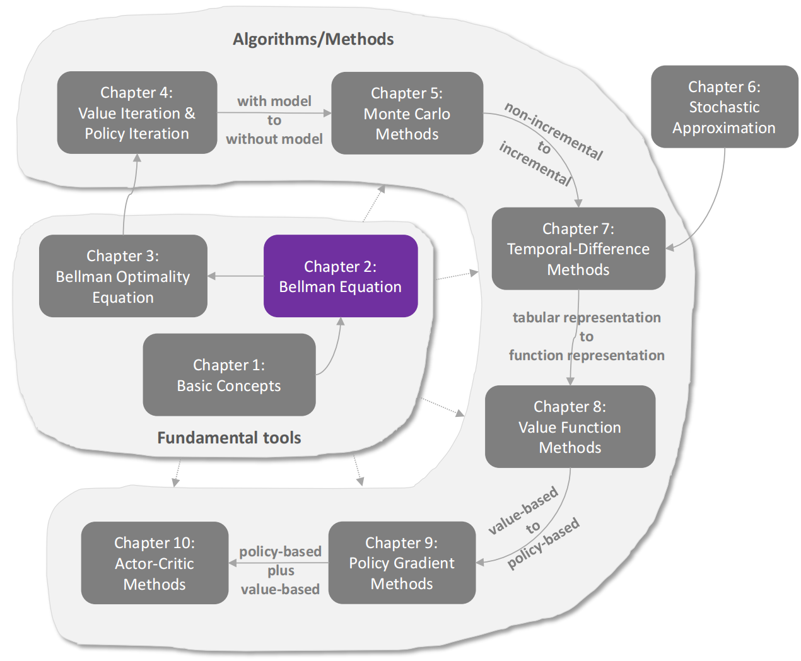
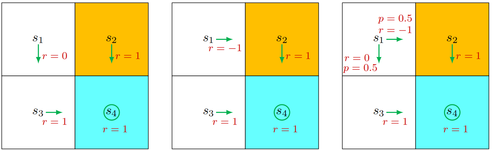
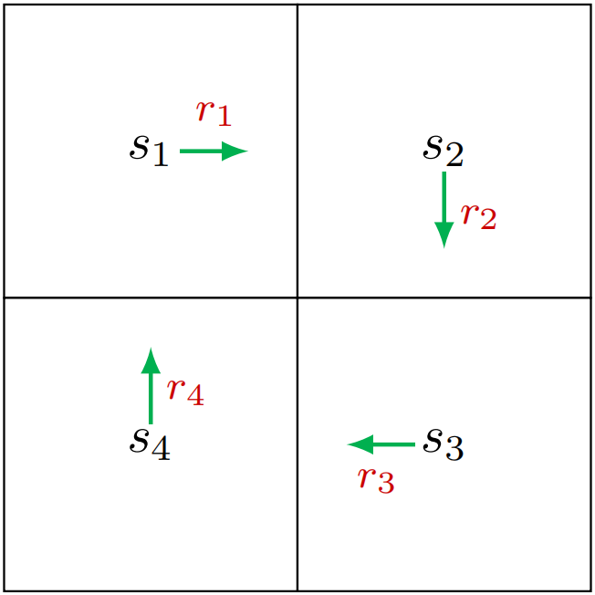
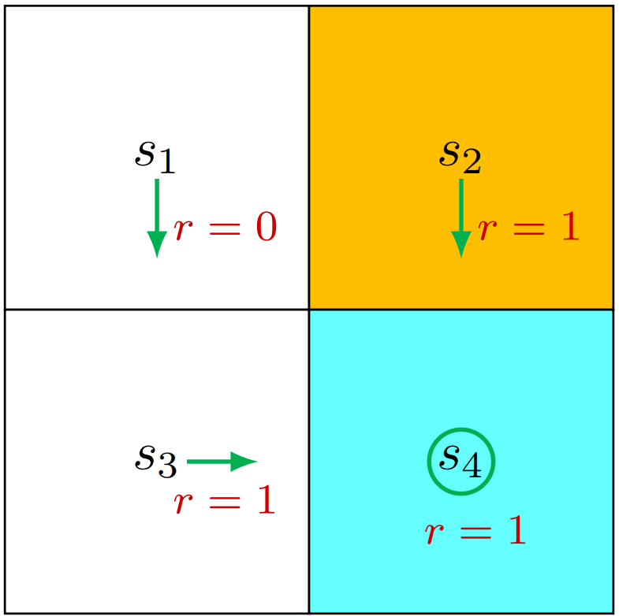
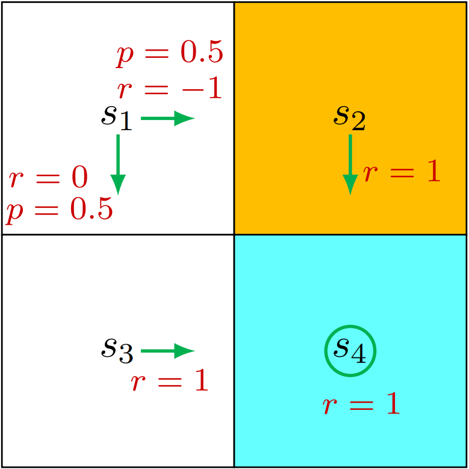
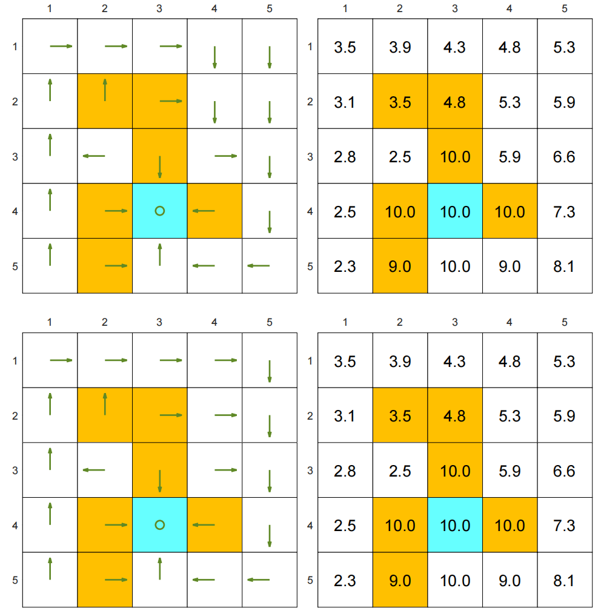
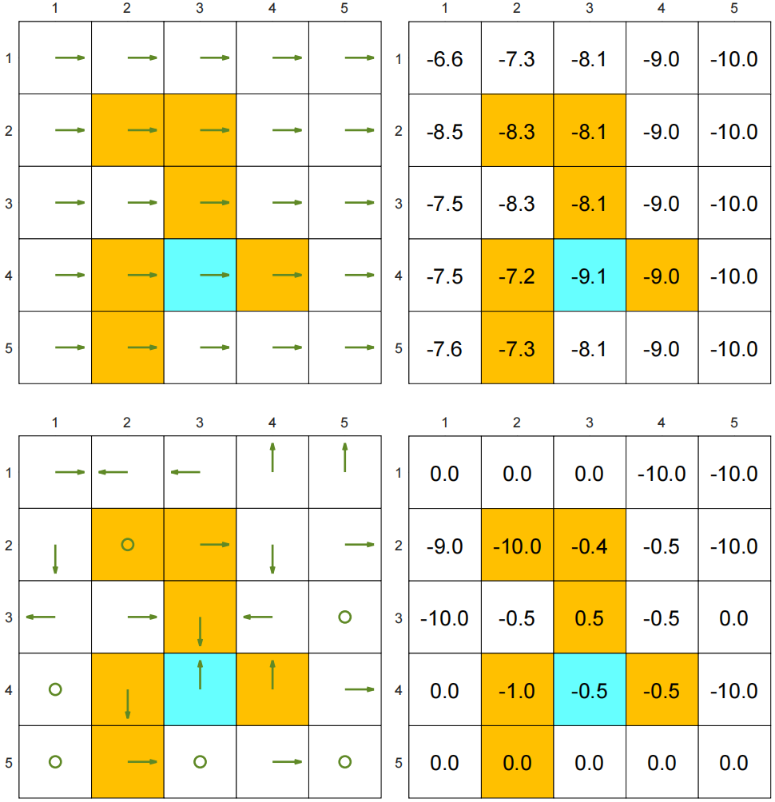

# 基本概念

## 一个网格世界例子

一个机器人在网格世界中移动，这个机器人叫做智能体，可以在图中相邻的格子移动。而且机器人在每一步只能占据一格子。白色格子是可进入的，橙色格子是被禁止的。机器人需要到达一个目标格子。本书将采用此类网格世界示例，因其直观易懂，便于阐释新概念与算法。


智能体的终极目标是找到一种“优质”策略，使其能够从任意初始位置出发抵达目标单元格。如何定义策略的“优劣标准”？核心思路在于：

- 智能体应当在抵达目标时不进入任何禁行区域
- 避免不必要的迂回路径
- 同时防止与网格边界发生碰撞。

若智能体事先掌握网格世界的地图信息，规划到达目标单元格的路径将变得轻而易举。但当智能体无法预知环境信息时，任务难度便会显著提升。此时，智能体必须通过试错法与环境交互来寻找优质策略。为此，本章后续阐述的核心概念具有关键作用。


## State 状态 和 action 动作

- `状态`：**它描述了智能体相对于环境的状态**。

  在网格世界示例中，状态对应智能体的位置。由于存在九个单元格，因此状态数量也为九种，其索引为$s_1、s_2,...,s_9$。

  所有状态的集合称为`状态空间`，记作$S=\{s_1,...,s_9\}$

- `动作`

  对于每个状态，智能体可采取五种可能的动作：向上移动、向右移动、向下移动、向左移动以及保持静止。这五种动作分别用$a_1,a_2,...,a_5$表示。

  所有动作的集合称为`动作空间`，记作$A = \{a_1,...,a_5\}$。

  不同状态可能具有不同的动作空间。例如，考虑到在状态$s_1$中执行$a_1$或$a_4$会导致与边界发生碰撞，我们可以将状态$s_1$的动作空间设定为$A(s_1) = {a_2，a_3，a_5}$。本书采用最通用的情形：对于所有$i$，$A(s_i) = A = {a1,...,a5}$。

  


### 状态迁移

> 当执行`动作`时，智能体可从一个`状态`转移到另一个`状态`，这一过程称为`状态迁移`。

- 例如，若智能体处于状态$s_1$并选择动作$a_2$（即向右移动），则会进入状态$s_2$。该过程可表示为：
  $$
  s_1\xrightarrow{\large a_2}s_2.
  $$

- 接下来我们分析两个重要示例

  - 🤔当智能体试图**突破边界状态**（例如在状态s1执行动作a1）时，其后续状态会如何演变？

    答案是该智能体将被弹回，因为智能体无法退出`状态空间`。因此，我们得出结论：
    $$
    s_1\xrightarrow{\large a_1}s_1
    $$

  - 🤔当智能体尝试**进入禁止区域**（例如在状态$s_5$执行动作$a_2$）时，接下来的状态会如何变化？

    可能出现两种不同情况。

    - 第一种情况是：虽然$s_6$区域被**禁止进入**，但仍**可通行**。此时下一状态为$s_6$，状态转移过程为$s_5 \rightarrow a_2 \rightarrow s_6$

      > [!NOTE]
      >
      > **禁止（forbidden） != 不可进入（blocked）**
      >
      > **区域被禁止但仍可通信**：系统允许你进入这个状态，但进入后会受到惩罚（reward 很低 / negative reward）

    - 第二种情况是：$s_6$区域因被墙壁环绕而无法通行。若智能体尝试向右移动，系统会将其弹回$s_5$状态，此时状态转移过程为$s_5\rightarrow a_2\rightarrow s_5$

    那么我们应当考虑哪种场景？答案取决于物理环境。本书重点探讨第一种场景：虽然进入禁用单元格可能面临惩罚，但这些单元格仍可被访问。该场景更具普适性且更具研究价值。此外，由于我们采用模拟任务框架（仿真环境），状态转移过程可按需定义。而在实际应用中，状态转移过程需遵循现实世界的动态规律。

- `状态转换过程`针对每个状态及其关联动作进行定义。该过程可通过**表格形式**描述。

  |       | **a1 (upward)** | **a2 (rightward)** | **a3 (downward)** | **a4 (leftward)** | **a5 (still)** |
  | ----- | --------------- | ------------------ | ----------------- | ----------------- | -------------- |
  | $s_1$ | $s_1$           | $s_2$              | $s_4$             | $s_1$             | $s_1$          |
  | $s_2$ | $s_2$           | $s_3$              | $s_5$             | $s_1$             | $s_2$          |
  | $s_3$ | $s_3$           | $s_3$              | $s_6$             | $s_2$             | $s_3$          |
  | $s_4$ | $s_1$           | $s_5$              | $s_7$             | $s_4$             | $s_4$          |
  | $s_5$ | $s_2$           | $s_6$              | $s_8$             | $s_4$             | $s_5$          |
  | $s_6$ | $s_3$           | $s_6$              | $s_9$             | $s_5$             | $s_6$          |
  | $s_7$ | $s_4$           | $s_8$              | $s_7$             | $s_7$             | $s_7$          |
  | $s_8$ | $s_5$           | $s_9$              | $s_8$             | $s_7$             | $s_8$          |
  | $s_9$ | $s_6$           | $s_9$              | $s_9$             | $s_8$             | $s_9$          |

  在这个表格中：

  - 行代表了状态
  - 列代表了动作
  - 单元格表示智能体在对应状态下执行动作后需转换至的下一状态

- 从`数学角度`上，状态转移过程可通过`条件概率`进行描述。

  例如，对于$s_1$和$a_2$，其**条件概率分布**为
  $$
  \begin{aligned}&p(s_1|s_1,a_2)=0,\\&p(s_2|s_1,a_2)=1,\\&p(s_{3}|s_{1},a_{2})=0,\\&p(s_4|s_1,a_2)=0,\\&p(s_5|s_1,a_2)=0,\end{aligned}
  $$
  这表明，当在 状态$s_1$处 采取 动作$a_2$ 时：

  - 智能体移动至 状态$s_2$ 的概率为1

  - 而智能体移动至其他状态的概率均为0

  - 因此，在时间点$s_1$采取行动$a_2$必然会导致智能体状态转移至$s_2$

- 虽然表格化表示法直观易懂，但它仅能描述`确定性状态转移`。

  实际上，状态转移往往具有`随机性`，必须通过条件概率分布来描述。

  例如当网格系统中出现`随机阵风（一种比喻性环境机制，用于说明环境的不确定性）`时，若在 状态$s_1$ 采取 行动$a_2$，智能体可能会被吹到 $s_5$ 而非 $s_2$ 。此时概率分布$p(s_5|s_1,a_2)$将大于零。不过为简化说明，本书在网格世界示例中仅考虑确定性状态转移情形。


## Policy 策略

> [!NOTE]
>
> `策略`：策略 会指导智能体在每个 `状态 state` 时应该采取的 `行动 action` 

- 直观的说，**策略可以表示为箭头**。当一个智能体按**策略**行动时，它可以从**初始状态**生成**轨迹**

  <figure style="text-align: center;">
         
      <figcaption align="center">从策略中获得的轨迹</figcaption>
  </figure>

- 从`数学角度`看，策略可用`条件概率`描述。将 **策略** 记作 $\pi(a|s)$，这是针对每个状态定义的条件概率分布函数。例如，$s_1$状态下的策略为

  - `确定性策略（deterministic policy）`：每个 state 只对应一个固定 action
    $$
    \begin{gathered}\pi(a_1|s_1)=0,\\\pi(a_2|s_1)=1,\\\pi(a_3|s_1)=0,\\\pi(a_4|s_1)=0,\\\pi(a_5|s_1)=0,\end{gathered}
    $$
    这表明在 状态$s_1$ 下采取 行动$a_2$ 的概率为1，而采取 其他行动 的概率均为0

    <figure style="text-align: center;">
        
        <figcaption align="center">确定性策略（每个 state 只对应一个固定 action）</figcaption>
    </figure>

  - `随机策略（stochastic policy）`：在同一个 state 下，可能随机选择不同 action。

    一般而言，策略可能具有随机性。例如在 状态$s_1$ 时，智能体可选择向右或向下移动的行动。这两种行动的概率都相同（均为0.5）.在这个例子中，状态$s_1$ 的策略是：
    $$
    \begin{aligned}&\pi(a_1|s_1)=0,\\&\pi(a_2|s_1)=0.5,\\&\pi(a_3|s_1)=0.5,\\&\pi(a_4|s_1)=0,\\&\pi(a_5|s_1)=0.\end{aligned}
    $$

    <figure style="text-align: center;">
        
        <figcaption align="center">随机策略。在状态s1时，智能体以相等的概率0.5向右或向下移动</figcaption>
    </figure>

  - 以条件概率表示的策略可采用表格形式存储。

    例如，**下表** 展示了 **随机策略对应的图示** 中呈现的随机策略，其中**第i行第j列的数值 表示 在第i个状态执行第j个动作的概率**。

    这种表示方式称为`表格化表示法`。我们将在第八章介绍另一种将策略表示为参数化函数的方法。

    |       | **a1 (upward)** | **a2 (rightward)** | **a3 (downward)** | **a4 (leftward)** | **a5 (still)** |
    | ----- | --------------- | ------------------ | ----------------- | ----------------- | -------------- |
    | $s_1$ | 0               | 0.5                | 0.5               | 0                 | 0              |
    | $s_2$ | 0               | 0                  | 1                 | 0                 | 0              |
    | $s_3$ | 0               | 0                  | 0                 | 1                 | 0              |
    | $s_4$ | 0               | 1                  | 0                 | 0                 | 0              |
    | $s_5$ | 0               | 0                  | 1                 | 0                 | 0              |
    | $s_6$ | 0               | 0                  | 1                 | 0                 | 0              |
    | $s_7$ | 0               | 1                  | 0                 | 0                 | 0              |
    | $s_8$ | 0               | 1                  | 0                 | 0                 | 0              |
    | $s_9$ | 0               | 0                  | 0                 | 0                 | 1              |


## Reward 奖励

> `奖励`是是强化学习中最独特的概念之一。

- 当智能体在 `某个状态` 下执行 `动作` 后，会从环境中获得 **奖励（记为$r$）**作为反馈。

  该奖励是 状态$s$ 和 动作$a$ 的函数，表示为 $r(s，a)$。其数值可以是**正实数**、**负实数**或**零**。

  不同奖励 对智能体最终学习到的 策略 会产生不同影响：一般来说，

  - `正奖励`会促使智能体采取相应动作

  - `负奖励`则会抑制其执行该动作的倾向

- 例如，在网格世界示例中，奖励设计如下：

  - 若智能体试图 **离开边界区域**，则奖励值$r_{boundary}$设为−1；
  - 若试图 **进入禁止区域**，则奖励值$r_{forbidden}$设为−1；
  - 若 **成功抵达目标状态**，则奖励值$r_{target}$设为+1；
  - 否则奖励值$r_{other}$设为0

  > [!NOTE]
  >
  > 需特别关注目标状态$s_9$。奖励机制无需在智能体到达$s_9$后终止。
  >
  > - 若智能体在$s_9$执行动作$a_5$，下一状态仍为$s_9$且奖励值为$r_{target} = +1$
  >
  > - 若执行动作$a_2$，下一状态同样为$s_9$，但奖励值为$r_{boundary} = −1$

- 奖励机制可视为`人机交互界面`，通过它我们可以**引导智能体按照预期行为**。

  例如，通过设计上述奖励机制，我们能够确保智能体倾向于避免超出边界或进入禁区单元格。

  > [!NOTE]
  >
  > **在强化学习中，设计合适的奖励机制是关键步骤**
  >
  > 然而对于复杂任务而言，这一步骤并不简单，因为可能需要使用者对问题有深入理解。不过相较于需要专业背景或对问题有深刻认知的其他解决方案，这种设计方式仍可能更为简便。

- **执行 动作 后获得 奖励 的过程**可通过`表格`直观呈现

  如下表所示。表格中每一行对应一个状态，每一列对应一个动作。表格中每个单元格的数值表示在该状态下执行动作所能获得的奖励。

  <div align="center">在网格世界例子中，展示的是固定奖励</div>

  |           | **a1 (upward)**        | **a2 (rightward)**     | **a3 (downward)**      | **a4 (leftward)**      | **a5 (still)**         |
  | --------- | ---------------------- | ---------------------- | ---------------------- | ---------------------- | ---------------------- |
  | **$s_1$** | $r_{\text{boundary}}$  | 0                      | 0                      | $r_{\text{boundary}}$  | 0                      |
  | **$s_2$** | $r_{\text{boundary}}$  | 0                      | 0                      | 0                      | 0                      |
  | **$s_3$** | $r_{\text{boundary}}$  | $r_{\text{boundary}}$  | $r_{\text{forbidden}}$ | 0                      | 0                      |
  | **$s_4$** | 0                      | 0                      | $r_{\text{forbidden}}$ | $r_{\text{boundary}}$  | 0                      |
  | **$s_5$** | 0                      | $r_{\text{forbidden}}$ | 0                      | 0                      | 0                      |
  | **$s_6$** | 0                      | $r_{\text{boundary}}$  | $r_{\text{target}}$    | 0                      | $r_{\text{forbidden}}$ |
  | **$s_7$** | 0                      | 0                      | $r_{\text{boundary}}$  | $r_{\text{boundary}}$  | $r_{\text{forbidden}}$ |
  | **$s_8$** | 0                      | $r_{\text{target}}$    | $r_{\text{boundary}}$  | $r_{\text{forbidden}}$ | 0                      |
  | **$s_9$** | $r_{\text{forbidden}}$ | $r_{\text{boundary}}$  | $r_{\text{boundary}}$  | 0                      | $r_{\text{target}}$    |

- `固定奖励（deterministic reward）` 与 `随机奖励（stochastic reward）`

  - **固定奖励**：在同一个 state 和 action 下，reward 一定相同。
    $$
    r(s,a)=\text{固定值}
    $$

  - **随机奖励**：在同一个 state 和 action 下，reward 可能不同。（实际上更有可能出现的情况）

    例如，若学生刻苦学习，其将获得积极奖励（如考试成绩提高），但该奖励的具体价值可能具有不确定性。


## Trajectories 轨迹, returns 回报, 与 episodes 回合

<figure style="text-align: center;">
    
    <figcaption align="center">图1.6，左图：策略1与其轨迹<br/>右图：策略2与其轨迹</figcaption>
</figure>
- **轨迹**

  > `轨迹 Trajectories`：一种`状态(s)-动作(a)-奖励(r)链`，即一次运行过程中，系统走过的“路径”。

  例如，根据上图中左图所示策略，智能体可沿以下轨迹移动：
  $$
  s_1 \xrightarrow[r=0]{a_2} s_2 \xrightarrow[r=0]{a_3} s_5 \xrightarrow[r=0]{a_3} s_8 \xrightarrow[r=1]{a_2} s_9.
  $$

- **回报**

  > `回报 returns`：沿轨迹收集的所有奖励之和。
  >
  > `回报 returns`也叫`总奖励 total rewards`或`累积奖励 cumulative rewards`
  >
  > `回报`可以用于评估**策略**效果

  - 例如，我们可通过对比上图中两种策略的收益值进行评估。

    - 左图中：

      轨迹：
      $$
      s_1 \xrightarrow[r=0]{a_2} s_2 \xrightarrow[r=0]{a_3} s_5 \xrightarrow[r=0]{a_3} s_8 \xrightarrow[r=1]{a_2} s_9.
      $$
      回报：
      $$
      \begin{equation}
      \label{return1}
      \begin{aligned}\mathrm{return}&=0+0+0+1=1.\end{aligned}
      \end{equation}
      $$
    
    
      - 右图中：
    
        轨迹：
        $$
        s_1 \xrightarrow[r=0]{a_3} s_4 \xrightarrow[r=-1]{a_3} s_7 \xrightarrow[r=0]{a_2} s_8 \xrightarrow[r=+1]{a_2} s_9.
        $$
        回报：
        $$
        \begin{equation}
        \label{return2}
        \begin{aligned}\mathrm{return}&=0-1+0+1=0.\end{aligned}
        \end{equation}
        $$
    

- **分析**：上面两式中的回报表明，左侧策略优于右侧策略，因其回报更高。

  这一数学结论与直觉相符：右侧策略表现较差，因其会经过一个禁止区域。


  - `回报`由`即时奖励 immediate reward`和`未来奖励 future rewards`构成。

    - `即时奖励`：在当前状态 $s_t$ 采取一个动作 $a_t$ 后，环境立刻返回的奖励 $r_t$
    - `未来奖励`：从下一步开始，后面所有步骤得到的奖励的总和
    - 有时即时奖励可能为负值，而未来奖励却为正值。

    因此，决策时应以收益（即总回报）而非即时奖励来确定行动方案，从而避免短视决策。

  - `折扣回报（discounted return）`：**越远的奖励，价值越低**

    式$\eqref{return1}$ 中的返回值定义适用于 **有限长度轨迹**，也可推广至 **无限长轨迹**。在无限长轨迹中，我们应该使用`折扣回报`，原因如下：

    例如 **图1.6 左图** 所示轨迹在到达$s_9$点后即停止。

    - 由于策略在$s_9$点处已明确定义，智能体到达该点后无需停止运行。

    - 假设我们使用`回报`：

      我们可设计策略使智能体在到达$s_9$点后保持静止状态，此时策略将生成如下无限长轨迹：
      $$
      s_1 \xrightarrow[r=0]{a_2} s_2 \xrightarrow[r=0]{a_3} s_5 \xrightarrow[r=0]{a_3} s_8 \xrightarrow[r=1]{a_2} s_9 \xrightarrow[r=1]{a_5} s_9 \xrightarrow[r=1]{a_5} s_9 \dots
      $$
      那么该轨迹上的奖励和为：
      $$
      \mathrm{return}=0+0+0+1+1+1+\cdots=\infty,
      $$
      🤔很明显这会造成一个问题，智能体获得的奖励是无穷大的，这在强化学习中叫做`发散（diverge）`

    - 引入`折扣回报`：`折现回报`即为`折现奖励`的总和
      $$
      \begin{aligned}\text{discounted return}&=0+\gamma0+\gamma^20+\gamma^31+\gamma^41+\gamma^51+\ldots,\end{aligned}
      $$
      其中：

      - $\gamma$：`折扣因子`。满足$0\leq\gamma<1$

      引入`折扣因子`的核心作用：

      1. 它消除了必须设置`终止条件（stop criterion）`的需求，使得轨迹可以是无限长的。

         - 假设没有折扣，那么$return=1+1+1+1+...=\infty$。那么这个时候如果不给智能体设置终止条件， 智能体就会一直进行下去

         - 有了折扣后，因为$0\leq\gamma<1$，$1+\gamma+\gamma^2+\gamma^3+...=有限值$，所以即使**任务永远不结束，回报仍然是有限**的。

      2. 折扣率可以用来调节对`即时奖励`和`未来奖励`的重视程度。

         - 当 $\gamma$ 接近0时：`短视（智能体只会看眼前利益）`，也就是说未来奖励几乎没有价值

           例如：
           $$
           \gamma = 0.1
           $$
           未来奖励：

           | 时间   | 权重  |
           | ------ | ----- |
           | 现在   | 1     |
           | 下一步 | 0.1   |
           | 两步后 | 0.01  |
           | 三步后 | 0.001 |

           可以看到几步后$\gamma$几乎等于 0。

         - 当 $\gamma$ 接近 1：`长远（智能体愿意承受短期损失）`，也就是说未来奖励几乎和现在一样重要

           例如：
           $$
           \gamma = 0.99
           $$
           那么：

           | 时间     | 权重 |
           | -------- | ---- |
           | 现在     | 1    |
           | 下一步   | 0.99 |
           | 10 步后  | 0.90 |
           | 100 步后 | 0.37 |

           可以看到很多步后$\gamma$仍然很大。所以智能体会：愿意为了未来牺牲现在。

- **回合**

  > - `终止状态 terminal state`：任务结束的状态。例如智能体达到终点或达到最大步数
  > - `回合 episodes`：当智能体遵循策略与环境交互时，从开始到`终止状态`的这条完整轨迹，叫做一个 **episode（回合）**，也叫 **trial（试验）**。
  >   - 如果环境或策略是`随机的（stochastic）`，即使从同一个状态开始，也可能得到不同的 episode。
  >   - 如果一切都是`确定性的（deterministic）`，那么从同一个状态开始，总是得到同一个 episode。
  > - `回合型任务（episodic task）` 和 `持续型任务（continuing task）`
  >   - `episode`通常是有限长度的，`回合型任务`是有episode的任务
  >   - `持续型任务`：有些任务没有终止状态，也就是说与环境的交互过程永远不会结束。
  >   - 可以把 `episodic task` 转换成 `continuing task`，用**统一的数学方式处理**。
  
  🤔怎么把 episodic 变成 continuing？
  
  👉要做到这一点，我们需要定义：**当 agent 到达终止状态之后会发生什么**。关键点是不要让它真的停止，而是继续定义行为。
  
  1. 方法1：把 `终止状态（terminal state）` 变成`吸收状态（absorbing state）`
  
     - 智能体到达终点后，
  
       
  
       - 状态不再改变（即永远停在Goal），但系统仍然继续运行
       - 奖励一直是 0
  
       数学形式：
       $$
       s_T \rightarrow s_T \rightarrow s_T \rightarrow ...
       $$
       并且：
       $$
       r = 0
       $$
  
     - 例如：在网格世界例子中，
  
       对于目标状态$s_9$，
  
       我们可以指定 动作$A(s9)=\{a5\}$，
  
       或设定 动作$A(s9)=\{a1 ，... ，a5\}$，且对所有 $i=1,...,5$ 均有 $p(s_9|s_9，a_i)=1$。
  
  2. 方法2：把 `终止状态（terminal state）`  当成 `普通状态（normal state）`
  
     也就是说终点不再是终点，而是变为一个普通节点，智能体就可以自由进出该状态。
  
     **但是**：由于**每次到达（包括智能体上一步已经到达，但下一步执行$a_5$但原地不动）** $s_9$状态 都能获得 $r=1$ 的正向奖励，也就是说智能体会一直留在$s_9$状态（$s_9 → s_9 → s_9 → s_9 ...$），**最终会学会永久停留在 $s_9$状态 以持续获取奖励**。
  
     > [!NOTE]
     >
     > 值得注意的是，当**回合无限长且保持 $s_9$状态可获得正向奖励时**，必须采用`折扣因子`计算`折现回报`以避免`收益发散`。
  
  > 在本书中，我们探讨 **方法2**，即 **终止状态被视为普通状态**，其动作空间为$A(s_9) = \{a_1,...,a_5\}$


## 马尔可夫决策过程

本章前文通过实例阐述了强化学习中的若干基本概念。本节将在`马尔可夫决策过程（MDP / MDPs）`框架下，以更形式化的方式呈现这些概念。

MDP 是描述 **随机动力系统（同一个状态出发，下一步可能去不同地方，而且有概率）** 的通用框架。

1. MDP 关键要素

   - `集合`

     - **状态空间**：所有`状态`的集合，记为$\mathcal{S}$。
     - **行动空间**：与 每个 `状态`$s \in \mathcal{S}$ 相关联的 `动作`集合，记为$A(s)$。
     - **奖励集合**：在 `状态-动作对`$(s,a)$ 下**所有可能出现的`奖励值`的集合**，记为$R(s,a)$。

   - `模型`

     - 状态转移概率：

       在 状态$s$ 中，当执行 动作$a$ 时，转移至状态 $s'$ 的概率为 $p(s'|s,a)$。对于任意 `状态-动作对`$(s,a)$，有$\sum_{s^{\prime}\in\mathcal{S}}p\left(s^{\prime}|s,a\right)=1$

     - 奖励概率：

       在 状态$s$ 下采取 行动$a$ 时，获得 奖励$r$ 的概率为$p(r|s,a)$。对于任意状态-行为对$(s,a)$，有$\sum_{r\in\mathcal{R}(s,a)}p(r|s,a)=1$

   - `策略`

     在 状态$s$ 下，选择 动作$a$ 的概率为 $\pi(a|s)$，对于任意 状态$s\in\mathcal{S}$，有$\sum_{a\in A(s)}\pi(a|s)=1$

   - `马尔可夫性质`

     > `马尔可夫性质`：未来只取决于现在，与过去无关

     - **无记忆性**

       举一个直观的例子，想象一个机器人在迷宫里：

       - **状态**：当前位置 $s_t$
       - **动作**：往左/右/前/后 $a_t$
       - **奖励**：走对了 +1，撞墙 +0

       如果这个系统满足 **马尔可夫性质**，那就意味着：机器人下一步会到哪里，只取决于 **现在的位置** 和 **现在的动作**，而不需要知道它是怎么走到这里的。

     - **马尔可夫性质在数学上的定义**

       `状态`：
       $$
       p(s_{t+1}|s_t,a_t,s_{t-1},a_{t-1},...,s_0,a_0)=p(s_{t+1}|s_t,a_t)
       $$
       其中：

       - $t$ 表示当前时间步，$t+1$ 表示下一个时间步

       + 左边：在知道整个历史的情况下，下一状态的概率，即$P(下一状态 | 所有过去)$
       + 右边：$P(下一状态 | 当前状态 + 当前动作)$
       + 左边=右边，也就是说，<span style="color:red">历史信息是多余的。只要知道当前，就够了</span>。

       `奖励`：
       $$
       p(r_{t+1}|s_t,a_t,s_{t-1},a_{t-1},...,s_0,a_0)=p(r_{t+1}|s_t,a_t)
       $$
       其中：

       - 左边＆右边 和上面同理
       - 左边=右边，也就是说，<span style="color:red">奖励只取决于当前状态和动作</span>。

       > [!NOTE]
       >
       > `马尔可夫性质`对于推导`马尔可夫决策过程（MDP）`的`基本贝尔曼方程`至关重要

2. `模型`（动态过程）

   > `模型（动态过程）`：在上文中，所有 状态-动作对$(s,a)$对应的概率分布$p\left(s^{\prime}|s,a\right)$**（状态概率分布）** 和 $p\left(r|s,a\right)$**（奖励状态分布）** 叫做模型或动态过程

   模型分为两类

   - **平稳型（时间不变型）**：平稳模型随事件保持恒定
   - **非平稳型（时间变化型）**：非平稳模型可能随事件发生变化

   例如在**网格世界模型**中，**若某些禁止区域会时隐时现**，即构成`非平稳模型`。本书仅研究平稳模型。

3. `马尔可夫过程（MPs）`

   🤔马尔可夫决策过程（MDP）与马尔可夫过程（MP）有什么区别呢？

   👉当 MDP 中的策略一旦确定后，其 **`MDP` 就会退化为`马尔可夫过程`**。

   > - `马尔可夫过程（MP）`
   >
   >   - 只有：状态 $s$
   >
   >   - 状态转移概率：
   >     $$
   >     P(s'|s)
   >     $$
   >
   >   **没有“动作”，系统自己随机演化**
   >
   > - `马尔可夫决策过程（MDP）`
   >
   >   - 具有 状态 $s$ 和 动作 $a$
   >
   >   - 状态转移概率：
   >     $$
   >     P(s'|s,a)
   >     $$
   >
   >   - 奖励 $R(s,a)$
   >
   >   **多了一个“你可以做决策”的维度**

   例如：

   <figure style="text-align: center;"><figcaption align="center">图1.7：网格世界示例作为马尔可夫过程的抽象图。其中，圆圈代表状态，带箭头的连线表示状态转移。</figcaption></figure>

   **该网格世界原本是一个 MDP。当策略 $\pi(a|s)$ 给定后，可以将动作的选择概率与状态转移概率 $P(s'|s,a)$ 合并，从而得到状态之间的转移概率 $P(s'|s)$，因此该过程可以等价地表示为一个马尔可夫过程（MP）。**

   在随机过程研究文献中，**若过程为`离散时间`过程且`状态`数有限或可数，则马尔可夫过程也被称为`马尔可夫链`**。

   - 条件1：**离散时间**

     在网格世界模型中按 step 更新：

     ```
     t = 0,1,2,3,...
     ```

     比如：每一步移动一次，不是连续时间。

   - 条件2：**状态是有限或可数**

     在网格世界模型中的状态为：
     $$
     s1,s2,s3,...,s9
     $$
     一共是9个状态，所以这是一个有限集合

   > [!NOTE]
   >
   > 本书中当上下文明确时，“`马尔可夫过程`”与“`马尔可夫链`”这两个术语可互换使用。
   >
   > 此外，本书主要研究 **状态数和动作数均为有限值** 的`有限马尔可夫决策过程（MDP）`，这是最基础且需要深入理解的典型案例。

4. **`强化学习`的本质**

   强化学习本质上是一个**智能体与环境的交互过程**。`智能体`作为决策主体，能够感知自身`状态`、制定`策略`并执行`动作`，而其外部`环境`则构成整个系统。

   以网格世界模型为例：

   - `智能体`对应机器人
   - `环境`则对应网格世界。
   - 当智能体做出行动`决策`后，执行器会立即实施该决策，此时智能体`状态`会发生变化并获得`奖励`。
   

通过**把环境返回的原始反馈（传感器/信号）转换成强化学习可用的状态和奖励的处理机制**，智能体可对新状态及奖励进行解析，从而形成**闭环反馈机制**。


# 状态价值 与 贝尔曼方程



本章将介绍一个核心概念和重要工具。

- 核心概念

  > `状态价值`：定义为智能体**遵循特定策略时**所能获得的**平均奖励**。状态价值越高，对应的策略质量就越好。

  状态价值可作为评估策略优劣的关键指标。

  🤔虽然状态价值至关重要，但我们该如何进行分析？👇

- 重要工具

  > `贝尔曼方程`：这是分析状态价值的重要工具。贝尔曼方程描述了**所有状态价值之间的相互关系**。

  通过求解 **贝尔曼方程**，我们即可获得`状态价值`。这一过程称为`策略评估`。

最后本章还会介绍 `动作价值`$Q(s,a)$——表示在 状态$s$ 下采取 动作$a$ 的价值


## 启发性例子1：为什么回报很重要？

在之前的章节中我们介绍了`回报（returns）`这个概念。实际上，回报在强化学习中起着基础性的作用，因为其能够**评估`策略`的`有效性`**。



- 🤔观察图2.2所示的三种策略，可以发现它们在 初始状态$s_1$ 时存在显著差异。那么哪种策略最优，哪种最差呢？

  直观来看：

  - 最左侧的策略最优，因为从$s_1$出发的智能体能够避开禁区。
  - 中间策略显然次优，因为该策略会导致智能体进入禁区。
  - 最右侧的策略则介于两者之间，其进入禁区的概率仅为0.5。

- 🤔上述分析来自于直觉，我们能否运用`数学方法`来描述这种直觉？

  👉答案是肯定的，且结论依赖于`回报`。具体而言，假设智能体从 状态$s_1$ 开始行动：

  - 对第一种`策略`

    `轨迹` 是 $\begin{aligned}s_1\to s_3\to s_4\to s_4\cdots\end{aligned}$，对应的 `折扣回报` 是
    $$
    \begin{aligned}return_1&\begin{aligned}&=0+\gamma1+\gamma^21+\ldots\end{aligned}\\&=\gamma(1+\gamma+\gamma^2+\ldots)\\&=\frac{\gamma}{1-\gamma},\end{aligned}
    $$
    其中 $\gamma\in\begin{pmatrix}0,1\end{pmatrix}$ 是`折扣因子`

  - 对第二种`策略`

    `轨迹` 是 $\begin{aligned}s_1\to s_2\to s_4\to s_4\cdot\cdot\cdot\end{aligned}$，对应的 `折扣回报` 是
    $$
    \begin{aligned}return_2&\begin{aligned}=-1+\gamma1+\gamma^21+\ldots\end{aligned}\\&=-1+\gamma(1+\gamma+\gamma^2+\ldots)\\&=-1+\frac{\gamma}{1-\gamma}.\end{aligned}
    $$

  - 对第三种`策略`

    一种 `轨迹` 是 $\begin{aligned}s_1\to s_2\to s_4\to s_4\cdot\cdot\cdot\end{aligned}$，

    另一种 `轨迹` 是 $\begin{aligned}s_1&\to s_2\to s_4\to s_4\cdots\end{aligned}$

    选择这两种的轨迹都是0.5

    对应的 `折扣回报` 是（使用条件概率计算）
    $$
    \begin{aligned}return_3&\begin{aligned}&=0.5\left(-1+\frac{\gamma}{1-\gamma}\right)+0.5\left(\frac{\gamma}{1-\gamma}\right)\end{aligned}\\&=-0.5+\frac{\gamma}{1-\gamma}.\end{aligned}
    $$

  - 通过比较三种`策略`的回报，我们观察到
    $$
    \mathrm{return}_1>\mathrm{return}_3>\mathrm{return}_2
    $$

  对于任意 $\gamma$值而言，第一种策略最优，因其收益最大；第二种策略最差，因其收益最小。这一数学结论与前述直觉一致：第一种策略最优，因其可避免进入禁入区域；第二种策略最差，因其会导致进入禁入区域。

  > 上述案例表明，`回报`可用于评估`策略`效果：遵循某策略获得的回报越高，该策略就越优。

  > [!NOTE]
  >
  > 值得注意的是，$return_3$并不严格符合收益指标的定义，因其更接近`期望值`。后文将阐明，$return_3$实为一种`状态价值`。


## 启发性例子2：如何计算回报？

尽管我们已证实回报的重要性，但随之而来的问题是**如何在遵循特定策略时计算回报**。计算回报存在两种方法。

1. 由定义得出：`回报`等于沿`轨迹`收集的所有`奖励的折现总和`。

   

   从图2.3中的 **四个状态出发**，可以计算得出这四个状态出发时分别得到的`回报`
   $$
   \begin{equation}
   \label{four rewards of four returns}
   \begin{gathered}v_{1}\begin{aligned}&=r_1+\gamma r_2+\gamma^2r_3+\ldots,\end{aligned}\\v_{2}\begin{aligned}&=r_2+\gamma r_3+\gamma^2r_4+\ldots,\end{aligned}\\v_{3}\begin{aligned}&=r_3+\gamma r_4+\gamma^2r_1+\ldots,\end{aligned}\\v_{4}=r_4+\gamma r_1+\gamma^2r_2+\ldots.
   \end{gathered}
   \end{equation}
   $$

2. 基于`自助法（bootstrapping）`的理念：通过观察 式$\eqref{four rewards of four returns}$ 中回报的表达式，我们可以将其重写为
   $$
   \begin{equation}
   \label{bootstrapping_v}
   v_{1}=r_1+\gamma(r_2+\gamma r_3+\ldots)=r_1+\gamma v_2,
   \\
   v_{2}=r_2+\gamma(r_3+\gamma r_4+\ldots)=r_2+\gamma v_3,
   \\
   v_{3}=r_3+\gamma(r_4+\gamma r_1+\ldots)=r_3+\gamma v_4,
   \\v_{4}=r_4+\gamma(r_1+\gamma r_2+\ldots)=r_4+\gamma v_1.
   \end{equation}
   $$

   - 现象：各回报值之前存在互相依赖关系。具体而言：v1依赖于v2，v2依赖于v3，v3依赖于v4，而v4又依赖于v1。

     这一现象体现了`自助法`的核心思想：**通过数据本身来推导某些量的数值**。

   - 这么一看，`自助法`似乎是一个无限循环的过程，因为未知值的计算依赖于另一个未知值。实际上，从`数学角度`理解，式$\eqref{bootstrapping_v}$可以转换为`线性矩阵-向量方程`：
     $$
     \underbrace{\begin{bmatrix}v_1\\v_2\\v_3\\v_4\end{bmatrix}}_{v}=\begin{bmatrix}r_1\\r_2\\r_3\\r_4\end{bmatrix}+\begin{bmatrix}\gamma v_2\\\gamma v_3\\\gamma v_4\\\gamma v_1\end{bmatrix}=\underbrace{\begin{bmatrix}r_1\\r_2\\r_3\\r_4\end{bmatrix}}_{r}+\gamma\underbrace{\begin{bmatrix}0&1&0&0\\0&0&1&0\\0&0&0&1\\1&0&0&0\end{bmatrix}}_{P}\underbrace{\begin{bmatrix}v_1\\v_2\\v_3\\v_4\end{bmatrix}}_{v},
     $$
     可以简洁地表示为：
     $$
     v=r+\gamma Pv.
     $$
     其中：
     
     - $v$：`状态价值`向量，$v=\begin{bmatrix}v_1\\v_2\\v_3\\v_4\end{bmatrix}$
     
     - $r$：`奖励`向量，$r=\begin{bmatrix}r_1\\r_2\\r_3\\r_4\end{bmatrix}$，表示每个状态立即获得的奖励。那么这个时候可能会有一个疑惑：
     
       🤔`奖励`不是依赖于`状态-动作对`吗？为什么这里说状态获得的奖励呢？
     
       👉从工程上来说，奖励确实依赖于状态-动作对$R(s,a)$，而且这里使用的是简化形式$R(s)$，当然写成简化形式是有条件的：
     
       即：**`策略`是固定的（在每个状态下，动作是唯一确定的）**，例如：
       $$
       \pi(a_3|s_1)=1
       $$
       表示在 状态$s_1$ 下一定执行 动作$a_3$，动作是确定的，此时$R(s_1,a_3)$就可以写成$R(s_1)$
     
       于是 $R(s,a)$ 就可以省去一个动作$a$，变为 $R(s)$
     
       相反，当一个状态有多个可能动作时就只能写 $R(s,a)$
     
     - $\gamma$：折扣因子
     
     - $P$：`状态转移矩阵`，表示 从一个状态会转移到哪个状态
     
     - $Pv$：**下一状态**的`状态价值`向量
   
   因此，$v$ 的值可轻松计算为 $v=(I-\gamma P)^{-1}r$，其中$I$为具有适当维度的单位矩阵。
   
   且 $I-\gamma P$ 总是`可逆`，具体解释见第2.7.1节。


## 状态价值（State values）

> 我们曾指出**回报可用于评估策略**，但其不适用于`随机系统`，因为从某一状态出发可能导致不同的回报。
>
> 基于这一问题，本节引入`状态价值`的概念。

- `回报`是针对**单条轨迹**的

  首先我们要引入一些必要的符号。考虑 **一段时间步（time steps）**$t=0,1,2,....$。在 时间$t$ 时，智能体处于 状态$S_t$ ，根据 策略$\pi$ 采取 行为$A_t$，下一个 状态为$S_{t+1}$，即时获得的 奖励为$R_{t+1}$，该过程可以表示为：
  $$
  S_t\xrightarrow{A_t}S_{t+1},R_{t+1}.
  $$
  注意到，$S_t,S_{t+1},A_t,R_{t+1}$都是随机变量，此外$S_t,S_{t+1}\in\mathcal{S},A_t\in\mathcal{A}(S_t)$，且$R_{t+1}\in\mathcal{R}(S_t,A_t)$

  从 时间点$t$ 开始，我们可以获得一个`状态-动作-奖励轨迹`：
  $$
  S_{t}\xrightarrow{A_{t}}S_{t+1},R_{t+1}\xrightarrow{A_{t+1}}S_{t+2},R_{t+2}\xrightarrow{A_{t+2}}S_{t+3},R_{t+3}\ldots.
  $$
  根据定义，该轨迹上的`折扣回报`为：
  $$
  G_t\doteq R_{t+1}+\gamma R_{t+2}+\gamma^2R_{t+3}+\ldots,
  \\
  其中\gamma\in\begin{pmatrix}0,1\end{pmatrix}是折扣因子，\doteq是定义为的意思
  $$
  注意到：因为 $R_{t+1},R_{t+2},\ldots.$ 均为随机变量，所以$G_t$也是一个随机变量。

  用实际意义解释：**在策略或环境具有`随机性`时，从同一状态出发可能产生不同的轨迹，而不同轨迹会对应不同的回报取值，因此 $G_t$ 是随机变量**。

- `状态价值`是**多条轨迹**的平均

  因为 `回报`$G_t$ 是一个随机变量，我们可以计算其`期望值`：
  $$
  \upsilon_\pi(s)\doteq\mathbb{E}[G_t|S_t=s].
  \\
  在当前状态是s的条件下,未来回报G_t的平均值。
  $$
  其中：

  - 该式的含义：**从状态 $s$ 出发，按照策略 $\pi$ 一直执行，未来可能得到很多不同的回报；期望值就是这些回报的“平均水平”。**

  - $\upsilon_{\pi}\left(s\right)$ 称为 `状态价值函数`，或简称 $s$的`状态价值`：
    - $\upsilon_{\pi}\left(s\right)$取决于 状态$s$。这是因为其定义为条件期望，且条件是智能体从状态$S_t=s$开始
    - $\upsilon_{\pi}\left(s\right)$取决于 策略$\pi$。若采用不同策略，状态价值可能有所不同
    - $\upsilon_{\pi}\left(s\right)$不取决于 时间步$t$。因为智能体在状态空间中移动，$\upsilon_{\pi}\left(s\right)$的值在策略确定后即被确定（与时间步无关）。

- `状态价值`与`回报`之间的关系可进一步阐明如下：

  - 当策略模型和系统模型均为`确定性`时，**从同一初始状态出发必然产生相同轨迹**。此时，**从该状态获得的回报等于该状态的状态价值**。


  - 反之，若策略模型或系统模型具有`随机性`，即使**从相同初始状态出发也可能生成不同轨迹**。此时**不同轨迹的回报存在差异，而状态价值即为这些收益的平均值**。


  - `回报`是针对单个轨迹定义的，而`状态价值`是对很多条轨迹回报的平均


> [!IMPORTANT]
>
> 虽然如第2.1节所示 可采用`回报`评估**策略**，
>
> 但使用`状态价值`进行策略评估更具**形式化特征**：**`状态价值`较高的策略更具优势**。
>
> 因此，状态价值构成了强化学习的核心概念。


## 贝尔曼方程

> `贝尔曼方程`：一种用于分析状态值的数学工具。简而言之，Bellman方程是一组线性方程，用于描述所有`状态价值`之间的关系，**从而可以通过求解这些方程来计算各个状态的价值，并进一步用于寻找最优策略。**

- 推导`贝尔曼方程`

  - 重写 `回报`$G_t$ 为：
    $$
    \begin{aligned}G_{t}&=R_{t+1}+\gamma R_{t+2}+\gamma^2R_{t+3}+\ldots\\&=R_{t+1}+\gamma(R_{t+2}+\gamma R_{t+3}+\ldots)\\&=R_{t+1}+\gamma G_{t+1},\end{aligned}
    $$
    其中 $G_{t+1}=R_{t+2}+\gamma R_{t+3}+\ldots.$，该方程建立了 $G_t$与$G_{t+1}$之间的关系。随后`状态价值`可以表示为
    $$
    \begin{aligned}
    v_{\pi}(s)&=\mathbb{E}[G_t|S_t=s]
    \\
    &=\mathbb{E}[R_{t+1}+\gamma G_{t+1}|S_t=s]
    \\
    &=\mathbb{E}[R_{t+1}|S_t=s]+\gamma\mathbb{E}[G_{t+1}|S_t=s].
    \end{aligned}
    $$

  - **第一项：即时奖励的期望**
    $$
    \mathbb{E}[R_{t+1}|S_t=s]
    $$
    根据`全期望公式（law of total expectation）`，在 状态$s$ 下，智能体会按照 策略$\pi$ 选择 动作$a$，因此可以

    > `全期望公式`：
    >
    > - **定义：**
    >
    >   设有两个随机变量 $X$ 和 $Y$，则
    >   $$
    >   \boxed{
    >   \mathbb{E}[X]
    >   =
    >   \mathbb{E}\big[
    >   \mathbb{E}[X \mid Y]
    >   \big]
    >   }
    >   $$
    >
    > - 如果 $Y$ 是离散变量：
    >   $$
    >   \mathbb{E}[X]=\sum_yP(Y=y)\mathbb{E}[X\mid Y=y]
    >   \\
    >   总体的期望 = 该情况发生的概率 \times 各种情况的期望
    >   $$
    >
    > - 例子：
    >
    >   设：
    >
    >   - $Y$：天气（晴 / 雨）
    >   - $X$：当天收入
    >
    >   那么：
    >   $$
    >   \mathbb{E}[X]
    >   =
    >   P(\text{晴})
    >   \mathbb{E}[X \mid \text{晴}]
    >   +
    >   P(\text{雨})
    >   \mathbb{E}[X \mid \text{雨}]
    >   $$
    >   表示的就是：**平均收入 = 晴天平均收入 × 晴天概率 + 雨天平均收入 × 雨天概率**
    >
    >   这就是 **全期望公式**。
    
    对所有可能`动作`取期望：
    $$
    \mathbb{E}[R_{t+1}|S_t=s]
    =
    \sum_{a\in A}
    \pi(a|s)
    \mathbb{E}[R_{t+1}|S_t=s, A_t=a]
    $$
    进一步，对所有可能`奖励`取期望：
    $$
    \mathbb{E}[R_{t+1}|S_t=s]=\sum_{a\in A}\pi(a|s)\sum_{r\in R}p(r|s,a)r
    $$
    其中：
    
    - $A$：动作集合
    - $R$：奖励集合
    - $\pi(a|s)$：在 状态$s$ 选择 动作$a$ 的概率
    - $p(r|s,a)$：在 状态$s$ 采取 动作$a$ 得到 奖励$r$ 的概率
    
  - **第二项：未来回报的期望**
    $$
    \mathbb{E}[G_{t+1}|S_t=s]
    $$
    根据`全期望公式`，对所有可能的下一状态 $s'$ 取期望：
    $$
    \mathbb{E}[G_{t+1}|S_t=s]
    =
    \sum_{s'\in S}
    \mathbb{E}[G_{t+1}|S_t=s, S_{t+1}=s']
    \, p(s'|s)
    $$

    其中：

    - $\mathbb{E}[G_{t+1}\mid S_t=s]$：当当前状态是 $s$ 时，对未来回报 $G_{t+1}$ 的平均预测。
    - $\mathbb{E}[G_{t+1}\mid S_t=s,S_{t+1}=s^{\prime}]$：如果现在在 $s$，并且下一步会到达 $s'$，那么未来回报是多少？
    - $p(s^{\prime}|s)$：从 $s$ 转移到 $s'$ 的概率。
    
    > 根据 **马尔可夫性**：未来只取决于当前状态，而不取决于过去
    
    因为在上面我们得到 $G_{t+1}=R_{t+2}+\gamma R_{t+3}+\cdots$ ，所以 $G_{t+1}$ 只跟 $S_{t+1}$ 有关
    $$
    \mathbb{E}[G_{t+1}|S_t=s,S_{t+1}=s^{\prime}]=\mathbb{E}[G_{t+1}|S_{t+1}=s^{\prime}]
    $$
    而根据`状态价值`的定义：
    $$
    v_\pi(s')
    =
    \mathbb{E}[G_{t+1}|S_{t+1}=s']
    $$
    于是得到：
    $$
    \mathbb{E}[G_{t+1}|S_t=s]
    =
    \sum_{s'\in S}
    v_\pi(s')
    \, p(s'|s)
    $$
    再把 $p(s'|s)$ 展开 $p(s^{\prime}|s)=\sum_ap(s^{\prime}|s,a)\pi(a|s)$：
    $$
    \begin{aligned}
    \mathbb{E}[G_{t+1}\mid S_t=s]
    &=
    \sum_{s^{\prime}}
    v_\pi(s^{\prime})
    \sum_a
    \pi(a\mid s)
    p(s^{\prime}\mid s,a)
    \\
    &\quad
    \text{因为 } v_\pi(s^{\prime}) \text{ 与 } a \text{ 无关}
    \\
    &=
    \sum_{s^{\prime}}
    \sum_a
    v_\pi(s^{\prime})
    \pi(a\mid s)
    p(s^{\prime}\mid s,a)
    \\
    &\quad
    \text{因为 } \pi(a\mid s) \text{ 与 } s' \text{ 无关}
    \\
    &=
    \sum_{a\in A}
    \pi(a\mid s)
    \sum_{s'\in S}
    p(s'\mid s,a)
    v_\pi(s')
    \end{aligned}
    $$
    这表示：**未来状态价值的平均**
    
  - 代回得到`贝尔曼方程`

    将上述两项代入：
    $$
    \begin{aligned}
    v_\pi(s)
    &=
    \mathbb{E}[R_{t+1}\mid S_t=s]
    +
    \gamma
    \mathbb{E}[G_{t+1}\mid S_t=s]
    \\
    &=
    \sum_{a\in A}
    \pi(a\mid s)
    \sum_{r\in R}
    p(r\mid s,a)\, r
    
    +
    \gamma
    \sum_{a\in A}
    \pi(a\mid s)
    \sum_{s'\in S}
    p(s'\mid s,a)
    v_\pi(s')
    \end{aligned}
    $$
    得到：
  $$
  \begin{equation}
    \label{bellman}
    v_\pi(s)
    =
    \sum_{a\in A}
    \pi(a|s)
    \left[
    \sum_{r\in R}
    p(r|s,a)\, r
    +
    \gamma
    \sum_{s'\in S}
    p(s'|s,a)
    v_\pi(s')
    \right]
    \\
    状态价值=即时奖励期望+\gamma\times下一状态价值的期望
    \end{equation}
  $$
    对于所有 状态$s\in S$ 成立

    > 该方程即`贝尔曼方程`，用于描述状态值之间的关系。它是设计和分析强化学习算法的基本工具。

- 解析`贝尔曼方程`

  贝尔曼方程初看似乎较为复杂，但实际上其结构清晰。下文将对此进行若干评述。

  - $\upsilon_{\pi}(s)$ 和 $\upsilon_{\pi}(s')$ 是待计算的未知状态值。由于其计算依赖于另一个未知 $\upsilon_{\pi}(s')$，初学者可能会对如何求解这些未知 $\upsilon_{\pi}(s)$ 感到困惑。

    需要特别说明的是，**贝尔曼方程描述的是一组适用于所有状态的线性方程组**，而非单一方程。**将这些方程联立后，即可清晰推导出所有状态值的计算方法**。具体细节将在第2.7节中阐述。

  - $\pi(a|s)$表示`给定策略`。

    由于状态价值可用于评估策略，**通过贝尔曼方程求解状态价值即构成策略评估过程**，这一过程在强化学习算法中至关重要，我们将在本书后续章节中详细探讨。

  - $p(r|s,a)$与$p\left(s^{\prime}|s,a\right)$表示`系统模型`。

    我们将在第2.7节首先展示如何利用该模型计算状态值，随后在本书后续章节中通过无模型算法说明如何在不依赖模型的情况下实现相同计算过程。

- `贝尔曼方程`的两种等效表达式

  - 首先，根据`全概率定律`可得
    $$
    \begin{aligned}p(s^{\prime}|s,a)&=\sum_{r\in\mathcal{R}}p(s^{\prime},r|s,a),\\p(r|s,a)&=\sum_{s^{\prime}\in\mathcal{S}}p(s^{\prime},r|s,a).\end{aligned}
    $$
    所以 式$\eqref{bellman}$ 可重写为
    $$
    v_\pi(s)=\sum_{a\in\mathcal{A}}\pi(a|s)\sum_{s^{\prime}\in\mathcal{S}}\sum_{r\in\mathcal{R}}p(s^{\prime},r|s,a)\left[r+\gamma v_\pi(s^{\prime})\right].
    $$

  - 其次，在某些问题中，奖励$r$ 可能仅取决于下一状态$s'$（比如只要进入终点，就一定+10）。因此，我们可以将奖励表示为$r(s')$，从而得到$p(r(s^{\prime})|s,a)=p(s^{\prime}|s,a)$，将其代入 式$\eqref{bellman}$ 可得
    $$
    v_\pi(s)=\sum_{a\in\mathcal{A}}\pi(a|s)\sum_{s^{\prime}\in\mathcal{S}}p(s^{\prime}|s,a)\left[r(s^{\prime})+\gamma v_\pi(s^{\prime})\right].
    $$


## 用于说明贝尔曼方程的示例

接下来我们通过两个示例来演示如何逐步写出 Bellman方程 并计算 状态价值。


1. `平稳策略/静态策略` 下演示 贝尔曼方程

   

   上图中所展示的策略是一个确定性策略。接下来我们推导贝尔曼方程并求解状态价值。

   - 首先分析 状态$s_1$ ，在其策略下：

     采取`行动`的概率为$\pi(a=a_3|s_1)=1$和$\pi(a\neq a_3|s_1)=0$

     `状态转移`概率为$p(s^{\prime}=s_3|s_1,a_3)=1$和$p(s^{\prime}\neq s_3|s_1,a_3)=0.$

     `奖励`概率为$p(r=0|s_1,a_3)=1$和$p(r\neq0|s_1,a_3)=0$

     - 将这些数值代入 式$\eqref{bellman}$ 得到
       $$
       v_\pi(s_1)
       \\
       =\pi(a_3|s_1)\{[\sum_rp(r|s_1,a_3)r]+\gamma[p(s_3|s_1,a_3)v_\pi(s_3)+p(s_2|s_1,a_3)v_\pi(s_2)+p(s_4|s_1,a_3)v_\pi(s_4)]\}
       \\
       =0+\gamma v_\pi(s_3).
       $$
       同样可以得出
       $$
       v_{\pi}(s_{2})=1+\gamma v_{\pi}(s_{4}),
       \\v_{\pi}(s_{3})=1+\gamma v_{\pi}(s_{4}),
       \\v_{\pi}(s_{4})=1+\gamma v_{\pi}(s_{4}).
       $$

     - 然后我们联合这些方程求解，得到 `状态价值`
       $$
       \begin{cases}v_\pi(s_4)=\frac{1}{1-\gamma}\\v_\pi(s_3)=\frac{1}{1-\gamma}\\v_\pi(s_2)=\frac{1}{1-\gamma}\\v_\pi(s_1)=\frac{\gamma}{1-\gamma}&\end{cases}
       $$

   - 如果我们设定 `折扣因子`$\gamma=0.9$，那么
     $$
     \begin{gathered}v_\pi(s_4)\begin{aligned}=\frac{1}{1-0.9}=10,\end{aligned}\\v_{\pi}(s_{3})=\frac{1}{1-0.9}=10,\\v_\pi(s_2)=\frac{1}{1-0.9}=10,\\v_{\pi}(s_{1})=\frac{0.9}{1-0.9}=9.\end{gathered}
     $$
     我们回顾状态价值$v_\pi(s_i)$的定义：在策略$\pi$ 下，从 状态$s_i$ 开始，未来所有奖励的“折扣累计期望值”（平均还能拿到多少总奖励）。那么也就是说

     从 $s_4$ 开始，未来平均还能拿到 **10 单位奖励**

     从 $s_3$ 开始，未来平均还能拿到 **10 单位奖励**

     从 $s_2$ 开始，未来平均还能拿到 **10 单位奖励**

     从 $s_1$ 开始，未来平均还能拿到 **9 单位奖励**
     
     **可能存在多个不同的策略，它们的价值函数相同，因而都是最优策略**

2. `随机策略` 下演示 贝尔曼方程

   

   - 在 状态$s_1$ 中，**向右移动和向下移动的概率均为0.5**。

     采取`行动`的概率为$\pi(a=a_2|s_1)=0.5$和$\pi(a=a_3|s_1)=0.5$

     `状态转移`概率是确定的，因为$p(s^{\prime}=s_3|s_1,a_3)=1$并且$p(s^{\prime}=s_2|s_1,a_2)=1$

     `奖励`概率是确定的，因为$p(r=0|s_1,a_3)=1$并且$p(r=-1|s_1,a_2)=1$

     将这些值代入 式$\eqref{bellman}$ 得到
     $$
     v_\pi(s_1)
     \\
     =\pi(a_2|s_1)\sum_{s^{\prime},r}p(s^{\prime},r|s_1,a_2)\left[r+\gamma v_\pi(s^{\prime})\right]+\pi(a_3|s_1)\sum_{s^{\prime},r}p(s^{\prime},r|s_1,a_3)\left[r+\gamma v_\pi(s^{\prime})\right]
     \\
     =\pi(a_2|s_1)p(s_2,-1|s_1,a_2)\left[-1+\gamma v_\pi(s_2)\right]+\pi(a_3|s_1)p(s_3,0|s_1,a_3)\left[0+\gamma v_\pi(s_3)\right]
     \\
     =0.5[0+\gamma v_\pi(s_3)]+0.5[-1+\gamma v_\pi(s_2)].
     $$
     同样也可以得出
     $$
     \begin{aligned}v_\pi(s_2)&=1+\gamma v_\pi(s_4),\\v_\pi(s_3)&=1+\gamma v_\pi(s_4),\\v_\pi(s_4)&=1+\gamma v_\pi(s_4).\end{aligned}
     $$
     联合所有式子我们得到：
     $$
     \begin{aligned}&v_\pi(s_4)=\frac{1}{1-\gamma},\\&v_\pi(s_3)=\frac{1}{1-\gamma},\\&v_\pi(s_2)=\frac{1}{1-\gamma},\\&v_\pi(s_1)=0.5[0+\gamma v_\pi(s_3)]+0.5[-1+\gamma v_\pi(s_2)],\\&=-0.5+\frac{\gamma}{1-\gamma}.\end{aligned}
     $$

   - 如果我们设定 `折扣因子`$\gamma=0.9$，那么
     $$
     \begin{aligned}&v_{\pi}(s_{4})=10,\\&v_{\pi}(s_{3})=10,\\&v_\pi(s_2)=10,\\&v_\pi(s_1)=-0.5+9=8.5.\end{aligned}
     $$

3. 如果对比上述 `两种策略` 的 `状态价值` ，可以发现
   $$
   v_{\pi_1}(s_i)\geq v_{\pi_2}(s_i),\quad i=1,2,3,4,
   $$
   这表明 图2.4（静态策略对应的图） 所示策略更具优势，因其具有更高的状态价值。

   这一数学结论与直观认知相符：上述的静态策略更好，因其能使**智能体从 初始状态$s_1$ 时避免进入禁入区域**。上述两个实例充分证明，**状态价值可作为评估策略性能的有效依据**。


## 贝尔曼方程的`矩阵-向量形式`

- 推导`贝尔曼方程`的`矩阵-向量形式`

  式$\eqref{bellman}$ 中的贝尔曼方程采用**逐元素形式**。由于**该方程对所有状态均成立**，我们可以将所有方程合并，并以`矩阵-向量形式`简洁表示——这种形式在贝尔曼方程分析中将被频繁使用。为推导矩阵-向量形式，我们首先对 式$\eqref{bellman}$ 中的贝尔曼方程进行如下改写：
  $$
  \begin{equation}
  \label{bl}
  v_\pi(s)=r_\pi(s)+\gamma\sum_{s^{\prime}\in\mathcal{S}}p_\pi(s^{\prime}|s)v_\pi(s^{\prime}),
  \end{equation}
  $$
  其中：

  - $\begin{aligned}r_\pi(s)\doteq\sum_{a\in\mathcal{A}}\pi(a|s)\sum_{r\in\mathcal{R}}p(r|s,a)r\end{aligned}$，表示在 状态$s$ 下按照 策略$\pi$ 行动时，奖励 的平均值。
  - $p_\pi(s^{\prime}|s)\doteq\sum_{a\in\mathcal{A}}\pi(a|s)p(s^{\prime}|s,a)$，表示在 策略$\pi$下从 状态$s$ 转移到 状态$s_0$ 的概率。

  假设各`状态`用$s_i$表示，其中$i = 1 ,...,n且n = |S|$（$\left|S\right|$表示状态集合$S$）。对于 状态$s_i$，式$\eqref{bl}$ 可写为
  $$
  v_\pi(s_i)=r_\pi(s_i)+\gamma\sum_{s_j\in\mathcal{S}}p_\pi(s_j|s_i)v_\pi(s_j).
  $$
  假设 $v_\pi=\begin{bmatrix}v_\pi(s_1),\ldots,v_\pi(s_n)\end{bmatrix}^T\in\mathbb{R}^n$，$\begin{aligned}r_\pi=[r_\pi(s_1),\ldots,r_\pi(s_n)]^T\in\mathbb{R}^n\end{aligned}$，

  且$P_{\pi}$是一个n*n的实数矩阵即$P_\pi\in\mathbb{R}^{n\times n}$，其中该矩阵中的第i行第j列等于从状态 $s_i$ 转移到状态 $s_j$ 的概率（在策略 $\pi$ 下），即$\begin{bmatrix}P_\pi\end{bmatrix}_{ij}=p_\pi\left(s_j|s_i\right)$。

  此时 式$\eqref{bl}$ 可以表示为`矩阵-向量形式`：
  $$
  \begin{equation}
  \label{Bellman equations in matrix-vector form}
  v_\pi=r_\pi+\gamma P_\pi v_\pi
  \end{equation}
  $$
  其中：$v_\pi$为待求解的未知数，$r_\pi$与$P_\pi$为已知数。

- 矩阵$P_\pi$的性质

  - $P_\pi$是一个非负矩阵，即所有元素均不小于0。

    这一性质记为 $P_\pi\geq0$，其中0表示具有相应维度的`零矩阵`

    在本书中，符号$\geq$或$\leq$表示逐元素比较运算。

  - $P_\pi$是一个`随机矩阵`，即**每一行元素之和等于1**。

    这一性质记为$P_\pi\mathbf{1}=\mathbf{1}$，其中$\mathbf{1}=\begin{bmatrix}1,\ldots,1\end{bmatrix}^T$具有相应的维度

- 举个例子

  考虑下图中所示的示例，贝尔曼方程的`矩阵-向量形式`为

  
  $$
  \underbrace{\begin{bmatrix}v_\pi(s_1)\\v_\pi(s_2)\\v_\pi(s_3)\\v_\pi(s_4)\end{bmatrix}}_{v_\pi}=\underbrace{\begin{bmatrix}r_\pi(s_1)\\r_\pi(s_2)\\r_\pi(s_3)\\r_\pi(s_4)\end{bmatrix}}_{r_\pi}+\underbrace{\gamma\begin{bmatrix}p_\pi(s_1|s_1)&p_\pi(s_2|s_1)&p_\pi(s_3|s_1)&p_\pi(s_4|s_1)\\p_\pi(s_1|s_2)&p_\pi(s_2|s_2)&p_\pi(s_3|s_2)&p_\pi(s_4|s_2)\\p_\pi(s_1|s_3)&p_\pi(s_2|s_3)&p_\pi(s_3|s_3)&p_\pi(s_4|s_3)\\p_\pi(s_1|s_4)&p_\pi(s_2|s_4)&p_\pi(s_3|s_4)&p_\pi(s_4|s_4)\end{bmatrix}}_{P_\pi}\underbrace{\begin{bmatrix}v_\pi(s_1)\\v_\pi(s_2)\\v_\pi(s_3)\\v_\pi(s_4)\end{bmatrix}}_{v_\pi}.
  $$
  将具体数值代入到上式得
  $$
  \begin{bmatrix}v_\pi(s_1)\\v_\pi(s_2)\\v_\pi(s_3)\\v_\pi(s_4)\end{bmatrix}=\begin{bmatrix}0.5(0)+0.5(-1)\\1\\1\\1\end{bmatrix}+\gamma\begin{bmatrix}0&0.5&0.5&0\\0&0&0&1\\0&0&0&1\\0&0&0&1\end{bmatrix}\begin{bmatrix}v_\pi(s_1)\\v_\pi(s_2)\\v_\pi(s_3)\\v_\pi(s_4)\end{bmatrix}.
  $$
  可以看出 $P_{\pi}$ 是一个非负矩阵，且满足 $P_\pi\mathbf{1}=\mathbf{1}$


## 从贝尔曼方程求解状态价值

计算`给定策略`的`状态价值`是强化学习中的一个基本问题，该问题通常被称为`策略评估`。在本节中，我们介绍了两种基于贝尔曼方程计算状态价值的方法。

### 闭式解法

由于**贝尔曼方程的矩阵形式** $v_\pi=r_\pi+\gamma P_\pi v_\pi$ 是一个**简单的线性方程**，其闭式解可轻松得出：
$$
\begin{aligned}v_{\pi}&=r_\pi+\gamma P_\pi v_\pi\\v_\pi-\gamma P_\pi v_\pi&=r_{\pi}\\Iv_\pi-\gamma P_\pi v_\pi&=r_{\pi}\\(I-\gamma P_\pi)v_\pi&=r_{\pi}\\v_{\pi}&=(I-\gamma P_\pi)^{-1}r_\pi\end{aligned}
$$
下文给出了 矩阵$(I-\gamma P_\pi)^{-1}$ 的一些性质。

- 矩阵$(I-\gamma P_\pi)^{-1}$ `可逆`

  > `矩阵可逆`：
  >
  > 对于一个 **方阵** $A \in \mathbb{R}^{n\times n}$，如果存在另一个矩阵 $A^{-1}$，使得：
  > $$
  > A^{-1}A = AA^{-1} = I
  > $$
  > 那么我们说 **矩阵$A$是可逆的**，$A^{-1}$叫做`逆矩阵`

  证明如下：

  - 根据 **`Gershgorin 圆盘定理`**，矩阵 $I-\gamma P_\pi$ 的每一个特征值，都落在某一个 Gershgorin 圆盘里面

    > `Gershgorin 圆`：
    >
    > 对于矩阵 $A$，第 $i$ 个圆：
    >
    > 中心：
    > $$
    > c_i=A_{ii}
    > $$
    > 半径：
    > $$
    > R_i=\sum_{j\ne i}|A_{ij}|
    > $$
    > 也就是：对角线元素是中心，该行其他元素绝对值之和是半径

    我们将$A=I-\gamma P_\pi$，得到每个 **Gershgorin 圆** 的

    - **中心**：$[I-\gamma P_\pi]_{ii}=1-\gamma p_\pi(s_i|s_i)$

    - **半径**（半径是该行其余元素绝对值之和）：$\sum_{j\neq i}|[I-\gamma P_\pi]_{ij}|$

      因为$I=\begin{bmatrix}1&0&0&\cdots&0\\0&1&0&\cdots&0\\0&0&1&\cdots&0\\\vdots&\vdots&\vdots&\ddots&\vdots\\0&0&0&\cdots&1\end{bmatrix}$，所以对于`非对角线元素`，得到 $[I-\gamma P_\pi]_{ij}=-\gamma p_\pi(s_j|s_i)$

      取`绝对值`就变为了 $\gamma p_\pi(s_j|s_i)$

      所以`半径`为 $\mathrm{radius}=\sum_{j\neq i}\gamma p_\pi(s_j|s_i)=\gamma\sum_{j\neq i}p_\pi(s_j|s_i)=\gamma(1-p_\pi(s_i|s_i))$

    - 证明 **半径<中心**，即 $R_i<c_i$
      $$
      \begin{aligned}\gamma(1-p)&<1-\gamma p\\\gamma-\gamma p&<1-\gamma p&(\text{展开左侧括号})\\\gamma&<1&(\text{两侧同时加上 }\gamma p)\end{aligned}
      \\
      因为我们已知0\leq\gamma<1，所以成立
      $$

  - 得出结论

    - 现在我们得到了
      $$
      半径<中心
      $$
      这意味着：圆不会碰到0点。

      得到结论：**所有 Gershgorin 圆都不会包含原点**。

      > `Gershgorin 定理`保证：所有特征值必须在这些`Gershgorin 圆`里面。

      根据 Gershgorin 定理：**因为 0不在任何圆中，所以0不是特征值**

    - 根据线性代数基本定理：

      > 0不是特征值 是 矩阵$A$可逆 的充分必要条件：
      > $$
      > \boxed{0\text{ 不是特征值 }\Longleftrightarrow A\text{ 可逆}}
      > $$

      所以得到 矩阵$I-\gamma P_\pi$ 可逆，即 矩阵$(I-\gamma P_\pi)^{-1}$ 可逆

- $(I-\gamma P_\pi)^{-1}\geq I$，即 $(I-\gamma P_\pi)^{-1}$ 中的每个元素均为非负数。更准确地说，其值不小于单位矩阵的对应元素。

  这是因为 $P_{\pi}$矩阵 中的元素均为非负数，

  因根据`诺伊曼级数` $(I-\gamma P_\pi)^{-1}=I+\gamma P_\pi+\gamma^2P_\pi^2+\cdots\geq I\geq0$

  > `诺伊曼级数`
  >
  > - **等比级数公式**
  >   $$
  >   \frac{1}{1-a}
  >   =
  >   1+a+a^2+a^3+\cdots
  >   \quad(|a|<1)
  >   $$
  >   例如：
  >   $$
  >   \frac{1}{1-0.5}
  >   =
  >   1+0.5+0.25+0.125+\cdots
  >   $$
  >
  > - **矩阵等比级数**
  >
  >   把 $a$ 换成 $\gamma P_\pi$
  >
  >   就得到：
  >   $$
  >   (I-\gamma P_\pi)^{-1}
  >   =
  >   I+\gamma P_\pi+\gamma^2P_\pi^2+\gamma^3P_\pi^3+\cdots
  >   $$

- 对于 任意向量$r\geq0$ ，均有 $(I-\gamma P_\pi)^{-1}r\geq r\geq0.$

  - 还是根据`诺伊曼级数`推导得出：

    因为
    $$
    (I-\gamma P_\pi)^{-1}=I+\gamma P_\pi+\gamma^2P_\pi^2+\gamma^3P_\pi^3+\cdots
    $$
    所以
    $$
    (I-\gamma P_\pi)^{-1}r=r+\gamma P_\pi r+\gamma^2P_\pi^2r+\cdots
    $$

  - 依旧根据`诺伊曼级数`

    因为 $[(I-\gamma P_{\pi})^{-1}-I]r\geq0$

    因此，若$r_1\geq r_2$，我们有 $(I-\gamma P_\pi)^{-1}r_1\geq(I-\gamma P_\pi)^{-1}r_2$


### 迭代解

> [!NOTE]
>
> 虽然`闭式解`在理论分析中具有实用价值，但实际应用中难以直接采用，因其涉及**矩阵求逆运算**，**在计算上代价很高且不稳定**
>
> - 逆矩阵求解复杂度高
>
>   如果状态数是$n$，一般矩阵求逆需要使用高斯消元，复杂度大约是：$O(n^3)$，举个例子：
>
>   | 状态数 n | 运算量 |
>   | -------- | ------ |
>   | 100      | 10⁶    |
>   | 1000     | 10⁹    |
>   | 10000    | 10¹²   |
>
> - 数值不稳定
>
>   矩阵求逆会导致 **误差被放大**，原因是：
>
>   - 如果 $I - \gamma P_\pi$ 接近“奇异矩阵”（不好逆）
>
>   - 小的浮点数的误差 -> 被放大很多倍
>
>   结果就是：算出来的 $v_\pi$ 可能不准甚至发散
>
> 仍需通过其他数值算法进行计算。

实际上，我们可直接运用以下`迭代算法`求解贝尔曼方程：
$$
\begin{equation}
\label{Iterative form of the Bellman operator}
v_{k+1}=r_\pi+\gamma P_\pi v_k,\quad k=0,1,2,\ldots
\end{equation}
$$
其中：

- $v_{k}$：第 $k$ 次迭代时的 **状态价值向量（value vector）**，$v_k\in\mathbb{R}^n$
- $r_{\pi}$：在策略 $\pi$ 下，每个状态的**即时奖励（reward）**，$r_\pi\in\mathbb{R}^n$
- $\gamma$：折扣因子，一个常量
- $P_{\pi}$：在策略 $\pi$ 下的 **状态转移概率矩阵**，$P_\pi\in\mathbb{R}^{n\times n}$

该算法生成一个数值序列$\{v_0,v_1,v_2,\ldots\}$，其中$\upsilon_0\in\mathbb{R}^n$是$v_\pi$的`初始猜测值`，满足以下条件：
$$
v_k\to v_\pi=(I-\gamma P_\pi)^{-1}r_\pi,\quad\mathrm{~as~}k\to\infty.
\\
意思是:当迭代次数越来越多时，第k次得到的结果v_k会越来越接近真正答案 v_\pi
$$

> [!NOTE]
>
> 🤔为什么贝尔曼方程的迭代方程是这样写的呢？
>
> - 我们知道 贝尔曼方程的矩阵形式是 $v_\pi=r_\pi+\gamma P_\pi v_\pi$
>
>   需要矩阵求逆，计算量大。
>
> - 于是我们改成一种更简单的方法：`迭代法`
>
>   - 从一个 初始猜测$v_0$ 开始
>   - 不断更新这个 猜测值
>   - 这个 猜测值 会逐步逼近 $v_\pi$
>
> - 于是我们引入下标$k$
>
>   - 定义：第0次猜测 $v0$
>
>   - 更新：（每次都把上一次的 $v$ 代入 $(I-\gamma P_\pi)^{-1}r_\pi$）
>
>     第1次更新：$v_1$
>
>     第2次更新：$v_2$
>
>     ...
>
>     第$k$次更新：$v_k$
>
> - 所以公式变成了更新规则：
>   $$
>   v_{k+1}=r_\pi+\gamma P_\pi v_k
>   $$
>
> - 例子：
>
>   求解方程 $x=3+0.5x$
>
>   我们使用迭代法 $x_{k+1}=3+0.5x_k$
>
>   ```
>   设 x0 = 0
>   x1 = 3 + 0.5*0 = 3
>   x2 = 3 + 0.5*3 = 4.5
>   x3 = 4.5 + 0.5*4.5 = 5.25
>   x4 = 5.25 + 0.5*5.25 = 5.625
>   ...
>   x会收敛到一个值
>   ```


### 例证（TODO）

我们将 公式$\eqref{Iterative form of the Bellman operator}$ 中的算法应用于若干示例的状态值求解：

示例如 下图 所示w。

`橙色单元格`代表**禁入区域**，`蓝色单元格`代表**目标区域**。

`奖励参数`设置为：$r_{\mathrm{boundary}}=r_{\mathrm{forbidden}}=-1$，$r_{\mathrm{target}}=1$

`折扣因子`$\gamma=0.9$

<figure>
<figure style="text-align: center;">
    
    <figcaption align="center">图(a)，左图代表了两个“好”的策略，右图代表其对应的状态价值。<br/>这两个策略的状态价值函数是一样的，但是这两个策略在第 4 列最上面的两个状态处采取的动作不同。</figcaption>
</figure>
<figure style="text-align: center;">
    
    <figcaption align="center">图(b)，左图代表了两个“坏”的策略，右图代表其对应的状态价值。<br/>这两个策略对应的状态价值全都比“好”策略的状态价值小</figcaption>
</figure>
<figcaption align="center">图2.7：策略示例及其对应的状态价值</figcaption>
</figure>

- 图2.7(a)展示了两种“优质”策略及其通过 公式$\eqref{Iterative form of the Bellman operator}$ 计算得出的状态价值。虽然两种策略的状态价值相同，但在第四列的前两个状态价值上存在差异。由此可见，不同策略可能具有相同的状态价值。

  计算过程：

  1. 根据上面给出的条件，我们得到计算的式：
     $$
     V_{k+1}(s)=r(s)+0.9V_k(s^{\prime})
     $$

  2. 标记`目标区域`的状态价值（题目给出）：$r_{\mathrm{target}}=1$

  3. 从`目标区域`开始倒推每个格子的状态价值

     

- 图2.7(b)则呈现了两种“劣质”策略及其对应状态价值。这些策略之所以被判定为劣质，是因为其在多数状态下的动作选择存在明显不合理性。这种直观判断得到了状态价值计算结果的支持——如图所示，这两类策略的状态值均为负数，且数值远小于图2.7(a)中优质策略的状态价值。


## 从 状态价值函数 推导 动作价值函数

> [!NOTE]
>
> `动作价值`：用于衡量在特定`状态`下执行`动作`的“价值”。
>
> 尽管动作值概念本身具有重要意义，但其被安排在本章末节讨论，是因为其理论基础深度依赖于**状态价值**概念。在深入研究动作值之前，必须首先充分理解状态值的核心内涵。

- `状态-动作对`$(s,a)$的`动作价值`定义为：
  $$
  q_\pi(s,a)\doteq\mathbb{E}[G_t|S_t=s,A_t=a].
  $$
  可以看出，动作价值被定义为在特定状态采取某个动作后所能获得的预期回报。

  > [!NOTE] 
  >
  > $q_\pi(s,a)$取决于`状态-动作对`$(s,a)$，而非单一动作本身。严格来说，这一数值应称为`状态-动作价值`，但为简洁起见，通常称之为`动作价值`。
  >
  > 🤔为什么呢？
  >
  > 👉因为`动作价值`其实也是从此刻开始的`未来总回报（return)`。而`未来总回报`不仅取决于动作，还取决于当前状态。
  >
  > 🤔那么`动作价值`与`状态价值`的区别是什么呢？
  >
  > - `状态价值`：在 策略$\pi$ 下，从 状态$s$ 出发，**按策略行动**时的期望回报。
  >   $$
  >   v_\pi(s)=\mathbb{E}_\pi[G_t\mid S_t=s]
  >   $$
  >   👉直观理解：
  >
  >   - 我现在在状态 $s$
  >   - 接下来**按照策略 $\pi$** 自动行动（不再纠结选哪个动作）
  >   - 能拿到的平均总收益是多少？
  >
  > - `动作价值`：在 状态$s$ 下，**先执行动作 $a$**，之后再按 策略$\pi$ 行动的期望回报。
  >   $$
  >   q_\pi(s,a)=\mathbb{E}_\pi[G_t\mid S_t=s,A_t=a]
  >   $$
  >   👉直观理解：
  >
  >   - 我现在在状态 $s$
  >   - **我强行选一个具体动作 $a$**（而不是按策略随机选）
  >   - 之后再按策略 $\pi$ 自动行动（不再纠结选哪个动作）
  >   - 最终能拿多少收益？
  >
  > - **举个例子**：我要去找一家餐厅吃饭
  >
  >   状态价值：这家餐厅平均是几分？比如说平均分为8分
  >
  >   动作价值：我进去一家平均分为8分，其具体菜品评分为：拉面6分，炒饭8分，饺子9分
  
- **`动作价值` 与 `状态价值` 之间存在何种关系？**

  - 首先，根据条件期望的性质可得
    $$
    \underbrace{\mathbb{E}[G_t|S_t=s]}_{v_\pi(s)}=\sum_{a\in\mathcal{A}}\underbrace{\mathbb{E}[G_t|S_t=s,A_t=a]}_{q_\pi(s,a)}\pi(a|s).
    $$
    其中：

    - $S_{t}$：时间$t$时刻的状态，$s$：某一个具体状态
    - $A_{t}$：时间$t$时刻采取的动作，$a$：某一个具体动作，$\mathcal{A}$：动作集合
    - $G_{t}$：从时间t 开始的 `未来总回报（return)`
    - $\mathbb{E}[G_t\mid S_t=s]$：在已知当前状态是 $s$ 的条件下，未来累计回报 $G_t$ 的期望值
    - $\mathbb{E}[G_t\mid S_t=s,A_t=a]$：`动作价值`，表示现在在状态ｓ，第一步执行动作$a$，之后按策略$\pi$，未来总回报的平均值
    - $\pi(a|s)$：在状态$s$下`策略`，表示在状态$s$下选择动作$a$的概率

    由这条公式可以得到：
    $$
    \begin{equation}
    \label{The fundamental relationship between state value function and action value function}
    v_\pi(s)=\sum_{a\in\mathcal{A}}\pi(a|s)q_\pi(s,a).
    \end{equation}
    $$
    因此，**`状态价值` 是指与该状态相关联的 `动作价值的期望值`**。

  - 其次，由于`状态价值`由以下公式给出：
    $$
    v_{\pi}(s)=\sum_{a\in\mathcal{A}}\pi(a|s)\left[\sum_{r\in\mathcal{R}}p(r|s,a)r+\gamma\sum_{s^{\prime}\in\mathcal{S}}p(s^{\prime}|s,a)v_{\pi}(s^{\prime})\right]
    $$
    将其与 式$\eqref{The fundamental relationship between state value function and action value function}$ 进行 `逐项对应` 得到：
    $$
    \begin{equation}
    \label{The fundamental relationship between state value function and action value function2}
    \begin{aligned}q_\pi(s,a)=\sum_{r\in\mathcal{R}}p(r|s,a)r+\gamma\sum_{s^{\prime}\in\mathcal{S}}p(s^{\prime}|s,a)v_\pi(s^{\prime}).\end{aligned}
    \end{equation}
    $$
    可以看出，动作价值由两个部分构成：

    - 第一部分是`即时奖励的均值`
    - 第二部分是`未来奖励的均值`

  - 公式$\eqref{The fundamental relationship between state value function and action value function}$ 和 $\eqref{The fundamental relationship between state value function and action value function2}$ 均描述了`状态价值`与`动作价值`之间的关系，二者实为同一问题的两个不同视角：
    - 公式$\eqref{The fundamental relationship between state value function and action value function}$ 展示了如何 **从 动作价值 推导 状态价值**
    - 公式$\eqref{The fundamental relationship between state value function and action value function2}$ 揭示了如何 **从 状态价值 反推 动作价值**


### 例证

<figure style="text-align: center;">
    
    <figcaption align="center">图2.8：用于演示动作价值计算过程的示例。</figcaption>
</figure>

接下来我们将通过实例说明动作值的计算过程，**并探讨初学者常犯的错误**。

如图2.8所示`随机策略`中，我们仅分析 $s_1$状态 下的动作价值，其余状态亦可采用相同方法进行分析。

- 针对$(s1，a2)$，即我们现在只考虑在状态$s_1$下执行动作$a_2$，即 $p(s2 | s1, a2) = 1$，求解`动作价值` $q_\pi(s_1,a_2)$：

  - **即时奖励部分**：
    $$
    \sum_rp(r|s_1,a_2)r
    $$
    因为我们现在考虑 **在状态$s_1$下执行动作$a_2$**，所以这里只有一个奖励$r=-1$，而且概率为1，所以得到：
    $$
    \begin{array}{c}=1\times(-1)\\\\=-1\end{array}
    $$

  - **未来奖励部分**：
    $$
    \gamma\sum_{s^{\prime}}p(s^{\prime}|s_1,a_2)v_\pi(s^{\prime})
    $$
    因为我们固定条件**在状态$s_1$下执行动作$a_2$**，所以**下一个状态**只能是$s_2$，也就是说$s'=s_2$的概率为1，而其他概率均为0

    所以：
    $$
    =\gamma\times1\times v_\pi(s_2)=\gamma v_\pi(s_2)
    $$

  - 得到`动作价值`：
    $$
    q_\pi(s_1,a_2)=-1+\gamma v_\pi(s_2)
    $$

- 类似的，针对$(s1，a3)$，有：
  $$
  q_\pi(s_1,a_3)=0+\gamma v_\pi(s_3).
  $$

> [!IMPORTANT]
>
> `初学者`常犯的一个错误是 **误解 给定策略 未选择的动作 对应的动作价值**。

**例如：图2.8中的策略仅能选择$a_2$或$a_3$，而无法选择$a_1$、$a_4$或$a_5$。**

- **🤔有人可能会认为，既然策略不选择$a_1$、$a_4$或$a_5$，就不需要计算这些动作的值，或者直接将$q_\pi(s_1,a_1)=q_\pi(s_1,a_4)=q_\pi(s_1,a_5)=0$。这种观点是错误的。**

- 首先，<span style="color:red">即使某个动作不会被策略选中，它仍然具有动作价值</span>。

  在本例中，尽管 策略$\pi$ 在 $s_1$时刻未选择$a_1$，我们仍可**通过观察采取该行动后可能获得的结果**来计算其`动作价值`

  具体而言，当执行$a_1$后，智能体被弹回至$s_1$状态（因此 即时奖励为−1），随后根据 策略$\pi$ 继续在`状态空间`中从$s_1$状态移动（因此 未来奖励为$\gamma\upsilon_\pi(s_1)$）。因此，$(s_1,a_1)$的`行动价值`为
  $$
  q_\pi(s_1,a_1)=-1+\gamma v_\pi(s_1)
  $$
  同样地，对于 $a_4$ 和 $a_5$ 这两个选项，根据`给定策略`也无法被选中，我们有
  $$
  q_\pi(s_1,a_4)=-1+\gamma v_\pi(s_1),
  \\
  q_\pi(s_1,a_5)=0+\gamma v_\pi(s_1).
  $$

- 🤔**其次，我们为何要关注特定策略不会选择的动作？**

  虽然某些动作不可能被该策略选中，但这并不意味着这些动作就不可取。可能只是因为<span style="color:red">该策略本身存在缺陷，无法选择最优动作</span>。

  **强化学习的`核心目标`就是寻找`最优策略`**，因此我们必须持续探索所有动作，从而为每个状态确定更优的动作方案。

- 最后，在计算出`动作价值`后，我们还可以根据 公式$\eqref{The fundamental relationship between state value function and action value function}$ 计算`状态价值`：
  $$
  \begin{aligned}v_{\pi}(s_{1})&=0.5q_\pi(s_1,a_2)+0.5q_\pi(s_1,a_3),\\&=0.5[0+\gamma v_\pi(s_3)]+0.5[-1+\gamma v_\pi(s_2)].\end{aligned}
  $$


## 用`动作价值（action value）`来表示的贝尔曼方程

我们先前引入的贝尔曼方程是基于`状态价值`定义的。实际上，该方程也可用`动作价值`来表示。具体而言，将 式$\eqref{The fundamental relationship between state value function and action value function}$ 代入 式$\eqref{The fundamental relationship between state value function and action value function2}$ 可得：
$$
q_\pi(s,a)=\sum_{r\in\mathcal{R}}p(r|s,a)r+\gamma\sum_{s^{\prime}\in\mathcal{S}}p(s^{\prime}|s,a)\sum_{a^{\prime}\in\mathcal{A}(s^{\prime})}\pi(a^{\prime}|s^{\prime})q_\pi(s^{\prime},a^{\prime}),
$$
这是一个作用值方程。上述方程对所有`状态-动作对`均成立。若将所有这些方程合并，其`矩阵-向量形式`为
$$
q_\pi=\tilde{r}+\gamma P\Pi q_\pi,
\\
动作价值=即时奖励+折扣因子\times下一状态\times未来奖励
$$
其中：

- $q_{\pi}$：动作价值向量。由 `状态-动作对` 索引的 `动作价值向量`。其第$(s,a)$个元素为$\begin{bmatrix}q_\pi\end{bmatrix}_{(s,a)}=q_\pi(s,a)$。

- $\tilde{r}$：即时奖励向量。由 `状态-动作对` 索引的 `即时奖励向量`。其第$(s,a)$个元素为 $[\tilde{r}]_{(s,a)}=\sum_{r\in\mathcal{R}}p(r|s,a)r$

- 矩阵$P$：概率转移矩阵。

  其`行`由 `状态-动作对` 索引

  `列`由 `状态` 索引

  其第$(s,a)$个元素为 $[P]_{(s,a),s^{\prime}}=p(s^{\prime}|s,a)$

- $\Pi$：策略矩阵。一个`块对角矩阵`，每个块是一个 $1\times |A|$ 的向量

  其`行`由 `状态` 索引

  `列`由 `状态-动作对` 索引

  其第$s$行，第$(s,a)$列的元素为$\Pi_{s_0,(s_0,a_0)}=\pi(a_0|s_0)$，表示 策略在状态$s_0$下选择动作$a_0$的概率

  > `块对角矩阵`：
  >
  > 如果：$|S| = 3,|A| = 2$
  >
  > 那么：
  > $$
  > \Pi
  > =
  > \begin{bmatrix}
  > \pi(a_1|s_1) & \pi(a_2|s_1) & 0 & 0 & 0 & 0 \\
  > 0 & 0 & \pi(a_1|s_2) & \pi(a_2|s_2) & 0 & 0 \\
  > 0 & 0 & 0 & 0 & \pi(a_1|s_3) & \pi(a_2|s_3)
  > \end{bmatrix}
  > $$
  > 即 矩阵 的 维度 是$|S|\times(|S||A|)$，除了对角以外的元素都是0

与**用状态价值表示的贝尔曼方程**相比，**用动作价值表示的贝尔曼方程**具有一些独特的特性。

- 例如：

  `奖励向量`$\tilde{r}$ 和 `概率转移矩阵`$P$ 与`策略`无关，它们完全由`环境模型`决定。

  只有`策略矩阵`$\Pi$ 与`策略`有关

- 此外，该方程同样是一个压缩映射，因此存在**唯一解**，并且可以**通过迭代方法求解**。


# 最优状态价值 与 贝尔曼最优性方程

强化学习的终极目标在于寻找`最优策略`。因此，明确`最优策略的定义`至关重要。

本章将介绍一个核心概念和重要工具：

- **核心概念** 是**基于 最优状态价值 来定义 最优策略**；
- **重要工具** 则是**贝尔曼最优性方程**，通过该方程可求解最优状态值及策略。


## 启发式实例：如何改进`策略`？

<figure style="text-align: center;">
    
    <figcaption align="center">图3.2：一个展示策略改进的示例</figcaption>
</figure>

如图3.2所示策略中，**橙色和蓝色单元格分别代表禁止区域与目标区域**。该策略表现`欠佳`，因其在状态$s_1$时选择向右移动的$a_2$动作。如何改进现有策略以获得更优解？关键在于`状态价值` 与 `动作价值` 的优化。

- 从直觉上看：如果在 $s_1$ 时刻选择 $a_3$（向下）而非 $a_2$（向右），策略的效果会得到改善。这是因为向下移动能使智能体避免进入禁入区域。

- 从数学角度上：上述直觉可通过 `状态价值` 与 `动作价值` 的计算得以实现。

  - 首先，我们计算**给定策略的`状态价值`**。

    > 状态价值 $v_\pi(s)$ 只能告诉你“这个状态整体好不好”，但不能告诉你“在这个状态下该选哪个动作更好”
  
    具体而言，该策略的`贝尔曼方程`为（根据式$\eqref{bellman}$）
    $$
    \begin{gathered}v_{\pi}(s_{1})=-1+\gamma v_{\pi}(s_{2}),\\v_{\pi}(s_{2})=+1+\gamma v_\pi(s_4),\\v_{\pi}(s_{3})=+1+\gamma v_\pi(s_4),\\v_\pi(s_4)=+1+\gamma v_{\pi}(s_{4}).\end{gathered}
    $$
    设 `折扣因子`$\gamma=0.9$，联合上面四条式子，可以得到：
    $$
    \begin{aligned}&v_\pi(s_4)=v_\pi(s_3)=v_\pi(s_2)=10,\\&v_\pi(s_1)=8.\end{aligned}
    $$
  
  - 然后，我们计算 状态$s_1$ 的 `动作价值`：
    $$
    \begin{aligned} q_\pi(s_1, a_1) &= -1 + \gamma v_\pi(s_1) = 6.2, \\ q_\pi(s_1, a_2) &= -1 + \gamma v_\pi(s_2) = 8, \\ q_\pi(s_1, a_3) &= 0 + \gamma v_\pi(s_3) = 9, \\ q_\pi(s_1, a_4) &= -1 + \gamma v_\pi(s_1) = 6.2, \\ q_\pi(s_1, a_5) &= 0 + \gamma v_\pi(s_1) = 7.2. \end{aligned}
    $$
  
  - 值得注意的是，动作$a_3$ 具有最高的 `动作价值`：
    $$
    q_\pi(s_1,a_3)\geq q_\pi(s_1,a_i),\quad\text{for all }i\neq3.
    $$
    因此，我们可以 更新策略：在状态$s_1$处选择动作$a_3$
  
  > [!NOTE]
  >
  > 这个示例表明，若通过**更新策略**以选择**动作值最大的动作**，则可获得更好的策略。这正是许多`强化学习算法的基本思想`。
  
  > 但是这个例子非常简单，因为给定的策略只是在 状态$s1$ 上表现不好。
  >
  > - 如果该策略在其他状态下也表现不好，那么选择**动作价值最大的动作**是否仍然能够产生一个更好的策略呢？
  >
  > - 此外，是否总是存在**最优策略**呢？
  >
  > - 一个最优策略究竟是什么样的呢？
  >
  > 我们将在本章中回答所有这些问题。


## 最优状态价值 与 最优策略

强化学习的最终目标是获得最优策略，但首先需要明确何为`最优策略`。该定义基于状态价值。

具体而言，考虑两个给定策略$\pi_1$和$\pi_2$。若$\pi_1$在任意状态下状态价值均大于或等于$\pi_2$的状态价值，即：
$$
v_{\pi_1}(s)\geq v_{\pi_2}(s),\quad\text{for all }s\in\mathcal{S},
$$
那么我们说 $\pi_1$被认为优于$\pi_2$。此外，如果某项策略优于所有其他可能的策略，则该策略即为最优策略。

下文对此进行形式化阐述：

> [!IMPORTANT]
>
> `最优策略`：若 策略$\pi^{*}$ 对所有$s\in\mathcal{S}$及任意 其他策略$\pi$ 均满足$\upsilon_{\pi^*}\left(s\right)\geq\upsilon_\pi\left(s\right)$，则该策略为最优策略。
>
> `最优状态价值`：$\pi^{*}$的状态价值 即为 最优状态价值。

上述定义表明，相较于所有其他策略，最优策略在每个状态下的状态值均达到最大值。该定义同时也引发诸多疑问：

- `存在性`：最优策略是否存在？
- `唯一性`：最优策略是否唯一？
- `随机性`：最优策略是随机的还是确定性的？
- `算法`：如何获得最优策略及最优状态值？

要全面理解最优策略，就必须对这些基本问题给出明确的答案。例如，关于最优策略是否存在的问题：如果不存在最优策略，那么我们就无需费心设计算法来寻找它们。我们将在本章剩余部分回答所有这些问题。


## 贝尔曼最优方程

用于分析最优策略和最优状态价值的工具是`贝尔曼最优性方程（BOE）`。通过求解该方程，我们可以**获得最优策略和最优状态价值**。

接下来，我们将给出BOE的表达式，并对其进行详细分析。

- BOE的表达式

  对于每个$s\in\mathcal{S}$，BOE 的逐元素表达式为（我们可以与贝尔曼方程做对比，即式$\eqref{bellman}$）
  $$
  \begin{equation}
  \label{Bellman Optimality Equation}
  \begin{aligned}
  v(s)&=\max_{\pi(s)\in\Pi(s)}\sum_{a\in\mathcal{A}}\pi(a|s)\left(\sum_{r\in\mathcal{R}}p(r|s,a)r+\gamma\sum_{s^{\prime}\in\mathcal{S}}p(s^{\prime}|s,a)v(s^{\prime})\right)\\&=\max_{\pi(s)\in\Pi(s)}\sum_{a\in\mathcal{A}}\pi(a|s)q(s,a),
  \\
  状态价值&=max(所有策略)(该策略的期望收益)
  \end{aligned}
  \end{equation}
  $$
  其中：

  - $v(s)$：状态价值。表示从 状态$s$ 出发，在`最优策略`下的期望总回报

  - $\sum_rp(r|s,a)r$：立即奖励的期望值
  - $\gamma\sum_{s^{\prime}}p(s^{\prime}|s,a)v(s^{\prime})$：未来奖励的期望值
  - $q(s,a)=\sum_rp(r|s,a)r+\gamma\sum_{s^{\prime}}p(s^{\prime}|s,a)v(s^{\prime})$：状态-动作对$(s,a)$的动作价值

- 贝叶斯最优方程（BOE）是分析最优策略的优雅而强大的工具。

  然而，**理解该方程可能并非易事**。例如，该方程包含两个未知变量$v(s)$ 和 $\pi (a|s)$，初学者可能难以理解**如何从单一方程中求解两个未知变量**。

  此外，**BOE本质上属于特殊贝尔曼方程**，但由于其表达式与贝尔曼方程存在显著差异，这一点并不容易被察觉。我们还需针对BOE回答以下**基础性问题**：

  - `存在性`：该方程是否存在解？
  - `唯一性`：解是否唯一？
  - `算法`：如何求解该方程？
  - `最优性`：解与最优策略有何关联？

  一旦我们能够解答这些问题，即可明确 最优状态价值 与 最优策略。


### BOE方程等式右侧的最大化问题

接下来我们将阐明如何求解方程$\eqref{Bellman Optimality Equation}$中BOE`右侧`的`最大化问题`。

**初学者乍看可能难以理解如何通过单一方程求解两个未知变量$v(s)$和$\pi(a|s)$**。

实际上，<span style="color:red">这两个未知变量可逐一求解</span>。下例将说明这一思路。

- 例1：考虑两个未知变量 $x,y\in\mathbb{R}$，其满足：
  $$
  x=\max_{y\in\mathbb{R}}(2x-1-y^2)
  $$
  这是一种`自洽方程 / 不动点方程（fixed-point equation）`，对这种方程的标准思路是：

  1. 求解方程右侧的$y$的最大值

     - 我们看向方程右侧 $2x-1-y^2$，因为我们要求$y$的最大值，所以我们先把$x$当作常数

       所以我们把该子问题变为了 $\max_y(2x-1-y^2)$

     - 通过观察 $2x-1-y^2$，我们知道 $-y^2\leq0$ 

       所以 $2x-1-y^2\leq2x-1$

       也就是说，当 $y=0$ 时，$2x-1-y^2$ 就能取到最大值了

     - 得出 $y=0$

  2. 求解$x$

     当 $y=0$ 时，方程变为 $x=2x−1$，解得 $x=1$。

  3. 因此，$y=0$ 和 $x=1$ 是该方程的解。

  ---

  我们现在转向BOE右侧的最大化问题。式$\eqref{Bellman Optimality Equation}$ 中的BOE可简洁地表示为：
  $$
  \begin{aligned}&v(s)=\max_{\pi(s)\in\Pi(s)}\sum_{a\in\mathcal{A}}\pi(a|s)q(s,a),\quad s\in\mathcal{S}.\end{aligned}
  $$
  受 `例1` 启发，我们可先求解 `右侧最优`$\pi$。具体方法如何？下例将阐明其基本思路。

- 例2：给定$q_1,q_2,q_3\in\mathbb{R}$，我们希望找到$c_1,c_2,c_3$的最优值以实现最大化
  $$
  \begin{aligned}\sum_{i=1}^3c_iq_i=c_1q_1+c_2q_2+c_3q_3,\end{aligned}
  $$
  其中 $c_1+c_2+c_3=1$ 并且 $c_1,c_2,c_3\geq0$

  为了不失`一般性`，我们假设 $q_3\geq  q_1,q_2$，因为：
  $$
  q_3=(c_1+c_2+c_3)q_3=c_1q_3+c_2q_3+c_3q_3\geq c_1q_1+c_2q_2+c_3q_3
  $$
  则最优解为 $c_3^*=1$并且$c_1^*=c_2^*=0$

  ---

  受到 `例2` 启发，由于 $\sum_a\pi\left(a|s\right)=1$，我们有：
  $$
  \sum_{a\in\mathcal{A}}\pi(a|s)q(s,a)\leq\sum_{a\in\mathcal{A}}\pi(a|s)\max_{a\in\mathcal{A}}q(s,a)=\max_{a\in\mathcal{A}}q(s,a),
  $$
  🤔式子 $\sum_{a\in\mathcal{A}}\pi(a|s)q(s,a)\leq\sum_{a\in\mathcal{A}}\pi(a|s)\max_{a\in\mathcal{A}}q(s,a)$ 什么时候 **等号成立** 呢？

  👉**只有当所有概率都`集中`在最大值对应的动作上时，等号才成立**。也就是说对于策略$\pi(a|s)$：

  - 情况1：分散选择

    | 动作 | 概率 |
    | ---- | ---- |
    | a₁   | 0.3  |
    | a₂   | 0.4  |
    | a₃   | 0.3  |

  - 情况2：集中选择（等号成立的情况）

    | 动作 | 概率 |
    | ---- | ---- |
    | a₁   | 0    |
    | a₂   | 1    |
    | a₃   | 0    |

  用数学表达就是：
  $$
  \pi(a|s)=\begin{cases}1,&a=a^*\\0,&a\neq a^*&\end{cases}
  $$
  其中 $a^*=\arg\max_aq(s,a)$，表示 $a^*$ 是让 $q(s,a)$ 最大的那个动作。
  
  简而言之，**最优策略$\pi\begin{pmatrix}s\end{pmatrix}$是指选择$q(s,a)$取值最大的动作的策略。**
  
  > 得出数学结论：
  >
  > **最优解一定是“把全部概率放在最大那个动作上”**

- 所以BOE（式$\eqref{Bellman Optimality Equation}$）可以写成：
  $$
  v(s)=\max_a\left(\sum_rp(r|s,a)r+\gamma\sum_{s^{\prime}}p(s^{\prime}|s,a)v(s^{\prime})\right)
  $$
  表示：在状态 $s$ 下，对每一个可能的动作 $a$，计算对应的动作价值 $q(s,a)$，然后在这些动作价值中取最大值，这个最大值就是该状态的最优状态价值 $v^*(s)$。


### BOE的矩阵-向量形式

BOE（边界方程组）是指**为所有状态定义的一组方程**。若将这些方程联立，可得到简洁的`矩阵-向量形式`，该形式将在本章中被广泛使用。BOE的`矩阵-向量形式`为（对比式$\eqref{Bellman Optimality Equation}$）
$$
\begin{equation}
\label{BOE_ma}
v=\max_{\pi\in\Pi}(r_\pi+\gamma P_\pi v)
\end{equation}
$$
其中

- $v\in\mathbb{R}^{|\mathcal{S}|}$（$v$是一个**|$\mathcal{S}$|维的实数向量空间**）：所有`状态价值函数`（拼成一个向量），其中的元素代表一个`状态`$s_i$对应的`状态价值`，即$v=\begin{bmatrix}v(s_1)\\v(s_2)\\\vdots\\v(s_n)\end{bmatrix}$
- $\mathrm{max}_{\large\pi}$ 表示在所有策略中进行优化。该最大化**在整体上是对策略空间进行的**，但由于目标函数在各状态上是可分的，最终结果等价于**对每个状态分别取最大值**，即 $[v]_s=\max_\pi\left(r_\pi(s)+\gamma\sum_{s^{\prime}}P_\pi(s,s^{\prime})v(s^{\prime})\right)$
- $r_\pi$：在状态s 下，按照策略π 选动作时的**平均即时奖励**，$[r_\pi]_s\doteq\sum_{a\in\mathcal{A}}\pi(a|s)\sum_{r\in\mathcal{R}}p(r|s,a)r$
- $P_\pi$：状态转移矩阵，在策略π 下，从状态s 转移到s′ 的概率，$\quad[P_\pi]_{s,s^{\prime}}=p(s^{\prime}|s)\doteq\sum_{a\in\mathcal{A}}\pi(a|s)p(s^{\prime}|s,a).$
- $\gamma$：折扣因子

由于 策略$\pi$的`最佳值` 由 `状态价值`$v$ 决定，所以 式$\eqref{BOE_ma}$ 的右侧可记作 **状态价值$v$的函数**，即：
$$
f(v)\doteq\max_{\pi\in\Pi}(r_\pi+\gamma P_\pi v).
$$
然后BOE可以简洁地表示为
$$
\begin{equation}
\label{BOE concise expression}
v=f(v)
\end{equation}
$$
在本节剩余部分中，我们将展示如何求解该`非线性方程`。


### 压缩映射定理

由于BOE可表示为`非线性方程`$v=f(v)$，我们接下来将运用`压缩映射定理`进行分析。该定理是研究一般非线性方程的有力工具，亦称`不动点定理`，该定理是分析BOE方程的关键所在。

- 考虑BOE方程 $v=f(v)$，我们现在要做的是：

  1. 把问题改写为 **找不动点**

     考虑一个函数$f(x)$，其中 $x\in\mathbb{R}^d$（表示$x$是一个$d$维度的实数向量） 并且 $\boldsymbol{f}:\mathbb{R}^d\to\mathbb{R}^d$（$f$是一个函数，把$d$维向量映射到$d$维向量）。若 $f(x^*)=x^*$，那么点$x^*$被认为是一个`不动点`，数学表达式为：
     $$
     f(x^*)=x^*.
     $$
     上述方程的解释是：$x^∗$的映射就是自身。这就是$x^∗$被称为“固定”的原因。

  2. 什么是 **收缩映射**

     若 `存在（注意是存在！）`$\gamma\in(0,1)$使得 函数$f$ 满足
     $$
     \begin{aligned}\|f(x_1)-f(x_2)\|\leq\gamma\|x_1-x_2\|\end{aligned},对应任意x_1,x_2\in\mathbb{R}^d成立
     $$
     则称$f$为`收缩映射（或收缩函数）`**（也就是说该函数会把`距离`缩小）**。在书中$\left\|\cdot\right\|$表示`向量`或`矩阵范数`（这个矩阵能把向量放大的“最大倍数”）

     举个例子：

     - 任意两个点 $x_1, x_2$
     - 原来的距离是：$\|x_1 - x_2\|$
     - 经过函数后变成：$\|f(x_1) - f(x_2)\|$

     这个新距离最多是原来的 **$\gamma$倍（$\gamma$<1）**

  3. **压缩映射定理** 在说明一个什么事实呢？

     如果一个函数是“收缩的”，那么：

     - 一定存在`唯一`的`不动点` $x^*$

     - **用`迭代`一定能找到一个`收缩函数` $x_{k+1}=f(x_k)$ ，会收敛到 $x^*$**

       这是因为：

       收缩映射满足：
       $$
       \|f(x_1) - f(x_2)\| \le \gamma \|x_1 - x_2\|,\quad 0<\gamma<1
       $$
       把 $x^*$ 代进去：
       $$
       \|x_{k+1} - x^*\| = \|f(x_k) - f(x^*)\| \le \gamma \|x_k - x^*\|
       $$

- **示例**：通过三个实例来说明不动点与收缩映射的概念。

  1. $x=f(x)=0.5x,x\in\mathbb{R}.$

     - `不动点`

       通过观察容易得到 $x=0$是一个不动点

     - 是否为`压缩映射`？

       函数$x=f(x)=0.5x$ 是一个压缩映射函数。因为对于任意$\gamma\in[0.5,1)$，有：
       $$
       \|0.5x_1-0.5x_2\|=0.5\|x_1-x_2\|\leq\gamma\|x_1-x_2\|
       $$

  2. $x=f(x)=Ax,where \; x\in\mathbb{R}^n,A\in\mathbb{R}^{n\times n}and\|A\|\leq\gamma<1.$

     - `不动点`

       容易验证 $x=0$（0表示零向量） 是一个不动点，因为 $0=A0$（0表示零向量）

     - 是否为`压缩映射`？

       因为：$\|Ax_{1}-Ax_{2}\|=\|A(x_{1}-x_{2})\|\leq\|A\|\|x_{1}-x_{2}\|\leq\gamma\|x_{1}-x_{2}\|.$

       所以：$x=f(x)=Ax$ 是一个压缩映射函数

  3. $x=f(x)=0.5\sin x,x\in\mathbb{R}.$

     - `不动点`

       容易验证 $x=0$ 是一个不动点，因为 $x=0.5 \sin 0$

     - 是否为`压缩映射`？

       因为：根据`平均值定理`可得出 $\left|\frac{0.5\sin x_1-0.5\sin x_2}{x_1-x_2}\right|=|0.5\cos x_3|\leq0.5,\quad x_3\in[x_1,x_2].$

       所以：$|0.5\sin x_1-0.5\sin x_2|\leq0.5|x_1-x_2|$，因此函数 $f(x)=0.5\sin x$ 是一个压缩映射函数

> `不动点`与`压缩映射性质`之间的关系可以通过下面这个经典定理来描述。👇

- `压缩映射定理`：对于任何具有形式 $x = f(x)$ 的方程（其中 $x$ 和 $f(x)$均为实向量），若 $f$ 是一个**收缩映射**，则以下性质成立：

  - 存在性：存在一个不动点$x^*$满足$f(x^*)=x^*.$

  - 唯一性：不动点$x^*$是唯一的

  - 算法：

    考虑`迭代`过程：
    $$
    x_{k+1}=f(x_k),
    $$
    其中，$k=0,1,2,...$。当$k\to\infty$时，对于任意初始猜测值$x_0$，有$x_k\to x^*$，此外，**收敛速度 为 指数级**。

  `压缩映射定理`不仅能判定 **非线性方程解的存在性**，还可为**该方程的数值求解算法**提供依据。

- **示例**：利用 `压缩映射定理` 所提出的 **迭代算法** 计算某些方程的`不动点`。

  我们再次考察前文所述的三个方程：$x = 0.5x$、$x = Ax$ 和 $x = 0.5 \sin x$。虽然已证明这三个方程的右侧均为收缩映射，但根据收缩映射定理可知，它们各自具有唯一的不动点。经验证该不动点为 $x^∗ = 0$。

  现在我们用 **迭代算法** 来求出这三个方程的不动点：

  1. 给定一个初始猜测值$x_0$

  2. **迭代更新**

     不断重复`压缩映射的迭代方程`：
     $$
     x_{k+1}=f(x_k)
     $$
     对应上面三个方程就是：
     $$
     \begin{aligned}&x_{k+1}=0.5x_k,\\&x_{k+1}=Ax_k,\\&x_{k+1}=0.5\sin x_k,\end{aligned}
     $$

  3. 计算序列

     我们将 $x_0$ 代入 $x_{k+1}=f(x_k)$ 得到 $x_1$，

     将 $x_1$ 代入 $x_{k+1}=f(x_k)$ 得到 $x_2$，

     将 $x_2$ 代入 $x_{k+1}=f(x_k)$ 得到 $x_3$

     ......

     最后我们得到了一串数字（有些方程可能是向量）：
     $$
     x_0\to x_1\to x_2\to\cdots
     $$

  4. 判断`是否收敛`（停止条件）

     （其实下面两个式子计算是完全一样的，但是表达的语义不一样）

     - 相邻误差（这一步走得还大不大？）
       $$
       \|x_{k+1}-x_k\|<\varepsilon
       $$

     - 残差（这个点满足方程 $x=f(x)$ 的程度如何？）
       $$
       \|x_k-f(x_k)\|<\varepsilon
       $$

     $\varepsilon$ 是一个很小的数，比如 $10^{-6}$


### BOE方程右端的`压缩映射性质`

证明 式$\eqref{BOE concise expression}$ 中的BOE中的$f(v)$是一个压缩映射函数。因此，可应用前一小节中引入的压缩映射定理。特别地，对于任意$v_1,v_2\in\mathbb{R}^{|\mathcal{S}|}$，均有
$$
\|f(v_1)-f(v_2)\|_\infty\leq\gamma\|v_1-v_2\|_\infty,
$$
其中：

- $\gamma\in(0,1)$：折扣因子。表示函数 $f$ 每次最多把“距离”缩小到原来的多少倍

  - $\gamma$ 越小 → 收缩越强 → 收敛越快
  - $\gamma$ 越接近 1 → 收缩越弱 → 收敛越慢
  - 必须满足：$\gamma < 1$，否则就不是压缩映射

- $\|\cdot\|_{\infty}$：最大范数，定义为$\|v\|_\infty=\max_i|v_i|$

  表示向量中**绝对值最大的那个分量**，例如 $v=(1,-3,2)\Rightarrow\|v\|_\infty=3$

  那么我们回到 $\|f(v_1)-f(v_2)\|_\infty$，也就是说此时我们在比较两个状态价值函数向量$v_1,v_2$

  我们取这两个向量的差 中 的单个元素（即状态价值函数$v(s_i)$）的最大值，用于比较这两个状态价值函数向量$v_1,v_2$之间的距离。


## 从 BOE方程 得到 最优策略

上一节，我们已经准备好求解BOE以获得 `最优状态价值`$v^*$ 和 `最优策略`$\pi^*$

- 求解 `最优状态价值`$v^*$

  - 从 **贝尔曼最优方程** 出发：
    $$
    v^*=\max_{\pi\in\Pi}(r_\pi+\gamma P_\pi v^*).
    $$
    定义`算子（函数）`：
    $$
    f(v) = \max_{\pi \in \Pi}(r_\pi + \gamma P_\pi v)
    $$
    则原方程可写为：
    $$
    v = f(v)
    $$
    把其看为`不动点问题`

  - **求解不动点**
    $$
    v^*=f(v^*)
    $$
    所以 $v^{*}$ 是 函数$f$ 的 `不动点`

  - 证明 $f$ 是 `压缩映射` 的

    在上面我们证明了：
    $$
    \|f(v_1)-f(v_2)\|_\infty\leq\gamma\|v_1-v_2\|_\infty,\quad\gamma\in(0,1)
    $$
    

    因此$f$是一个`压缩映射`。所以我们得到了压缩映射定理的三个结论：

    - $v^∗$的`存在性`：BOE的解始终存在

    - $v^∗$的`唯一性`：解$v^∗$始终唯一

    - $v^∗$`求解算法`：

      > 由于BOE方程$v=f(v)=\max_{\pi\in\Pi}(r_\pi+\gamma P_\pi v)$，总存在唯一解$v^∗$，可通过`迭代法`求解：
      > $$
      > v_{k+1}=f(v_k)=\max_{\pi\in\Pi}(r_\pi+\gamma P_\pi v_k),\quad k=0,1,2,\ldots.
      > $$
      > 对于任意初始猜测值$v_k$，当$k\to\infty$时，$v_k$的值会以指数级速度收敛至$v^∗$

      可通过`压缩映射定理`提出的`迭代算法`$v_{k+1}=f(v_k)$ 求解$v^∗$值。
      $$
      v_{k+1}=\max_\pi(r_\pi+\gamma P_\pi v_k)
      $$
      该迭代算法具有特定名称“`值迭代法`”，其具体实现将在第四章详细阐述。本章重点探讨BOE的基本性质。

- 求解 `最优策略`$\pi^*$

  - **已知最优状态价值 $v^*$**

    已知 $v^*$ 满足贝尔曼最优方程（BOE）：
    $$
    v^* = \max_{\pi}(r_\pi + \gamma P_\pi v^*)
    $$
    含义：对每个 状态$s$，从所有策略里挑一个，使得“当前奖励 + 折扣后的未来价值”最大。

    <div align="center" style="color:red">max 表示 对结果取最大值</div>

  - **构造最优策略 $\pi^{*}$**

    定义策略：
    $$
    \pi^*=\arg\max_{\pi\in\Pi}(r_\pi+\gamma P_\pi v^*).
    $$
    含义：在给定 $v^*$ 的情况下，选择 **使 $r_\pi+\gamma P_\pi v^*$ 达到最大值的策略**

    <div align="center" style="color:red">arg max 表示 要怎么做才能达到最大值</div>

  - **将上式 代入BOE**

    由于 $\pi^*$ 是使最大值成立的策略，将其代入可得：
    $$
    v^*=r_{\pi^*}+\gamma P_{\pi^*}v^*.
    $$
    其中：

    - $v^*$：一个向量（维度=状态数）。最优状态价值函数向量。$v^*=(v^*(s_1),v^*(s_2),\ldots)$

      含义：从每个状态出发，在最优策略下能获得的最大期望回报

    - $\pi^*$：函数。最优策略。$\pi^*(s)=\text{在状态 }s\text{ 选的动作}$

      含义：在每个状态下选择“最优动作”

    - $r_{\pi^*}$：奖励向量。$r_{\pi^*}=(r(s_1,\pi^*(s_1)),r(s_2,\pi^*(s_2)),\ldots)$

      含义：在每个状态，按照策略 $\pi^*$ 采取动作时得到的**即时奖励**

  - 得出结论

    由`贝尔曼方程性质`可以知道：
    $$
    v^*=v_{\pi^*}
    $$
    **即 $v^{*}$ 正是策略 $\pi^*$ 的状态价值函数**

  > [!NOTE]
  >
  > 此时，虽然我们可以求解 $v^∗$ 和 $\pi^*$
  >
  > 但是$\pi^*$本质上只是一个 **由 BOE 构造出来的候选策略（我们认为的最优的策略）**，也就是说我们没有证明 **$\pi^*$比所有策略都好（全局最优）**，即它是在表达式 $r_\pi + \gamma P_\pi v^*$ 下取得最大值的策略，并未证明<span style="color:red">其在所有策略中使长期回报最大</span>。
  >
  > 所以**解**是否最优**（最优 = 在所有`策略（policy）`中，长期`回报（returns）`最大）**仍不明确。

  那么为了证明这个策略是最优，需要用到以下定理：

  > `定理3.4`（$v^*$ 与 $\pi^*$的最优性）：**BOE 求出来的解，就是全局最优解**
  > $$
  > v^*=v_{\pi^*}\geq v_\pi,\quad\forall\pi
  > $$
  > 其中：
  >
  > - $v_\pi$：策略$\pi$ 的 状态价值函数，$v_\pi=(v_\pi(s_1),v_\pi(s_2),\ldots)$
  >
  > - $\geq$：表示对 向量 中的元素进行 逐元素比较
  >
  > 含义：
  >
  > - $v^*$ 就是最优价值
  > - $\pi^*$ 是最优策略
  > - 没有任何策略比它更好

  > `证明` $v^*\geq v_\pi,\quad\forall\pi$：
  >
  > - 对于任何 策略$\pi$，都满足 贝尔曼方程（式$\eqref{Bellman equations in matrix-vector form}$）：
  >   $$
  >   v_\pi=r_\pi+\gamma P_\pi v_\pi.
  >   $$
  >
  > - 由于 贝尔曼最优方程
  >   $$
  >   v^*=\max_\pi(r_\pi+\gamma P_\pi v^*)=r_{\pi^*}+\gamma P_{\pi^*}v^*\geq r_\pi+\gamma P_\pi v^*
  >   $$
  >   于是我们有：
  >   $$
  >   v^*-v_\pi\geq(r_\pi+\gamma P_\pi v^*)-(r_\pi+\gamma P_\pi v_\pi)
  >   $$
  >   又因为
  >   $$
  >   (r_\pi+\gamma P_\pi v^*)-(r_\pi+\gamma P_\pi v_\pi)=\gamma P_\pi(v^*-v_\pi)
  >   $$
  >   所以
  >   $$
  >   v^*-v_\pi\geq \gamma P_\pi(v^*-v_\pi)
  >   $$
  >   
  > - 问题：我们要求的是 $v^*-v_\pi\geq0$
  >
  >   - 根据上面的式子 $v^*-v_\pi\geq\gamma P_\pi(v^*-v_\pi)$，我们根本看不出来，因为等式右边也有$v^*-v_\pi$，这个是一个 **自我依赖**
  >
  >   - 🤔我们应该怎么做呢？
  >
  >     我们对比一下 $v^*-v_\pi\geq0$ 与 $v^*-v_\pi\geq\gamma P_\pi(v^*-v_\pi)$
  >
  >     也就是说我们要把 $\gamma P_\pi(v^*-v_\pi)$ 不断**展开**，直到它变成接近 0 的东西👇
  >
  > - **反复应用上述不等式（注意不是只是单独的乘以$\gamma P_\pi$）**，即
  >   $$
  >   v^*-v_\pi\geq\gamma P_\pi(v^*-v_\pi)
  >   \\
  >   \gamma P_\pi(v^*-v_\pi)\geq \gamma P_\pi(\gamma P_\pi(v^*-v_\pi))
  >   \\
  >   \gamma P_\pi(\gamma P_\pi(v^*-v_\pi)) \geq \gamma P_\pi(\gamma P_\pi(\gamma P_\pi(v^*-v_\pi)))
  >   \\
  >   ......
  >   $$
  >   可得
  >   $$
  >   v^*-v_\pi\geq\gamma P_\pi(v^*-v_\pi)\geq\gamma^2P_\pi^2(v^*-v_\pi)\geq\cdots\geq\gamma^nP_\pi^n(v^*-v_\pi
  >   $$
  >   由此得出结论：
  >   $$
  >   v^*-v_\pi\geq\lim_{n\to\infty}\gamma^nP_\pi^n(v^*-v_\pi)=0
  >   $$
  >   最后一个等式成立，因为$\gamma<1$ ，且 $P_\pi^n$（状态转移概率矩阵，$P_\pi=\begin{bmatrix}P(s_1\to s_1)&P(s_1\to s_2)&\cdots\\P(s_2\to s_1)&P(s_2\to s_2)&\cdots\\\vdots&\vdots&\ddots\end{bmatrix}$）是一个非负矩阵，其所有元素均小于或等于1（因为 $P_\pi^n\mathbf{1}=\mathbf{1}$）。
  >
  >   因此，对于任意$\pi$，$v^*\geq v_\pi$。

- 接下来，我们更深入地研究$\pi^*$。

  特别地，以下定理表明：总存在一个`确定性贪心策略`能够达到`最优解`。

  > `定理3.5`（贪心最优策略）。
  >
  > 一旦你有了 最优价值函数$v^*$，`最优策略`可以用“**贪心选动作**”直接得到，而且这个策略一定是最优的。
  >
  > （下式中的策略被称为“**贪婪策略**”，因为它旨在寻找具有最大$q^*(s,a)$值的动作）
  > $$
  > \begin{equation}
  > \label{greedy policy}
  > \pi^*(a|s)=\begin{cases}1,&a=a^*(s),\\0,&a\neq a^*(s),&\end{cases}
  > \end{equation}
  > $$
  >
  > - 对于任意状态$s$：
  >   $$
  >   a^*(s)=\arg\max_aq^*(s,a)
  >   $$
  >   其中：
  >
  >   - $a^*(s)$：在状态$s$下应该采取的`最优动作`
  >
  >   - $q^{*}(s,a)$：最优`动作价值函数`。在状态 $s$，**先执行动作 $a$**，之后都按最优策略走，能得到的期望总回报
  >     $$
  >     q^*(s,a)=\sum_rp(r|s,a)r+\gamma\sum_{s^{\prime}}p(s^{\prime}|s,a)v^*(s^{\prime})
  >     $$
  >
  >     - $\sum_rp(r|s,a)r$：在状态$s$ 执行动作$a$ 的 **期望即时奖励**
  >     - $\gamma\sum_{s^{\prime}}p(s^{\prime}|s,a)v^*(s^{\prime})$：执行动作 $a$ 后，到达下一个状态的 **未来最优价值的期望**
  >
  >   - $\arg\max_xf(x)$：表示哪个 $x$ 让 函数$f(x)$ 最大
  >
  > - 🤔为什么 **选最大** 就是 **选最优**？
  >
  >   因为 BOE 的“按动作展开形式”是：
  >   $$
  >   v^*(s)=\max_aq^*(s,a)
  >   $$
  >   其中：
  >
  >   - $v^*(s)$：最优能达到的价值
  >   - $q^*(s,a)$：选动作 $a$ 时能达到的价值
  >
  > - 🤔为什么 最优策略 是 确定性策略 而不是 随机策略？
  >
  >   也就是说：
  >
  >   - 不需要随机策略
  >
  >   - 每个状态选一个确定动作就行
  >
  >   从直觉上解释：
  >
  >   - 如果某个动作最好，那就直接选它
  >   - 没必要掺杂别的动作（只会变差）

- 最优策略$\pi^*$ 的两个重要性质

  - **最优策略的`唯一性`**

    尽管 `最优状态价值函数`$v^{*}$ 的值具有`唯一性`

    但对应于 $v^{*}$ 的`最优策略`可能并`不唯一`

    这一点可通过反例轻松验证

    例如，图3.3所示的两种策略均为最优策略。

  - **最优策略的`随机性`**

    如图3.3所示，最优策略可以是`随机`的，也可以是`确定性`的。

    然而，**根据定理3.5可以确定，总是存在一个`确定性`的最优策略**。

  <figure style="text-align: center;">
      
      <figcaption align="center">图3.3：用于证明最优策略可能不唯一性的示例。两种策略虽不同但均为最优解</figcaption>
  </figure>


## 影响最优策略的因素

BOE是分析最优策略的强大工具。接下来我们将应用BOE来研究哪些因素可能影响最优策略。通过观察BOE的逐元素表达式（式$\eqref{Bellman Optimality Equation}$），我们可以得到：
$$
v(s)=\max_{\pi(s)\in\Pi(s)}\sum_{a\in\mathcal{A}}\pi(a|s)\left(\sum_{r\in\mathcal{R}}p(r|s,a)r+\gamma\sum_{s^{\prime}\in\mathcal{S}}p(s^{\prime}|s,a)v(s^{\prime})\right),\quad s\in\mathcal{S}.
$$
最优状态价值与最优策略由以下参数决定：

- 即时奖励 $r$
- 折扣率因子 $\gamma$
- 系统模型 $p(s^{\prime}|s,a),p(r|s,a)$

在`系统模型`固定的情况下，我们将探讨当调整 $r$ 和 $\gamma$ 参数时`最优策略`的变化规律。本节所述所有最优策略均可通过定理3.3中的算法获得，算法具体实现细节将在第四章详述。本章重点阐述最优策略的基本特性。

---


图 3.4：不同参数值下的 最优策略 及 最优状态价值。

### 一个基础示例

以图3.4所示为例：

奖励设置为 $r_{\mathrm{boundary}}=r_{\mathrm{forbidden}}=-1$ 且 $r_{\mathrm{target}}=1$；

此外，智能体在每个移动步骤都会获得奖励 $r_{other} = 0$；

折扣因子设定为 $\gamma = 0.9$。根据上述参数，最优策略及最优状态值如图3.4(a)所示。

值得注意的是，智能体并不畏惧穿越禁入区域以抵达目标区域。

具体而言，从状态 (行=4，列=1) 出发，智能体有两条路径可达目标区域：

- 第一条路径 避开所有禁入区域并长途跋涉至目标区域；
- 第二条路径 穿越禁入区域。尽管进入禁入区域会带来负奖励，第二条路径的累积奖励高于第一条路径。

因此，由于 $\gamma$ 的取值较大，该`最优策略`更重视“长期收益”，不太在意`短期损失`。

### 折扣因子的影响

- 若将折扣因子从 $\gamma =0.9$调整为 $\gamma = 0.5$，同时保持其他参数不变，最优策略即如`图3.4(b)`所示。

  值得注意的是：

  - 智能体不再愿意承担风险；

  - 相反，它会长途跋涉抵达目标，同时规避所有禁入区域。

  这是因为$\gamma$值相对较小，导致最优策略变得目光短浅。

- 极端情况下，我们把折扣因子变为0，即 $\gamma=0$。相应的最优策略如`图3.4(c)`所示。

  在此情况下，<span style="color:red">智能体无法抵达目标区域</span>。

  因为：**每个状态下的最优策略都具有极强的短视性，只会选择能带来最大即时回报的动作，而非追求最大总回报**。

  此外，**状态价值的空间分布**呈现出有趣规律：

  - 靠近目标的状态具有更高的状态价值
  - 远离目标的状态的状态价值更低

  这一规律在图3.4的所有示例中均可观察到。通过折扣因子机制可以解释这种现象：当某个状态需要沿更长路径才能抵达目标时，其状态值会因折扣率效应而降低

### 奖励的影响

若要严格禁止智能体进入任何禁入区域，可通过提高`违规惩罚力度`来实现。

例如，当禁入区域的惩罚系数$r_{forbidden}$从-1调整为-10时，优化策略就能规避所有禁入区域（参见`图3.4(d)`）。

> [!NOTE]
>
> **调整奖励机制并不总能产生不同的最优策略**。
>
> 因为：
>
> - `最优策略`对`奖励函数`的`仿射变换（一个“线性变换”（整体放大/缩小，或整体加一个常数））`具有`不变性`
>
> - 换句话说，即使对所有奖励值进行缩放或统一加法调整，最优策略的本质也不会改变。
> - 如果只是调整个别值就可能发生改变

> `定理3.6`：最优策略不变性
>
> - 考虑一个马尔可夫决策过程，其中$v^*\in\mathbb{R}^{|\mathcal{S}|}$是满足$v^*=\max_{\pi\in\Pi}(r_\pi+\gamma P_\pi v^*)$的最优状态价值函数。
>
> - 若将每个奖励$r\in\mathcal{R}$通过仿射变换转换为$\alpha r+\beta$（其中$\beta\in\mathbb{R}$并且$a>0$），则对应的最优状态价值$v'$可视为$v^*$的`仿射变换`：
>   $$
>   v^{\prime}=\alpha v^*+\frac{\beta}{1-\gamma}\mathbf{1},
>   $$
>   其中：
>
>   - $\gamma\in(0,1)$：折扣因子
>   - $\mathbf{1}=[1,\ldots,1]^T$：1向量
>
>   因此，由$v_0$导出的最优策略对奖励值的仿射变换具有不变性。

### 避免无意义的迂回路线

在奖励机制下，智能体每完成一个移动步骤都会获得奖励值 $r_{other} = 0$（除非进入禁止区域或目标区域，或试图超出边界）。由于零奖励并不构成惩罚，那么最优策略是否会采取毫无意义的迂回路径才能抵达目标？我们是否应将 $r_{other}$ 设为负值，以激励智能体尽快到达目标？

<figure>
<figure style="text-align: center;">
    
    <figcaption align="center">图(a) 最优策略</figcaption>
</figure>
<figure style="text-align: center;">
    
    <figcaption align="center">图(b) 非最优策略</figcaption>
</figure>
<figcaption align="center">图3.5：示例表明，最优策略不会因贴现率而采取无意义的迂回路径。</figcaption>
</figure>

参考图3.5中的示例，其中右下角单元格为目标区域。除状态$s_2$外，此处的两种策略完全相同。

根据图3.5(a)所示策略，智能体在$s_2$时刻向下移动，轨迹为$s_2\to s_4$

而图3.5(b)所示策略则使智能体向左移动，轨迹为$s_{2}\to s_{1}\to s_{3}\to s_{4}$

值得注意的是，第二种策略在抵达目标区域前会采取迂回路线。

- 若仅考虑`即时回报`，这种迂回路线并无影响，因为不会产生负向即时回报。

- 但若考虑`折现回报`，则该迂回路线具有重要影响。

  - 具体而言，第一种策略 的 折扣回报为
    $$
    \mathrm{return}=1+\gamma1+\gamma^21+\cdots=1/(1-\gamma)=10.
    $$

  - 作为对比，第二种策略 的 折扣回报为
    $$
    \mathrm{return}=0+\gamma0+\gamma^21+\gamma^31+\cdots=\gamma^2/(1-\gamma)=8.1.
    $$

  显然，轨迹越短，回报越大。因此，**尽管每一步的`即时奖励`并未促使智能体尽可能快速地接近目标，但`折扣因子`确实会激励其如此行动**。

> [!IMPORTANT]
>
> 初学者可能存在一个误解：认为必须**在每次动作获得的奖励基础上再添加一个负奖励（例如−1）**，才能促使智能体尽快到达目标。
>
> 这种理解是`错误`的！
>
> - 因为在所有奖励基础上叠加相同的奖励实际上是一种`仿射变换` $r^{\prime}=r-1$，能够**保持最优策略不变**。
>
> - 此外，`最优策略` 不会因 `折扣因子` 而选择**毫无意义的迂回路径**——即使这些迂回路径不会立即获得任何负奖励。
>   - 只要 $\gamma<1$，就不会选择“纯粹拖时间、没有任何收益的绕路”。因为时间拖得越晚，智能体渠道终点拿到的奖励越少。
>   - 但是如果 $\gamma=1$，也就是说奖励没有折扣。那么此时智能体无论多长时间去终点，得到的奖励都是一样的。


# 价值迭代（Value Iteration） 与 策略迭代（Policy Iteration）


在前几章完成相关准备后，我们现在可以正式介绍首批能够寻找最优策略的算法。本章将介绍三种彼此紧密相关的算法。

- `价值迭代算法`：通过 压缩映射定理 解决 贝尔曼最优性方程 时所提出的算法
- `策略迭代算法`：其核心思想在强化学习算法中被广泛应用
- `截断策略迭代算法`：这是一种统一算法，将 **价值迭代算法** 和 **策略迭代算法** 作为其特例纳入其中

本章介绍的算法被称为**动态规划算法**[10,11]，这些算法需要系统模型作为前提条件。它们构成了后续章节所介绍的`无模型强化学习算法`的重要基础。例如，第5章中提出的`蒙特卡洛算法`，正是通过对本章提出的**策略迭代算法**进行扩展而直接推导出来的。

## 价值迭代

本节介绍价值迭代算法。该算法正是根据收缩映射定理提出的、用于求解贝尔曼最优性方程的算法，具体内容已在上一章（定理3.3）中阐述。具体而言，该算法为`贝尔曼最优方程的迭代形式`
$$
v_{k+1}=\max_{\pi\in\Pi}(r_\pi+\gamma P_\pi v_k),\quad k=0,1,2,\ldots
$$
**定理3.3** 保证了当$k$趋近于无穷大时，$v_k$和$\pi_k$将分别收敛至 `最优状态价值` 和 `最优策略`。

该算法具有**迭代特性**，每次迭代包含两个步骤：

1. 第一步称为`策略更新步骤`。

   从数学角度而言，其目标是：在所有策略$\pi$中，找一个，使得 $r_\pi+\gamma P_\pi v_k$ 最大：
   $$
   \pi_{k+1}=\arg\max_{\pi}(r_{\pi}+\gamma P_{\pi}v_{k}),
   $$
   其中 $v_k$ 是在前一次迭代中获得的。

2. 第二步称为`价值更新步骤`。

   从数学上讲，其目标是：给定当前的 $v_k$ 和刚刚得到的策略 $\pi_{k+1}$，我们用一个公式把新的价值 $v_{k+1}$ 算出来。
   $$
   \begin{equation}
   \label{Policy Iteration Policy Evaluation}
   v_{k+1}=r_{\pi_{k+1}}+\gamma P_{\pi_{k+1}}v_k,
   \end{equation}
   $$
   其中 $v_{k+1}$ 将在下一次迭代中使用。


### 元素形式与实现

> 用当前的$v_k$，假装未来是最优的，反推当前最优决策

考虑 一个时间步长$k$ 与 一个状态$s$

- `策略更新步骤`
  
  首先，策略更新步骤的 **矩阵形式** 为 $\pi_{k+1}=\arg\max_\pi(r_\pi+\gamma P_\pi v_k)$ 。但是这是整体的，并不直观。
  
  于是我们使用 策略更新步骤 的 **逐元素形式** 为 
  $$
  \pi_{k+1}(s)=\arg\max_\pi\sum_a\pi(a|s)\underbrace{\left(\sum_rp(r|s,a)r+\gamma\sum_{s^{\prime}}p(s^{\prime}|s,a)v_k(s^{\prime})\right)}_{q_k(s,a)},\quad s\in\mathcal{S}.
  $$
  我们在第3.3.1节中证明，能够解决上述优化问题的`最优策略`为
  $$
  \begin{equation}
  \label{RLPI_temp}
  \left.\pi_{k+1}(a|s)=\begin{cases}&1,&a=a_k^*(s),\\&0,&a\neq a_k^*(s),&\end{cases}\right.
  \end{equation}
  $$
  其中 $a_k^*(s)=\arg\max_aq_k(s,a)$，若 $a_k^*(s)=\arg\max_aq_k(s,a)$存在多个解（意味着这些动作在当前价值评估下是**完全等价的最优动作**），我们可以选择任意一个解，而不会影响算法的`收敛性`。由于新策略 $\pi_{k +1}$ 会选择 $q_k(s,a)$ 值最大的动作，因此这种策略被称为`贪婪策略`。
  
- `价值更新步骤`

  其次，状态价值更新步骤 $v_{k+1}=r_{\pi_{k+1}}+\gamma P_{\pi_{k+1}}v_{k}$ 的 **逐元素形式** 为：
  $$
  v_{k+1}(s)=\sum_a\pi_{k+1}(a|s)\underbrace{\left(\sum_rp(r|s,a)r+\gamma\sum_{s^{\prime}}p(s^{\prime}|s,a)v_k(s^{\prime})\right)}_{q_k(s,a)},\quad s\in\mathcal{S}.
  $$
  将 式$\eqref{RLPI_temp}$ 代入上式得到：
  $$
  v_{k+1}(s)=\max_aq_k(s,a).
  $$

- 总之，上述步骤可概括如下：
  $$
  v_k(s)\to q_k(s,a)\to \text{新贪婪策略 } \pi_{k+1}(s)\to \text{新的价值 } v_{k+1}(s)=\max_a q_k(s,a)
  $$

  > 从`状态价值函数` $v_k(s)$ 出发，计算`动作价值函数` $q_k(s,a)$，进而得到`新的贪婪策略` $\pi_{k+1}(s)$，最后更新得到`新的状态价值函数`

  具体实现细节总结于算法4.1。

  > [!NOTE]
  >
  > 🤔一个可能令人困惑的问题是：式$\eqref{Policy Iteration Policy Evaluation}$ 中的 $\mathcal{v}_{k}$ 是否属于`状态价值`。答案是否定的。
  >
  > 尽管 $v_k$ 最终会收敛到`最优状态价值`，但无法保证其满足任何策略的贝尔曼方程。
  >
  > 例如，通常情况下 $v_k$ 并不满足公式$v_k=r_{\pi_{k+1}}+\gamma P_{\pi_{k+1}}v_k$或者$v_k=r_{\pi_k}+\gamma P_{\pi_k}v_k$。$v_k$仅仅是算法生成的中间值。
  >
  > 此外，由于$v_k$并非状态价值，因此$q_k$也不是动作价值。


### 示例

接下来，我们通过一个示例来说明价值迭代算法的逐步实现过程。该示例为一个2×2网格结构，其中包含一个禁止区域（见图4.2）。目标区域为$s_4$。奖励设置为：$r_{\mathrm{boundary}}=r_{\mathrm{forbidden}}=-1$ 并且 $r_{\mathrm{target}}=1$ 。折扣率 $\gamma=0.9$

<figure style="text-align: center;">
    
    <figcaption align="center">图 4.2：展示价值迭代算法实现的示例</figcaption>
    
    <figcaption align="center">动作定义</figcaption>
</figure>


| **$q(s,a)$表达式**<br />$q(s,a)=r(s,a)+\gamma v(s^{\prime})$ | $a_1$                | $a_2$                | $a_3$                | $a_4$                | $a_5$                |
| :----------------------------------------------------------- | -------------------- | :------------------- | -------------------- | -------------------- | -------------------- |
| $s_1$                                                        | $-1 + \gamma v(s_1)$ | $-1 + \gamma v(s_2)$ | $0 + \gamma v(s_3)$  | $-1 + \gamma v(s_1)$ | $0 + \gamma v(s_1)$  |
| $s_2$                                                        | $-1 + \gamma v(s_2)$ | $-1 + \gamma v(s_2)$ | $1 + \gamma v(s_4)$  | $0 + \gamma v(s_1)$  | $-1 + \gamma v(s_2)$ |
| $s_3$                                                        | $0 + \gamma v(s_1)$  | $1 + \gamma v(s_4)$  | $-1 + \gamma v(s_3)$ | $-1 + \gamma v(s_3)$ | $0 + \gamma v(s_3)$  |
| $s_4$                                                        | $-1 + \gamma v(s_2)$ | $-1 + \gamma v(s_4)$ | $-1 + \gamma v(s_4)$ | $0 + \gamma v(s_3)$  | $1 + \gamma v(s_4)$  |

> `算法`：价值迭代算法
>
> - `初始化`：所有 $(s,a)$ 对应的概率模型 $p(r|s,a)$ 和 $p(s^{\prime}|s,a)$ 已知。初始猜测值为 $v_0$
>
> - `目标`：寻找解决 `贝尔曼最优性方程` 所需的 `最优状态值` 及 `最优策略`。
>
> - `迭代算法`：
>
>   虽然 $v_k$ 并未达到收敛状态（即 $\|v_k-v_{k-1}\|$ 不大于预设的小阈值），但在第 $k$ 次迭代时，do：
>
>   - For 每个 状态$s\in\mathcal{S}$，do：
>
>     - For 每个 动作$a\in\mathcal{A}(s)$，do：
>       - 更新 动作价值$q$：$q_k(s,a)=\sum_rp(r|s,a)r+\gamma\sum_{s^{\prime}}p(s^{\prime}|s,a)v_k(s^{\prime})$
>
>     - 最大化 动作价值：$a_k^*(s)=\arg\max_aq_k(s,a)$
>
>     - 策略更新：
>
>       if $a=a_k^*$:
>
>         $\pi_{k+1}(a|s)=1$
>
>       else :
>
>         $\pi_{k+1}(a|s)=0$
>
>     - 状态价值更新：$v_{k+1}(s)=\max_aq_k(s,a)$

开始进行价值迭代算法：

- 初始状态 $k=0$：（第0次迭代）

  为了不失一般性，我们将初始值设为 $v_0(s_1)=v_0(s_2)=v_0(s_3)=v_0(s_4)=0.$

  - **计算$q$值**：将$\upsilon_0(s_i)$代入上面的表格，可以得到下表所示的 $q_0$值

    | **$q_0$ table** | **a1** | **a2** | **a3** | **a4** | **a5** |
    | --------------- | ------ | ------ | ------ | ------ | ------ |
    | $s_1$           | -1     | -1     | 0      | -1     | 0      |
    | $s_2$           | -1     | -1     | 1      | 0      | -1     |
    | $s_3$           | 0      | 1      | -1     | -1     | 0      |
    | $s_4$           | -1     | -1     | -1     | 0      | 1      |

  - **策略更新**：我们已经算出了这一轮的 $q(s,a)$，然后对 **每个状态 $s$**，找到让 $q(s,a)$ **最大的那个动作 $a$** 把它设为策略。<span style="color:red">且当存在多个最优动作时，可以<b>任意选择一个</b></span>。
    
    因为在$s_1$里，$a_3$与$a_5$的$q$值都是最大的，我们可以任意选择一个，所以在状态 $s_1$，我们**选择动作$a_5$**
    
    对于状态$s_2,s_3,s_4$也一样，于是我们得到：
    $$
    \pi_1(a_5|s_1)=1,\quad\pi_1(a_3|s_2)=1,\quad\pi_1(a_2|s_3)=1,\quad\pi_1(a_5|s_4)=1.
    $$
    该策略如`图4.2（中间子图）`所示。
    
    > 🤔从直观上看，很显然，该策略并非最优，因为它选择在$s_1$位置保持静止，所以我们要不断迭代直到`策略`收敛为最优。
    >
    > 值得注意的是，**$(s_1,a_5)$ 与 $(s_1,a_3)$ 的$q$值实际上相同，因此我们可以随机选择任一动作**。
    
  - **状态价值更新**：对每个状态$s$，把它的价值更新为：$v_{k+1}(s)=\max_aq_k(s,a)$。**选 最优动作对应的$q$值 作为这个`状态的新价值`**

    代入得：
    $$
    v_1(s_1)=0,\quad v_1(s_2)=1,\quad v_1(s_3)=1,\quad v_1(s_4)=1.
    $$

- $k=1$：（第1次迭代）

  - **计算$q$值**：将 $v_1(s_i)$ 代入 公式$q(s,a)=r(s,a)+\gamma v(s^{\prime})$ 后，可得到 下表 所示的 $q_1$值。

    | **$q_1$ table** | **a1**          | **a2**          | **a3**          | **a4**          | **a5**          |
    | --------------- | --------------- | --------------- | --------------- | --------------- | --------------- |
    | $s_1$           | $-1 + \gamma 0$ | $-1 + \gamma 1$ | $0 + \gamma 1$  | $-1 + \gamma 0$ | $0 + \gamma 0$  |
    | $s_2$           | $-1 + \gamma 1$ | $-1 + \gamma 1$ | $1 + \gamma 1$  | $0 + \gamma 0$  | $-1 + \gamma 1$ |
    | $s_3$           | $0 + \gamma 0$  | $1 + \gamma 1$  | $-1 + \gamma 1$ | $-1 + \gamma 1$ | $0 + \gamma 1$  |
    | $s_4$           | $-1 + \gamma 1$ | $-1 + \gamma 1$ | $-1 + \gamma 1$ | $0 + \gamma 1$  | $1 + \gamma 1$  |

  - **策略更新**：对每个 状态$s$，把它的价值更新为：$v_{k+1}(s)=\max_aq_k(s,a)$。**选 最优动作对应的$q$值 作为这个`状态的新价值`**
    $$
    \pi_2(a_3|s_1)=1,\quad\pi_2(a_3|s_2)=1,\quad\pi_2(a_2|s_3)=1,\quad\pi_2(a_5|s_4)=1.
    $$
    该策略如`图4.2（右侧子图）`所示。

  - **状态价值更新**：$v_2$是通过将 每个状态的$v$值 更新为 对应的最大$q$值 而获得的。
    $$
    v_2(s_1)=\gamma1,\quad v_2(s_2)=1+\gamma1,\quad v_2(s_3)=1+\gamma1,\quad v_2(s_4)=1+\gamma1.
    $$

- $k=2,3,4,\ldots$

  值得注意的是，如图4.2所示，该策略$\pi _2$​已达到最优状态。

  因此，在这个简单示例中，我们**只需要进行两次迭代**就可以得到一个最优策略。对于更复杂的情况，则需要进行更多次迭代，直到价值函数 $v_k$ **收敛**为止（例如，当 $\|v_{k+1} - v_k\|$ 小于一个预先设定的阈值时，就可以认为已经收敛）。
  


## 策略迭代

与价值迭代不同，策略迭代并非直接用于求解贝尔曼最优性方程；然而，如后文所示，它与价值迭代存在密切关联。此外，策略迭代的理念至关重要，因为它被广泛应用于强化学习算法中。

### 算法分析

策略迭代是一种迭代算法。每次迭代包含两个步骤。

1. `策略评估`

   顾名思义，该步骤通过计算相应的`状态价值`来 **评估**给定的`策略` ，即求解以下贝尔曼方程：
   $$
   v_{\pi_k}=r_{\pi_k}+\gamma P_{\pi_k}v_{\pi_k},
   $$
   其中：

   - $\pi_k$：表示上一次迭代获得的策略
   - $v_{\pi_k}$：待计算的状态价值**向量**，并且 $v_k=v_{\pi_k}$
   - $r_{\pi_k}$（在策略$\pi_k$下的“期望即时奖励”向量）与$P_{\pi_k}$（状态转移矩阵）可以从系统模型获取

   含义：给定一个完整策略$\pi_k$，计算每个状态对应的状态价值$v_{\pi_k}$（但是因为计算这个状态价值的式子是一个`自包含方程`，所以需要通过`迭代`的方式来求解$v_{\pi_k}$）

2. `策略改进`

   顾名思义，该步骤旨在优化策略。具体而言，在第一步计算出$v_{\pi_k}$后，即可获得新的策略$\pi_{k+1}$。
   $$
   \pi_{k+1}=\arg\max_\pi(r_\pi+\gamma P_\pi v_{\pi_k}).
   $$
   含义：每个状态$s$都选择一个 **让未来回报最大** 的动作（就变为了策略）

根据上面这两个算法，这里引出三个问题：

- 🤔在`策略评估`步骤中，如何求解 **状态价值函数 $v_{\pi_k}$**？

  其实在第二章讲过，对于求解 上式（一个贝尔曼方程）的方法有两个：

  1. `闭式解`

     贝尔曼方程具有解析解：
     $$
     v_{\pi_k}=(I-\gamma P_{\pi_k})^{-1}r_{\pi_k}
     $$
     我们在前面讨论过：这种闭式解适用于理论分析，但在实际实现中效率较低，因为它需要借助其他数值算法（高斯消元、LU分解......）来计算逆矩阵。

  2. `迭代算法`
     $$
     \begin{equation}
     \label{Policy Evaluation Iteration formula}
     v_{\pi_k}^{(j+1)}=r_{\pi_k}+\gamma P_{\pi_k}v_{\pi_k}^{(j)},\quad j=0,1,2,...
     \end{equation}
     $$
     其中：

     - 这是矩阵形式，不是逐元素表达式

     - $\upsilon_{\pi_k}^{(j)}$：表示 $v_{\pi_k}$ 的第$j$个估计值
     
       在2.7章节我们说过，从任意初始猜测值$v_{\pi_k}^{(0)}$ 出发，可以保证当$j\to\infty$时，$v_{\pi_k}^{(j)}\to v_{\pi_k}$

  > - 有趣的是，**`策略迭代`本身是一个迭代算法，而在其`策略评估`步骤中又嵌套了另一个迭代算法（公式$\eqref{Policy Evaluation Iteration formula}$）**。
  >
  > - 从理论上讲，这个嵌套的迭代算法需要**进行无限次迭代（即 $j \to \infty$）**，才能收敛到真实的状态价值函数 $v_{\pi_k}$。然而，这在实际中是不可能实现的。
  >
  >   在实际应用中，我们通常在满足某种**终止条件**时停止迭代。例如，可以设定：
  >
  >   - 当 $\| v_{\pi_k}^{(j+1)} - v_{\pi_k}^{(j)} \|$ 小于某个预设阈值时停止；
  >
  >   - 或者当迭代次数 $j$ 超过某个预设上限时停止。
  >
  > - 但是，如果不进行**无限次迭代**，我们只能得到一个**不精确的 $v_{\pi_k}$**，而这个近似值会被用于后续的策略改进步骤。
  >
  >   那么，这会带来问题吗？**答案是不会。**
  >
  >   原因将在第 4.3 节介绍的**截断策略迭代（truncated policy iteration）**中变得清晰。

- 🤔在`策略改进`步骤中，为什么新的策略 $\pi_{k+1}$ 会比原来的策略 $\pi_k$ 更优？

  引理4.1（策略改进）：如果 $\pi_{k+1}=\operatorname{arg}\operatorname*{max}_{\pi}(r_{\pi}+\gamma P_{\pi}v_{\pi_{k}})$，那么 $v_{\pi_{k+1}}\geq v_{\pi_k}$（其中，$v_{\pi_{k+1}}\geq v_{\pi_k}$ 意味着对所有$s$，都有 $v_{\pi_{k+1}}(s)\geq v_{\pi_k}(s)$）

  该引理的证明见 BOX 4.1

  > BOX 4.1：引理 4.1 的证明
  >
  > 由于 $v_{\pi_{k+1}}$ 与 $v_{\pi_{k}}$ 都是`状态价值`，他们都满足贝尔曼方程：
  > $$
  > \begin{aligned}v_{\pi_{k+1}}&=r_{\pi_{k+1}}+\gamma P_{\pi_{k+1}}v_{\pi_{k+1}},\\v_{\pi_{k}}&=r_{\pi_{k}}+\gamma P_{\pi_{k}}v_{\pi_{k}}.\end{aligned}
  > $$
  > 由于 $\pi_{k+1}=\arg\max_\pi(r_\pi+\gamma P_\pi v_{\pi_k})$，可知
  > $$
  > r_{\pi_{k+1}}+\gamma P_{\pi_{k+1}}v_{\pi_k}\geq r_{\pi_k}+\gamma P_{\pi_k}v_{\pi_k}.
  > $$
  > 由此可得出：
  > $$
  > \begin{aligned}v_{\pi_{k}}-v_{\pi_{k+1}}&=(r_{\pi_{k}}+\gamma P_{\pi_{k}}v_{\pi_{k}})-(r_{\pi_{k+1}}+\gamma P_{\pi_{k+1}}v_{\pi_{k+1}})\\&\leq(r_{\pi_{k+1}}+\gamma P_{\pi_{k+1}}v_{\pi_{k}})-(r_{\pi_{k+1}}+\gamma P_{\pi_{k+1}}v_{\pi_{k+1}})\\&\leq\gamma P_{\pi_{k+1}}(v_{\pi_{k}}-v_{\pi_{k+1}}).\end{aligned}
  > $$
  > 因此：
  > $$
  > \begin{aligned}v_{\pi_{k}}-v_{\pi_{k+1}}\leq\gamma^{2}P_{\pi_{k+1}}^{2}(v_{\pi_{k}}-v_{\pi_{k+1}})\leq\ldots&\leq\gamma^nP_{\pi_{k+1}}^n(v_{\pi_k}-v_{\pi_{k+1}})\\&\leq\lim_{n\to\infty}\gamma^{n}P_{\pi_{k+1}}^{n}(v_{\pi_{k}}-v_{\pi_{k+1}})=0.\end{aligned}
  > $$
  > 该极限成立的原因是：
  >
  > - $n$：代表时间步数
  > - 当 $n\to\infty$ 时，$\gamma^n\to0$
  > - 对于任意$n$，$P_{\pi k+1}^n$都是一个`非负随机矩阵`（这是一个状态转移矩阵）（`随机矩阵`是指其所有行之行和均为1的非负矩阵。）

- 🤔为什么该算法最终能够收敛到一个最优策略？

  - 策略迭代算法生成两个序列：

    - 第一个是`策略序列` $\{\pi_0,\pi_1,\ldots,\pi_k,\ldots\}$；
    - 第二个是`状态价值序列`$\{v_{\pi_0},v_{\pi_1},\ldots,v_{\pi_k},\ldots\}.$

    假设$v^{*}$是最优状态价值，则对所有$k$均有$v_{\pi_k}\leq v^*$。由于策略会根据引理 4.1 持续优化，因此可知：
    $$
    v_{\pi_0}\leq v_{\pi_1}\leq v_{\pi_2}\leq\cdots\leq v_{\pi_k}\leq\cdots\leq v^*.
    $$
    由于 $v_{\pi_k}$ 是**单调不减的**，并且始终被最优价值函数 $v^*$ **从上界限制住**，根据**单调收敛定理**，可以得到：

    > 当 $k \to \infty$ 时，$v_{\pi_k}$ 会收敛到某个常数值，记为 $v_\infty$。

    接下来的分析将表明：
    $$
    v_\infty = v^*
    $$

  - **定理 4.1（策略迭代的收敛性）**
    策略迭代算法生成的状态价值序列 $\{v_{\pi_k}\}_{k=0}^{\infty}$ 收敛到最优状态价值 $v^*$。因此，策略序列 $\{\pi_k\}_{k=0}^{\infty}$ 也会收敛到一个最优策略。

    该定理的证明见框 4.2。这个证明不仅说明了策略迭代算法的收敛性，还揭示了**策略迭代与价值迭代之间的关系**。粗略来说，如果两个算法从相同的初始值开始，**由于`策略评估`步骤中包含了额外的迭代过程，`策略迭代`通常会比`价值迭代`收敛得更快**。

    当我们在第 4.3 节介绍**截断策略迭代（truncated policy iteration）**时，这一点会变得更加清晰。

    > **Box 4.2：定理 4.1 的证明**
    >
    > 该证明的思路是：说明**策略迭代算法比价值迭代算法收敛更快**。
    >
    > ---
    >
    > 具体来说，为了证明序列 $\{v_{\pi_k}\}_{k=0}^{\infty}$ 的收敛性，我们引入另一个序列 $\{v_k\}_{k=0}^{\infty}$，其生成方式为：
    > $$
    > v_{k+1} = f(v_k) = \max_{\pi}(r_\pi + \gamma P_\pi v_k)
    > $$
    > 这个迭代算法正是**价值迭代算法（value iteration）**。我们已经知道，对于任意初始值 $v_0$，序列 $v_k$ 都会收敛到最优值 $v^*$。
    >
    > ---
    >
    > 对于 $k = 0$，我们总可以找到一个 $v_0$，使得对任意初始策略 $\pi_0$，都有：
    > $$
    > v_{\pi_0} \ge v_0
    > $$
    > 接下来我们用`数学归纳法`证明：对于所有 $k$，都有：
    > $$
    > v_k \le v_{\pi_k} \le v^*
    > $$
    >
    > - 对于 $k \ge 0$，假设：
    >   $$
    >   v_{\pi_k} \ge v_k
    >   $$
    >   
    >
    > - 对于 $k+1$，有：
    >   $$
    >   \begin{aligned}
    >   v_{\pi_{k+1}} - v_{k+1}
    >   &= (r_{\pi_{k+1}} + \gamma P_{\pi_{k+1}} v_{\pi_{k+1}}) - \max_{\pi}(r_\pi + \gamma P_\pi v_k) \\
    >   &\ge (r_{\pi_{k+1}} + \gamma P_{\pi_{k+1}} v_{\pi_k}) - \max_{\pi}(r_\pi + \gamma P_\pi v_k)
    >   \end{aligned}
    >   $$
    >   （因为根据引理 4.1，有 $v_{\pi_{k+1}} \ge v_{\pi_k}$，且 $P_{\pi_{k+1}} \ge 0$）
    >
    > - 设：
    >   $$
    >   \pi'_k = \arg\max_{\pi}(r_\pi + \gamma P_\pi v_k)
    >   $$
    >   则有：
    >   $$
    >   = (r_{\pi_{k+1}} + \gamma P_{\pi_{k+1}} v_{\pi_k}) - (r_{\pi'_k} + \gamma P_{\pi'_k} v_k)
    >   $$
    >
    > - 又因为：
    >   $$
    >   \pi_{k+1} = \arg\max_{\pi}(r_\pi + \gamma P_\pi v_{\pi_k})
    >   $$
    >   所以：（这是因为我们假设了 $v_{\pi_k} \ge v_k$）
    >   $$
    >   \ge (r_{\pi'_k} + \gamma P_{\pi'_k} v_{\pi_k}) - (r_{\pi'_k} + \gamma P_{\pi'_k} v_k)
    >   $$
    >
    > - 整理得：
    >   $$
    >   = \gamma P_{\pi'_k}(v_{\pi_k} - v_k)
    >   $$
    >
    > - 由于：
    >
    >   - $v_{\pi_k} - v_k \ge 0$
    >   - $P_{\pi'_k}$ 是非负矩阵
    >
    >   所以：
    >   $$
    >   P_{\pi'_k}(v_{\pi_k} - v_k) \ge 0
    >   $$
    >   因此：
    >   $$
    >   v_{\pi_{k+1}} - v_{k+1} \ge 0
    >   $$
    >
    > - 由此可通过归纳法证明：
    >   $$
    >   v_k \le v_{\pi_k} \le v^*, \quad \forall k \ge 0
    >   $$
    >   根据`夹逼收敛定理`：由于 $v_k \to v^*$，因此 $v_{\pi_k} \to v^*$


### 元素形式与实现

为实现该策略迭代算法，我们需要研究其逐元素形式。

> 算法4.2：策略迭代算法
>
> `初始化`：系统模型已知（即对所有$(s,a)$对应的系统模型$p(r|s,a)$与$p(s^{\prime}|s,a)$都是已知的。初始化猜测值为$\pi_0$）
>
> `目标`：寻找 最优状态价值 与 最优策略
>
> - While $v_{\pi_k}$还没有收敛，对于第$k$次迭代，有：
>
>   - 策略评估：
>
>     - 初始化：任意初始猜测值$v_{\pi k}^{(0)}$
>
>     - While $v_{\pi_k}^{(j)}$还没有收敛，对于第$j$次迭代，有：
>       - For 状态$s$ in 状态空间$S$，有：
>         - $v_{\pi_{k}}^{(j+1)}(s)=\sum_{a}\pi_{k}(a|s)\left[\sum_{r}p(r|s,a)r+\gamma\sum_{s^{\prime}}p(s^{\prime}|s,a)v_{\pi_{k}}^{(j)}(s^{\prime})\right]$
>
>   - 策略改进：
>
>     - For 状态$s$ in 状态空间$S$，有：
>
>       - For 动作$a$ in 动作空间$A$，有：
>         - $q_{\pi_k}(s,a)=\sum_rp(r|s,a)r+\gamma\sum_{s^{\prime}}p(s^{\prime}|s,a)v_{\pi_k}(s^{\prime})$
>
>       - $a_k^*(s)=\arg\max_aq_{\pi_k}(s,a)$
>
>       - if $a=a_k^*$ :
>
>         ​	$\pi_{k+1}(a|s)=1$
>
>         else:
>
>         ​	$\pi_{k+1}(a|s)=0$

- 首先，`策略评估`步骤通过使用公式$\eqref{Policy Evaluation Iteration formula}$中的迭代算法，从方程$v_{\pi_k}=r_{\pi_k}+\gamma P_{\pi_k}v_{\pi_k}$中求解$v_{\pi_{k}}$。

  该迭代算法的 **逐元素形式** 为：
  $$
  v_{\pi_k}^{(j+1)}(s)=\sum_a\pi_k(a|s)\left(\sum_rp(r|s,a)r+\gamma\sum_{s^{\prime}}p(s^{\prime}|s,a)v_{\pi_k}^{(j)}(s^{\prime})\right),\quad s\in\mathcal{S},
  $$
  其中 $j=0,1,2,\ldots$

- 然后，`策略改进`步骤求解 $\pi_{k+1}=\arg\max_\pi(r_\pi+\gamma P_\pi v_{\pi_k})$。该方程的逐元素形式为：
  $$
  \pi_{k+1}(s)=\arg\max_\pi\sum_a\pi(a|s)\underbrace{\left(\sum_rp(r|s,a)r+\gamma\sum_{s^{\prime}}p(s^{\prime}|s,a)v_{\pi_k}(s^{\prime})\right)}_{q_{\pi_k}(s,a)},\quad s\in\mathcal{S},
  $$
  其中 $q_{\pi_k}(s,a)$ 表示 策略$\pi_k$ 下的`动作价值`。

  令 $a_k^*(s)=\arg\max_aq_{\pi_k}(s,a)$，得到`贪婪最优策略`为：
  $$
  \pi_{k+1}(a|s)=\begin{cases}1,&a=a_k^*(s),\\0,&a\neq a_k^*(s).&\end{cases}
  $$


### 示范例子

#### 一个简单例子

考虑图4.3所示的一个简单示例。

系统包含两个`状态`

各个状态对应三种可能的`动作`：$\mathcal{A}=\{a_\ell,a_0,a_r\}$。这三种动作分别代表**向左移动**、**保持不变**和**向右移动**。

奖励设置为 $r_{\mathrm{boundary}}=-1$、$r_{target} = 1$，折扣因子为 $\gamma = 0.9$。

<figure style="text-align: center;">
    
    <figcaption align="center">图 4.3：用于说明策略迭代算法实现的示例</figcaption>
</figure>

接下来，我们将分步骤介绍策略迭代算法的具体实现方法。当 $k=0$ 时，我们从 图4.3(a) 所示的初始策略开始。该策略效果不佳，因为它并未朝目标区域移动。随后，我们将展示如何应用策略迭代算法来获得最优策略。

1. `策略评估`步骤

   这个步骤就是 **通过求解贝尔曼方程，计算当前策略 $\pi_k$ 对应的状态价值函数 $v_{\pi_k}$**
   $$
   v_{\pi_{0}}(s_{1})=-1+\gamma v_{\pi_{0}}(s_{1}),
   \\
   v_{\pi_{0}}(s_{2})=0+\gamma v_{\pi_{0}}(s_{1}).
   $$

   - 因为这里方程比较简单，我们联合方程，手动求解得

   $$
   v_{\pi_0}(s_1)=-10,\quad v_{\pi_0}(s_2)=-9.
   $$

   - 在实际应用中，该方程可通过 式$\eqref{Policy Evaluation Iteration formula}$ 所示的`迭代算法`求解。例如，将设为 $v_{\pi_0}^{(0)}(s_1)=v_{\pi_0}^{(0)}(s_2)=0$。根据 式$\eqref{Policy Evaluation Iteration formula}$ 可知：
     $$
     \begin{cases}
     v_{\pi_0}^{(1)}(s_1) = -1 + \gamma v_{\pi_0}^{(0)}(s_1) = -1, \\
     v_{\pi_0}^{(1)}(s_2) = 0 + \gamma v_{\pi_0}^{(0)}(s_1) = 0,
     \end{cases}
     \\
     \begin{cases}
     v_{\pi_0}^{(2)}(s_1) = -1 + \gamma v_{\pi_0}^{(1)}(s_1) = -1.9, \\
     v_{\pi_0}^{(2)}(s_2) = 0 + \gamma v_{\pi_0}^{(1)}(s_1) = -0.9,
     \end{cases}
     \\
     \begin{cases}
     v_{\pi_0}^{(3)}(s_1) = -1 + \gamma v_{\pi_0}^{(2)}(s_1) = -2.71, \\
     v_{\pi_0}^{(3)}(s_2) = 0 + \gamma v_{\pi_0}^{(2)}(s_1) = -1.71,
     \end{cases}
     \\
     \vdots
     $$
     经过多次迭代后，我们可以管擦和到趋势：

     随着 $j$的值 的增加

     - $v_{\pi_0}^{(j)}(s_1)\to v_{\pi_0}(s_1)=-10$
     - $v_{\pi_0}^{(j)}(s_2)\to v_{\pi_0}(s_2)=-9$

2. `策略改进`步骤

   关键在于计算每个 `状态-动作对` 的 动作价值$q_{\pi_0}(s,a)$：

   | $q_{\pi_k}(s,a)$ | **aℓ**                       | **a0**                      | **ar**                       |
   | ---------------- | ---------------------------- | --------------------------- | ---------------------------- |
   | $s_1$            | $-1 + \gamma v_{\pi_k}(s_1)$ | $0 + \gamma v_{\pi_k}(s_1)$ | $1 + \gamma v_{\pi_k}(s_2)$  |
   | $s_2$            | $0 + \gamma v_{\pi_k}(s_1)$  | $1 + \gamma v_{\pi_k}(s_2)$ | $-1 + \gamma v_{\pi_k}(s_2)$ |

   将前一步策略评估中得到的 $v_{\pi_0}(s_1)=-10,v_{\pi_0}(s_2)=-9$ 代入上表得到：

   | $q_{\pi_0}(s,a)$ | **aℓ** | **a0** | **ar** |
   | ---------------- | ------ | ------ | ------ |
   | $s_1$            | $-10$  | $-9$   | $-7.1$ |
   | $s_2$            | $-9$   | $-7.1$ | $-9.1$ |

   通过寻找 $q_{\pi_0}$ 的最大值，可以得到改进后的策略 $\pi_1$：
   $$
   \pi_1(a_r \mid s_1) = 1, \quad \pi_1(a_0 \mid s_2) = 1.
   $$
   该策略如图 4.3(b) 所示。可以看出，这个策略已经是最优策略。

   上述过程表明，在这个简单的例子中，仅需**一次迭代**就可以找到最优策略。而在更复杂的情形中，则需要更多次迭代。


#### 一个更复杂的例子

我们接下来通过 `图4.4` 所示的一个更复杂的例子来演示策略迭代算法。奖励设置为：$r_{\text{boundary}} = -1$，$r_{\text{forbidden}} = -10$，$r_{\text{target}} = 1$。折扣因子为 $\gamma = 0.9$。从一个`随机初始策略`（图 4.4(a)）开始，策略迭代算法可以收敛到`最优策略`（图 4.4(h)）。

<figure style="text-align: center;">
    
    <figcaption align="center">图4.4：策略迭代算法生成策略的演化过程</figcaption>
</figure>

在迭代过程中可以观察到两个有趣的现象：

- 首先，如果我们观察策略的演化过程，会发现一个有趣的规律：<span style="color:red">靠近目标区域的状态会比远离目标的状态更早找到最优策略</span>。只有当这些“近处”的状态先找到通往目标的路径后，“远处”的状态才能通过经过这些近处状态的路径到达目标。
- 其次，状态价值的空间分布呈现出一个有趣的模式：<span style="color:red">越接近目标的状态，其状态价值越大</span>。其原因在于，从较远的状态出发的智能体需要经过更多步才能获得正奖励，而这些奖励会被折扣因子不断削弱，因此其价值相对较小。


## 截断策略迭代

接下来，我们介绍一种更为通用的算法，称为截断策略迭代法。我们将看到，价值迭代算法和策略迭代算法都是截断策略迭代算法的两种特例。

### 比较价值迭代与策略迭代

- 首先，我们通过以下步骤列出`数值迭代算法`与`策略迭代算法`的具体流程，对二者进行比较。

  - `策略迭代`：选择任意初始策略$\pi_0$。在第$k$次迭代中，执行以下两个步骤：

    - 步骤1：策略评估（PE）。给定策略$\pi_k$，得到状态价值$v_{\pi_k}$：
      $$
      v_{\pi_k}=r_{\pi_k}+\gamma P_{\pi_k}v_{\pi_k}.
      $$

    - 步骤2：策略改进（PI）。给定状态价值$v_{\pi_k}$，求解改进后的策略$\pi_{k+1}$：
      $$
      \pi_{k+1}=\arg\max_\pi(r_\pi+\gamma P_\pi v_{\pi_k}).
      $$

  - `价值迭代`：选择一个任意初始值$v_0$。在第$k$次迭代中，执行以下两个步骤：

    - 步骤1：策略更新（PU）。给定 状态价值$v_k$，求解策略$\pi_{k+1}$：
      $$
      \pi_{k+1}=\arg\max_\pi(r_\pi+\gamma P_\pi v_k).
      $$

    - 步骤2：状态价值更新（VU）。给定 策略$\pi_{k+1}$，求解状态价值$v_{k+1}$：
      $$
      v_{k+1}=r_{\pi_{k+1}}+\gamma P_{\pi_{k+1}}v_{k}.
      $$

  - 上述两种算法的步骤可如下图所示：
    $$
    \begin{aligned}
    &\text{策略迭代: } \pi_0 \xrightarrow{PE} v_{\pi_0} \xrightarrow{PI} \pi_1 \xrightarrow{PE} v_{\pi_1} \xrightarrow{PI} \pi_2 \xrightarrow{PE} v_{\pi_2} \xrightarrow{PI} \dots \\
    &\text{价值迭代: } \hspace{3em} v_0 \xrightarrow{PU} \pi_1' \xrightarrow{VU} v_1 \xrightarrow{PU} \pi_2' \xrightarrow{VU} v_2 \xrightarrow{PU} \dots
    \end{aligned}
    $$
    可以看出，这两种算法的执行流程极为相似。

- 我们进一步详细分析它们的计算步骤，以揭示**两者之间的差异**。

  具体而言，假设两种算法均从相同的初始条件 $v_0=v_{\pi_0}$ 出发。两种算法的具体流程详见 `下表`。

  **在前三个步骤中，由于 $v_0=v_{\pi_0}$ ，两种算法会产生完全相同的结果。**

  |            | **策略迭代算法**                                             | **价值迭代算法**                                           | **备注**                                               |
  | ---------- | ------------------------------------------------------------ | ---------------------------------------------------------- | ------------------------------------------------------ |
  | 1) Policy: | $\pi_0$                                                      | N/A                                                        |                                                        |
  | 2) Value:  | $v_{\pi_0} = r_{\pi_0} + \gamma P_{\pi_0} v_{\pi_0}$         | $v_0 \doteq v_{\pi_0}$                                     |                                                        |
  | 3) Policy: | $\pi_1 = \arg \max_{\pi} (r_{\pi} + \gamma P_{\pi} v_{\pi_0})$ | $\pi_1 = \arg \max_{\pi} (r_{\pi} + \gamma P_{\pi} v_0)$   | 这两个策略是相同的                                     |
  | 4) Value:  | $v_{\pi_1} = r_{\pi_1} + \gamma P_{\pi_1} v_{\pi_1}$<br />（迭代计算） | $v_1 = r_{\pi_1} + \gamma P_{\pi_1} v_0$<br />（单步计算） | 因为$v_{\pi_1} \ge v_{\pi_0}$，所以$v_{\pi_1} \ge v_1$ |
  | 5) Policy: | $\pi_2 = \arg \max_{\pi} (r_{\pi} + \gamma P_{\pi} v_{\pi_1})$ | $\pi_2' = \arg \max_{\pi} (r_{\pi} + \gamma P_{\pi} v_1)$  |                                                        |
  | $\vdots$   | $\vdots$                                                     | $\vdots$                                                   | $\vdots$                                               |

  在第四步中，两种算法是不同的。

  - 在第四步中，**价值迭代算法**执行：
    $$
    v_1 = r_{\pi_1} + \gamma P_{\pi_1} v_0,
    $$
    这只是一个**单步计算（one-step calculation）**。

  - 而**策略迭代算法**则需要求解：
    $$
    v_{\pi_1} = r_{\pi_1} + \gamma P_{\pi_1} v_{\pi_1},
    $$
    这通常需要**无限次迭代**才能得到`精确解`。

  - 如果我们把第四步中求解 $v_{\pi_1}$ 的迭代过程**显式写出来**，就会变得很清楚。

    令：
    $$
    v_{\pi_1}^{(0)} = v_0,
    $$
    则有：
    $$
    \begin{aligned}
    & & v_{\pi_1}^{(0)} &= v_0 \\
    \text{价值迭代} &\leftarrow v_1 \leftarrow & v_{\pi_1}^{(1)} &= r_{\pi_1} + \gamma P_{\pi_1} v_{\pi_1}^{(0)} \\
    & & v_{\pi_1}^{(2)} &= r_{\pi_1} + \gamma P_{\pi_1} v_{\pi_1}^{(1)} \\
    & & &\vdots \\
    \text{截断策略迭代} &\leftarrow \bar{v}_1 \leftarrow & v_{\pi_1}^{(j)} &= r_{\pi_1} + \gamma P_{\pi_1} v_{\pi_1}^{(j-1)} \\
    & & &\vdots \\
    \text{策略迭代} &\leftarrow v_{\pi_1} \leftarrow & v_{\pi_1}^{(\infty)} &= r_{\pi_1} + \gamma P_{\pi_1} v_{\pi_1}^{(\infty)}
    \end{aligned}
    $$
    通过上述过程可获得以下观察结果：

    - **如果只进行一次迭代**，那么
      $$
      v_{\pi_1}^{(1)}
      $$
      实际上就是`价值迭代算法`中计算得到的 $v_1$。

    - **如果进行无限次迭代**，那么
      $$
      v_{\pi_1}^{(\infty)}
      $$
      实际上就是`策略迭代算法`中计算得到的 $v_{\pi_1}$。

      >[!NOTE]
      >
      >需要注意的是，虽然上述比较具有说明性，但它是基于条件
      >$$
      >v_{\pi_1}^{(0)} = v_0 = v_{\pi_0}
      >$$
      >的。在没有这个条件时，这两种算法是不能直接进行比较的。

    - **如果只进行有限次迭代（记为 $j_{\text{truncate}}$）**，那么这种算法称为**截断策略迭代（truncated policy iteration）**。之所以称为“截断”，是因为从 $j_{\text{truncate}}$ 到 $\infty$ 的剩余迭代被截断了。
    - 因此，`价值迭代算法`和`策略迭代算法`可以看作是`截断策略迭代算法`的两个极端情况：
      - 价值迭代：在 $j_{\text{truncate}} = 1$ 时终止
      - 策略迭代：在 $j_{\text{truncate}} = \infty$ 时终止

    > 算法 4.3：截断策略迭代算法（Truncated Policy Iteration）
    >
    > - `初始化`：
    >
    >   已知所有状态-动作对 \((s,a)\) 的概率模型：奖励概率：\( p(r|s,a) \)，状态转移概率：\( p(s'|s,a) \)均为已知
    >
    >   初始化策略：\( \pi_0 \)
    >
    > - `目标`：寻找最优状态价值函数和最优策略
    >
    > - While 当 \( v_k \) 尚未收敛时，对第 \(k\) 次迭代，有：
    >
    >   - `策略评估`
    >
    >     - `初始化`：
    >
    >       设 状态价值初始值为 $v_k^{(0)} = v_{k-1}$
    >
    >       设最大迭代次数为：\( j_{\text{truncate}} \)
    >
    >     - `状态价值迭代更新`：
    >
    >       - While \( j < j_{\text{truncate}} \) 时，有：
    >         - For 状态$s$ in 状态空间$S$，有：
    >           - $v_k^{(j+1)}(s) =\sum_a \pi_k(a|s)\left[\sum_r p(r|s,a) r+\gamma \sum_{s'} p(s'|s,a) v_k^{(j)}(s')\right]$
    >       - `截断`：设 $v_k = v_k^{(j_{\text{truncate}})}$
    >
    >   - `策略改进`
    >
    >     - For 状态$s$ in 状态空间$S$，有：
    >
    >       - For 动作$a$ in 状态$s$下的动作空间$\mathcal{A}(s)$，有：
    >         - $q_k(s,a) =\sum_r p(r|s,a) r+\gamma \sum_{s'} p(s'|s,a) v_k(s')$
    >
    >       - `选择最优动作`：$a_k^*(s) = \arg\max_a q_k(s,a)$
    >
    >       - `更新策略`：
    >
    >         if $a=a_k^*$ :
    >
    >         ​	$\pi_{k+1}(a|s)=1$
    >
    >         else:
    >
    >         ​	$\pi_{k+1}(a|s)=0$

    

### 截断策略迭代算法

简而言之，`截断策略迭代算法`与`传统策略迭代算法`本质相同，**区别仅在于策略评估步骤中仅执行有限次数的迭代**。

> [!NOTE]
>
> 算法中的 $v_k$ 和 $v_k^{(j)}$ 并非状态价值，而是 **真实状态价值的近似值**
>
> 这是因为 策略评估步骤 仅执行 **有限次数的迭代**。

> [!NOTE]
>
> 🤔如果 $v_k$ 不等于 $\upsilon_{\pi_k}$ ，算法仍能找到最优策略吗？
>
> 👉能。直观上，`截断策略迭代`介于`价值迭代`和`策略迭代`之间：
>
> - 由于在`策略评估`步骤中：
>
> - 一方面，
>
>   - 价值迭代：只更新 **1次**
>
>     截断策略迭代：更新 **j次（j > 1）**
>
>   - 所以 截断策略迭代 的收敛速度比 价值迭代算法 更快；
>
> - 另一方面，由于仅执行有限次数的迭代，其收敛速度又慢于`策略迭代`算法。
>
>   - 截断策略迭代：更新 **j次（j > 1）**
>   - 策略迭代：更新 **无限次（直到完全收敛）**

命题4.1（价值改进）：考虑策略迭代算法中的迭代过程

<figure style="text-align: center;">
    
    <figcaption align="center">图4.5：价值迭代、策略迭代及截断策略迭代算法之间关系的示意图</figcaption>
</figure>

在`策略评估`步骤中，`状态价值`通过如下迭代方式更新：
$$
v_{\pi_k}^{(j+1)} = r_{\pi_k} + \gamma P_{\pi_k} v_{\pi_k}^{(j)}, \quad j = 0, 1, 2, \ldots
$$
如果将**初始值**设为**上一轮策略的状态价值函数**，即：
$$
v_{\pi_k}^{(0)} = v_{\pi_{k-1}},
$$
那么对于所有 $j = 0, 1, 2, \ldots$，都有：
$$
v_{\pi_k}^{(j+1)} \ge v_{\pi_k}^{(j)}。
$$
也就是说，在这种初始化方式下，策略评估过程中的状态价值序列是**单调不减的**。

> `Box 4.3`：命题 4.1 的证明
>
> - 首先，由于
>   $$
>   v_{\pi_k}^{(j)} = r_{\pi_k} + \gamma P_{\pi_k} v_{\pi_k}^{(j-1)},
>   \quad
>   v_{\pi_k}^{(j+1)} = r_{\pi_k} + \gamma P_{\pi_k} v_{\pi_k}^{(j)},
>   $$
>   两者相减，然后不断代入`递推公式`，可以得到：
>   $$
>   v_{\pi_k}^{(j+1)} - v_{\pi_k}^{(j)}
>   = \gamma P_{\pi_k}\bigl(v_{\pi_k}^{(j)} - v_{\pi_k}^{(j-1)}\bigr)
>   = \cdots
>   = \gamma^j P_{\pi_k}^j \bigl(v_{\pi_k}^{(1)} - v_{\pi_k}^{(0)}\bigr).
>   \tag{4.5}
>   $$
>
> - 其次，由于
>   $$
>   v_{\pi_k}^{(0)} = v_{\pi_{k-1}}
>   $$
>   有：
>   $$
>   v_{\pi_k}^{(1)}
>   = r_{\pi_k} + \gamma P_{\pi_k} v_{\pi_k}^{(0)}
>   = r_{\pi_k} + \gamma P_{\pi_k} v_{\pi_{k-1}}
>   \ge r_{\pi_{k-1}} + \gamma P_{\pi_{k-1}} v_{\pi_{k-1}}
>   = v_{\pi_{k-1}}
>   = v_{\pi_k}^{(0)}
>   $$
>   其中，不等式成立是因为：
>   $$
>   \pi_k = \arg\max_\pi \bigl(r_\pi + \gamma P_\pi v_{\pi_{k-1}}\bigr)
>   $$
>
> - 将
>   $$
>   v_{\pi_k}^{(1)} \ge v_{\pi_k}^{(0)}
>   $$
>   代入式（4.5），即可得到：
>   $$
>   v_{\pi_k}^{(j+1)} \ge v_{\pi_k}^{(j)}
>   $$

> [!NOTE]
>
> `注意`：命题 4.1 依赖一个假设，即：
> $$
> v_{\pi_k}^{(0)} = v_{\pi_{k-1}}
> $$
>
> - 然而，在实际中，$v_{\pi_{k-1}}$ 是不可获得的，我们只能得到 $v_{k-1}$。
>
>   - $v_{\pi_{k-1}}$ 是在策略 $\pi_{k-1}$ 下的**真实状态价值函数**，想要得到它现需要解：
>     $$
>     v=r_{\pi_{k-1}}+\gamma P_{\pi_{k-1}}v
>     $$
>     也就是说 不然就求`闭式解`（排除），不然就求`无限次迭代`
>
>     但是在`截断策略迭代`中，我们只对状态价值做**有限次迭代**，所以我们无法获得一个**无限次迭代后的状态价值**
>
>   - $v_{k−1}$ 是上一轮`策略评估`得到的“近似价值函数”，同时被用作本轮策略评估的初始值
>     $$
>     v_{k-1}=v_{\pi_{k-1}}^{(j_\mathrm{truncate})}
>     $$
>
> - 尽管如此，命题 4.1 仍然为**截断策略迭代算法的收敛性**提供了重要的启示。关于这一问题的更深入讨论，可以参考文献 [2，第 6.5 节]。

到目前为止，截断策略迭代的优势已经很清晰：

- 与**策略迭代算法**相比，截断策略迭代在策略评估步骤中只需要进行**有限次迭代**，因此在计算上更加高效；
- 与**价值迭代算法**相比，截断策略迭代通过在策略评估步骤中多执行几次迭代，可以**加快收敛速度**。


## 总结

- 本章介绍了三种可以用于寻找最优策略的算法。

  - **价值迭代（Value Iteration）**：
    价值迭代算法 是 `压缩映射定理` 在 `贝尔曼最优方程` 上的具体应用。

    它可以分解为两个步骤：**价值更新（value update）和 策略更新（policy update）**。

  - **策略迭代（Policy Iteration）**：
    策略迭代算法比价值迭代稍微复杂一些。它同样包含两个步骤：**策略评估（policy evaluation）和 策略改进（policy improvement）**。

  - **截断策略迭代（Truncated Policy Iteration）**：
    价值迭代和策略迭代可以看作是截断策略迭代的两个极端情况。

- 这三种算法的一个共同特点是：每一次迭代都包含两个步骤：

  1. 更新价值函数

  2. 更新策略

  这种 **`价值更新` 与 `策略更新`之间相互作用的思想** 在强化学习算法中广泛存在，这一思想也被称为**广义策略迭代（Generalized Policy Iteration, GPI）**。

- 最后，本章介绍的这些算法都依赖于**已知的系统模型**。从第 5 章开始，我们将学习**无模型（model-free）强化学习算法**。可以看到，这些无模型算法实际上是通过对本章算法的扩展得到的。
