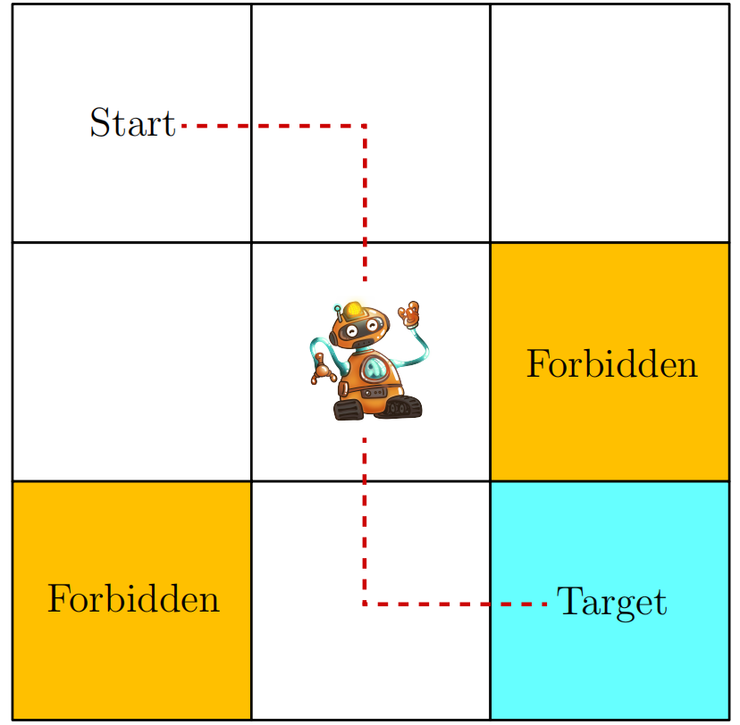
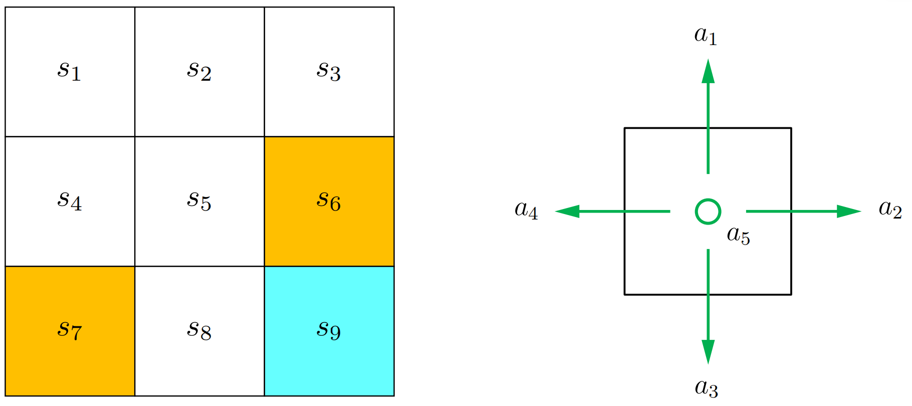
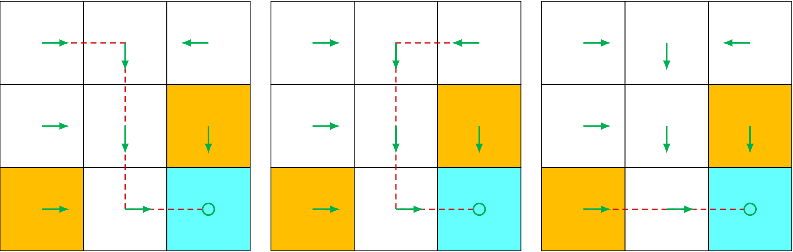
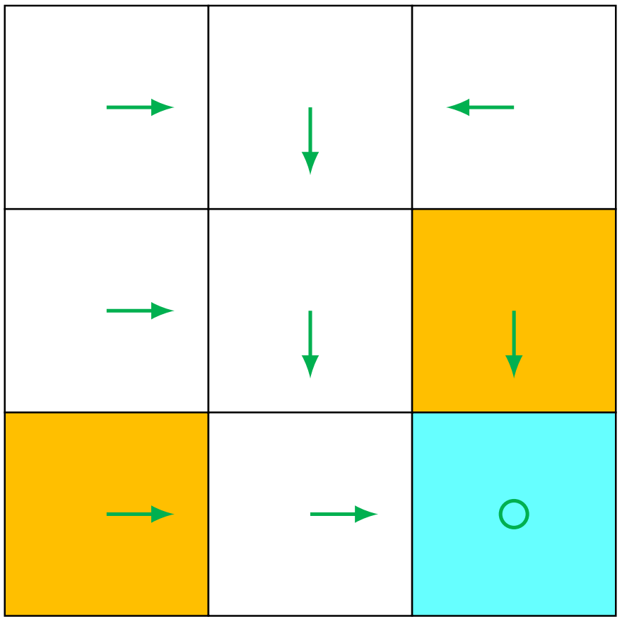
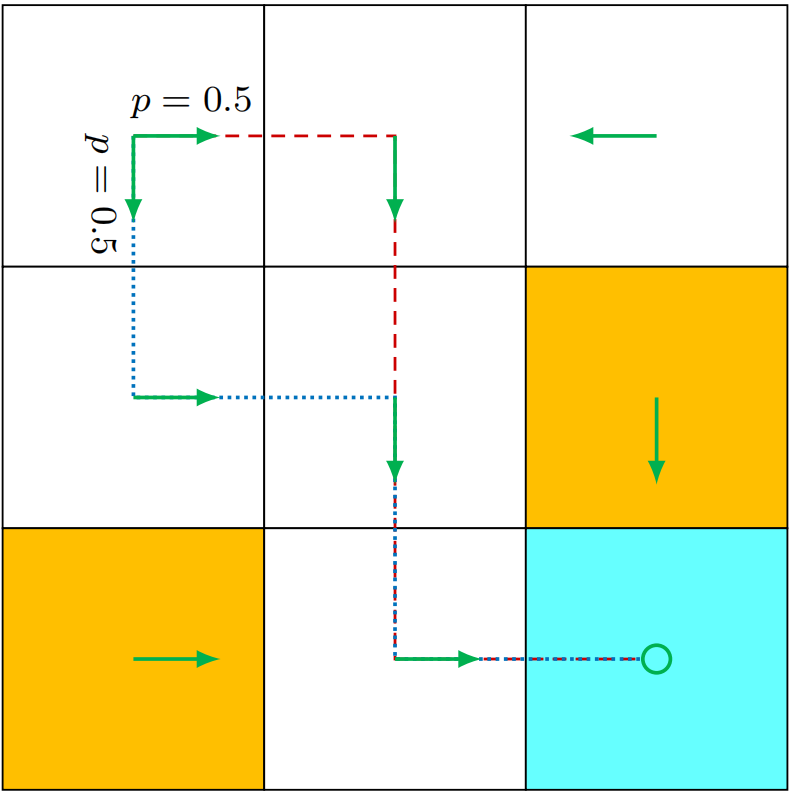
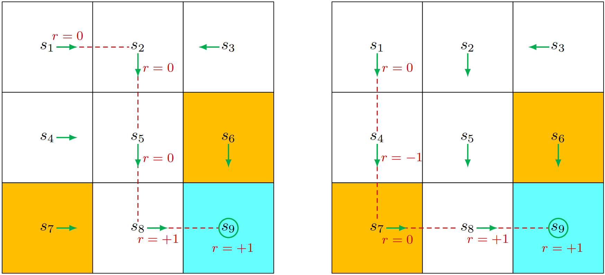
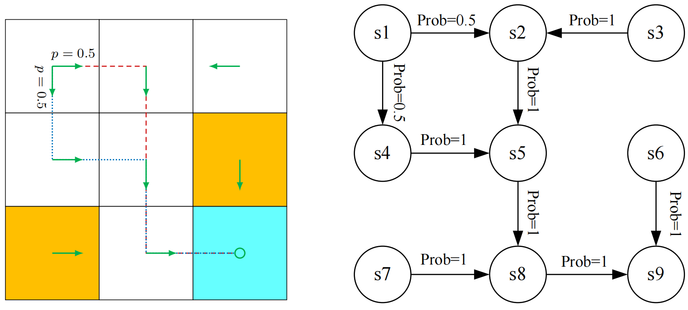

# 基本概念

## 一个网格世界例子

一个机器人在网格世界中移动，这个机器人叫做智能体，可以在图中相邻的格子移动。而且机器人在每一步只能占据一格子。白色格子是可进入的，橙色格子是被禁止的。机器人需要到达一个目标格子。本书将采用此类网格世界示例，因其直观易懂，便于阐释新概念与算法。



智能体的终极目标是找到一种“优质”策略，使其能够从任意初始位置出发抵达目标单元格。如何定义策略的“优劣标准”？核心思路在于：

- 智能体应当在抵达目标时不进入任何禁行区域
- 避免不必要的迂回路径
- 同时防止与网格边界发生碰撞。

若智能体事先掌握网格世界的地图信息，规划到达目标单元格的路径将变得轻而易举。但当智能体无法预知环境信息时，任务难度便会显著提升。此时，智能体必须通过试错法与环境交互来寻找优质策略。为此，本章后续阐述的核心概念具有关键作用。


## State 状态 和 action 动作

- `状态`：**它描述了智能体相对于环境的状态**。

  在网格世界示例中，状态对应智能体的位置。由于存在九个单元格，因此状态数量也为九种，其索引为$s_1、s_2,...,s_9$。

  所有状态的集合称为`状态空间`，记作$S=\{s_1,...,s_9\}$

- `动作`

  对于每个状态，智能体可采取五种可能的动作：向上移动、向右移动、向下移动、向左移动以及保持静止。这五种动作分别用$a_1,a_2,...,a_5$表示。

  所有动作的集合称为`动作空间`，记作$A = \{a_1,...,a_5\}$。

  不同状态可能具有不同的动作空间。例如，考虑到在状态$s_1$中执行$a_1$或$a_4$会导致与边界发生碰撞，我们可以将状态$s_1$的动作空间设定为$A(s_1) = {a_2，a_3，a_5}$。本书采用最通用的情形：对于所有$i$，$A(s_i) = A = {a1,...,a5}$。

  


### 状态迁移

> 当执行`动作`时，智能体可从一个`状态`转移到另一个`状态`，这一过程称为`状态迁移`。

- 例如，若智能体处于状态$s_1$并选择动作$a_2$（即向右移动），则会进入状态$s_2$。该过程可表示为：
  $$
  s_1\xrightarrow{\large a_2}s_2.
  $$

- 接下来我们分析两个重要示例

  - 🤔当智能体试图**突破边界状态**（例如在状态s1执行动作a1）时，其后续状态会如何演变？

    答案是该智能体将被弹回，因为智能体无法退出`状态空间`。因此，我们得出结论：
    $$
    s_1\xrightarrow{\large a_1}s_1
    $$

  - 🤔当智能体尝试**进入禁止区域**（例如在状态$s_5$执行动作$a_2$）时，接下来的状态会如何变化？

    可能出现两种不同情况。

    - 第一种情况是：虽然$s_6$区域被**禁止进入**，但仍**可通行**。此时下一状态为$s_6$，状态转移过程为$s_5 \rightarrow a_2 \rightarrow s_6$

      > [!NOTE]
      >
      > **禁止（forbidden） != 不可进入（blocked）**
      >
      > **区域被禁止但仍可通信**：系统允许你进入这个状态，但进入后会受到惩罚（reward 很低 / negative reward）

    - 第二种情况是：$s_6$区域因被墙壁环绕而无法通行。若智能体尝试向右移动，系统会将其弹回$s_5$状态，此时状态转移过程为$s_5\rightarrow a_2\rightarrow s_5$

    那么我们应当考虑哪种场景？答案取决于物理环境。本书重点探讨第一种场景：虽然进入禁用单元格可能面临惩罚，但这些单元格仍可被访问。该场景更具普适性且更具研究价值。此外，由于我们采用模拟任务框架（仿真环境），状态转移过程可按需定义。而在实际应用中，状态转移过程需遵循现实世界的动态规律。

- `状态转换过程`针对每个状态及其关联动作进行定义。该过程可通过**表格形式**描述。

  |       | **a1 (upward)** | **a2 (rightward)** | **a3 (downward)** | **a4 (leftward)** | **a5 (still)** |
  | ----- | --------------- | ------------------ | ----------------- | ----------------- | -------------- |
  | $s_1$ | $s_1$           | $s_2$              | $s_4$             | $s_1$             | $s_1$          |
  | $s_2$ | $s_2$           | $s_3$              | $s_5$             | $s_1$             | $s_2$          |
  | $s_3$ | $s_3$           | $s_3$              | $s_6$             | $s_2$             | $s_3$          |
  | $s_4$ | $s_1$           | $s_5$              | $s_7$             | $s_4$             | $s_4$          |
  | $s_5$ | $s_2$           | $s_6$              | $s_8$             | $s_4$             | $s_5$          |
  | $s_6$ | $s_3$           | $s_6$              | $s_9$             | $s_5$             | $s_6$          |
  | $s_7$ | $s_4$           | $s_8$              | $s_7$             | $s_7$             | $s_7$          |
  | $s_8$ | $s_5$           | $s_9$              | $s_8$             | $s_7$             | $s_8$          |
  | $s_9$ | $s_6$           | $s_9$              | $s_9$             | $s_8$             | $s_9$          |

  在这个表格中：

  - 行代表了状态
  - 列代表了动作
  - 单元格表示智能体在对应状态下执行动作后需转换至的下一状态

- 从`数学角度`上，状态转移过程可通过`条件概率`进行描述。

  例如，对于$s_1$和$a_2$，其**条件概率分布**为
  $$
  \begin{aligned}&p(s_1|s_1,a_2)=0,\\&p(s_2|s_1,a_2)=1,\\&p(s_{3}|s_{1},a_{2})=0,\\&p(s_4|s_1,a_2)=0,\\&p(s_5|s_1,a_2)=0,\end{aligned}
  $$
  这表明，当在 状态$s_1$处 采取 动作$a_2$ 时：

  - 智能体移动至 状态$s_2$ 的概率为1

  - 而智能体移动至其他状态的概率均为0

  - 因此，在时间点$s_1$采取行动$a_2$必然会导致智能体状态转移至$s_2$

- 虽然表格化表示法直观易懂，但它仅能描述`确定性状态转移`。

  实际上，状态转移往往具有`随机性`，必须通过条件概率分布来描述。

  例如当网格系统中出现`随机阵风（一种比喻性环境机制，用于说明环境的不确定性）`时，若在 状态$s_1$ 采取 行动$a_2$，智能体可能会被吹到 $s_5$ 而非 $s_2$ 。此时概率分布$p(s_5|s_1,a_2)$将大于零。不过为简化说明，本书在网格世界示例中仅考虑确定性状态转移情形。


## Policy 策略

> [!NOTE]
>
> `策略`：策略 会指导智能体在每个 `状态 state` 时应该采取的 `行动 action` 

- 直观的说，**策略可以表示为箭头**。当一个智能体按**策略**行动时，它可以从**初始状态**生成**轨迹**

  <figure style="text-align: center;">
         
      <figcaption align="center">从策略中获得的轨迹</figcaption>
  </figure>

- 从`数学角度`看，策略可用`条件概率`描述。将 **策略** 记作 $\pi(a|s)$，这是针对每个状态定义的条件概率分布函数。例如，$s_1$状态下的策略为

  - `确定性策略（deterministic policy）`：每个 state 只对应一个固定 action
    $$
    \begin{gathered}\pi(a_1|s_1)=0,\\\pi(a_2|s_1)=1,\\\pi(a_3|s_1)=0,\\\pi(a_4|s_1)=0,\\\pi(a_5|s_1)=0,\end{gathered}
    $$
    这表明在 状态$s_1$ 下采取 行动$a_2$ 的概率为1，而采取 其他行动 的概率均为0

    <figure style="text-align: center;">
        
        <figcaption align="center">确定性策略（每个 state 只对应一个固定 action）</figcaption>
    </figure>

  - `随机策略（stochastic policy）`：在同一个 state 下，可能随机选择不同 action。

    一般而言，策略可能具有随机性。例如在 状态$s_1$ 时，智能体可选择向右或向下移动的行动。这两种行动的概率都相同（均为0.5）.在这个例子中，状态$s_1$ 的策略是：
    $$
    \begin{aligned}&\pi(a_1|s_1)=0,\\&\pi(a_2|s_1)=0.5,\\&\pi(a_3|s_1)=0.5,\\&\pi(a_4|s_1)=0,\\&\pi(a_5|s_1)=0.\end{aligned}
    $$

    <figure style="text-align: center;">
        
        <figcaption align="center">随机策略。在状态s1时，智能体以相等的概率0.5向右或向下移动</figcaption>
    </figure>

  - 以条件概率表示的策略可采用表格形式存储。

    例如，**下表** 展示了 **随机策略对应的图示** 中呈现的随机策略，其中**第i行第j列的数值 表示 在第i个状态执行第j个动作的概率**。

    这种表示方式称为`表格化表示法`。我们将在第八章介绍另一种将策略表示为参数化函数的方法。

    |       | **a1 (upward)** | **a2 (rightward)** | **a3 (downward)** | **a4 (leftward)** | **a5 (still)** |
    | ----- | --------------- | ------------------ | ----------------- | ----------------- | -------------- |
    | $s_1$ | 0               | 0.5                | 0.5               | 0                 | 0              |
    | $s_2$ | 0               | 0                  | 1                 | 0                 | 0              |
    | $s_3$ | 0               | 0                  | 0                 | 1                 | 0              |
    | $s_4$ | 0               | 1                  | 0                 | 0                 | 0              |
    | $s_5$ | 0               | 0                  | 1                 | 0                 | 0              |
    | $s_6$ | 0               | 0                  | 1                 | 0                 | 0              |
    | $s_7$ | 0               | 1                  | 0                 | 0                 | 0              |
    | $s_8$ | 0               | 1                  | 0                 | 0                 | 0              |
    | $s_9$ | 0               | 0                  | 0                 | 0                 | 1              |


## Reward 奖励

> `奖励`是是强化学习中最独特的概念之一。

- 当智能体在 `某个状态` 下执行 `动作` 后，会从环境中获得 **奖励（记为$r$）**作为反馈。

  该奖励是 状态$s$ 和 动作$a$ 的函数，表示为 $r(s，a)$。其数值可以是**正实数**、**负实数**或**零**。

  不同奖励 对智能体最终学习到的 策略 会产生不同影响：一般来说，

  - `正奖励`会促使智能体采取相应动作

  - `负奖励`则会抑制其执行该动作的倾向

- 例如，在网格世界示例中，奖励设计如下：

  - 若智能体试图 **离开边界区域**，则奖励值$r_{boundary}$设为−1；
  - 若试图 **进入禁止区域**，则奖励值$r_{forbidden}$设为−1；
  - 若 **成功抵达目标状态**，则奖励值$r_{target}$设为+1；
  - 否则奖励值$r_{other}$设为0

  > [!NOTE]
  >
  > 需特别关注目标状态$s_9$。奖励机制无需在智能体到达$s_9$后终止。
  >
  > - 若智能体在$s_9$执行动作$a_5$，下一状态仍为$s_9$且奖励值为$r_{target} = +1$
  >
  > - 若执行动作$a_2$，下一状态同样为$s_9$，但奖励值为$r_{boundary} = −1$

- 奖励机制可视为`人机交互界面`，通过它我们可以**引导智能体按照预期行为**。

  例如，通过设计上述奖励机制，我们能够确保智能体倾向于避免超出边界或进入禁区单元格。

  > [!NOTE]
  >
  > **在强化学习中，设计合适的奖励机制是关键步骤**
  >
  > 然而对于复杂任务而言，这一步骤并不简单，因为可能需要使用者对问题有深入理解。不过相较于需要专业背景或对问题有深刻认知的其他解决方案，这种设计方式仍可能更为简便。

- **执行 动作 后获得 奖励 的过程**可通过`表格`直观呈现

  如下表所示。表格中每一行对应一个状态，每一列对应一个动作。表格中每个单元格的数值表示在该状态下执行动作所能获得的奖励。

  <div align="center">在网格世界例子中，展示的是固定奖励</div>

  |           | **a1 (upward)**        | **a2 (rightward)**     | **a3 (downward)**      | **a4 (leftward)**      | **a5 (still)**         |
  | --------- | ---------------------- | ---------------------- | ---------------------- | ---------------------- | ---------------------- |
  | **$s_1$** | $r_{\text{boundary}}$  | 0                      | 0                      | $r_{\text{boundary}}$  | 0                      |
  | **$s_2$** | $r_{\text{boundary}}$  | 0                      | 0                      | 0                      | 0                      |
  | **$s_3$** | $r_{\text{boundary}}$  | $r_{\text{boundary}}$  | $r_{\text{forbidden}}$ | 0                      | 0                      |
  | **$s_4$** | 0                      | 0                      | $r_{\text{forbidden}}$ | $r_{\text{boundary}}$  | 0                      |
  | **$s_5$** | 0                      | $r_{\text{forbidden}}$ | 0                      | 0                      | 0                      |
  | **$s_6$** | 0                      | $r_{\text{boundary}}$  | $r_{\text{target}}$    | 0                      | $r_{\text{forbidden}}$ |
  | **$s_7$** | 0                      | 0                      | $r_{\text{boundary}}$  | $r_{\text{boundary}}$  | $r_{\text{forbidden}}$ |
  | **$s_8$** | 0                      | $r_{\text{target}}$    | $r_{\text{boundary}}$  | $r_{\text{forbidden}}$ | 0                      |
  | **$s_9$** | $r_{\text{forbidden}}$ | $r_{\text{boundary}}$  | $r_{\text{boundary}}$  | 0                      | $r_{\text{target}}$    |

- `固定奖励（deterministic reward）` 与 `随机奖励（stochastic reward）`

  - **固定奖励**：在同一个 state 和 action 下，reward 一定相同。
    $$
    r(s,a)=\text{固定值}
    $$

  - **随机奖励**：在同一个 state 和 action 下，reward 可能不同。（实际上更有可能出现的情况）

    例如，若学生刻苦学习，其将获得积极奖励（如考试成绩提高），但该奖励的具体价值可能具有不确定性。


## Trajectories 轨迹, returns 回报, 与 episodes 回合

<figure style="text-align: center;">
    
    <figcaption align="center">图1.6，左图：策略1与其轨迹<br/>右图：策略2与其轨迹</figcaption>
</figure>
### 轨迹 trajectories

> `轨迹 Trajectories`：一种`状态(s)-动作(a)-奖励(r)链`，即一次运行过程中，系统走过的“路径”。

例如，根据上图中左图所示策略，智能体可沿以下轨迹移动：
$$
s_1 \xrightarrow[r=0]{a_2} s_2 \xrightarrow[r=0]{a_3} s_5 \xrightarrow[r=0]{a_3} s_8 \xrightarrow[r=1]{a_2} s_9.
$$

### 回报 returns

> `回报 returns`：沿轨迹收集的所有奖励之和。
>
> `回报 returns`也叫`总奖励 total rewards`或`累积奖励 cumulative rewards`
>
> `回报`可以用于评估**策略**效果

- 例如，我们可通过对比上图中两种策略的收益值进行评估。

  - 左图中：

    轨迹：
    $$
    s_1 \xrightarrow[r=0]{a_2} s_2 \xrightarrow[r=0]{a_3} s_5 \xrightarrow[r=0]{a_3} s_8 \xrightarrow[r=1]{a_2} s_9.
    $$
    回报：
    $$
    \tag{2.1}
    \label{finite_horizon_return_example}
    \begin{aligned}\mathrm{return}&=0+0+0+1=1.\end{aligned}
    $$
  
  - 右图中：
  
      轨迹：
      $$
      s_1 \xrightarrow[r=0]{a_3} s_4 \xrightarrow[r=-1]{a_3} s_7 \xrightarrow[r=0]{a_2} s_8 \xrightarrow[r=+1]{a_2} s_9.
      $$
      回报：
      $$
      \tag{2.2}
      \label{alternative_return_example}
      \begin{aligned}\mathrm{return}&=0-1+0+1=0.\end{aligned}
      $$

- **分析**：上面两式中的回报表明，左侧策略优于右侧策略，因其回报更高。

  这一数学结论与直觉相符：右侧策略表现较差，因其会经过一个禁止区域。


  - `回报`由`即时奖励 immediate reward`和`未来奖励 future rewards`构成。

    - `即时奖励`：在当前状态 $s_t$ 采取一个动作 $a_t$ 后，环境立刻返回的奖励 $r_t$
    - `未来奖励`：从下一步开始，后面所有步骤得到的奖励的总和
    - 有时即时奖励可能为负值，而未来奖励却为正值。

    因此，决策时应以收益（即总回报）而非即时奖励来确定行动方案，从而避免短视决策。


  - `折扣回报（discounted return）`：**越远的奖励，价值越低**

    式$\eqref{finite_horizon_return_example}$ 中的返回值定义适用于 **有限长度轨迹**，也可推广至 **无限长轨迹**。在无限长轨迹中，我们应该使用`折扣回报`，原因如下：

    例如 **图1.6 左图** 所示轨迹在到达$s_9$点后即停止。

    - 由于策略在$s_9$点处已明确定义，智能体到达该点后无需停止运行。

    - 假设我们使用`回报`：

      我们可设计策略使智能体在到达$s_9$点后保持静止状态，此时策略将生成如下无限长轨迹：
      $$
      s_1 \xrightarrow[r=0]{a_2} s_2 \xrightarrow[r=0]{a_3} s_5 \xrightarrow[r=0]{a_3} s_8 \xrightarrow[r=1]{a_2} s_9 \xrightarrow[r=1]{a_5} s_9 \xrightarrow[r=1]{a_5} s_9 \dots
      $$
      那么该轨迹上的奖励和为：
      $$
      \mathrm{return}=0+0+0+1+1+1+\cdots=\infty,
      $$
      🤔很明显这会造成一个问题，智能体获得的奖励是无穷大的，这在强化学习中叫做`发散（diverge）`

    - 引入`折扣回报`：`折现回报`即为`折现奖励`的总和
      $$
      \begin{aligned}\text{discounted return}&=0+\gamma0+\gamma^20+\gamma^31+\gamma^41+\gamma^51+\ldots,\end{aligned}
      $$
      其中：

      - $\gamma$：`折扣因子`。满足$0\leq\gamma<1$

      引入`折扣因子`的核心作用：

      1. 它消除了必须设置`终止条件（stop criterion）`的需求，使得轨迹可以是无限长的。

         - 假设没有折扣，那么$return=1+1+1+1+...=\infty$。那么这个时候如果不给智能体设置终止条件， 智能体就会一直进行下去

         - 有了折扣后，因为$0\leq\gamma<1$，$1+\gamma+\gamma^2+\gamma^3+...=有限值$，所以即使**任务永远不结束，回报仍然是有限**的。

      2. 折扣率可以用来调节对`即时奖励`和`未来奖励`的重视程度。

         - 当 $\gamma$ 接近0时：`短视（智能体只会看眼前利益）`，也就是说未来奖励几乎没有价值

           例如：
           $$
           \gamma = 0.1
           $$
           未来奖励：

           | 时间   | 权重  |
           | ------ | ----- |
           | 现在   | 1     |
           | 下一步 | 0.1   |
           | 两步后 | 0.01  |
           | 三步后 | 0.001 |

           可以看到几步后$\gamma$几乎等于 0。

         - 当 $\gamma$ 接近 1：`长远（智能体愿意承受短期损失）`，也就是说未来奖励几乎和现在一样重要

           例如：
           $$
           \gamma = 0.99
           $$
           那么：

           | 时间     | 权重 |
           | -------- | ---- |
           | 现在     | 1    |
           | 下一步   | 0.99 |
           | 10 步后  | 0.90 |
           | 100 步后 | 0.37 |

           可以看到很多步后$\gamma$仍然很大。所以智能体会：愿意为了未来牺牲现在。


### 回合

> - `终止状态 terminal state`：任务结束的状态。例如智能体达到终点或达到最大步数
> - `回合 episodes`：当智能体遵循策略与环境交互时，从开始到`终止状态`的这条完整轨迹，叫做一个 **episode（回合）**，也叫 **trial（试验）**。
>   - 如果环境或策略是`随机的（stochastic）`，即使从同一个状态开始，也可能得到不同的 episode。
>   - 如果一切都是`确定性的（deterministic）`，那么从同一个状态开始，总是得到同一个 episode。
> - `回合型任务（episodic task）` 和 `持续型任务（continuing task）`
>   - `episode`通常是有限长度的，`回合型任务`是有episode的任务
>   - `持续型任务`：有些任务没有终止状态，也就是说与环境的交互过程永远不会结束。
>   - 可以把 `episodic task` 转换成 `continuing task`，用**统一的数学方式处理**。

🤔怎么把 episodic 变成 continuing？

👉要做到这一点，我们需要定义：**当 agent 到达终止状态之后会发生什么**。关键点是不要让它真的停止，而是继续定义行为。

1. 方法1：把 `终止状态（terminal state）` 变成`吸收状态（absorbing state）`

   - 智能体到达终点后，

     

     - 状态不再改变（即永远停在Goal），但系统仍然继续运行
     - 奖励一直是 0

     数学形式：
     $$
     s_T \rightarrow s_T \rightarrow s_T \rightarrow ...
     $$
     并且：
     $$
     r = 0
     $$

   - 例如：在网格世界例子中，

     对于目标状态$s_9$，

     我们可以指定 动作$A(s9)=\{a5\}$，

     或设定 动作$A(s9)=\{a1 ，... ，a5\}$，且对所有 $i=1,...,5$ 均有 $p(s_9|s_9，a_i)=1$。

2. 方法2：把 `终止状态（terminal state）`  当成 `普通状态（normal state）`

   也就是说终点不再是终点，而是变为一个普通节点，智能体就可以自由进出该状态。

   **但是**：由于**每次到达（包括智能体上一步已经到达，但下一步执行$a_5$但原地不动）** $s_9$状态 都能获得 $r=1$ 的正向奖励，也就是说智能体会一直留在$s_9$状态（$s_9 → s_9 → s_9 → s_9 ...$），**最终会学会永久停留在 $s_9$状态 以持续获取奖励**。

   > [!NOTE]
   >
   > 值得注意的是，当**回合无限长且保持 $s_9$状态可获得正向奖励时**，必须采用`折扣因子`计算`折现回报`以避免`收益发散`。

> 在本书中，我们探讨 **方法2**，即 **终止状态被视为普通状态**，其动作空间为$A(s_9) = \{a_1,...,a_5\}$


## 马尔可夫决策过程

本章前文通过实例阐述了强化学习中的若干基本概念。本节将在`马尔可夫决策过程（MDP / MDPs）`框架下，以更形式化的方式呈现这些概念。


MDP 是描述 **随机动力系统（同一个状态出发，下一步可能去不同地方，而且有概率）** 的通用框架。

1. MDP 关键要素

   - `集合`

     - **状态空间**：所有`状态`的集合，记为$\mathcal{S}$。
     - **行动空间**：与 每个 `状态`$s \in \mathcal{S}$ 相关联的 `动作`集合，记为$A(s)$。
     - **奖励集合**：在 `状态-动作对`$(s,a)$ 下**所有可能出现的`奖励值`的集合**，记为$R(s,a)$。

   - `模型`

     - 状态转移概率：

       在 状态$s$ 中，当执行 动作$a$ 时，转移至状态 $s'$ 的概率为 $p(s'|s,a)$。对于任意 `状态-动作对`$(s,a)$，有$\sum_{s^{\prime}\in\mathcal{S}}p\left(s^{\prime}|s,a\right)=1$

     - 奖励概率：

       在 状态$s$ 下采取 行动$a$ 时，获得 奖励$r$ 的概率为$p(r|s,a)$。对于任意状态-行为对$(s,a)$，有$\sum_{r\in\mathcal{R}(s,a)}p(r|s,a)=1$

   - `策略`

     在 状态$s$ 下，选择 动作$a$ 的概率为 $\pi(a|s)$，对于任意 状态$s\in\mathcal{S}$，有$\sum_{a\in A(s)}\pi(a|s)=1$

   - `马尔可夫性质`

     > `马尔可夫性质`：未来只取决于现在，与过去无关

     - **无记忆性**

       举一个直观的例子，想象一个机器人在迷宫里：

       - **状态**：当前位置 $s_t$
       - **动作**：往左/右/前/后 $a_t$
       - **奖励**：走对了 +1，撞墙 +0

       如果这个系统满足 **马尔可夫性质**，那就意味着：机器人下一步会到哪里，只取决于 **现在的位置** 和 **现在的动作**，而不需要知道它是怎么走到这里的。

     - **马尔可夫性质在数学上的定义**

       `状态`：
       $$
       p(s_{t+1}|s_t,a_t,s_{t-1},a_{t-1},...,s_0,a_0)=p(s_{t+1}|s_t,a_t)
       $$
       其中：

       - $t$ 表示当前时间步，$t+1$ 表示下一个时间步

       + 左边：在知道整个历史的情况下，下一状态的概率，即$P(下一状态 | 所有过去)$
       + 右边：$P(下一状态 | 当前状态 + 当前动作)$
       + 左边=右边，也就是说，<span style="color:red">历史信息是多余的。只要知道当前，就够了</span>。

       `奖励`：
       $$
       p(r_{t+1}|s_t,a_t,s_{t-1},a_{t-1},...,s_0,a_0)=p(r_{t+1}|s_t,a_t)Basic
       $$
       其中：

       - 左边＆右边 和上面同理
       - 左边=右边，也就是说，<span style="color:red">奖励只取决于当前状态和动作</span>。

       > [!NOTE]
       >
       > `马尔可夫性质`对于推导`马尔可夫决策过程（MDP）`的`基本贝尔曼方程`至关重要

2. `模型`（动态过程）

   > `模型（动态过程）`：在上文中，所有 状态-动作对$(s,a)$对应的概率分布$p\left(s^{\prime}|s,a\right)$**（状态概率分布）** 和 $p\left(r|s,a\right)$**（奖励状态分布）** 叫做模型或动态过程

   模型分为两类

   - **平稳型（时间不变型）**：平稳模型随事件保持恒定
   - **非平稳型（时间变化型）**：非平稳模型可能随事件发生变化

   例如在**网格世界模型**中，**若某些禁止区域会时隐时现**，即构成`非平稳模型`。本书仅研究平稳模型。

3. `马尔可夫过程（MPs）`

   🤔马尔可夫决策过程（MDP）与马尔可夫过程（MP）有什么区别呢？

   👉当 MDP 中的策略一旦确定后，其 **`MDP` 就会退化为`马尔可夫过程`**。

   > - `马尔可夫过程（MP）`
   >
   >   - 只有：状态 $s$
   >
   >   - 状态转移概率：
   >     $$
   >     P(s'|s)
   >     $$
   >
   >   **没有“动作”，系统自己随机演化**
   >
   > - `马尔可夫决策过程（MDP）`
   >
   >   - 具有 状态 $s$ 和 动作 $a$
   >
   >   - 状态转移概率：
   >     $$
   >     P(s'|s,a)
   >     $$
   >
   >   - 奖励 $R(s,a)$
   >
   >   **多了一个“你可以做决策”的维度**

   例如：

   <figure style="text-align: center;"><figcaption align="center">图1.7：网格世界示例作为马尔可夫过程的抽象图。其中，圆圈代表状态，带箭头的连线表示状态转移。</figcaption></figure>

   **该网格世界原本是一个 MDP。当策略 $\pi(a|s)$ 给定后，可以将动作的选择概率与状态转移概率 $P(s'|s,a)$ 合并，从而得到状态之间的转移概率 $P(s'|s)$，因此该过程可以等价地表示为一个马尔可夫过程（MP）。**

   在随机过程研究文献中，**若过程为`离散时间`过程且`状态`数有限或可数，则马尔可夫过程也被称为`马尔可夫链`**。

   - 条件1：**离散时间**

     在网格世界模型中按 step 更新：

     ```
     t = 0,1,2,3,...
     ```

     比如：每一步移动一次，不是连续时间。

   - 条件2：**状态是有限或可数**

     在网格世界模型中的状态为：
     $$
     s1,s2,s3,...,s9
     $$
     一共是9个状态，所以这是一个有限集合

   > [!NOTE]
   >
   > 本书中当上下文明确时，“`马尔可夫过程`”与“`马尔可夫链`”这两个术语可互换使用。
   >
   > 此外，本书主要研究 **状态数和动作数均为有限值** 的`有限马尔可夫决策过程（MDP）`，这是最基础且需要深入理解的典型案例。

4. **`强化学习`的本质**

   强化学习本质上是一个**智能体与环境的交互过程**。`智能体`作为决策主体，能够感知自身`状态`、制定`策略`并执行`动作`，而其外部`环境`则构成整个系统。

   以网格世界模型为例：

   - `智能体`对应机器人
   - `环境`则对应网格世界。
   - 当智能体做出行动`决策`后，执行器会立即实施该决策，此时智能体`状态`会发生变化并获得`奖励`。

通过**把环境返回的原始反馈（传感器/信号）转换成强化学习可用的状态和奖励的处理机制**，智能体可对新状态及奖励进行解析，从而形成**闭环反馈机制**。

