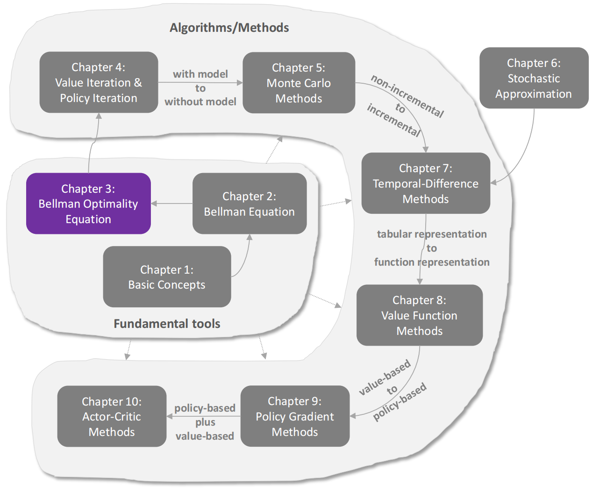
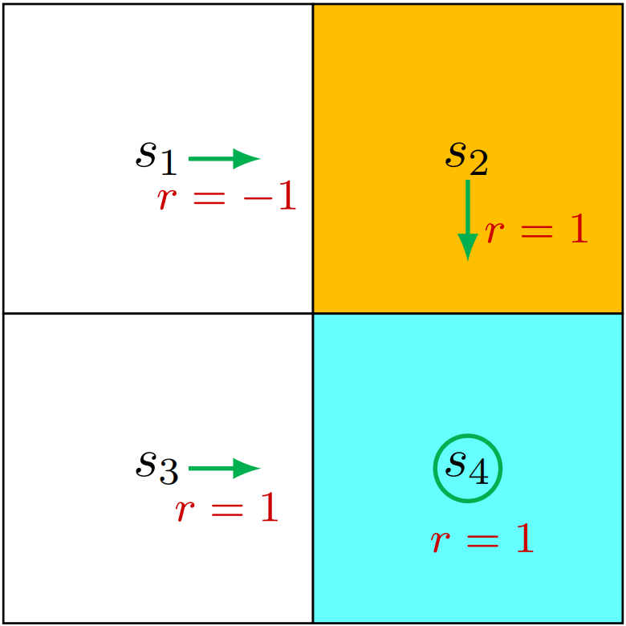
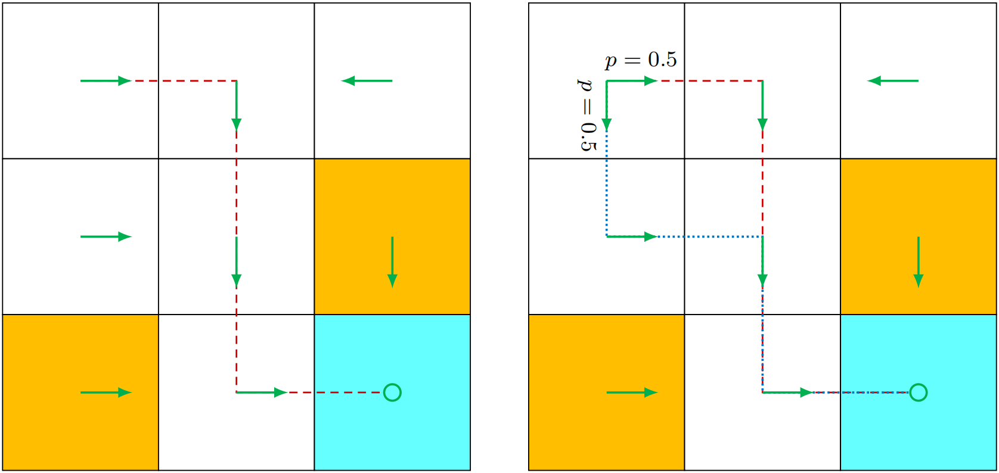
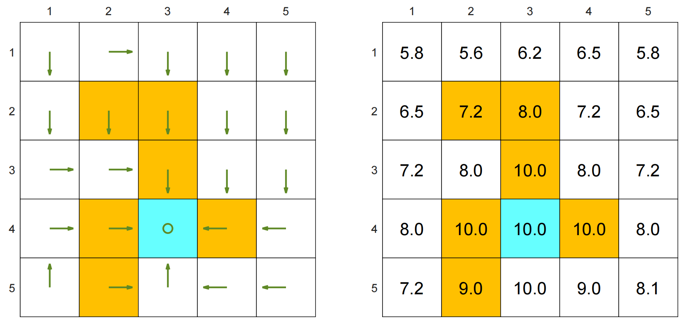
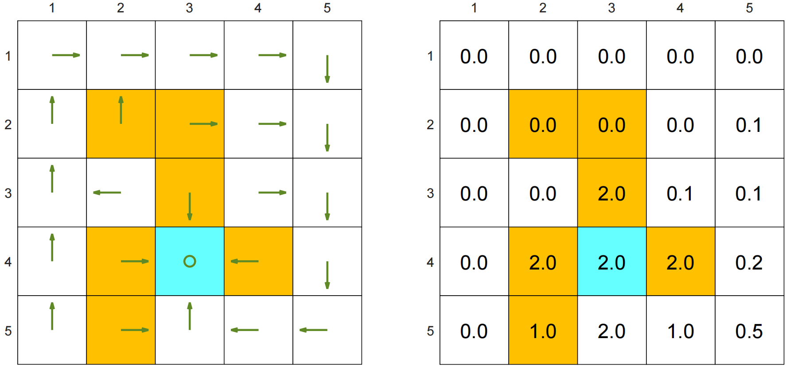
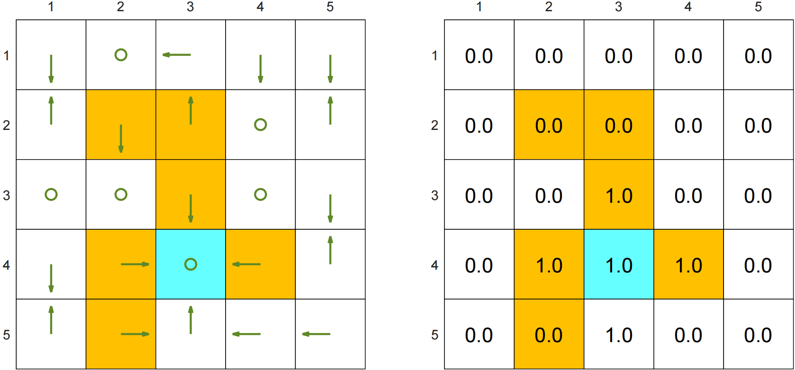
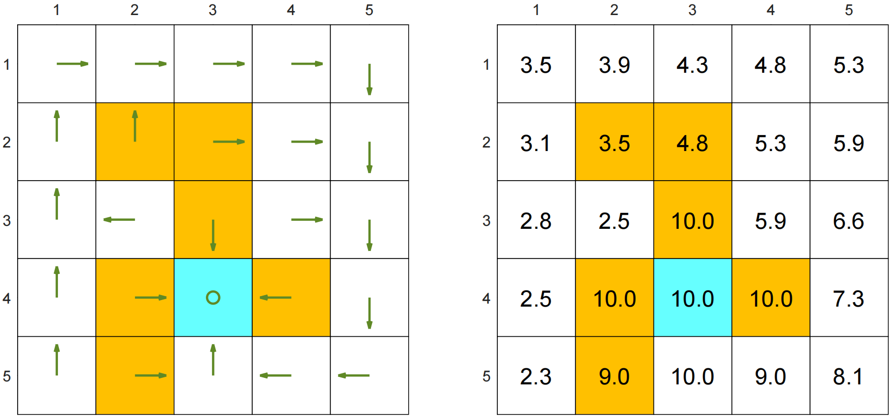
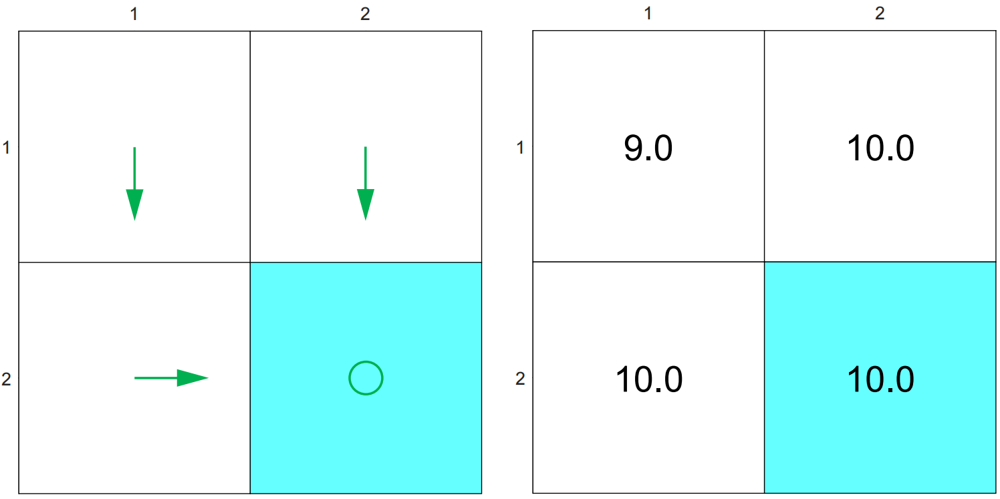
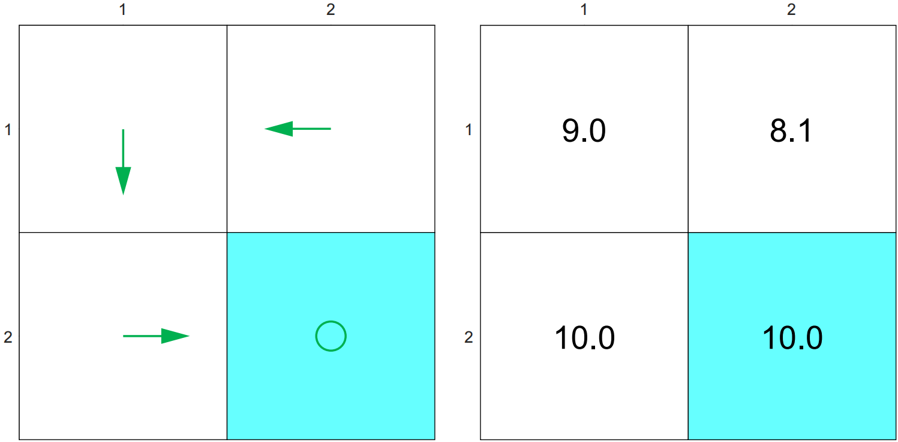

# 最优状态价值 与 贝尔曼最优性方程

强化学习的终极目标在于寻找`最优策略`。因此，明确`最优策略的定义`至关重要。

本章将介绍一个核心概念和重要工具：

- **核心概念** 是**基于 最优状态价值 来定义 最优策略**；
- **重要工具** 则是**贝尔曼最优性方程**，通过该方程可求解最优状态值及策略。

## 启发式实例：如何改进`策略`？

<figure style="text-align: center;">
    
    <figcaption align="center">图3.2：一个展示策略改进的示例</figcaption>
</figure>

如图3.2所示策略中，**橙色和蓝色单元格分别代表禁止区域与目标区域**。该策略表现`欠佳`，因其在状态$s_1$时选择向右移动的$a_2$动作。如何改进现有策略以获得更优解？关键在于`状态价值` 与 `动作价值` 的优化。

- 从直觉上看：如果在 $s_1$ 时刻选择 $a_3$（向下）而非 $a_2$（向右），策略的效果会得到改善。这是因为向下移动能使智能体避免进入禁入区域。

- 从数学角度上：上述直觉可通过 `状态价值` 与 `动作价值` 的计算得以实现。

  - 首先，我们计算**给定策略的`状态价值`**。

    > 状态价值 $v_\pi(s)$ 只能告诉你“这个状态整体好不好”，但不能告诉你“在这个状态下该选哪个动作更好”

    具体而言，根据`贝尔曼方程`：
    $$
    v_\pi(s)
      =
      \sum_{a\in A}
      \pi(a|s)
      \left[
      \sum_{r\in R}
      p(r|s,a)\, r
      +
      \gamma
      \sum_{s'\in S}
      p(s'|s,a)
      v_\pi(s')
      \right]
    $$
    该策略的`贝尔曼方程`为：
    $$
    \begin{gathered}v_{\pi}(s_{1})=-1+\gamma v_{\pi}(s_{2}),\\v_{\pi}(s_{2})=1+\gamma v_\pi(s_4),\\v_{\pi}(s_{3})=1+\gamma v_\pi(s_4),\\v_\pi(s_4)=1+\gamma v_{\pi}(s_{4}).\end{gathered}
    $$
    设 `折扣因子`$\gamma=0.9$，联合上面四条式子，可以得到：
    $$
    \begin{aligned}&v_\pi(s_4)=v_\pi(s_3)=v_\pi(s_2)=10,\\&v_\pi(s_1)=8.\end{aligned}
    $$
  
  - 然后，我们计算 状态$s_1$ 的 `动作价值`：
    $$
    \begin{aligned} q_\pi(s_1, a_1) &= -1 + \gamma v_\pi(s_1) = 6.2, \\ q_\pi(s_1, a_2) &= -1 + \gamma v_\pi(s_2) = 8, \\ q_\pi(s_1, a_3) &= 0 + \gamma v_\pi(s_3) = 9, \\ q_\pi(s_1, a_4) &= -1 + \gamma v_\pi(s_1) = 6.2, \\ q_\pi(s_1, a_5) &= 0 + \gamma v_\pi(s_1) = 7.2. \end{aligned}
    $$
  
  - 值得注意的是，动作$a_3$ 具有最高的 `动作价值`：
    $$
    q_\pi(s_1,a_3)\geq q_\pi(s_1,a_i),\quad\text{for all }i\neq3.
    $$
  
  - 因此，我们可以 **更新策略：在状态$s_1$处选择动作$a_3$**
  
  > [!NOTE]
  >
  > 这个示例表明，若通过**更新策略**以选择**动作值最大的动作**，则可获得更好的策略。这正是许多`强化学习算法的基本思想`。
  
  > 但是这个例子非常简单，因为给定的策略只是在 状态$s1$ 上表现不好。
  >
  > - 如果该策略在其他状态下也表现不好，那么选择**动作价值最大的动作**是否仍然能够产生一个更好的策略呢？
  >
  > - 此外，是否总是存在**最优策略**呢？
  >
  > - 一个最优策略究竟是什么样的呢？
  >
  > 我们将在本章中回答所有这些问题。

## 最优状态价值 与 最优策略

强化学习的最终目标是获得最优策略，但首先需要明确何为`最优策略`。该定义基于`状态价值`。

> 具体而言，考虑两个给定策略$\pi_1$和$\pi_2$。若$\pi_1$在任意状态下状态价值均大于或等于$\pi_2$的状态价值，即：
> $$
> v_{\pi_1}(s)\geq v_{\pi_2}(s),\quad\text{for all }s\in\mathcal{S},
> $$
> 那么我们说 $\pi_1$被认为优于$\pi_2$。此外，如果某项策略优于所有其他可能的策略，则该策略即为最优策略。

下文对此进行形式化阐述：

> [!IMPORTANT]
>
> `最优策略`：若 策略$\pi^{*}$ 对所有$s\in\mathcal{S}$及任意 其他策略$\pi$ 均满足$\upsilon_{\pi^*}\left(s\right)\geq\upsilon_\pi\left(s\right)$，则该策略为最优策略。
>
> `最优状态价值`：$\pi^{*}$的状态价值 即为 最优状态价值。
> 上述定义表明，相较于所有其他策略，最优策略在每个状态下的状态值均达到最大值。该定义同时也引发诸多疑问：

- `存在性`：最优策略是否存在？
- `唯一性`：最优策略是否唯一？
- `随机性`：最优策略是随机的还是确定性的？
- `算法`：如何获得最优策略及最优状态值？

要全面理解最优策略，就必须对这些基本问题给出明确的答案。例如，关于最优策略是否存在的问题：如果不存在最优策略，那么我们就无需费心设计算法来寻找它们。我们将在本章剩余部分回答所有这些问题。

## 贝尔曼最优方程 `Bellman Optimality Equation`

用于分析最优策略和最优状态价值的工具是`贝尔曼最优性方程（BOE）`。通过求解该方程，我们可以**获得最优策略和最优状态价值**。

接下来，我们将给出BOE的表达式，并对其进行详细分析。

- BOE的表达式

  对于每个$s\in\mathcal{S}$，BOE 的逐元素表达式为（我们可以与前文的贝尔曼期望方程做对比）
  \[
  \tag{2.11}
  \label{bellman_optimality_equation}
  \begin{aligned}
  \underbrace{v_*(s)}_{\text{最优状态价值}}
  &=
  \underbrace{
  \max_{\pi(\cdot\mid s)\in\Pi(s)}
  }_{\substack{\text{在状态 }s\text{ 下}\\\text{选择最优的动作概率分布}}}
  \sum_{a\in\mathcal{A}(s)}
  \underbrace{
  \pi(a\mid s)
  }_{\text{选择动作 }a\text{ 的概率}}
  \left[
  \underbrace{
  \sum_{r\in\mathcal{R}}
  p(r\mid s,a)\,r
  }_{\text{即时奖励的期望}}
  +
  \gamma
  \underbrace{
  \sum_{s'\in\mathcal{S}}
  p(s'\mid s,a)v_*(s')
  }_{\text{下一状态最优价值的期望}}
  \right]
  \\[6pt]
  &=
  \underbrace{
  \max_{\pi(\cdot\mid s)\in\Pi(s)}
  }_{\text{对动作概率分布进行优化}}
  \sum_{a\in\mathcal{A}(s)}
  \underbrace{
  \pi(a\mid s)
  }_{\text{动作选择概率}}
  \underbrace{
  q_*(s,a)
  }_{\text{动作价值}}
  \\[6pt]
  &=
  \underbrace{
  \max_{a\in\mathcal{A}(s)}
  q_*(s,a)
  }_{\text{所有可行动作的动作价值中的最大值}}.
  \end{aligned}
  \]
  其中：
  
  - \(v_*(s)\)：**最优状态价值**。表示从状态 \(s\) 出发，在之后**始终遵循最优策略**时所能获得的**期望折扣回报**。
  - \(\displaystyle \sum_r p(r\mid s,a)\,r\)：在状态 \(s\) 下执行动作 \(a\) 后获得的**即时奖励的期望值**。
  - \(\displaystyle \gamma\sum_{s'}p(s'\mid s,a)v_*(s')\)：执行动作 \(a\) 后，转移到各个下一状态 \(s'\) 的**折扣后的未来价值期望**。
  - \[ q_*(s,a) = \sum_r p(r\mid s,a)\,r + \gamma\sum_{s'}p(s'\mid s,a)v_*(s') \]：状态-动作对 \((s,a)\) 的**最优动作价值**。表示在状态 \(s\) 下**先执行动作 \(a\)**，之后遵循最优策略时所能获得的期望折扣回报。

- 贝叶斯最优方程（BOE）是分析最优策略的优雅而强大的工具。

  然而，**理解该方程可能并非易事**。例如，该方程包含两个未知变量$v(s)$ 和 $\pi (a|s)$，初学者可能难以理解**如何从单一方程中求解两个未知变量**。

  此外，**BOE本质上属于特殊贝尔曼方程**，但由于其表达式与贝尔曼方程存在显著差异，这一点并 不容易被察觉。我们还需针对BOE回答以下**基础性问题**：

  - `存在性`：该方程是否存在解？
  - `唯一性`：解是否唯一？
  - `算法`：如何求解该方程？
  - `最优性`：解与最优策略有何关联？

  一旦我们能够解答这些问题，即可明确 最优状态价值 与 最优策略。

### BOE方程等式右侧的最大化问题

接下来我们将阐明如何求解方程（2.11）中 BOE `右侧`的`最大化问题`。

**初学者乍看可能难以理解如何通过单一方程求解两个未知变量$v(s)$和$\pi(a|s)$**。

实际上，这两个未知变量可逐一求解。下例将说明这一思路。

- 例1：考虑两个未知变量 $x,y\in\mathbb{R}$，其满足：
  $$
  x=\max_{y\in\mathbb{R}}(2x-1-y^2)
  $$
  这是一种`自洽方程 / 不动点方程（fixed-point equation）`，对这种方程的标准思路是：

  1. 求解方程右侧的$y$的最大值

     - 我们看向方程右侧 $2x-1-y^2$，因为我们要求$y$的最大值，所以我们先把$x$当作常数

       所以我们把该子问题变为了 $\max_y(2x-1-y^2)$

     - 通过观察 $2x-1-y^2$，我们知道 $-y^2\leq0$ ， 所以 $2x-1-y^2\leq2x-1$

       也就是说，当 $y=0$ 时，$2x-1-y^2$ 就能取到最大值了

     - 得出 $y=0$

  2. 求解$x$

     当 $y=0$ 时，方程变为 $x=2x−1$，解得 $x=1$。

  3. 因此，$y=0$ 和 $x=1$ 是该方程的解。

> 我们现在转向 BOE 右侧的最大化问题。式（2.11）中的 BOE 可简洁地表示为：
> $$
> \begin{aligned}&v(s)=\max_{\pi(s)\in\Pi(s)}\sum_{a\in\mathcal{A}}\pi(a|s)q(s,a),\quad s\in\mathcal{S}.\end{aligned}
> $$
>   受 `例1` 启发，我们可先求解 `右侧最优`$\pi$。具体方法如何？

- 例2：
  
  - 假设在 状态\(s\) 下共有三个可选 动作：\[ \mathcal A(s)=\{a_1,a_2,a_3\}. \]
  
    策略 在 状态\(s\) 下选择这三个 动作 的概率分别为：\[ \pi(a_1\mid s), \pi(a_2\mid s), \pi(a_3\mid s)\]，并满足：\[ \pi(a_1\mid s) + \pi(a_2\mid s) + \pi(a_3\mid s) = 1\]，以及：\[ \pi(a_1\mid s),\, \pi(a_2\mid s),\, \pi(a_3\mid s) \ge 0. \]

    三个 动作 对应的 动作价值 分别为：\[ q(s,a_1), q(s,a_2), q(s,a_3). \]
  
    因此，状态价值 可以写成：$\begin{aligned} v(s) &= \pi(a_1\mid s)q(s,a_1)+ \pi(a_2\mid s)q(s,a_2) + \pi(a_3\mid s)q(s,a_3). \end{aligned}$
  
    现在我们的目标是选择三个策略的其中一个：\[ \pi(a_1\mid s), \pi(a_2\mid s), \pi(a_3\mid s) \] 使上式尽可能大。

  - 为了不失`一般性`，我们假设：\[ q(s,a_3) \ge q(s,a_1)\]，并且\[ q(s,a_3) \ge q(s,a_2)\]，也就是说：\[ \boxed{ q(s,a_3) = \max_{a\in\mathcal A(s)}q(s,a) } \]

    由于策略概率之和为 \(1\)：$\pi(a_1\mid s) + \pi(a_2\mid s) + \pi(a_3\mid s) = 1,$
  
    因此：\[ \begin{aligned} q(s,a_3) &= \left[ \pi(a_1\mid s) + \pi(a_2\mid s) + \pi(a_3\mid s) \right] q(s,a_3) \\[4pt] &= \pi(a_1\mid s)q(s,a_3) + \pi(a_2\mid s)q(s,a_3) + \pi(a_3\mid s)q(s,a_3). \end{aligned} \]
  
  - 又因为：\[ q(s,a_3)\ge q(s,a_1),\pi(a_1\mid s)\ge0, \]

    所以：\[ \pi(a_1\mid s)q(s,a_3) \ge \pi(a_1\mid s)q(s,a_1). \]

    同理：\[ \pi(a_2\mid s)q(s,a_3) \ge \pi(a_2\mid s)q(s,a_2). \]

    而第三项显然满足：\[ \pi(a_3\mid s)q(s,a_3) = \pi(a_3\mid s)q(s,a_3). \]
  
    因此：\[ \begin{aligned} q(s,a_3) &= \pi(a_1\mid s)q(s,a_3) + \pi(a_2\mid s)q(s,a_3) + \pi(a_3\mid s)q(s,a_3) \\[4pt] &\ge \pi(a_1\mid s)q(s,a_1) + \pi(a_2\mid s)q(s,a_2) + \pi(a_3\mid s)q(s,a_3). \end{aligned} \]
  
    因此：$\underbrace{
    \pi(a_1\mid s)q_\pi(s,a_1)
    +
    \pi(a_2\mid s)q_\pi(s,a_2)
    +
    \pi(a_3\mid s)q_\pi(s,a_3)
    }_{v_\pi(s)}
    \le
    q_\pi(s,a_3)$

    而因为：\[ q(s,a_3) = \max_{a\in\mathcal A(s)}q(s,a), \]（我们假设的条件）
  
    所以：\[ \boxed{ \sum_{a\in\mathcal A(s)} \pi(a\mid s)q(s,a) \le \max_{a\in\mathcal A(s)} q(s,a) } \]
  
  - 🤔什么时候等号成立？

    如果 \(a_3\) 是唯一使动作价值最大的动作，那么令：\[ \pi(a_3\mid s)=1,\pi(a_1\mid s)=0,\pi(a_2\mid s)=0, \]

    则：\[ \begin{aligned} \sum_a\pi(a\mid s)q(s,a) &= 0\cdot q(s,a_1) + 0\cdot q(s,a_2) + 1\cdot q(s,a_3) \\ &= q(s,a_3) \\ &= \max_aq(s,a). \end{aligned} \]
  
    因此：\[ \boxed{ \max_{\pi(\cdot\mid s)} \sum_a \pi(a\mid s)q(s,a) = \max_a q(s,a) } \]

    然后再把动作价值 \(q(s,a)\) 也彻底展开：\[ q(s,a) = \sum_{r\in\mathcal R} p(r\mid s,a)r + \gamma \sum_{s'\in\mathcal S} p(s'\mid s,a)v(s'). \]
  
    代回去：
    \[
    \begin{aligned}
    \underbrace{v_*(s)}_{\text{最优状态价值}}
    &=
    \underbrace{
    \max_{a\in\mathcal A(s)} q_*(s,a)
    }_{\text{所有动作价值中的最大值}}
    \\[4pt]
    &=
    \max_{a\in\mathcal A(s)}
    \left[
    \underbrace{
    \sum_{r\in\mathcal R}
    p(r\mid s,a)\,r
    }_{\text{即时奖励期望}}
    +
    \gamma
    \underbrace{
    \sum_{s'\in\mathcal S}
    p(s'\mid s,a)v_*(s')
    }_{\text{下一状态最优价值的期望}}
    \right].
    \end{aligned}
    \]

### BOE的矩阵-向量形式

**贝尔曼最优方程组（Bellman Optimality Equations, BOE）** 是指对状态空间中每一个状态 \(s\in\mathcal S\) 都成立的一组最优性方程。将这些逐状态方程统一组织起来，可以写成更加紧凑的`矩阵-向量形式`。该形式将在本章后续推导中被广泛使用。BOE 的`矩阵-向量形式`为（对比式 $\eqref{bellman_optimality_equation}$）
\[
\tag{2.12}
\label{bellman_optimality_matrix_equation}
\underbrace{v}_{\text{最优状态价值向量}}
=
\underbrace{
\max_{\pi\in\Pi}
}_{\substack{\text{在所有可行策略中优化}\\
\text{等价于逐状态选择最优动作}}}
\left(
\underbrace{
r_\pi
}_{\text{即时奖励期望向量}}
+
\underbrace{
\gamma
}_{\text{折扣因子}}
\underbrace{
P_\pi
}_{\text{状态转移概率矩阵}}
\underbrace{
v
}_{\text{下一状态价值向量}}
\right)
\]
其中

- \(\displaystyle \max_{\pi\in\Pi}\)：表示在 **所有可行策略\(\pi\)** 中进行优化；由于各状态上的决策可以分别优化，因此等价于对每个状态分别选择使其价值最大的动作。
- \(\Pi\)：**所有合法策略组成的集合**，其中每个策略\(\pi\) 都规定了在每个状态\(s\) 下选择各动作\(a\) 的概率 \(\pi(a\mid s)\)。
- \(r_\pi\in\mathbb{R}^{|\mathcal S|}\)：策略 \(\pi\) 下的 **即时奖励期望向量\[ r_\pi= \begin{bmatrix} r_\pi(s_1)\\ r_\pi(s_2)\\ \vdots\\ r_\pi(s_n) \end{bmatrix}\]**，其中第 \(s\) 个分量是\[ r_\pi(s) = \sum_{a\in\mathcal A(s)} \pi(a\mid s) \sum_{r\in\mathcal R} p(r\mid s,a)\,r \]，表示在 状态\(s\) 下按照 策略\(\pi\) 选择 动作$a$ 后得到的**即时奖励**期望。
- \(P_\pi\in\mathbb{R}^{|\mathcal S|\times|\mathcal S|}\)：策略\(\pi\) 下的 **状态转移概率矩阵\[ P_\pi= \begin{bmatrix} P_\pi(s_1,s_1)&P_\pi(s_1,s_2)&\cdots&P_\pi(s_1,s_n)\\ P_\pi(s_2,s_1)&P_\pi(s_2,s_2)&\cdots&P_\pi(s_2,s_n)\\ \vdots&\vdots&\ddots&\vdots\\ P_\pi(s_n,s_1)&P_\pi(s_n,s_2)&\cdots&P_\pi(s_n,s_n) \end{bmatrix} \]**，其中 \[ P_\pi(s,s') = \sum_{a\in\mathcal A(s)} \pi(a\mid s)p(s'\mid s,a) \] 表示在 状态\(s\) 下按照 策略\(\pi\) 行动后转移到 状态\(s'\) 的概率。
- \(\gamma\in[0,1)\)：**折扣因子**，用于控制未来状态价值相对于当前即时奖励的重要程度。

由于策略 $\pi$ 的`最佳值`由`状态价值` $v$ 决定，所以式（2.12）的右侧可记作**状态价值 $v$ 的函数**，即：
$$
f(v)\doteq\max_{\pi\in\Pi}(r_\pi+\gamma P_\pi v).
$$
然后BOE可以简洁地表示为
$$
\tag{2.13}
\label{bellman_optimality_fixed_point}
v=f(v)
$$
因为这个函数有 **取最大值** 的存在，所以 $f(v)$一般不再是线性函数，所以我们认为贝尔曼最优方程$v=f(v)$是一个非线性方程。在本节剩余部分中，我们将展示如何求解该`非线性方程`。

### 压缩映射定理

> `压缩映射定理`：如果一个映射每作用一次，都会把任意两点之间的距离按固定比例缩小，那么不断重复这个映射，最终一定会收敛到唯一的不动点

由于BOE可表示为`非线性方程`$v=f(v)$，我们接下来将运用`压缩映射定理`进行分析。该定理是研究一般非线性方程的有力工具，亦称`不动点定理`，该定理是分析BOE方程的关键所在。

#### 压缩映射定理的一般步骤

- 考虑BOE方程 $v=f(v)$，我们现在要做的是：

  1. 把问题改写为 **找不动点**

     - 什么叫找不动点呢？

       考虑一个函数$f(x)$，其中 $x\in\mathbb{R}^d$（表示$x$是一个$d$维度的实数向量） 并且 $\boldsymbol{f}:\mathbb{R}^d\to\mathbb{R}^d$（$f$是一个函数，把$d$维向量映射到$d$维向量）。若 $f(x^*)=x^*$，那么点$x^*$被认为是一个`不动点`，数学表达式为：
       $$
       f(x^*)=x^*.
       $$
       上述方程的解释是：$x^∗$的映射就是自身。这就是$x^∗$被称为“固定”的原因。

     - 举个例子：

       我们来看最简单的一维例子，假设 $f(x)=\frac{1}{2}x+1$​，我们想找一个 \(x^*\)，使得：\[ f(x^*)=x^* \]

       为了寻找不动点，我们令 \(f(x^*)=x^*\)，再把 \(f(x)=\frac12x+1\) 代入，得：\[ \frac12x^*+1=x^* \]，解得：\[ x^*=2. \]

       因为$x=2$经过函数 \(f\) 之后，它没有“移动”到别的数，所以叫**不动点**，即\[ \underbrace{2\xrightarrow{f}2}_\text{2是不动点} \]

       同理，我们把$x=0$代入函数$f(x)$得\[ f(0)=1 \]，那么\(0\) 被函数映射到了 \(1\)，所以 \(0\) **不是不动点**，即\[ \underbrace{0\xrightarrow{f}1}_\text{0不是不动点} \]

  2. 什么是 **收缩映射**

     若 `存在（注意是存在！）`$\gamma\in(0,1)$使得 函数$f$ 满足
     $$
     \begin{aligned}\|f(x_1)-f(x_2)\|\leq\gamma\|x_1-x_2\|\end{aligned},对应任意x_1,x_2\in\mathbb{R}^d成立
     $$
     则称$f$为`收缩映射（或收缩函数）`**（也就是说该函数会把`距离`缩小）**。在书中$\left\|\cdot\right\|$表示`向量`或`矩阵范数`（这个矩阵能把向量放大的“最大倍数”）

     举个例子：

     - 任意两个点 $x_1, x_2$
     - 原来的距离是：$\|x_1 - x_2\|$

     - 经过函数后变成：$\|f(x_1) - f(x_2)\|$

     这个新距离最多是原来的 **$\gamma$倍（$\gamma$<1）**

  3. **压缩映射定理** 在说明一个什么事实呢？

     如果一个函数是“收缩的”，那么：

     - 一定存在`唯一`的`不动点` $x^*$

     - **用`迭代`一定能找到一个`收缩函数` $x_{k+1}=f(x_k)$ ，会收敛到 $x^*$**

       这是因为：

       收缩映射满足：
       $$
       \|f(x_1) - f(x_2)\| \le \gamma \|x_1 - x_2\|,\quad 0<\gamma<1
       $$
       把 $x^*$ 代进去：
       $$
       \|x_{k+1} - x^*\| = \|f(x_k) - f(x^*)\| \le \gamma \|x_k - x^*\|
       $$

- **示例**：通过三个实例来说明不动点与收缩映射的概念。

  1. $x=f(x)=0.5x,x\in\mathbb{R}.$

     - `不动点`

       通过观察容易得到 $x=0$是一个不动点

     - 是否为`压缩映射`？

       函数$x=f(x)=0.5x$ 是一个压缩映射函数。因为对于任意$\gamma\in[0.5,1)$，有：
       $$
       \|0.5x_1-0.5x_2\|=0.5\|x_1-x_2\|\leq\gamma\|x_1-x_2\|
       $$

  2. $x=f(x)=Ax,where \; x\in\mathbb{R}^n,A\in\mathbb{R}^{n\times n}and\|A\|\leq\gamma<1.$

     - `不动点`

       容易验证 $x=0$（0表示零向量） 是一个不动点，因为 $0=A0$（0表示零向量）

     - 是否为`压缩映射`？

       因为：$\|Ax_{1}-Ax_{2}\|=\|A(x_{1}-x_{2})\|\leq\|A\|\|x_{1}-x_{2}\|\leq\gamma\|x_{1}-x_{2}\|.$

       所以：$x=f(x)=Ax$ 是一个压缩映射函数

  3. $x=f(x)=0.5\sin x,x\in\mathbb{R}.$

     - `不动点`

       容易验证 $x=0$ 是一个不动点，因为 $x=0.5 \sin 0$

     - 是否为`压缩映射`？

       因为：根据`平均值定理`可得出 $\left|\frac{0.5\sin x_1-0.5\sin x_2}{x_1-x_2}\right|=|0.5\cos x_3|\leq0.5,\quad x_3\in[x_1,x_2].$

       所以：$|0.5\sin x_1-0.5\sin x_2|\leq0.5|x_1-x_2|$，因此函数 $f(x)=0.5\sin x$ 是一个压缩映射函数

> `不动点`与`压缩映射性质`之间的关系可以通过下面这个经典定理来描述。👇

- `压缩映射定理`：对于任何具有形式 $x = f(x)$ 的方程（其中 $x$ 和 $f(x)$均为实向量），若 $f$ 是一个**收缩映射**，则以下性质成立：

  - 存在性：存在一个不动点$x^*$满足$f(x^*)=x^*.$

  - 唯一性：不动点$x^*$是唯一的

  - 算法：

    考虑`迭代`过程：
    $$
    x_{k+1}=f(x_k),
    $$
    其中，$k=0,1,2,...$。当$k\to\infty$时，对于任意初始猜测值$x_0$，有$x_k\to x^*$，此外，**收敛速度 为 指数级**。

  `压缩映射定理`不仅能判定 **非线性方程解的存在性**，还可为**该方程的数值求解算法**提供依据。

- **示例**：利用 `压缩映射定理` 所提出的 **迭代算法** 计算某些方程的`不动点`。

  我们再次考察前文所述的三个方程：$x = 0.5x$、$x = Ax$ 和 $x = 0.5 \sin x$。虽然已证明这三个方程的右侧均为收缩映射，但根据收缩映射定理可知，它们各自具有唯一的不动点。经验证该不动点为 $x^∗ = 0$。

  现在我们用 **迭代算法** 来求出这三个方程的不动点：

  1. 给定一个初始猜测值$x_0$

  2. **迭代更新**

     不断重复`压缩映射的迭代方程`：
     $$
     x_{k+1}=f(x_k)
     $$
     对应上面三个方程就是：
     $$
     \begin{aligned}&x_{k+1}=0.5x_k,\\&x_{k+1}=Ax_k,\\&x_{k+1}=0.5\sin x_k,\end{aligned}
     $$

  3. 计算序列

     我们将 $x_0$ 代入 $x_{k+1}=f(x_k)$ 得到 $x_1$，

     将 $x_1$ 代入 $x_{k+1}=f(x_k)$ 得到 $x_2$，

     将 $x_2$ 代入 $x_{k+1}=f(x_k)$ 得到 $x_3$

     ......

     最后我们得到了一串数字（有些方程可能是向量）：
     $$
     x_0\to x_1\to x_2\to\cdots
     $$

  4. 判断`是否收敛`（停止条件）

     （其实下面两个式子计算是完全一样的，但是表达的语义不一样）

     - 相邻误差（这一步走得还大不大？）
       $$
       \|x_{k+1}-x_k\|<\varepsilon
       $$

     - 残差（这个点满足方程 $x=f(x)$ 的程度如何？）
       $$
       \|x_k-f(x_k)\|<\varepsilon
       $$

     $\varepsilon$ 是一个很小的数，比如 $10^{-6}$

### BOE方程右端的`压缩映射性质`

证明式（2.13）中的 BOE 中的 $f(v)$ 是一个压缩映射函数。因此，可应用前一小节中引入的压缩映射定理。

1. 我们需要求解的问题

   我们来看BOE方程的逐状态形式，即 \[ f(v)(s) = \max_{a\in\mathcal A(s)} \left[ \sum_r p(r\mid s,a)r + \gamma \sum_{s'}p(s'\mid s,a)v(s') \right]. \]

   现在拿两个任意 状态价值向量 \[ v_1,v_2\]，我们要证明：\[ \|f(v_1)-f(v_2)\|_\infty \le \gamma\|v_1-v_2\|_\infty \]

2. 先看某一个固定 状态\(s\)

   有：
   \[
   f(v_1)(s) = \max_a \left[ \sum_r p(r\mid s,a)r + \gamma \sum_{s'}p(s'\mid s,a)v_1(s') \right]
   \]
   以及：
   \[
   f(v_2)(s) = \max_a \left[ \sum_r p(r\mid s,a)r + \gamma \sum_{s'}p(s'\mid s,a)v_2(s') \right].
   \]
   所以我们需要比较： \[ |f(v_1)(s)-f(v_2)(s)|. \]

   这里会用到一个基本性质：\[ \boxed{ \left| \max_a x_a-\max_a y_a \right| \le \max_a|x_a-y_a| } \]

   因此：\[ \begin{aligned} &|f(v_1)(s)-f(v_2)(s)| \\ &\le \max_a \left| \left[ \sum_r p(r\mid s,a)r + \gamma \sum_{s'}p(s'\mid s,a)v_1(s') \right] - \left[ \sum_r p(r\mid s,a)r + \gamma \sum_{s'}p(s'\mid s,a)v_2(s') \right] \right|. \end{aligned} \]

3. 即时奖励项相消

   因为对于同一个 \(s,a\)，\[ \sum_r p(r\mid s,a)r-\sum_r p(r\mid s,a)r=0, \]

   所以：\[ \begin{aligned} |f(v_1)(s)-f(v_2)(s)| &\le \max_a \left| \gamma \sum_{s'} p(s'\mid s,a) \left[ v_1(s')-v_2(s') \right] \right| \\ &= \gamma \max_a \left| \sum_{s'} p(s'\mid s,a) \left[ v_1(s')-v_2(s') \right] \right|. \end{aligned} \]

4. 利用绝对值的三角不等式

   我们得到 \[ \left| \sum_{s'}p(s'\mid s,a) [v_1(s')-v_2(s')] \right| \] 不超过 \[ \sum_{s'} p(s'\mid s,a) |v_1(s')-v_2(s')|. \]

   因此：\[ |f(v_1)(s)-f(v_2)(s)| \le \gamma \max_a \sum_{s'} p(s'\mid s,a) |v_1(s')-v_2(s')|. \]

5. 引入最大范数

   根据定义：\[ \boxed{ \|v_1-v_2\|_\infty = \max_{s'} |v_1(s')-v_2(s')| } \]

   所以对于任意 \(s'\)，一定有：\[ |v_1(s')-v_2(s')| \le \|v_1-v_2\|_\infty. \]

   于是：\[ \begin{aligned} &\sum_{s'} p(s'\mid s,a) |v_1(s')-v_2(s')|\le \sum_{s'} p(s'\mid s,a) \|v_1-v_2\|_\infty. \end{aligned} \]

   因为 \(\|v_1-v_2\|_\infty\) 与 \(s'\) 无关（因为 这是**所有状态上的最大绝对差**，算出来以后就是一个固定数），可以提出去，即：\[\sum_{s^{\prime}}p(s^{\prime}\mid s,a)\|v_1-v_2\|_\infty = \|v_1-v_2\|_\infty \sum_{s'}p(s'\mid s,a). \]

   而状态转移概率满足：\[ \boxed{ \sum_{s'}p(s'\mid s,a)=1 } \]

   所以：\[ \sum_{s'} p(s'\mid s,a) |v_1(s')-v_2(s')| \le \|v_1-v_2\|_\infty. \]

   又因为我们求出了：\[ |f(v_1)(s)-f(v_2)(s)| \le \gamma \max_a \sum_{s'} p(s'\mid s,a) |v_1(s')-v_2(s')| \]

   因此：\[ \boxed{ |f(v_1)(s)-f(v_2)(s)| \le \gamma\|v_1-v_2\|_\infty } \] ，对于**每一个状态 \(s\)** 都成立。

6. 最后再对所有状态取最大值

   最大范数定义为：\[ \|f(v_1)-f(v_2)\|_\infty = \max_s |f(v_1)(s)-f(v_2)(s)|. \]

   而我们刚刚已经证明每个状态都有：\[ |f(v_1)(s)-f(v_2)(s)| \le \gamma\|v_1-v_2\|_\infty. \]

   因此取最大值之后仍然有：\[ \boxed{ \|f(v_1)-f(v_2)\|_\infty \le \gamma \|v_1-v_2\|_\infty } \] （这是因为$|f(v_1)(s)-f(v_2)(s)|$中每个项都小于等于$\gamma\|v_1-v_2\|_\infty$，也就是说$|f(v_1)(s)-f(v_2)(s)|$中最大的项必然小于等于$\gamma\|v_1-v_2\|_\infty$）

   这就证明了 \(f\) 是压缩映射。

## 从 BOE方程 得到 最优策略

上一节，我们已经准备好求解BOE以获得 `最优状态价值`$v^*$ 和 `最优策略`$\pi^*$

- 求解 `最优状态价值`$v^*$

  - 从 **贝尔曼最优方程（矩阵-向量形式）**（即式$\eqref{bellman_optimality_matrix_equation}$） 出发：
    $$
    v^*=\max_{\pi\in\Pi}(r_\pi+\gamma P_\pi v^*).
    $$
    定义`算子（函数）`：
    
    > `算子`：输入一个价值向量，经过某种规则处理后，输出另一个价值向量的函数。
    
    $$
    f(v) = \max_{\pi \in \Pi}(r_\pi + \gamma P_\pi v)
    $$
    则原方程可写为：
    $$
    v = f(v)
    $$
    把其看为`不动点问题`
    
  - 使用 **迭代法** 求解 `最优状态价值`$v^*$

    > 我们已经证明了 $f$ 是`压缩映射`的
    >
    > 在上面我们证明了：
    > $$
    > \|f(v_1)-f(v_2)\|_\infty\leq\gamma\|v_1-v_2\|_\infty,\quad\gamma\in(0,1)
    > $$
    > 因此$f$是一个`压缩映射`。所以我们得到了压缩映射定理的三个结论：
    >
    > - $v^∗$的`存在性`：BOE的解始终存在
    >
    > - $v^∗$的`唯一性`：解$v^∗$始终唯一
    >
    > - $v^∗$可以通过`迭代法`求解
    >
    >
    > ---
    >
    > 因为 $v^*=f(v^*)$ 所以 $v^{*}$ 是 函数$f$ 的 `不动点`
    
    由于BOE方程总存在唯一解$v^∗$，可通过求`压缩映射定理`提出的`迭代算法（值迭代法）`进行求解：
    $$
    v_{k+1}=f(v_k)=\max_{\pi\in\Pi}(r_\pi+\gamma P_\pi v_k),\quad k=0,1,2,\ldots.
    $$
    对于任意初始猜测值$v_k$，当$k\to\infty$时，$v_k$的值会以指数级速度收敛至 `最优状态价值`$v^∗$

- 求解 `最优策略`$\pi^*$

  - **已知最优状态价值 $v^*$**

    已知 $v^*$ 满足贝尔曼最优方程（BOE）：
    $$
    v^* = \max_{\pi}(r_\pi + \gamma P_\pi v^*)
    $$
    含义：对每个 状态$s$，从所有策略里挑一个，使得“当前奖励 + 折扣后的未来价值”最大。

    
max 表示 对结果取最大值

  - **构造最优策略 $\pi^{*}$**

    定义策略：
    $$
    \pi^*=\arg\max_{\pi\in\Pi}(r_\pi+\gamma P_\pi v^*).
    $$
    含义：在给定 $v^*$ 的情况下，选择 **使 $r_\pi+\gamma P_\pi v^*$ 达到最大值的策略**

    
arg max 表示 要怎么做才能达到最大值

  - **将上式 代入BOE**

    由于 $\pi^*$ 是使最大值成立的策略，将其代入 $v^* = \max_{\pi}(r_\pi + \gamma P_\pi v^*)$ 可得：
    $$
    v^*=r_{\pi^*}+\gamma P_{\pi^*}v^*.
    $$
    其中：

    - $v^*$：一个向量（维度=状态数）。最优状态价值函数向量。$v^*=(v^*(s_1),v^*(s_2),\ldots)$

      含义：从每个状态出发，在最优策略下能获得的最大期望回报

    - $\pi^*$：函数。最优策略。$\pi^*(s)$是在 状态$s$ 选的 动作

      含义：在每个状态下选择“最优动作”

    - $r_{\pi^*}$：奖励向量。$r_{\pi^*}=(r(s_1,\pi^*(s_1)),r(s_2,\pi^*(s_2)),\ldots)$

      含义：在每个状态，按照策略 $\pi^*$ 采取动作时得到的**即时奖励**

  - 得出结论

    由`贝尔曼方程性质`可以知道：
    $$
    v^*=v_{\pi^*}
    $$
    **即 $v^{*}$ 正是策略 $\pi^*$ 的状态价值函数**

  > [!NOTE]
  >
  > 此时，虽然我们可以求解 $v^∗$ 和 $\pi^*$
  >
  > 但是$\pi^*$本质上只是一个 **由 BOE 构造出来的候选策略（我们认为的最优的策略）**，也就是说我们没有证明 **$\pi^*$比所有策略都好（全局最优）**，即它是在表达式 $r_\pi + \gamma P_\pi v^*$ 下取得最大值的策略，并未证明其在所有策略中使长期回报最大。
  >
  > 所以**解**是否最优**（最优 = 在所有`策略（policy）`中，长期`回报（returns）`最大）**仍不明确。

  

## 证明 BOE方程得出的 最优策略 确实是最优解

那么为了证明这个策略是最优，需要用到以下定理：

> `定理3.4`（$v^*$ 与 $\pi^*$的最优性）：**BOE 求出来的解，就是全局最优解**
> $$
> v^*=v_{\pi^*}\geq v_\pi,\quad\forall\pi
> $$
> 其中：
>
> - $v_\pi$：策略$\pi$ 的 状态价值函数，$v_\pi=(v_\pi(s_1),v_\pi(s_2),\ldots)$
>
> - $\geq$：表示对 向量 中的元素进行 逐元素比较
>
> 含义：
>
> - $v^*$ 就是最优价值
> - $\pi^*$ 是最优策略
> - 没有任何策略比它更好

> `证明` $v^*\geq v_\pi,\quad\forall\pi$：
>
> - 对于任何 策略$\pi$，都满足前文的贝尔曼矩阵方程：
>   $$
>   v_\pi=r_\pi+\gamma P_\pi v_\pi.
>   $$
>
> - 由于 贝尔曼最优方程
>   $$
>   v^*=\max_\pi(r_\pi+\gamma P_\pi v^*)=r_{\pi^*}+\gamma P_{\pi^*}v^*\geq r_\pi+\gamma P_\pi v^*
>   $$
>   于是我们有：
>   $$
>   v^*-v_\pi\geq(r_\pi+\gamma P_\pi v^*)-(r_\pi+\gamma P_\pi v_\pi)
>   $$
>   又因为
>   $$
>   (r_\pi+\gamma P_\pi v^*)-(r_\pi+\gamma P_\pi v_\pi)=\gamma P_\pi(v^*-v_\pi)
>   $$
>   所以
>   $$
>   v^*-v_\pi\geq \gamma P_\pi(v^*-v_\pi)
>   $$
>
> - 问题：我们要求的是 $v^*-v_\pi\geq0$
>
>   - 根据上面的式子 $v^*-v_\pi\geq\gamma P_\pi(v^*-v_\pi)$，我们根本看不出来，因为等式右边也有$v^*-v_\pi$，这个是一个 **自我依赖**
>
>   - 🤔我们应该怎么做呢？
>
>     我们对比一下 $v^*-v_\pi\geq0$ 与 $v^*-v_\pi\geq\gamma P_\pi(v^*-v_\pi)$
>
>     也就是说我们要把 $\gamma P_\pi(v^*-v_\pi)$ 不断**展开**，直到它变成接近 0 的东西👇
>
> - **反复应用上述不等式（注意不是只是单独的乘以$\gamma P_\pi$）**，即
>   $$
>   v^*-v_\pi\geq\gamma P_\pi(v^*-v_\pi)
>   \\
>   \gamma P_\pi(v^*-v_\pi)\geq \gamma P_\pi(\gamma P_\pi(v^*-v_\pi))
>   \\
>   \gamma P_\pi(\gamma P_\pi(v^*-v_\pi)) \geq \gamma P_\pi(\gamma P_\pi(\gamma P_\pi(v^*-v_\pi)))
>   \\
>   ......
>   $$
>   可得
>   $$
>   v^*-v_\pi\geq\gamma P_\pi(v^*-v_\pi)\geq\gamma^2P_\pi^2(v^*-v_\pi)\geq\cdots\geq\gamma^nP_\pi^n(v^*-v_\pi
>   $$
>   由此得出结论：
>   $$
>   v^*-v_\pi\geq\lim_{n\to\infty}\gamma^nP_\pi^n(v^*-v_\pi)=0
>   $$
>   最后一个等式成立，因为$\gamma<1$ ，且 $P_\pi^n$（状态转移概率矩阵，$P_\pi=\begin{bmatrix}P(s_1\to s_1)&P(s_1\to s_2)&\cdots\\P(s_2\to s_1)&P(s_2\to s_2)&\cdots\\\vdots&\vdots&\ddots\end{bmatrix}$）是一个非负矩阵，其所有元素均小于或等于1（因为 $P_\pi^n\mathbf{1}=\mathbf{1}$）。
>
>   因此，对于任意$\pi$，$v^*\geq v_\pi$。

- 接下来，我们更深入地研究$\pi^*$。

  特别地，以下定理表明：总存在一个`确定性贪心策略`能够达到`最优解`。

  > `定理3.5`（贪心最优策略）。
  >
  > 一旦你有了 最优价值函数$v^*$，`最优策略`可以用“**贪心选动作**”直接得到，而且这个策略一定是最优的。
  >
  > （下式中的策略被称为“**贪婪策略**”，因为它旨在寻找具有最大$q^*(s,a)$值的动作）
  > $$
  > \tag{2.14}
  > \label{greedy_policy}
  > \pi^*(a|s)=\begin{cases}1,&a=a^*(s),\\0,&a\neq a^*(s),&\end{cases}
  > $$
  >
  > - 对于任意状态$s$：
  >   $$
  >   a^*(s)=\arg\max_aq^*(s,a)
  >   $$
  >   其中：
  >
  >   - $a^*(s)$：在状态$s$下应该采取的`最优动作`
  >
  >   - $q^{*}(s,a)$：最优`动作价值函数`。在状态 $s$，**先执行动作 $a$**，之后都按最优策略走，能得到的期望总回报
  >     $$
  >     q^*(s,a)=\sum_rp(r|s,a)r+\gamma\sum_{s^{\prime}}p(s^{\prime}|s,a)v^*(s^{\prime})
  >     $$
  >
  >     - $\sum_rp(r|s,a)r$：在状态$s$ 执行动作$a$ 的 **期望即时奖励**
  >     - $\gamma\sum_{s^{\prime}}p(s^{\prime}|s,a)v^*(s^{\prime})$：执行动作 $a$ 后，到达下一个状态的 **未来最优价值的期望**
  >
  >   - $\arg\max_xf(x)$：表示哪个 $x$ 让 函数$f(x)$ 最大
  >
  > - 🤔为什么 **选最大** 就是 **选最优**？
  >
  >   因为 BOE 的“按动作展开形式”是：
  >   $$
  >   v^*(s)=\max_aq^*(s,a)
  >   $$
  >   其中：
  >
  >   - $v^*(s)$：最优能达到的价值
  >   - $q^*(s,a)$：选动作 $a$ 时能达到的价值
  >
  > - 🤔为什么 最优策略 是 确定性策略 而不是 随机策略？
  >
  >   也就是说：
  >
  >   - 不需要随机策略
  >
  >   - 每个状态选一个确定动作就行
  >
  >   从直觉上解释：
  >
  >   - 如果某个动作最好，那就直接选它
  >   - 没必要掺杂别的动作（只会变差）

- 最优策略$\pi^*$ 的两个重要性质

  - **最优策略的`唯一性`**

    尽管 `最优状态价值函数`$v^{*}$ 的值具有`唯一性`

    但对应于 $v^{*}$ 的`最优策略`可能并`不唯一`

    这一点可通过反例轻松验证

    例如，图3.3所示的两种策略均为最优策略。

  - **最优策略的`随机性`**

    如图3.3所示，最优策略可以是`随机`的，也可以是`确定性`的。

    然而，**根据定理3.5可以确定，总是存在一个`确定性`的最优策略**。

  <figure style="text-align: center;">
      
      <figcaption align="center">图3.3：用于证明最优策略可能不唯一性的示例。两种策略虽不同但均为最优解</figcaption>
  </figure>

## 影响最优策略的因素

BOE 是分析最优策略的强大工具。接下来我们将应用 BOE 来研究哪些因素可能影响最优策略。通过观察 BOE 的逐元素表达式（式 2.11），我们可以得到：
$$
v(s)=\max_{\pi(s)\in\Pi(s)}\sum_{a\in\mathcal{A}}\pi(a|s)\left(\sum_{r\in\mathcal{R}}p(r|s,a)r+\gamma\sum_{s^{\prime}\in\mathcal{S}}p(s^{\prime}|s,a)v(s^{\prime})\right),\quad s\in\mathcal{S}.
$$
最优状态价值与最优策略由以下参数决定：

- 即时奖励 $r$
- 折扣率因子 $\gamma$
- 系统模型 $p(s^{\prime}|s,a),p(r|s,a)$

在`系统模型`固定的情况下，我们将探讨当调整 $r$ 和 $\gamma$ 参数时`最优策略`的变化规律。本节所述所有最优策略均可通过定理3.3中的算法获得，算法具体实现细节将在第四章详述。本章重点阐述最优策略的基本特性。

---

图 3.4：不同参数值下的 最优策略 及 最优状态价值。

### 一个基础示例

以图3.4所示为例：

奖励设置为 $r_{\mathrm{boundary}}=r_{\mathrm{forbidden}}=-1$ 且 $r_{\mathrm{target}}=1$；

此外，智能体在每个移动步骤都会获得奖励 $r_{other} = 0$；

折扣因子设定为 $\gamma = 0.9$。根据上述参数，最优策略及最优状态值如图3.4(a)所示。

值得注意的是，智能体并不畏惧穿越禁入区域以抵达目标区域。

具体而言，从状态 (行=4，列=1) 出发，智能体有两条路径可达目标区域：

- 第一条路径 避开所有禁入区域并长途跋涉至目标区域；
- 第二条路径 穿越禁入区域。尽管进入禁入区域会带来负奖励，第二条路径的累积奖励高于第一条路径。

因此，由于 $\gamma$ 的取值较大，该`最优策略`更重视“长期收益”，不太在意`短期损失`。

### 折扣因子的影响

- 若将折扣因子从 $\gamma =0.9$调整为 $\gamma = 0.5$，同时保持其他参数不变，最优策略即如`图3.4(b)`所示。

  值得注意的是：

  - 智能体不再愿意承担风险；

  - 相反，它会长途跋涉抵达目标，同时规避所有禁入区域。

  这是因为$\gamma$值相对较小，导致最优策略变得目光短浅。

- 极端情况下，我们把折扣因子变为0，即 $\gamma=0$。相应的最优策略如`图3.4(c)`所示。

  在此情况下，智能体无法抵达目标区域。

  因为：**每个状态下的最优策略都具有极强的短视性，只会选择能带来最大即时回报的动作，而非追求最大总回报**。

  此外，**状态价值的空间分布**呈现出有趣规律：

  - 靠近目标的状态具有更高的状态价值
  - 远离目标的状态的状态价值更低

  这一规律在图3.4的所有示例中均可观察到。通过折扣因子机制可以解释这种现象：当某个状态需要沿更长路径才能抵达目标时，其状态值会因折扣率效应而降低

### 奖励的影响

若要严格禁止智能体进入任何禁入区域，可通过提高`违规惩罚力度`来实现。

例如，当禁入区域的惩罚系数$r_{forbidden}$从-1调整为-10时，优化策略就能规避所有禁入区域（参见`图3.4(d)`）。

> [!NOTE]
>
> **调整奖励机制并不总能产生不同的最优策略**。
>
> 因为：
>
> - `最优策略`对`奖励函数`的`仿射变换（一个“线性变换”（整体放大/缩小，或整体加一个常数））`具有`不变性`
>
> - 换句话说，即使对所有奖励值进行缩放或统一加法调整，最优策略的本质也不会改变。
> - 如果只是调整个别值就可能发生改变

> `定理3.6`：最优策略不变性
>
> - 考虑一个马尔可夫决策过程，其中$v^*\in\mathbb{R}^{|\mathcal{S}|}$是满足$v^*=\max_{\pi\in\Pi}(r_\pi+\gamma P_\pi v^*)$的最优状态价值函数。
>
> - 若将每个奖励$r\in\mathcal{R}$通过仿射变换转换为$\alpha r+\beta$（其中$\beta\in\mathbb{R}$并且$a>0$），则对应的最优状态价值$v'$可视为$v^*$的`仿射变换`：
>   $$
>   v^{\prime}=\alpha v^*+\frac{\beta}{1-\gamma}\mathbf{1},
>   $$
>   其中：
>
>   - $\gamma\in(0,1)$：折扣因子
>   - $\mathbf{1}=[1,\ldots,1]^T$：1向量
>
>   因此，由$v_0$导出的最优策略对奖励值的仿射变换具有不变性。

### 避免无意义的迂回路线

在奖励机制下，智能体每完成一个移动步骤都会获得奖励值 $r_{other} = 0$（除非进入禁止区域或目标区域，或试图超出边界）。由于零奖励并不构成惩罚，那么最优策略是否会采取毫无意义的迂回路径才能抵达目标？我们是否应将 $r_{other}$ 设为负值，以激励智能体尽快到达目标？

<figure>
<figure style="text-align: center;">
    
    <figcaption align="center">图(a) 最优策略</figcaption>
</figure>
<figure style="text-align: center;">
    
    <figcaption align="center">图(b) 非最优策略</figcaption>
</figure>
<figcaption align="center">图3.5：示例表明，最优策略不会因贴现率而采取无意义的迂回路径。</figcaption>
</figure>

参考图3.5中的示例，其中右下角单元格为目标区域。除状态$s_2$外，此处的两种策略完全相同。

根据图3.5(a)所示策略，智能体在$s_2$时刻向下移动，轨迹为$s_2\to s_4$

而图3.5(b)所示策略则使智能体向左移动，轨迹为$s_{2}\to s_{1}\to s_{3}\to s_{4}$

值得注意的是，第二种策略在抵达目标区域前会采取迂回路线。

- 若仅考虑`即时回报`，这种迂回路线并无影响，因为不会产生负向即时回报。

- 但若考虑`折现回报`，则该迂回路线具有重要影响。

  - 具体而言，第一种策略 的 折扣回报为
    $$
    \mathrm{return}=1+\gamma1+\gamma^21+\cdots=1/(1-\gamma)=10.
    $$

  - 作为对比，第二种策略 的 折扣回报为
    $$
    \mathrm{return}=0+\gamma0+\gamma^21+\gamma^31+\cdots=\gamma^2/(1-\gamma)=8.1.
    $$

  显然，轨迹越短，回报越大。因此，**尽管每一步的`即时奖励`并未促使智能体尽可能快速地接近目标，但`折扣因子`确实会激励其如此行动**。

> [!IMPORTANT]
>
> 初学者可能存在一个误解：认为必须**在每次动作获得的奖励基础上再添加一个负奖励（例如−1）**，才能促使智能体尽快到达目标。
>
> 这种理解是`错误`的！
>
> - 因为在所有奖励基础上叠加相同的奖励实际上是一种`仿射变换` $r^{\prime}=r-1$，能够**保持最优策略不变**。
>
> - 此外，`最优策略` 不会因 `折扣因子` 而选择**毫无意义的迂回路径**——即使这些迂回路径不会立即获得任何负奖励。
>   - 只要 $\gamma<1$，就不会选择“纯粹拖时间、没有任何收益的绕路”。因为时间拖得越晚，智能体渠道终点拿到的奖励越少。
>   - 但是如果 $\gamma=1$，也就是说奖励没有折扣。那么此时智能体无论多长时间去终点，得到的奖励都是一样的。

