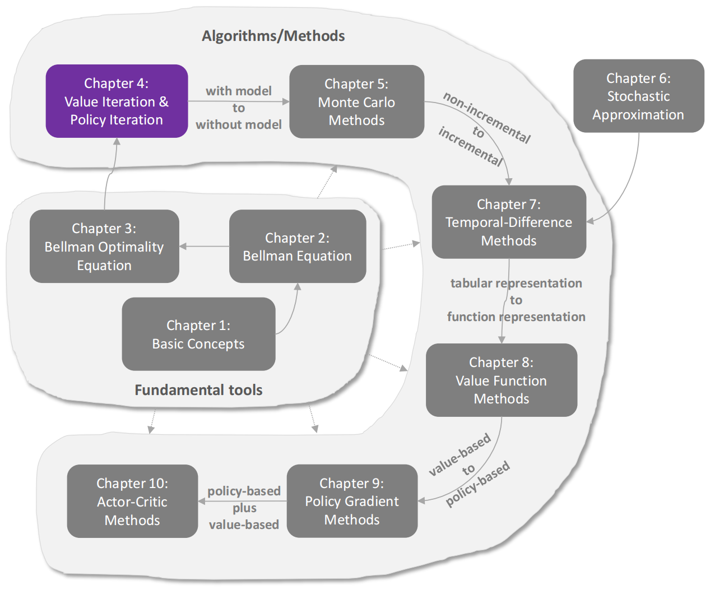
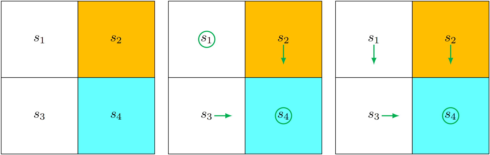
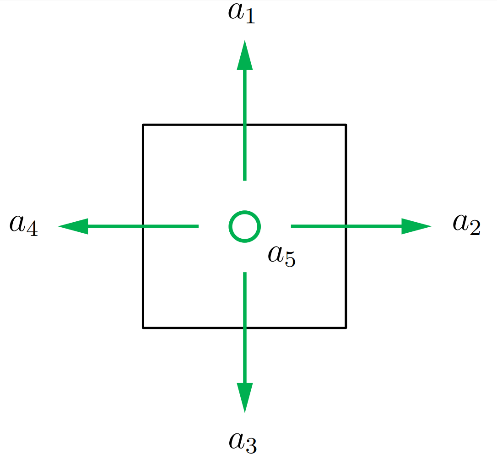
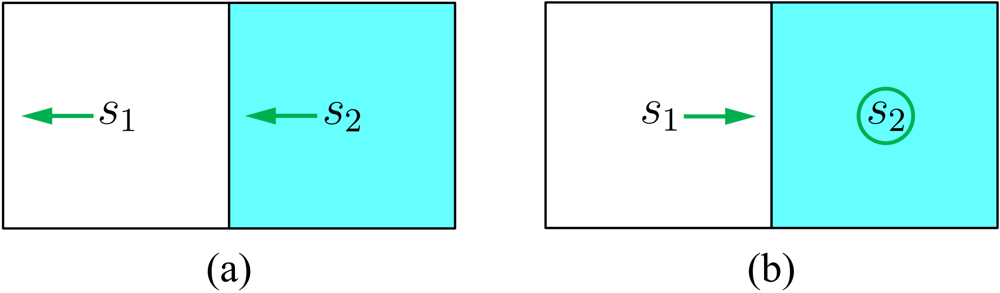
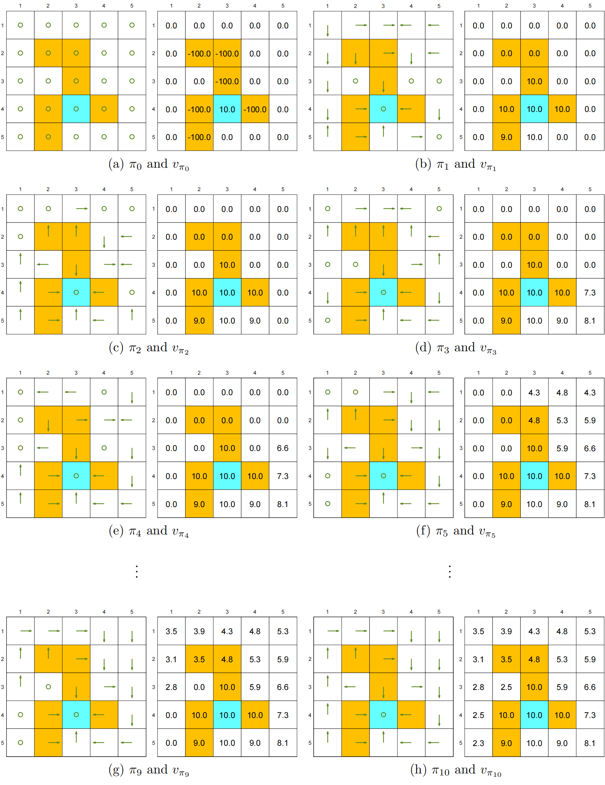
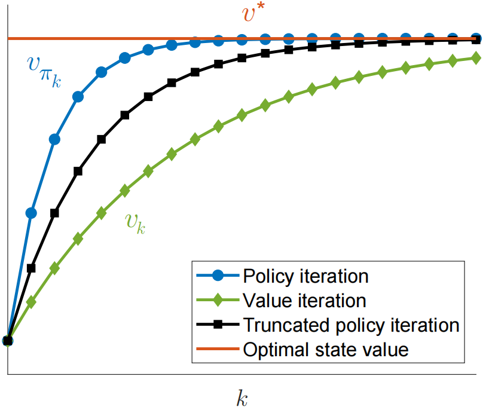

# 价值迭代（Value Iteration） 与 策略迭代（Policy Iteration）

本章介绍三种彼此相关的 用于寻找 **最优策略** 的算法。

- `价值迭代算法`：核心是不断逼近**最优状态价值 \(v^\*\)**，同时可以由 \(v^*\) 得到**最优策略 \(\pi^\*\)**。
- `策略迭代算法`：核心是不断改进 **策略\(\pi\)**，最终得到 **最优策略\(\pi^*\)**，同时得到这个最优策略对应的 **最优状态价值\(v^*\)**。
- `截断策略迭代算法`：将 **价值迭代算法** 和 **策略迭代算法** 相结合的一种算法。核心是**对当前策略只进行有限次策略评估，然后立即进行策略改进**，在“价值更新”和“策略改进”之间取得平衡。

本章介绍的算法被称为**动态规划算法**，这些算法需要系统模型作为前提条件。它们构成了后续章节所介绍的`无模型强化学习算法`的重要基础。例如，第5章中提出的`蒙特卡洛算法`，正是通过对本章提出的**策略迭代算法**进行扩展而直接推导出来的。

## 价值迭代

本节介绍价值迭代算法。该算法正是根据收缩映射定理提出的、用于求解贝尔曼最优性方程的算法，具体内容已在上一章（定理3.3）中阐述。具体而言，该算法为`贝尔曼最优方程的迭代形式`
$$
v_{k+1}=\max_{\pi\in\Pi}(r_\pi+\gamma P_\pi v_k),\quad k=0,1,2,\ldots
$$
**定理3.3** 保证了当$k$趋近于无穷大时，$v_k$和$\pi_k$将分别收敛至 `最优状态价值` 和 `最优策略`。

该算法具有**迭代特性**，每次迭代包含两个步骤：

1. `策略更新步骤`。
   从数学角度而言，其目标是：在所有策略$\pi$中，找一个，使得 $r_\pi+\gamma P_\pi v_k$ 最大：
   $$
   \pi_{k+1}=\arg\max_{\pi}(r_{\pi}+\gamma P_{\pi}v_{k}),
   $$
   其中 $v_k$ 是在前一次迭代中获得的。

2. `价值更新步骤`。

   从数学上讲，其目标是：给定当前的 $v_k$ 和刚刚得到的策略 $\pi_{k+1}$，我们用一个公式把新的价值 $v_{k+1}$ 算出来。
   $$
   \tag{2.15}
   \label{policy_iteration_evaluation}
   v_{k+1}=r_{\pi_{k+1}}+\gamma P_{\pi_{k+1}}v_k,
   $$
   其中 $v_{k+1}$ 将在下一次迭代中使用。

### 元素形式与实现

考虑 一个时间步长$k$ 与 一个状态$s$

- `策略更新步骤`

  > `核心思想`：在当前 状态\(s\) 下，根据 下一状态的状态价值函数\(v_k\) 计算每个动作$a$在当前状态$s$下的动作价值\(q_k(s,a)\)，然后选择其中动作价值$q_k(s,a)$最大的动作$a$，并据此更新策略$\pi$。

  首先，策略更新步骤的 **矩阵形式** 为 $\pi_{k+1}=\arg\max_\pi(r_\pi+\gamma P_\pi v_k)$ 。但是这是整体的，并不直观。

  于是我们使用 策略更新步骤 的 **逐元素形式** 为 
  $$
  \pi_{k+1}(s)=\arg\max_\pi\sum_a\pi(a|s)\underbrace{\left(\sum_rp(r|s,a)r+\gamma\sum_{s^{\prime}}p(s^{\prime}|s,a)v_k(s^{\prime})\right)}_{q_k(s,a)},\quad s\in\mathcal{S}.
  $$
  我们在第3.3.1节中证明，能够解决上述优化问题的`最优策略`为
  $$
  \tag{2.16}
  \label{policy_improvement}
  \left.\pi_{k+1}(a|s)=\begin{cases}&1,&a=a_k^*(s),\\&0,&a\neq a_k^*(s),&\end{cases}\right.
  $$
  其中 $a_k^*(s)=\arg\max_aq_k(s,a)$，若 $a_k^*(s)=\arg\max_aq_k(s,a)$存在多个解（意味着这些动作在当前价值评估下是**完全等价的最优动作**），我们可以选择任意一个解，而不会影响算法的`收敛性`。由于新策略 $\pi_{k +1}$ 会选择 $q_k(s,a)$ 值最大的动作，因此这种策略被称为`贪婪策略`。

- `价值更新步骤`

  > `核心思想`：在 当前状态\(s\) 下，根据 新得到的策略\(\pi_{k+1}\)，以此计算更新后的状态价值\(v_{k+1}(s)\)

  其次，状态价值更新步骤 $v_{k+1}=r_{\pi_{k+1}}+\gamma P_{\pi_{k+1}}v_{k}$ 的 **逐元素形式** 为：
  $$
  v_{k+1}(s)=\sum_a\pi_{k+1}(a|s)\underbrace{\left(\sum_rp(r|s,a)r+\gamma\sum_{s^{\prime}}p(s^{\prime}|s,a)v_k(s^{\prime})\right)}_{q_k(s,a)},\quad s\in\mathcal{S}.
  $$
  将 式$\eqref{policy_improvement}$ 代入上式得到：
  $$
  v_{k+1}(s)=\max_aq_k(s,a).
  $$

- 总之，上述步骤可概括如下：
  $$
  v_k(s)\to q_k(s,a)\to \text{新贪婪策略 } \pi_{k+1}(s)\to \text{新的价值 } v_{k+1}(s)=\max_a q_k(s,a)
  $$

  > 从`状态价值函数` $v_k(s)$ 出发，计算`动作价值函数` $q_k(s,a)$，进而得到`新的贪婪策略` $\pi_{k+1}(s)$，最后更新得到`新的状态价值函数`

  具体实现细节总结于算法4.1。

  > [!NOTE]
  >
  > 🤔一个可能令人困惑的问题是：式$\eqref{policy_iteration_evaluation}$ 中的 $\mathcal{v}_{k}$ 是否属于`状态价值`。答案是否定的。
  >
  > 尽管 $v_k$ 最终会收敛到`最优状态价值`，但无法保证其满足任何策略的贝尔曼方程。
  >
  > 例如，通常情况下 $v_k$ 并不满足公式$v_k=r_{\pi_{k+1}}+\gamma P_{\pi_{k+1}}v_k$或者$v_k=r_{\pi_k}+\gamma P_{\pi_k}v_k$。$v_k$仅仅是算法生成的中间值。
  >
  > 此外，由于$v_k$并非状态价值，因此$q_k$也不是动作价值。

### 示例

接下来，我们通过一个示例来说明价值迭代算法的逐步实现过程。该示例为一个2×2网格结构，其中包含一个禁止区域（见图4.2）。目标区域为$s_4$。奖励设置为：$r_{\mathrm{boundary}}=r_{\mathrm{forbidden}}=-1$ 并且 $r_{\mathrm{target}}=1$ 。折扣率 $\gamma=0.9$

<figure style="text-align: center;">
    
    <figcaption align="center">图 4.2：展示价值迭代算法实现的示例</figcaption>
    
    <figcaption align="center">动作定义</figcaption>
</figure>

| **$q(s,a)$表达式** $q(s,a)=r(s,a)+\gamma v(s^{\prime})$ | $a_1$                | $a_2$                | $a_3$                | $a_4$                | $a_5$                |
| :----------------------------------------------------------- | -------------------- | :------------------- | -------------------- | -------------------- | -------------------- |
| $s_1$                                                        | $-1 + \gamma v(s_1)$ | $-1 + \gamma v(s_2)$ | $0 + \gamma v(s_3)$  | $-1 + \gamma v(s_1)$ | $0 + \gamma v(s_1)$  |
| $s_2$                                                        | $-1 + \gamma v(s_2)$ | $-1 + \gamma v(s_2)$ | $1 + \gamma v(s_4)$  | $0 + \gamma v(s_1)$  | $-1 + \gamma v(s_2)$ |
| $s_3$                                                        | $0 + \gamma v(s_1)$  | $1 + \gamma v(s_4)$  | $-1 + \gamma v(s_3)$ | $-1 + \gamma v(s_3)$ | $0 + \gamma v(s_3)$  |
| $s_4$                                                        | $-1 + \gamma v(s_2)$ | $-1 + \gamma v(s_4)$ | $-1 + \gamma v(s_4)$ | $0 + \gamma v(s_3)$  | $1 + \gamma v(s_4)$  |

> `算法`：价值迭代算法
>
> - `初始化`：所有 $(s,a)$ 对应的概率模型 $p(r|s,a)$ 和 $p(s^{\prime}|s,a)$ 已知。初始猜测值为 $v_0$
>
> - `目标`：寻找解决 `贝尔曼最优性方程` 所需的 `最优状态值` 及 `最优策略`。
>
> - `迭代算法`：
>
>   虽然 $v_k$ 并未达到收敛状态（即 $\|v_k-v_{k-1}\|$ 不大于预设的小阈值），但在第 $k$ 次迭代时，do：
>
>   - For 每个 状态$s\in\mathcal{S}$，do：
>
>     - For 每个 动作$a\in\mathcal{A}(s)$，do：
>
>       - 更新 动作价值$q$：$q_k(s,a)=\sum_rp(r|s,a)r+\gamma\sum_{s^{\prime}}p(s^{\prime}|s,a)v_k(s^{\prime})$
>
>     - 在所有可选动作中，选择动作价值最大的那个动作：$a_k^*(s)=\arg\max_aq_k(s,a)$
>
>     - `策略更新`：
>
>       if $a=a_k^*$:
>
>         $\pi_{k+1}(a|s)=1$
>
>       else :
>
>         $\pi_{k+1}(a|s)=0$
>
>     - `状态价值更新`：$v_{k+1}(s)=\max_aq_k(s,a)$

开始进行价值迭代算法：

- 初始状态 $k=0$：（第0次迭代）

  为了不失一般性，我们将初始值设为 $v_0(s_1)=v_0(s_2)=v_0(s_3)=v_0(s_4)=0.$

  - **计算$q$值**：将$\upsilon_0(s_i)$代入上面的表格，可以得到下表所示的 $q_0$值

    | **$q_0$ table** | **a1** | **a2** | **a3** | **a4** | **a5** |
    | --------------- | ------ | ------ | ------ | ------ | ------ |
    | $s_1$           | -1     | -1     | 0      | -1     | 0      |
    | $s_2$           | -1     | -1     | 1      | 0      | -1     |
    | $s_3$           | 0      | 1      | -1     | -1     | 0      |
    | $s_4$           | -1     | -1     | -1     | 0      | 1      |

  - **在所有可选动作中，选择动作价值最大的那个动作**：

    我们已经算出了这一轮的 $q(s,a)$，然后对 **每个状态 $s$**，找到让 $q(s,a)$ **最大的那个动作 $a$** 把它设为策略。且当存在多个最优动作时，可以<b>任意选择一个</b>。

    - 对状态$s_1$：$a_3$与$a_5$的$q$值都是最大的，我们可以任意选择一个，所以在 状态$s_1$，我们**选择 动作$a_5$**

    - 对状态$s_2$：$a_3$的$q$值最大，所以在 状态$s_2$ 选择 动作$a_3$
    - 对状态$s_3$：$a_2$的$q$值最大，所以在 状态$s_3$ 选择 动作$a_2$
    - 对状态$s_4$：$a_5$的$q$值最大，所以在 状态$s_4$ 选择 动作$a_5$

  - **策略更新**：

    于是我们得到 **第一轮迭代的策略**：
    $$
    \pi_1(a_5|s_1)=1,\quad\pi_1(a_3|s_2)=1,\quad\pi_1(a_2|s_3)=1,\quad\pi_1(a_5|s_4)=1.
    $$
    该策略如`图4.2（中间子图）`所示。

    > 🤔从直观上看，很显然，该策略并非最优，因为它选择在$s_1$位置保持静止，所以我们要不断迭代直到`策略`收敛为最优。
    >
    > 值得注意的是，在这次迭代，**$(s_1,a_5)$ 与 $(s_1,a_3)$ 的$q$值实际上相同，因此我们可以随机选择任一动作**。

  - **状态价值更新**：对每个状态$s$，把它的状态价值更新为：$v_{k+1}(s)=\max_aq_k(s,a)$。**选 最优动作对应的$q$值 作为这个`状态的新价值`**

    代入得：
    $$
    v_1(s_1)=0,\quad v_1(s_2)=1,\quad v_1(s_3)=1,\quad v_1(s_4)=1.
    $$

- $k=1$：（第1次迭代）

  - **计算$q$值**：将 $v_1(s_i)$ 代入 公式$q(s,a)=r(s,a)+\gamma v(s^{\prime})$ 后，可得到 下表 所示的 $q_1$值。

    | **$q_1$ table** | **a1**          | **a2**          | **a3**          | **a4**          | **a5**          |
    | --------------- | --------------- | --------------- | --------------- | --------------- | --------------- |
    | $s_1$           | $-1 + \gamma 0$ | $-1 + \gamma 1$ | $0 + \gamma 1$  | $-1 + \gamma 0$ | $0 + \gamma 0$  |
    | $s_2$           | $-1 + \gamma 1$ | $-1 + \gamma 1$ | $1 + \gamma 1$  | $0 + \gamma 0$  | $-1 + \gamma 1$ |
    | $s_3$           | $0 + \gamma 0$  | $1 + \gamma 1$  | $-1 + \gamma 1$ | $-1 + \gamma 1$ | $0 + \gamma 1$  |
    | $s_4$           | $-1 + \gamma 1$ | $-1 + \gamma 1$ | $-1 + \gamma 1$ | $0 + \gamma 1$  | $1 + \gamma 1$  |

  - **在所有可选动作中，选择动作价值最大的那个动作**：
    
    - 对状态$s_1$：$a_3$的$q$值最大，所以在 状态$s_1$ 选择 动作$a_3$
    
    - 对状态$s_2$：$a_3$的$q$值最大，所以在 状态$s_2$ 选择 动作$a_3$
    - 对状态$s_3$：$a_2$的$q$值最大，所以在 状态$s_3$ 选择 动作$a_2$
    - 对状态$s_4$：$a_5$的$q$值最大，所以在 状态$s_4$ 选择 动作$a_5$
    
  - **策略更新**：
    $$
    \pi_2(a_3|s_1)=1,\quad\pi_2(a_3|s_2)=1,\quad\pi_2(a_2|s_3)=1,\quad\pi_2(a_5|s_4)=1.
    $$
    该策略如`图4.2（右侧子图）`所示。

  - **状态价值更新**：
    $$
    v_2(s_1)=\gamma1,\quad v_2(s_2)=1+\gamma1,\quad v_2(s_3)=1+\gamma1,\quad v_2(s_4)=1+\gamma1.
    $$

- $k=2,3,4,\ldots$

  值得注意的是，如图4.2所示，该策略$\pi _2$​已达到最优状态。

  因此，在这个简单示例中，我们**只需要进行两次迭代**就可以得到一个最优策略。对于更复杂的情况，则需要进行更多次迭代，直到价值函数 $v_k$ **收敛**为止（例如，当 $\|v_{k+1} - v_k\|$ 小于一个预先设定的阈值时，就可以认为已经收敛）。

## 策略迭代

与价值迭代不同，策略迭代并非直接用于求解贝尔曼最优性方程；然而，如后文所示，它与价值迭代存在密切关联。此外，策略迭代的理念至关重要，因为它被广泛应用于强化学习算法中。

### 算法分析

策略迭代是一种迭代算法。每次迭代包含两个步骤。

1. `策略评估`

   我们给定 策略$\pi$，计算相应的 状态价值$v_\pi$，这就是我们所说的`策略评估` ，我们需要求解以下**贝尔曼方程（矩阵-向量形式）**：
   $$
   v_{\pi_k}=r_{\pi_k}+\gamma P_{\pi_k}v_{\pi_k},
   $$
   其中：

   - $\pi_k$：表示上一次迭代获得的策略
   - $v_{\pi_k}$：待计算的状态价值**向量**，并且 $v_k=v_{\pi_k}$
   - $r_{\pi_k}$（在策略$\pi_k$下的“期望即时奖励”向量）与$P_{\pi_k}$（状态转移矩阵）可以从系统模型获取

2. `策略改进`

   该步骤旨在优化策略。具体而言，在第一步计算出$v_{\pi_k}$后，即可获得新的策略$\pi_{k+1}$。
   $$
   \pi_{k+1}=\arg\max_\pi(r_\pi+\gamma P_\pi v_{\pi_k}).
   $$
   含义：每个状态$s$都选择一个 **让未来回报最大** 的动作

根据上面这两个算法，这里引出三个问题：

- 🤔在`策略评估`步骤中，如何求解 **状态价值函数 $v_{\pi_k}$**？

  其实在第二章讲过，对于求解 上式（一个贝尔曼方程的矩阵向量形式）的方法有两个：

  1. `闭式解`

     贝尔曼方程具有解析解：
     $$
     v_{\pi_k}=(I-\gamma P_{\pi_k})^{-1}r_{\pi_k}
     $$
     我们在前面讨论过：这种闭式解适用于理论分析，但在实际实现中效率较低，因为它需要借助其他数值算法（高斯消元、LU分解......）来计算逆矩阵。

  2. `迭代算法`
     $$
     \tag{2.17}
     \label{policy_evaluation_iteration}
     v_{\pi_k}^{(j+1)}=r_{\pi_k}+\gamma P_{\pi_k}v_{\pi_k}^{(j)},\quad j=0,1,2,...
     $$
     其中：

     - 这是矩阵形式，不是逐元素表达式

     - $\upsilon_{\pi_k}^{(j)}$：表示 $v_{\pi_k}$ 的第$j$个估计值

       在2.7章节我们说过，从任意初始猜测值$v_{\pi_k}^{(0)}$ 出发，可以保证当$j\to\infty$时，$v_{\pi_k}^{(j)}\to v_{\pi_k}$

  > - 有趣的是，**`策略迭代`本身是一个迭代算法，而在其`策略评估`步骤中又嵌套了另一个迭代算法（公式$\eqref{policy_evaluation_iteration}$）**。
  >
  > - 从理论上讲，这个嵌套的迭代算法需要**进行无限次迭代（即 $j \to \infty$）**，才能收敛到真实的状态价值函数 $v_{\pi_k}$。然而，这在实际中是不可能实现的。
  >
  >   在实际应用中，我们通常在满足某种**终止条件**时停止迭代。例如，可以设定：
  >
  >   - 当 $\| v_{\pi_k}^{(j+1)} - v_{\pi_k}^{(j)} \|$ 小于某个预设阈值时停止；
  >
  >   - 或者当迭代次数 $j$ 超过某个预设上限时停止。
  >
  > - 但是，如果不进行**无限次迭代**，我们只能得到一个**不精确的 $v_{\pi_k}$**，而这个近似值会被用于后续的策略改进步骤。
  >
  >   那么，这会带来问题吗？**答案是不会。**
  >
  >   原因将在第 4.3 节介绍的**截断策略迭代（truncated policy iteration）**中变得清晰。

- 🤔在`策略改进`步骤中，为什么新的策略 $\pi_{k+1}$ 会比原来的策略 $\pi_k$ 更优？

  引理4.1（策略改进）：如果 $\pi_{k+1}=\operatorname{arg}\operatorname*{max}_{\pi}(r_{\pi}+\gamma P_{\pi}v_{\pi_{k}})$，那么 $v_{\pi_{k+1}}\geq v_{\pi_k}$（其中，$v_{\pi_{k+1}}\geq v_{\pi_k}$ 意味着对所有$s$，都有 $v_{\pi_{k+1}}(s)\geq v_{\pi_k}(s)$）

  该引理的证明见 BOX 4.1

  > BOX 4.1：引理 4.1 的证明
  >
  > 由于 $v_{\pi_{k+1}}$ 与 $v_{\pi_{k}}$ 都是`状态价值`，他们都满足贝尔曼方程：
  > $$
  > \begin{aligned}v_{\pi_{k+1}}&=r_{\pi_{k+1}}+\gamma P_{\pi_{k+1}}v_{\pi_{k+1}},\\v_{\pi_{k}}&=r_{\pi_{k}}+\gamma P_{\pi_{k}}v_{\pi_{k}}.\end{aligned}
  > $$
  > 由于 $\pi_{k+1}=\arg\max_\pi(r_\pi+\gamma P_\pi v_{\pi_k})$，可知
  > $$
  > r_{\pi_{k+1}}+\gamma P_{\pi_{k+1}}v_{\pi_k}\geq r_{\pi_k}+\gamma P_{\pi_k}v_{\pi_k}.
  > $$
  > 由此可得出：
  > $$
  > \begin{aligned}v_{\pi_{k}}-v_{\pi_{k+1}}&=(r_{\pi_{k}}+\gamma P_{\pi_{k}}v_{\pi_{k}})-(r_{\pi_{k+1}}+\gamma P_{\pi_{k+1}}v_{\pi_{k+1}})\\&\leq(r_{\pi_{k+1}}+\gamma P_{\pi_{k+1}}v_{\pi_{k}})-(r_{\pi_{k+1}}+\gamma P_{\pi_{k+1}}v_{\pi_{k+1}})\\&\leq\gamma P_{\pi_{k+1}}(v_{\pi_{k}}-v_{\pi_{k+1}}).\end{aligned}
  > $$
  > 因此：
  > $$
  > \begin{aligned}v_{\pi_{k}}-v_{\pi_{k+1}}\leq\gamma^{2}P_{\pi_{k+1}}^{2}(v_{\pi_{k}}-v_{\pi_{k+1}})\leq\ldots&\leq\gamma^nP_{\pi_{k+1}}^n(v_{\pi_k}-v_{\pi_{k+1}})\\&\leq\lim_{n\to\infty}\gamma^{n}P_{\pi_{k+1}}^{n}(v_{\pi_{k}}-v_{\pi_{k+1}})=0.\end{aligned}
  > $$
  > 该极限成立的原因是：
  >
  > - $n$：代表时间步数
  > - 当 $n\to\infty$ 时，$\gamma^n\to0$
  > - 对于任意$n$，$P_{\pi k+1}^n$都是一个`非负随机矩阵`（这是一个状态转移矩阵）（`随机矩阵`是指其所有行之行和均为1的非负矩阵。）

- 🤔为什么该算法最终能够收敛到一个最优策略？

  - 策略迭代算法生成两个序列：

    - 第一个是`策略序列` $\{\pi_0,\pi_1,\ldots,\pi_k,\ldots\}$；
    - 第二个是`状态价值序列`$\{v_{\pi_0},v_{\pi_1},\ldots,v_{\pi_k},\ldots\}.$

    假设$v^{*}$是最优状态价值，则对所有$k$均有$v_{\pi_k}\leq v^*$。由于策略会根据引理 4.1 持续优化，因此可知：
    $$
    v_{\pi_0}\leq v_{\pi_1}\leq v_{\pi_2}\leq\cdots\leq v_{\pi_k}\leq\cdots\leq v^*.
    $$
    由于 $v_{\pi_k}$ 是**单调不减的**，并且始终被最优价值函数 $v^*$ **从上界限制住**，根据**单调收敛定理**，可以得到：

    > 当 $k \to \infty$ 时，$v_{\pi_k}$ 会收敛到某个常数值，记为 $v_\infty$。

    接下来的分析将表明：
    $$
    v_\infty = v^*
    $$

  - **定理 4.1（策略迭代的收敛性）**
    策略迭代算法生成的状态价值序列 $\{v_{\pi_k}\}_{k=0}^{\infty}$ 收敛到最优状态价值 $v^*$。因此，策略序列 $\{\pi_k\}_{k=0}^{\infty}$ 也会收敛到一个最优策略。

    该定理的证明见框 4.2。这个证明不仅说明了策略迭代算法的收敛性，还揭示了**策略迭代与价值迭代之间的关系**。粗略来说，如果两个算法从相同的初始值开始，**由于`策略评估`步骤中包含了额外的迭代过程，`策略迭代`通常会比`价值迭代`收敛得更快**。

    当我们在第 4.3 节介绍**截断策略迭代（truncated policy iteration）**时，这一点会变得更加清晰。

    > **Box 4.2：定理 4.1 的证明**
    >
    > 该证明的思路是：说明**策略迭代算法比价值迭代算法收敛更快**。
    >
    > ---
    >
    > 具体来说，为了证明序列 $\{v_{\pi_k}\}_{k=0}^{\infty}$ 的收敛性，我们引入另一个序列 $\{v_k\}_{k=0}^{\infty}$，其生成方式为：
    > $$
    > v_{k+1} = f(v_k) = \max_{\pi}(r_\pi + \gamma P_\pi v_k)
    > $$
    > 这个迭代算法正是**价值迭代算法（value iteration）**。我们已经知道，对于任意初始值 $v_0$，序列 $v_k$ 都会收敛到最优值 $v^*$。
    >
    > ---
    >
    > 对于 $k = 0$，我们总可以找到一个 $v_0$，使得对任意初始策略 $\pi_0$，都有：
    > $$
    > v_{\pi_0} \ge v_0
    > $$
    > 接下来我们用`数学归纳法`证明：对于所有 $k$，都有：
    > $$
    > v_k \le v_{\pi_k} \le v^*
    > $$
    >
    > - 对于 $k \ge 0$，假设：
    >   $$
    >   v_{\pi_k} \ge v_k
    >   $$
    >
    >
    > - 对于 $k+1$，有：
    >   $$
    >   \begin{aligned}
    >   v_{\pi_{k+1}} - v_{k+1}
    >   &= (r_{\pi_{k+1}} + \gamma P_{\pi_{k+1}} v_{\pi_{k+1}}) - \max_{\pi}(r_\pi + \gamma P_\pi v_k) \\
    >   &\ge (r_{\pi_{k+1}} + \gamma P_{\pi_{k+1}} v_{\pi_k}) - \max_{\pi}(r_\pi + \gamma P_\pi v_k)
    >   \end{aligned}
    >   $$
    >   （因为根据引理 4.1，有 $v_{\pi_{k+1}} \ge v_{\pi_k}$，且 $P_{\pi_{k+1}} \ge 0$）
    >
    > - 设：
    >   $$
    >   \pi'_k = \arg\max_{\pi}(r_\pi + \gamma P_\pi v_k)
    >   $$
    >   则有：
    >   $$
    >   = (r_{\pi_{k+1}} + \gamma P_{\pi_{k+1}} v_{\pi_k}) - (r_{\pi'_k} + \gamma P_{\pi'_k} v_k)
    >   $$
    >
    > - 又因为：
    >   $$
    >   \pi_{k+1} = \arg\max_{\pi}(r_\pi + \gamma P_\pi v_{\pi_k})
    >   $$
    >   所以：（这是因为我们假设了 $v_{\pi_k} \ge v_k$）
    >   $$
    >   \ge (r_{\pi'_k} + \gamma P_{\pi'_k} v_{\pi_k}) - (r_{\pi'_k} + \gamma P_{\pi'_k} v_k)
    >   $$
    >
    > - 整理得：
    >   $$
    >   = \gamma P_{\pi'_k}(v_{\pi_k} - v_k)
    >   $$
    >
    > - 由于：
    >
    >   - $v_{\pi_k} - v_k \ge 0$
    >   - $P_{\pi'_k}$ 是非负矩阵
    >
    >   所以：
    >   $$
    >   P_{\pi'_k}(v_{\pi_k} - v_k) \ge 0
    >   $$
    >   因此：
    >   $$
    >   v_{\pi_{k+1}} - v_{k+1} \ge 0
    >   $$
    >
    > - 由此可通过归纳法证明：
    >   $$
    >   v_k \le v_{\pi_k} \le v^*, \quad \forall k \ge 0
    >   $$
    >   根据`夹逼收敛定理`：由于 $v_k \to v^*$，因此 $v_{\pi_k} \to v^*$

### 元素形式与实现

为实现该策略迭代算法，我们需要研究其逐元素形式。

> **算法4.2：策略迭代算法**
>
> `初始化`：系统模型已知（即对所有$(s,a)$对应的系统模型$p(r|s,a)$与$p(s^{\prime}|s,a)$都是已知的。初始化猜测值为$\pi_0$）
>
> `目标`：寻找 **最优状态价值** 与 **最优策略**
>
> - While $v_{\pi_k}$还没有收敛，对于第$k$次迭代，有：
>
>   - `策略评估`：
>
>     - 初始化：任意初始猜测值$v_{\pi k}^{(0)}$
>
>     - While $v_{\pi_k}^{(j)}$还没有收敛，对于第$j$次迭代，有：
>       - For 状态$s$ in 状态空间$S$，有：
>         - $v_{\pi_{k}}^{(j+1)}(s)=\sum_{a}\pi_{k}(a|s)\left[\sum_{r}p(r|s,a)r+\gamma\sum_{s^{\prime}}p(s^{\prime}|s,a)v_{\pi_{k}}^{(j)}(s^{\prime})\right]$
>
>   - `策略改进`：
>
>     - For 状态$s$ in 状态空间$S$，有：
>
>       - For 动作$a$ in 动作空间$A$，有：
>
>         - 根据得到的 状态价值$v_{\pi_k}$ 更新 动作价值$q_{\pi_k}$：$q_{\pi_k}(s,a)=\sum_rp(r|s,a)r+\gamma\sum_{s^{\prime}}p(s^{\prime}|s,a)v_{\pi_k}(s^{\prime})$
>
>       - 在所有可选动作中，选择动作价值最大的那个动作：$a_k^*(s)=\arg\max_aq_{\pi_k}(s,a)$
>
>       - 更新策略：
>
>         if $a=a_k^*$ :
>
>         ​	$\pi_{k+1}(a|s)=1$
>
>         else:
>         
>         ​	$\pi_{k+1}(a|s)=0$

- 首先，`策略评估`步骤通过使用公式$\eqref{policy_evaluation_iteration}$中的迭代算法，从方程$v_{\pi_k}=r_{\pi_k}+\gamma P_{\pi_k}v_{\pi_k}$中求解$v_{\pi_{k}}$。

  该迭代算法的 **逐元素形式** 为：
  $$
  v_{\pi_k}^{(j+1)}(s)=\sum_a\pi_k(a|s)\left(\sum_rp(r|s,a)r+\gamma\sum_{s^{\prime}}p(s^{\prime}|s,a)v_{\pi_k}^{(j)}(s^{\prime})\right),\quad s\in\mathcal{S},
  $$
  其中 $j=0,1,2,\ldots$

- 然后，`策略改进`步骤求解 $\pi_{k+1}=\arg\max_\pi(r_\pi+\gamma P_\pi v_{\pi_k})$。该方程的逐元素形式为：
  $$
  \pi_{k+1}(s)=\arg\max_\pi\sum_a\pi(a|s)\underbrace{\left(\sum_rp(r|s,a)r+\gamma\sum_{s^{\prime}}p(s^{\prime}|s,a)v_{\pi_k}(s^{\prime})\right)}_{q_{\pi_k}(s,a)},\quad s\in\mathcal{S},
  $$
  其中 $q_{\pi_k}(s,a)$ 表示 策略$\pi_k$ 下的`动作价值`。

  令 $a_k^*(s)=\arg\max_aq_{\pi_k}(s,a)$，得到`贪婪最优策略`为：
  $$
  \pi_{k+1}(a|s)=\begin{cases}1,&a=a_k^*(s),\\0,&a\neq a_k^*(s).&\end{cases}
  $$

### 示例

#### 一个简单例子

考虑图4.3所示的一个简单示例。

系统包含两个`状态`

各个状态对应三种可能的`动作`：$\mathcal{A}=\{a_l,a_0,a_r\}$。这三种动作分别代表**向左移动**、**保持不变**和**向右移动**。

奖励设置为 $r_{\mathrm{boundary}}=-1$、$r_{target} = 1$，折扣因子为 $\gamma = 0.9$。

<figure style="text-align: center;">
    
    <figcaption align="center">图 4.3：用于说明策略迭代算法实现的示例</figcaption>
</figure>

接下来，我们将分步骤介绍策略迭代算法的具体实现方法。

当 $k=0$ 时，我们从 图4.3(a) 所示的初始策略开始。该策略效果不佳，因为它并未朝目标区域移动。

现在展示如何应用`策略迭代算法`来获得`最优策略`。

1. `策略评估`步骤

   这个步骤就是 **通过求解贝尔曼方程（矩阵-向量形式），计算当前策略 $\pi_k$ 对应的状态价值函数 $v_{\pi_k}$**

   - **直接求法**（因为这个案例比较简单）

     - 根据**贝尔曼具体方程** $v_\pi(s)=\sum_{a\in\mathcal{A}}\pi(a|s)\sum_{s^{\prime}\in\mathcal{S}}p(s^{\prime}|s,a)\left[r(s^{\prime})+\gamma v_\pi(s^{\prime})\right]$ 直接写出 状态$s_1$ 与 状态$s_2$ 的`状态价值`：

     $$
     v_{\pi_{0}}(s_{1})=-1+\gamma v_{\pi_{0}}(s_{1}),
     \\
     v_{\pi_{0}}(s_{2})=0+\gamma v_{\pi_{0}}(s_{1}).
     $$

     - 联合方程，代入$\gamma = 0.9$，得
       $$
       v_{\pi_0}(s_1)=-10,\quad v_{\pi_0}(s_2)=-9.
       $$

   - **迭代算法求解**
     
     通过 式$\eqref{policy_evaluation_iteration}$ 所示的`迭代算法`求解。
     
     例如，将初始值设为 $v_{\pi_0}^{(0)}(s_1)=v_{\pi_0}^{(0)}(s_2)=0$。根据 式$\eqref{policy_evaluation_iteration}$ 可知：
     $$
     \begin{cases}
     v_{\pi_0}^{(1)}(s_1) = -1 + \gamma v_{\pi_0}^{(0)}(s_1) = -1, \\
     v_{\pi_0}^{(1)}(s_2) = 0 + \gamma v_{\pi_0}^{(0)}(s_1) = 0,
     \end{cases}
     \\
     \begin{cases}
     v_{\pi_0}^{(2)}(s_1) = -1 + \gamma v_{\pi_0}^{(1)}(s_1) = -1.9, \\
     v_{\pi_0}^{(2)}(s_2) = 0 + \gamma v_{\pi_0}^{(1)}(s_1) = -0.9,
     \end{cases}
     \\
     \begin{cases}
     v_{\pi_0}^{(3)}(s_1) = -1 + \gamma v_{\pi_0}^{(2)}(s_1) = -2.71, \\
     v_{\pi_0}^{(3)}(s_2) = 0 + \gamma v_{\pi_0}^{(2)}(s_1) = -1.71,
     \end{cases}
     \\
     \vdots
     $$
     经过多次迭代后，我们可以观察到趋势：
     
     随着 $j$的值 的增加：
     
     - $v_{\pi_0}^{(j)}(s_1)\to v_{\pi_0}(s_1)=-10$
     - $v_{\pi_0}^{(j)}(s_2)\to v_{\pi_0}(s_2)=-9$

2. `策略改进`步骤

   - 更新动作价值$q_{\pi_0}(s,a)$

     | $q_{\pi_k}(s,a)$ | $a_l$                        | $a_0$                       | $a_r$                        |
     | ---------------- | ---------------------------- | --------------------------- | ---------------------------- |
     | $s_1$            | $-1 + \gamma v_{\pi_k}(s_1)$ | $0 + \gamma v_{\pi_k}(s_1)$ | $1 + \gamma v_{\pi_k}(s_2)$  |
     | $s_2$            | $0 + \gamma v_{\pi_k}(s_1)$  | $1 + \gamma v_{\pi_k}(s_2)$ | $-1 + \gamma v_{\pi_k}(s_2)$ |

     将前一步策略评估中得到的 $v_{\pi_0}(s_1)=-10,v_{\pi_0}(s_2)=-9$ 代入上表得到：

     | $q_{\pi_0}(s,a)$ | $a_l$ | $a_0$  | $a_r$  |
     | ---------------- | ----- | ------ | ------ |
     | $s_1$            | $-10$ | $-9$   | $-7.1$ |
     | $s_2$            | $-9$  | $-7.1$ | $-9.1$ |

   - 在所有可选动作中，选择动作价值最大的那个动作
     - 对状态$s_1$：$a_r$的$q$值最大，所以在 状态$s_1$ 选择 动作$a_r$
     - 对状态$s_2$：$a_0$的$q$值最大，所以在 状态$s_2$ 选择 动作$a_0$

   - 更新策略

     通过寻找 各个状态下 $q_{\pi_0}$ 的最大值，可以得到改进后的策略 $\pi_1$：
     $$
     \pi_1(a_r \mid s_1) = 1, \quad \pi_1(a_0 \mid s_2) = 1.
     $$
     该策略如图 4.3(b) 所示。可以看出，这个策略已经是最优策略。

   上述过程表明，在这个简单的例子中，仅需**一次迭代**就可以找到最优策略。而在更复杂的情形中，则需要更多次迭代。

#### 一个更复杂的例子

我们接下来通过 `图4.4` 所示的一个更复杂的例子来演示策略迭代算法。奖励设置为：$r_{\text{boundary}} = -1$，$r_{\text{forbidden}} = -10$，$r_{\text{target}} = 1$。折扣因子为 $\gamma = 0.9$。从一个`随机初始策略`（图 4.4(a)）开始，策略迭代算法可以收敛到`最优策略`（图 4.4(h)）。

<figure style="text-align: center;">
    
    <figcaption align="center">图4.4：策略迭代算法生成策略的演化过程</figcaption>
</figure>

在迭代过程中可以观察到两个有趣的现象：

- 首先，如果我们观察策略的演化过程，会发现一个有趣的规律：靠近目标区域的状态会比远离目标的状态更早找到最优策略。只有当这些“近处”的状态先找到通往目标的路径后，“远处”的状态才能通过经过这些近处状态的路径到达目标。
- 其次，状态价值的空间分布呈现出一个有趣的模式：越接近目标的状态，其状态价值越大。其原因在于，从较远的状态出发的智能体需要经过更多步才能获得正奖励，而这些奖励会被折扣因子不断削弱，因此其价值相对较小。

## 截断策略迭代

- `截断策略迭代法` 是一种 更通用的算法
- `价值迭代算法`和`策略迭代算法`都是`截断策略迭代算法`的**两种特例**。

### 比较价值迭代与策略迭代

- 首先，我们通过以下步骤列出`数值迭代算法`与`策略迭代算法`的具体流程，对二者进行比较。

  - `策略迭代`：选择任意初始策略$\pi_0$。在第$k$次迭代中，执行以下两个步骤：

    - 步骤1：**策略评估（PE）**。给定策略$\pi_k$，得到状态价值$v_{\pi_k}$：
      $$
      v_{\pi_k}=r_{\pi_k}+\gamma P_{\pi_k}v_{\pi_k}.
      $$

    - 步骤2：**策略改进（PI）**。给定状态价值$v_{\pi_k}$，求解改进后的策略$\pi_{k+1}$：

      $$
      \pi_{k+1}=\arg\max_\pi(r_\pi+\gamma P_\pi v_{\pi_k}).
      $$

  - `价值迭代`：选择一个任意初始值$v_0$。在第$k$次迭代中，执行以下两个步骤：

    - 步骤1：**策略更新（PU）**。给定 状态价值$v_k$，求解策略$\pi_{k+1}$：
      $$
      \pi_{k+1}=\arg\max_\pi(r_\pi+\gamma P_\pi v_k).
      $$

    - 步骤2：**状态价值更新（VU）**。给定 策略$\pi_{k+1}$，求解状态价值$v_{k+1}$：
      $$
      v_{k+1}=r_{\pi_{k+1}}+\gamma P_{\pi_{k+1}}v_{k}.
      $$

  - 上述两种算法的步骤可如下图所示：
    $$
    \begin{aligned}
    &\text{策略迭代: } \pi_0 \xrightarrow{PE} v_{\pi_0} \xrightarrow{PI} \pi_1 \xrightarrow{PE} v_{\pi_1} \xrightarrow{PI} \pi_2 \xrightarrow{PE} v_{\pi_2} \xrightarrow{PI} \dots \\
    &\text{价值迭代: } \hspace{3em} v_0 \xrightarrow{PU} \pi_1' \xrightarrow{VU} v_1 \xrightarrow{PU} \pi_2' \xrightarrow{VU} v_2 \xrightarrow{PU} \dots
    \end{aligned}
    $$
    可以看出，这两种算法的执行流程极为相似。

- 我们进一步详细分析它们的计算步骤，以揭示**两者之间的差异**。

  具体而言，假设两种算法均从相同的初始条件 $v_0=v_{\pi_0}$ 出发。两种算法的具体流程详见 `下表`。

  **在前三个步骤中，由于 $v_0=v_{\pi_0}$ ，两种算法会产生完全相同的结果。**

  |            | **策略迭代算法**                                             | **价值迭代算法**                                             | **备注**                                               |
  | ---------- | ------------------------------------------------------------ | ------------------------------------------------------------ | ------------------------------------------------------ |
  | 1) Policy: | $\pi_0$                                                      | N/A                                                          |                                                        |
  | 2) Value:  | $v_{\pi_0} = r_{\pi_0} + \gamma P_{\pi_0} v_{\pi_0}$         | $v_0 \doteq v_{\pi_0}$                                       |                                                        |
  | 3) Policy: | $\pi_1 = \arg \max_{\pi} (r_{\pi} + \gamma P_{\pi} v_{\pi_0})$ | $\pi_1 = \arg \max_{\pi} (r_{\pi} + \gamma P_{\pi} v_0)$     | 这两个策略是相同的                                     |
  | 4) Value:  | $v_{\pi_1} = r_{\pi_1} + \gamma P_{\pi_1} v_{\pi_1}$ （贝尔曼期望方程） | $v_1 = r_{\pi_1} + \gamma P_{\pi_1} v_0$ （贝尔曼更新/迭代更新公式） | 因为$v_{\pi_1} \ge v_{\pi_0}$，所以$v_{\pi_1} \ge v_1$ |
  | 5) Policy: | $\pi_2 = \arg \max_{\pi} (r_{\pi} + \gamma P_{\pi} v_{\pi_1})$ | $\pi_2' = \arg \max_{\pi} (r_{\pi} + \gamma P_{\pi} v_1)$    |                                                        |
  | $\vdots$   | $\vdots$                                                     | $\vdots$                                                     | $\vdots$                                               |

  在第四步中，两种算法是不同的。

  - 在第四步中，**`价值迭代算法`**执行：
    $$
    v_1 = r_{\pi_1} + \gamma P_{\pi_1} v_0,
    $$
    这只是一个**单步计**。

  - 而**`策略迭代算法`**则需要求解：
    $$
    v_{\pi_1} = r_{\pi_1} + \gamma P_{\pi_1} v_{\pi_1},
    $$
    这通常需要**无限次迭代**才能得到`精确解`。

  - 如果我们把第四步中求解 $v_{\pi_1}$ 的迭代过程**显式写出来**，就会变得很清楚。

    令：
    $$
    v_{\pi_1}^{(0)} = v_0,
    $$
    则有：
    $$
    \begin{aligned}
    & & v_{\pi_1}^{(0)} &= v_0 \\
    \text{价值迭代} &\leftarrow v_1 \leftarrow & v_{\pi_1}^{(1)} &= r_{\pi_1} + \gamma P_{\pi_1} v_{\pi_1}^{(0)} \\
    & & v_{\pi_1}^{(2)} &= r_{\pi_1} + \gamma P_{\pi_1} v_{\pi_1}^{(1)} \\
    & & &\vdots \\
    \text{截断策略迭代} &\leftarrow \bar{v}_1 \leftarrow & v_{\pi_1}^{(j)} &= r_{\pi_1} + \gamma P_{\pi_1} v_{\pi_1}^{(j-1)} \\
    & & &\vdots \\
    \text{策略迭代} &\leftarrow v_{\pi_1} \leftarrow & v_{\pi_1}^{(\infty)} &= r_{\pi_1} + \gamma P_{\pi_1} v_{\pi_1}^{(\infty)}
    \end{aligned}
    $$
    通过上述过程可获得以下观察结果：

    - **如果只进行一次迭代**，那么
      $$
      v_{\pi_1}^{(1)}
      $$
      实际上就是`价值迭代算法`中计算得到的 $v_1$。

    - **如果进行无限次迭代**，那么
      $$
      v_{\pi_1}^{(\infty)}
      $$
      实际上就是`策略迭代算法`中计算得到的 $v_{\pi_1}$。

      >[!NOTE]
      >
      >需要注意的是，虽然上述比较具有说明性，但它是基于条件
      >$$
      >v_{\pi_1}^{(0)} = v_0 = v_{\pi_0}
      >$$
      >的。在没有这个条件时，这两种算法是不能直接进行比较的。

    - **如果只进行有限次迭代（记为 $j_{\text{truncate}}$）**，那么这种算法称为**截断策略迭代（truncated policy iteration）**。之所以称为“截断”，是因为从 $j_{\text{truncate}}$ 到 $\infty$ 的剩余迭代被截断了。

    - 因此，`价值迭代算法`和`策略迭代算法`可以看作是`截断策略迭代算法`的两个极端情况：

      - 价值迭代：在 $j_{\text{truncate}} = 1$ 时终止
      - 策略迭代：在 $j_{\text{truncate}} = \infty$ 时终止

    > 算法 4.3：截断策略迭代算法（Truncated Policy Iteration）
    >
    > - `初始化`：
    >
    >   已知所有状态-动作对 \((s,a)\) 的概率模型：
    >
    >   - 奖励概率：\( p(r|s,a) \)
    >
    >   - 状态转移概率：\( p(s'|s,a) \)
    >
    >   初始化策略：\( \pi_0 \)
    >
    > - `目标`：寻找 `最优状态价值函数` 和 `最优策略`
    >
    > - While 当 \( v_k \) 尚未收敛时，对第 \(k\) 次迭代，有：
    >
    >   - `策略评估`
    >
    >     - `初始化`：
    >
    >       设 状态价值初始值为 $v_k^{(0)} = v_{k-1}$
    >
    >       设最大迭代次数为：\( j_{\text{truncate}} \)
    >
    >     - `状态价值迭代更新`：
    >
    >       - While \( j < j_{\text{truncate}} \) 时，有：
    >         - For 状态$s$ in 状态空间$S$，有：
    >           - $v_k^{(j+1)}(s) =\sum_a \pi_k(a|s)\left[\sum_r p(r|s,a) r+\gamma \sum_{s'} p(s'|s,a) v_k^{(j)}(s')\right]$
    >       - **截断**：设 $v_k = v_k^{(j_{\text{truncate}})}$
    >
    >   - `策略改进`
    >
    >     - For 状态$s$ in 状态空间$S$，有：
    >
    >       - For 动作$a$ in 状态$s$下的动作空间$\mathcal{A}(s)$，有：
    >
    >         - $q_k(s,a) =\sum_r p(r|s,a) r+\gamma \sum_{s'} p(s'|s,a) v_k(s')$
    >
    >       - 在所有可选动作中，选择动作价值最大的那个动作：$a_k^*(s) = \arg\max_a q_k(s,a)$
    >
    >       - 更新策略：
    >
    >         if $a=a_k^*$ :
    >
    >         ​	$\pi_{k+1}(a|s)=1$
    >
    >         else:
    >
    >         ​	$\pi_{k+1}(a|s)=0$
    
    

### 截断策略迭代算法

简而言之，`截断策略迭代算法`与`传统策略迭代算法`本质相同，**区别仅在于策略评估步骤中仅执行有限次数的迭代**。

> [!NOTE]
>
> 算法中的 $v_k$ 和 $v_k^{(j)}$ 并非状态价值，而是 **真实状态价值的近似值**
>
> 这是因为 该算法中的 策略评估步骤 仅执行 **有限次数的迭代**。

> [!NOTE]
>
> 🤔 如果 $v_k\neq v_{\pi_k}$（在阶段策略迭代中\[ \boxed{v_k\text{ 只是对 }v_{\pi_k}\text{ 的近似}} \]），截断策略迭代还能找到最优策略吗？
>
> 👉 **能。**
>
> 截断策略迭代不要求每次都精确计算当前策略的真实价值 $v_{\pi_k}$，而是只进行有限次策略评估，得到 $v_k$ 作为 $v_{\pi_k}$ 的近似值，然后根据这个近似价值进行策略改进。这是因为策略改进不一定要求你知道 \(v_{\pi_k}\) 的精确值，只要**当前的价值估计足以指导策略变得更好**即可。
>
> 三种算法可以统一理解为：**每次策略改进之前，对当前策略评估多少次。**
>
> - `价值迭代`：只评估 **1次**，然后立即进行策略改进；
> - `截断策略迭代`：评估 **j次$(1<j<\infty)$**，然后进行策略改进；
> - `策略迭代`：一直评估，直到 $v_k=v_{\pi_k}$，即完成**完整策略评估**后再进行策略改进。
>
> 因此：
> \[
> j=1 \Rightarrow \text{价值迭代}
> \]
>
> \[
> 1<j<\infty \Rightarrow \text{截断策略迭代}
> \]
>
> \[
> j\rightarrow\infty \Rightarrow \text{策略迭代}
> \]
>
> $j$越大，每轮策略评估越充分，通常所需的外层策略改进次数越少，但每轮计算成本也越高。因此，截断策略迭代是在**价值迭代和策略迭代之间进行计算成本与评估充分程度的折中**。

命题4.1（价值改进）：考虑策略迭代算法中的迭代过程

<figure style="text-align: center;">
    
    <figcaption align="center">图4.5：价值迭代、策略迭代及截断策略迭代算法之间关系的示意图</figcaption>
</figure>

在`策略评估`步骤中，`状态价值`通过如下迭代方式更新：
$$
v_{\pi_k}^{(j+1)} = r_{\pi_k} + \gamma P_{\pi_k} v_{\pi_k}^{(j)}, \quad j = 0, 1, 2, \ldots
$$
如果将**初始值**设为**上一轮策略的状态价值函数**，即：
$$
v_{\pi_k}^{(0)} = v_{\pi_{k-1}},
$$
那么对于所有 $j = 0, 1, 2, \ldots$，都有：
$$
v_{\pi_k}^{(j+1)} \ge v_{\pi_k}^{(j)}。
$$
也就是说，在这种初始化方式下，策略评估过程中的状态价值序列是**单调不减的**。

> `Box 4.3`：命题 4.1 的证明
>
> - 首先，由于
>   $$
>   v_{\pi_k}^{(j)} = r_{\pi_k} + \gamma P_{\pi_k} v_{\pi_k}^{(j-1)},
>   \quad
>   v_{\pi_k}^{(j+1)} = r_{\pi_k} + \gamma P_{\pi_k} v_{\pi_k}^{(j)},
>   $$
>   两者相减，然后不断代入`递推公式`，可以得到：
>   $$
>   v_{\pi_k}^{(j+1)} - v_{\pi_k}^{(j)}
>   = \gamma P_{\pi_k}\bigl(v_{\pi_k}^{(j)} - v_{\pi_k}^{(j-1)}\bigr)
>   = \cdots
>   = \gamma^j P_{\pi_k}^j \bigl(v_{\pi_k}^{(1)} - v_{\pi_k}^{(0)}\bigr).
>   \tag{4.5}
>   $$
>
> - 其次，由于
>   $$
>   v_{\pi_k}^{(0)} = v_{\pi_{k-1}}
>   $$
>   有：
>   $$
>   v_{\pi_k}^{(1)}
>   = r_{\pi_k} + \gamma P_{\pi_k} v_{\pi_k}^{(0)}
>   = r_{\pi_k} + \gamma P_{\pi_k} v_{\pi_{k-1}}
>   \ge r_{\pi_{k-1}} + \gamma P_{\pi_{k-1}} v_{\pi_{k-1}}
>   = v_{\pi_{k-1}}
>   = v_{\pi_k}^{(0)}
>   $$
>   其中，不等式成立是因为：
>   $$
>   \pi_k = \arg\max_\pi \bigl(r_\pi + \gamma P_\pi v_{\pi_{k-1}}\bigr)
>   $$
>
> - 将
>   $$
>   v_{\pi_k}^{(1)} \ge v_{\pi_k}^{(0)}
>   $$
>   代入式（4.5），即可得到：
>   $$
>   v_{\pi_k}^{(j+1)} \ge v_{\pi_k}^{(j)}
>   $$

> [!NOTE]
>
> `注意`：命题 4.1 依赖一个假设，即：
> $$
> v_{\pi_k}^{(0)} = v_{\pi_{k-1}}
> $$
>
> - 然而，在实际中，$v_{\pi_{k-1}}$ 是不可获得的，我们只能得到 $v_{k-1}$。
>
>   - $v_{\pi_{k-1}}$ 是在策略 $\pi_{k-1}$ 下的**真实状态价值函数**，想要得到它现需要解：
>     $$
>     v=r_{\pi_{k-1}}+\gamma P_{\pi_{k-1}}v
>     $$
>     也就是说 不然就求`闭式解`（排除），不然就求`无限次迭代`
>
>     但是在`截断策略迭代`中，我们只对状态价值做**有限次迭代**，所以我们无法获得一个**无限次迭代后的状态价值**
>
>   - $v_{k−1}$ 是上一轮`策略评估`得到的“近似价值函数”，同时被用作本轮策略评估的初始值
>     $$
>     v_{k-1}=v_{\pi_{k-1}}^{(j_\mathrm{truncate})}
>     $$
>
> - 尽管如此，命题 4.1 仍然为**截断策略迭代算法的收敛性**提供了重要的启示。关于这一问题的更深入讨论，可以参考文献 [2，第 6.5 节]。

到目前为止，截断策略迭代的优势已经很清晰：

- 与**策略迭代算法**相比，截断策略迭代在策略评估步骤中只需要进行**有限次迭代**，因此在计算上更加高效；
- 与**价值迭代算法**相比，截断策略迭代通过在策略评估步骤中多执行几次迭代，可以**加快收敛速度**。

## 总结

- 本章介绍了三种可以用于寻找最优策略的算法。

  - **价值迭代（Value Iteration）**：
    价值迭代算法 是 `压缩映射定理` 在 `贝尔曼最优方程` 上的具体应用。

    它可以分解为两个步骤：**价值更新（value update）和 策略更新（policy update）**。

  - **策略迭代（Policy Iteration）**：
    策略迭代算法比价值迭代稍微复杂一些。它同样包含两个步骤：**策略评估（policy evaluation）和 策略改进（policy improvement）**。

  - **截断策略迭代（Truncated Policy Iteration）**：
    价值迭代和策略迭代可以看作是截断策略迭代的两个极端情况。

- 这三种算法的一个共同特点是：每一次迭代都包含两个步骤：

  1. 更新价值函数

  2. 更新策略

  这种 **`价值更新` 与 `策略更新`之间相互作用的思想** 在强化学习算法中广泛存在，这一思想也被称为**广义策略迭代（Generalized Policy Iteration, GPI）**。

- 最后，本章介绍的这些算法都依赖于**已知的系统模型**。从第 5 章开始，我们将学习**无模型（model-free）强化学习算法**。可以看到，这些无模型算法实际上是通过对本章算法的扩展得到的。

