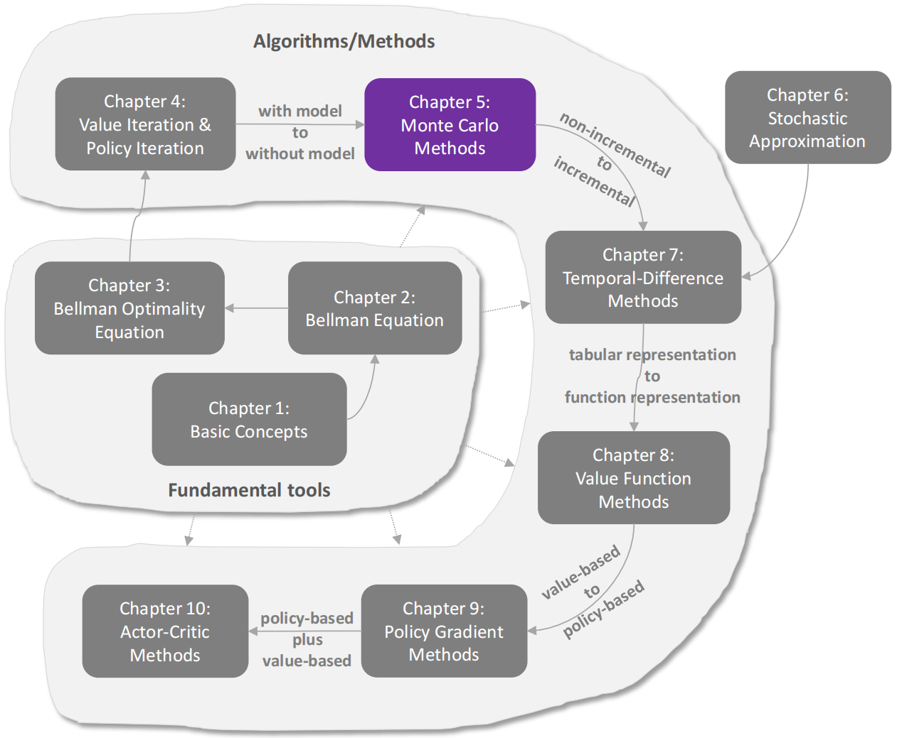
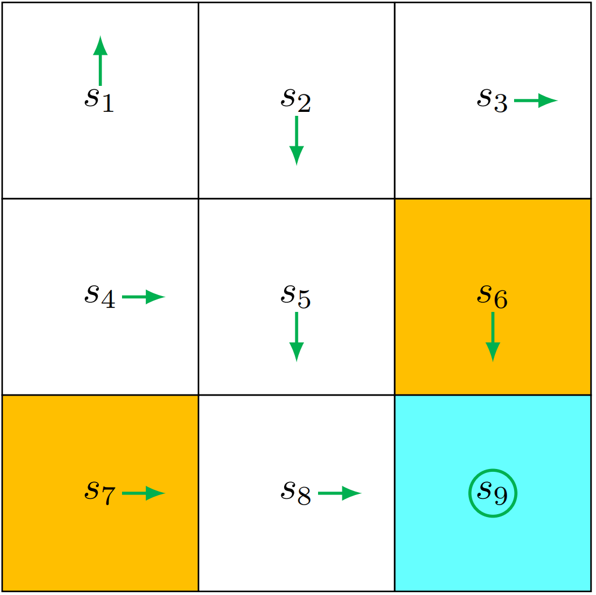
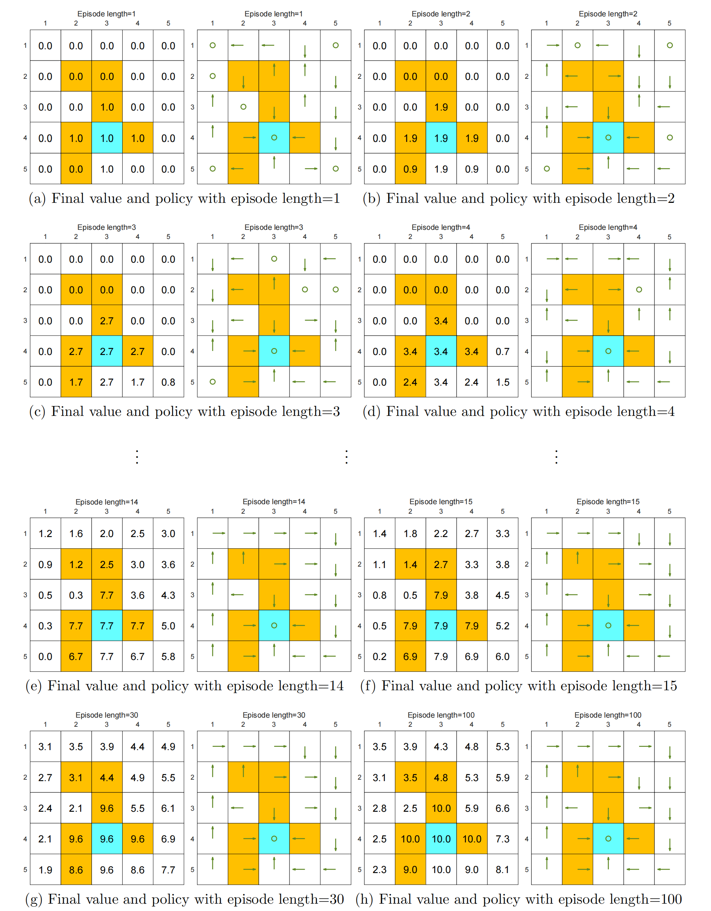
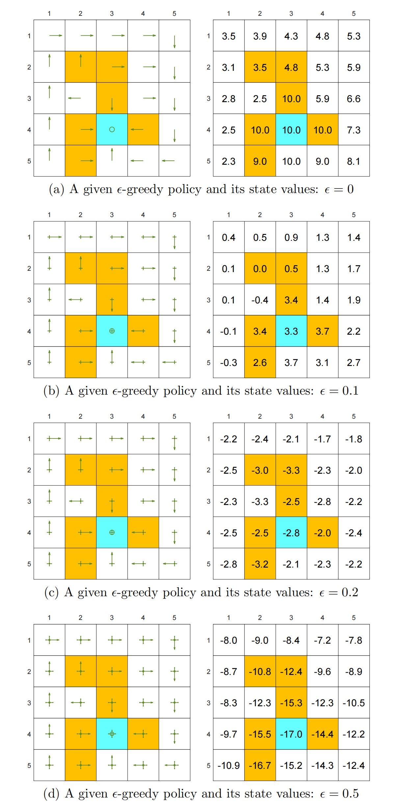
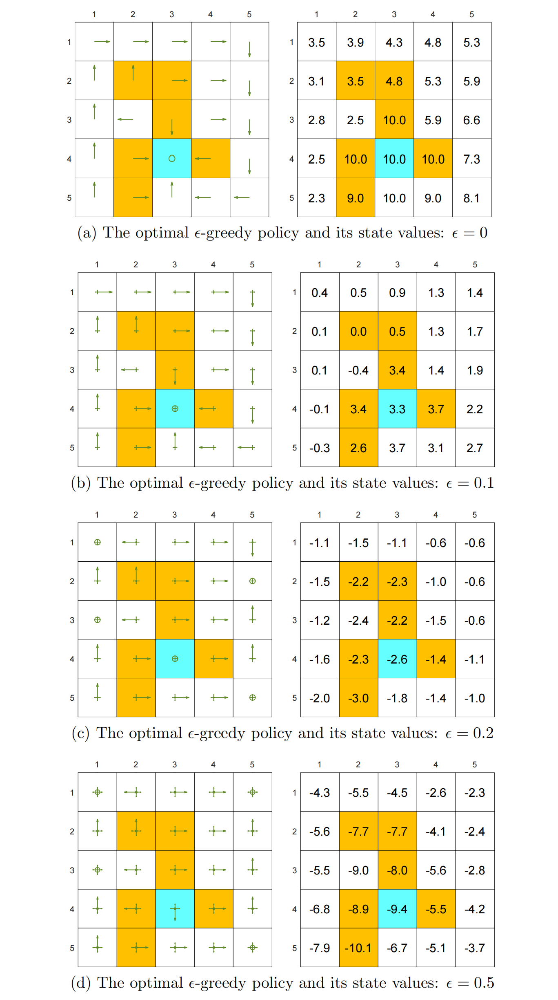
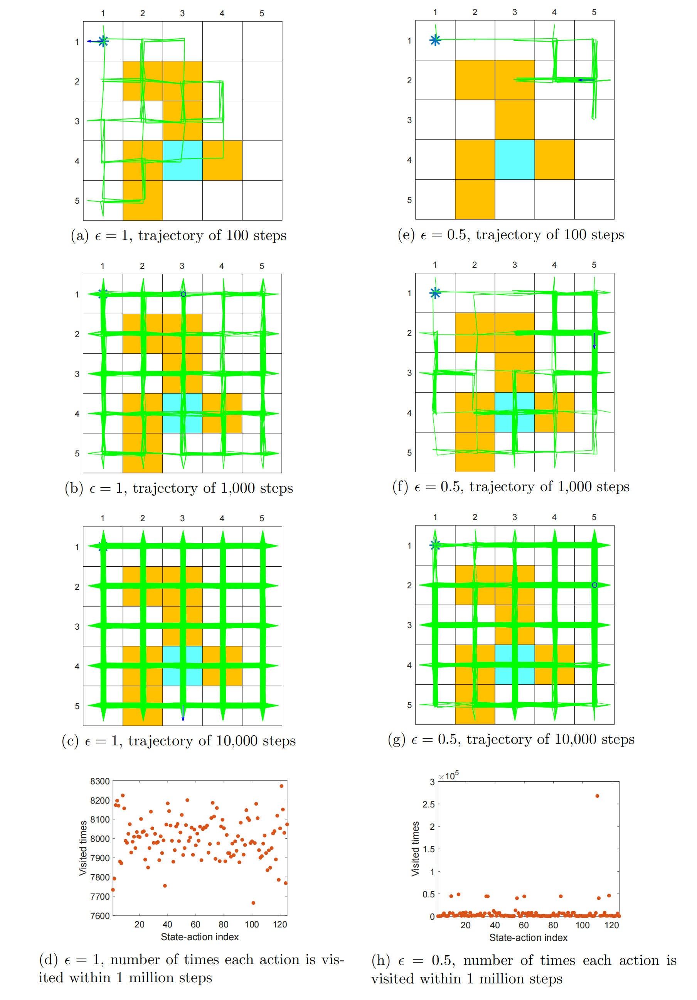

# 蒙特卡洛法



- 在上一章中，我们介绍了 **能够基于系统模型寻找最优策略的算法**。本章将开始介绍 **无需依赖系统模型的无模型强化学习算法**。

- 🤔因为首次引入无模型算法，所以需要填补一个知识空白：**如何在没有模型的情况下找到最优策略？**

  👉其核心理念很简单：

  - 若没有模型，就必须拥有数据；

  - 若没有数据，则必须构建模型；

  - 若两者皆无，则无法找到最优策略。

  在强化学习中，“数据”通常指智能体与环境之间的交互经验。

- 为了说明如何从数据中学习（而不是依赖模型），我们在本章一开始介绍`均值估计问题`（**即从一些样本中估计随机变量的期望值**）。

  理解这个问题对于掌握 **从数据中学习** 的基本思想至关重要。

- 随后，我们介绍了**三种基于`蒙特卡洛方法`的算法**，这些算法能够从经验样本中学习出`最优策略`。

  - MC Basic算法（最简单）：只需对**策略迭代算法**进行修改即可实现。理解该算法对于理解基于蒙特卡洛的强化学习核心思想具有重要意义。

  - 通过扩展该算法，我们还介绍了另外两种更为复杂但效率更高的算法。


## 启发式示例：均值估计

接下来，我们将介绍`均值估计问题`，以此说明如何从数据而非模型中学习。我们会发现，均值估计可以通过**蒙特卡洛方法**实现（这类方法属于**利用随机样本解决估计问题**的广泛技术范畴）。

🤔我们为何要关注均值估计问题？原因很简单：`状态价值`和`动作价值`均被定义为收益的均值。因此，估计状态价值或动作价值本质上就是一个均值估计问题。

假设存在一个随机变量$X$，其取值范围为有限个实数集合$\mathcal{X}$。如果我们需要计算$X$的均值或期望值$\mathbb{E}[X]$，则有两种方法可用于实现这一计算。

- 方法1：基于`模型`的方法

  > `模型`：指$X$的概率分布。

  如果模型已知，那么可以根据期望值的定义直接计算其均值：
  $$
  E[X]=\sum_{x\in\mathcal{X}}p(x)x.
  $$

  > [!NOTE]
  >
  > 在本书中，我们将“`期望值`”、“`均值`”和“`平均值`”这几个术语视为同义词，交替使用。

- 方法2：`无模型`方法

  当 **$X$的概率分布是未知（即模型未知）** 时，假设我们获得$X$的若干样本$\{x_1,x_2,\ldots,x_n\}$，则可将均值近似为：
  $$
  \mathbb{E}[X]\approx\bar{x}=\frac{1}{n}\sum_{j=1}^nx_j.
  $$
  根据`大数定律`，我们可以知道：当$n$较小时，该近似可能不精确。然而随着$n$的增大，该近似值$\bar{x}$精度逐渐提高。当 $n\to\infty$ 时，我们有 $\bar{x}\to\mathbb{E}[X]$

  > `大数定律`：当样本数量足够大时，**样本的平均值** 会越来越接近 **真实的期望值**。


## MC Basic：最简单的基于蒙特卡洛（MC）的算法

> MC Basic的实现方式：用无模型的蒙特卡洛估计步骤，替换了第4.2节所述`策略迭代`算法中的**基于模型的`策略评估`步骤**。

### 将策略迭代转化为无模型方法

**策略迭代算法**的每次迭代包含两个步骤。

- 第一步是`策略评估`，其目的是通过求解方程 $v_{\pi_k}=r_{\pi_k}+\gamma P_{\pi_k}v_{\pi_k}$ 来计算 `状态价值`$v_{\pi_k}$；

- 第二步是`策略改进`，其目的是计算 `贪婪策略` $\pi_{k+1}=\arg\max_{\pi}(r_{\pi}+\gamma P_{\pi}v_{\pi_{k}})$。策略改进步骤的逐元素表达式如下：
  $$
  \begin{aligned}\pi_{k+1}(s)&=\arg\max_\pi\sum_a\pi(a|s)\left[\sum_rp(r|s,a)r+\gamma\sum_{s^{\prime}}p(s^{\prime}|s,a)v_{\pi_k}(s^{\prime})\right]\\&=\arg\max_\pi\sum_a\pi(a|s)q_{\pi_k}(s,a),\quad s\in\mathcal{S}.\end{aligned}
  $$

  > [!NOTE]
  >
  > `注意`：通过上面两个式子，我们发现**动作价值 是这两个步骤的核心**。具体来说：
  >
  > - 在第一步中，我们计算`状态价值`，其目的是为了进一步计算`动作价值`；
  >
  > - 在第二步中，则是基于已经计算得到的`动作价值`来生成新的`策略`。

🤔现在，我们重新思考一下：如何计算`动作价值`？

实际上，有两种可行的方法。

- 方法1：`基于模型`的方法（策略迭代采用的方法）

  即：我们可以首先通过求解**贝尔曼方程**来计算 `状态价值`$v_{\pi_k}$，随后再利用下面的方程计算`动作价值`：
  $$
  q_{\pi_k}(s,a)=\sum_rp(r|s,a)r+\gamma\sum_{s^{\prime}}p(s^{\prime}|s,a)v_{\pi_k}(s^{\prime}).
  $$
  但是该方法要求 **已知`系统模型`**$\{p(r|s,a),p(s^{\prime}|s,a)\}$

- 方法2：`无模型`方法

  - **回顾`动作价值`的定义**：
    $$
    \begin{aligned}q_{\pi_{k}}(s,a)&=\mathbb{E}[G_t|S_t=s,A_t=a]\\&=\mathbb{E}[R_{t+1}+\gamma R_{t+2}+\gamma^2R_{t+3}+\ldots|S_t=s,A_t=a],\end{aligned}
    $$
    也就是说，动作价值表示：**从 `状态-动作对`$(s,a)$ 出发所能获得的 `期望回报`**。

  - 由于 $q_{\pi_k}(s,a)$ 本质上是一个**期望值**，因此可以像第 5.1 节中展示的那样，使用`蒙特卡洛（MC）方法`来进行**估计**。

  - **具体步骤**：

    从 $(s,a)$ 出发，智能体按照 `策略`$\pi_k$ 与环境交互，从而获得若干个 `episode（回合）`。

    假设一共获得了 $n$ 个 episode，第 $i$ 个 episode 的`回报`为 $g_{\pi_k}^{(i)}(s,a)$，那么可以用下面的方式近似：
    $$
    q_{\pi_k}(s,a) = \mathbb{E}[G_t \mid S_t = s, A_t = a]
    \approx \frac{1}{n} \sum_{i=1}^{n} g_{\pi_k}^{(i)}(s,a).
    $$
    我们已经知道，根据**大数定律**，当 episode 数量 $n$ 足够大时，这个近似会足够精确。

    > [!NOTE]
    >
    > 基于`蒙特卡洛`的强化学习的核心思想，就是用这种**无模型的动作价值估计方法**（如上式），来替代策略迭代算法中的**基于模型的方法**。


### MC Basic算法

`基于蒙特卡洛的强化学习算法`：从初始策略$\pi_0$出发，在第$k$次迭代$(k=0,1,2,...)$中包含两个步骤：

- 步骤1：`策略评估`

  此步骤用于估算所有 $(s,a)$组合对应的 $q_{\pi_k}(s,a)$

  具体而言：对于每个$(s,a)$组合，我们收集足够数量的训练轮次，并采用回报的平均值（记为 $q_k(s,a)$）来近似 $q_{\pi_k}(s,a)$

- 步骤2：`策略改进`

  这一步需要求解：

  - 对于 状态$s\in S$，找到一个 策略$\pi_{k+1}(s)=\arg\max_\pi\sum_a\pi(a|s)q_k(s,a)$

  - `贪婪最优策略`为 $\pi_{k+1}(a_k^*|s)=1$，其中 $a_k^*=\arg\max_aq_k(s,a)$

> `算法 5.1`: MC Basic（策略迭代的无模型版本）
>
> - `初始化`：初始化 策略猜测值$\pi_0$
>
> - `目标`：寻找最优策略
>
> - For 迭代次数$k$ in ($k=0,1,2,\ldots$)，do：
>
>   - For 状态$s$ in 状态空间$S$，do：
>
>     - For 动作$a$ in 状态$s$下的动作集合$\mathcal{A}(s)$，do:
>
>       - 从 `状态-动作对`$(s,a)$ 出发，按照 `策略`$\pi_k$ 进行交互，收集足够多的`回合（episodes）`
>
>       - `策略评估`：
>
>         $q_{\pi_k}(s,a)\approx q_k(s,a)=\text{从 }(s,a)\text{出发的所有回合的平均回报}$
>
>         其中：$q_k(s,a)=\frac{1}{n}\sum_{i=1}^nG^{(i)}(s,a)$
>
>     - `策略改进`：
>
>       $a_k^*(s)=\arg\max_aq_k(s,a)$
>
>       if $a=a_k^*$:
>
>       ​	$\pi_{k+1}(a|s)=1$
>
>       else:
>
>       ​	$\pi_{k+1}(a|s)=0$

这是`最简单的基于蒙特卡洛（MC）的强化学习算法`，在本书中称为 **MC Basic**。该算法的伪代码见`算法5.1`。

可以看到，它与**策略迭代算法**非常相似。**唯一的区别在于**：

- `MC Basic` 是**直接从`经验样本`中计算`动作价值`**；
- `策略迭代算法`是**先计算`状态价值`，再利用系统模型计算`动作价值`**。

> [!NOTE]
>
> 注意：
>
> 👉 **无模型算法 必须直接估计 动作价值**。
> 否则，如果先估计状态价值，那么仍然需要通过`系统模型`（如公式 (5.1)）从状态价值计算动作价值。

------

由于`策略迭代`是收敛的，因此在**样本数量足够多**的情况下，`MC Basic` 也是收敛的。

也就是说：

- 对于每一个 $(s,a)$，如果从该状态-动作对出发的 episode 数量足够多，那么这些回报的平均值可以**准确逼近**其真实的动作价值。

- 然而，在实际中，我们通常**无法为每一个 $(s,a)$ 获得足够多的 episode**，因此：

  👉 动作价值的估计可能不够准确。

- 尽管如此，该算法通常仍然可以正常工作。这一点类似于**截断策略迭代（truncated policy iteration）**，在那种方法中，**动作价值同样没有被精确计算**。

------

最后，由于**样本效率较低（用多少数据（经验）能学到多好的结果）**，MC Basic 算法过于简单，难以在实际中直接应用。

之所以引入这个算法，是为了帮助读者理解：

👉 **基于蒙特卡洛的强化学习的核心思想**

在学习本章后续更复杂的算法之前，充分理解该算法是非常重要的。我们将看到，更复杂且样本效率更高的算法可以通过对 MC Basic 进行扩展而得到。


### 示例

#### 一个简单例子：一步一步演示算法实现过程

<figure style="text-align: center;">
    
    <figcaption align="center">图 5.3：用于说明 MC Basic 算法的示例</figcaption>
</figure>

接下来我们通过一个示例来说明 MC Basic 算法的具体实现细节。奖励设置为：$r_\mathrm{boundary~}=r_\mathrm{forbidden~}=-1$，$r_{\mathrm{target}}=1$；折扣率$\gamma=0.9$。初始策略$\pi_{0}$如图5.3所示，该策略对$s_1$和$s_3$均非最优解。

虽然所有动作值都应被计算，但由于篇幅限制，我们仅展示 $s_1$ 的数据。在 $s_1$ 中存在五种可能的动作。

- 对于每种动作，我们需要收集足够长的多个训练回合，才能有效估算其动作值。
- 然而，由于**该示例在策略和模型层面均具有确定性**，多次运行只会生成相同的轨迹。因此，每个动作值的估算仅需单个训练回合即可完成。

---

按照策略 $\pi_0$，我们可以分别从 $(s_1,a_1), (s_1,a_2), \ldots, (s_1,a_5)$ 出发，得到如下的 episode：

- 从 $(s_1,a_1)$ 开始，该回合为 $s_1\xrightarrow{a_1}s_1\xrightarrow{a_1}s_1\xrightarrow{a_1}\ldots$，动作价值 等于 该回合的折现回报（动作价值的定义是在状态$s$选择动作$a$，之后按策略$\pi$行动，能获得的“长期平均回报”，而又因为这里系统模型是确定的，所以动作价值就变为了从该回合开始的所有回报）：
  $$
  q_{\pi_0}(s_1,a_1)=-1+\gamma(-1)+\gamma^2(-1)+\cdots=\frac{-1}{1-\gamma}.
  $$

- 

- 从 $(s_1,a_2)$ 开始，该回合的序列为 $s_1\xrightarrow{a_2}s_2\xrightarrow{a_3}s_5\xrightarrow{a_3}\ldots$，动作价值 等于 该回合的`折现回报`：
  $$
  q_{\pi_0}(s_1,a_2)=0+\gamma0+\gamma^20+\gamma^3(1)+\gamma^4(1)+\cdots=\frac{\gamma^3}{1-\gamma}.
  $$

- 从 $(s_1,a_3)$ 开始，该回合的序列为 $s_1\xrightarrow{a_3}s_4\xrightarrow{a_2}s_5\xrightarrow{a_3}\ldots$，动作价值 等于 该回合的`折现回报`：
  $$
  q_{\pi_0}(s_1,a_3)=0+\gamma0+\gamma^20+\gamma^3(1)+\gamma^4(1)+\cdots=\frac{\gamma^3}{1-\gamma}.
  $$

- 从 $(s_1,a_4)$ 开始，该回合的序列为 $s_1\xrightarrow{a_3}s_4\xrightarrow{a_2}s_5\xrightarrow{a_3}\ldots$，动作价值 等于 该回合的`折现回报`：
  $$
  q_{\pi_0}(s_1,a_4)=-1+\gamma(-1)+\gamma^2(-1)+\cdots=\frac{-1}{1-\gamma}.
  $$

- 从 $(s_1,a_5)$ 开始，该回合的序列为 $s_1\xrightarrow{a_5}s_1\xrightarrow{a_1}s_1\xrightarrow{a_1}\ldots$，动作价值 等于 该回合的`折现回报`：
  $$
  q_{\pi_0}(s_1,a_5)=0+\gamma(-1)+\gamma^2(-1)+\cdots=\frac{-\gamma}{1-\gamma}.
  $$

通过比较这5个动作价值，我们看到：
$$
q_{\pi_0}(s_1,a_2)=q_{\pi_0}(s_1,a_3)=\frac{\gamma^3}{1-\gamma}>0
$$
即为最大值。因此，新策略可得出如下结果：
$$
\pi_1(a_2|s_1)=1\quad\mathrm{or}\quad\pi_1(a_3|s_1)=1.
$$
显然，这种改进后的策略（在状态 s1 选择 a2 或 a3）是最优的。因此，在这个简单示例中，仅需一次迭代即可成功获得最优策略。在该示例中，初始策略对除 s1 和 s3 之外的所有状态均已达到最优；因此，仅需一次迭代即可使策略达到最优。若策略对其他状态并非最优，则需要进行更多次迭代。


####  一个综合示例：回合长度与稀疏奖励

接下来，我们通过分析一个更全面的示例，探讨MC Basic算法的一些有趣特性。该示例采用5×5网格世界（图5.4），奖励设置为：$\begin{aligned}r_{\mathrm{boundary}}=-1,r_{\mathrm{forbidden}}=-10\end{aligned},r_{\mathrm{target}}=1$，折扣率$\gamma=0.9$

<figure style="text-align: center;">
    
    <figcaption align="center">图5.4：MC Basic算法在不同 <b>回合长度</b> 下获得的状态价值与策略<br />只有当每个剧回合的长度足够长时，才能准确估算状态值</figcaption>
</figure>

- `回合长度` 对最终得到的最优策略产生的影响：

  - 具体来说，图 5.4 展示了在不同回合长度下，使用 MC Basic 算法得到的最终结果：

    - 当 **每个回合的长度过短** 时，无论是`策略`还是`价值估计`都不是最优的（见图 5.4(a)-(d)）。

    - 在一个**极端情况**下，当回合长度为 1 时，只有那些**紧邻目标的状态**具有非零价值，而其他所有状态的价值都为 0。这是因为每个回合都太短，无法到达目标或获得正奖励（见图 5.4(a)）。

    - **随着`回合长度`的增加**，`策略`和`价值估计`会逐渐逼近最优（见图 5.4(h)）。

  - 随着回合长度的增加，会出现一个有趣的**空间分布现象**：

    > **距离目标较近的状态，会比远离目标的状态更早获得非零价值。**

    原因如下：

    - <span style="color:red">从某个状态出发，智能体至少需要走一定步数才能到达目标并获得正奖励。如果回合长度小于这个最小步数，那么回报一定为 0，对应的状态价值估计也为 0。</span>
    - 在这个例子中，从左下角出发到达目标至少需要 15 步，因此回合长度必须不小于 15，才能开始学到有意义的价值。

  - **尽管上述分析表明回合需要足够长，但也不必是无限长。**

    如图 5.4(g) 所示，当**`回合长度`为 30** 时，算法已经可以找到**最优策略**，尽管此时价值估计还没有完全最优。

- `稀疏奖励` 对最终得到的最优策略产生的影响：

  > `稀疏奖励`：**只有到达目标时才会获得正奖励**，否则没有任何奖励。
  >
  > - 也就是说：在这种设置下，需要**回合足够长才能到达目标**，这在**状态空间很大时是很难满足**的。
  > - 所以：**稀疏奖励 会降低 `学习效率`（样本效率变差）**

  - 解决方法：**设计`非稀疏奖励`**

    例如，在这个网格世界中，可以重新设计奖励，使得 **在靠近目标的状态也能获得小的正奖励**。

    这样就会在目标周围形成一个：**`吸引场（attractive field）`**，从而帮助智能体更容易找到目标。


## MC探索之旅开始

接下来，我们将MC Basic算法进行扩展，得到另一种基于蒙特卡洛（MC）的强化学习算法。该**算法略显复杂**，但**样本效率更高**。

### 更高效地利用样本

MC（蒙特卡洛）强化学习中的一个重要问题是：**如何更高效地利用样本**。

具体来说，假设我们通过策略 $\pi$ 得到了一个 episode（回合）样本：
$$
\begin{equation}
\label{a state-action sequence}
s_1\xrightarrow{a_2}s_2\xrightarrow{a_4}s_1\xrightarrow{a_2}s_2\xrightarrow{a_3}s_5\xrightarrow{a_1}\ldots
\end{equation}
$$
这里，下标表示的是**状态或动作的编号**，而不是时间步。

每当一个`状态-动作对` $(s,a)$ 在一个 **episode** 中出现一次，就称为对该**状态-动作对**的一次**`访问（visit）`**。

对于如何利用这些**访问（visits）**，可以采用不同的策略。

1. `初始访问（initial visit）策略`（最简单的策略）

   > `初始访问策略`：一个 episode **只用于估计它起始的那个状态-动作对的价值**。

   - 在 公式$\eqref{a state-action sequence}$ 的例子中，即：
     $$
     s_1\xrightarrow{a_2}s_2\xrightarrow{a_4}s_1\xrightarrow{a_2}s_2\xrightarrow{a_3}s_5\xrightarrow{a_1}\ldots
     $$
     `初始访问策略`只会用 **这个 episode** 来估计 $(s_1, a_2)$ 的`动作价值`。MC Basic 算法正是采用了这种初始访问策略。

   - 然而，这种方法的**样本效率较低**，因为：

     在 **这个 episode** 中，其实还**访问了很多其他状态-动作对**，比如：

     - $(s_2, a_4)$
     - $(s_2, a_3)$
     - $(s_5, a_1)$

     这些访问同样可以用于估计对应的动作价值。

   - 所以我们**更进一步**，把一个 `episode` 分解为多个 `子回合（subepisodes）`，即：
     $$
     \begin{aligned}
     s_1 \xrightarrow{a_2} s_2 \xrightarrow{a_4} s_1 \xrightarrow{a_2} s_2 \xrightarrow{a_3} s_5 \xrightarrow{a_1} \dots 
     & \quad \text{[原始回合]} \\
     
     s_2 \xrightarrow{a_4} s_1 \xrightarrow{a_2} s_2 \xrightarrow{a_3} s_5 \xrightarrow{a_1} \dots 
     & \quad \text{[从 $(s_2, a_4)$ 开始的子回合]} \\
     
     s_1 \xrightarrow{a_2} s_2 \xrightarrow{a_3} s_5 \xrightarrow{a_1} \dots 
     & \quad \text{[从 $(s_1, a_2)$ 开始的子回合]} \\
     
     s_2 \xrightarrow{a_3} s_5 \xrightarrow{a_1} \dots 
     & \quad \text{[从 $(s_2, a_3)$ 开始的子回合]} \\
     
     s_5 \xrightarrow{a_1} \dots 
     & \quad \text{[从 $(s_5, a_1)$ 开始的子回合]}
     \end{aligned}
     $$
     从某个状态-动作对被访问之后，**其后续轨迹可以看作一个新的 episode**。

     这些 **新的 episode** 也可以用来估计更多的**动作价值**。

     通过这种方式，可以更高效地利用一个 episode 中的样本。

   - 此外，一个`状态-动作对`在一个 **episode** 中可能会被访问多次。

     例如，在 式子$\eqref{a state-action sequence}$ 中，$(s_1, a_2)$ 被访问了两次。

     - 如果我们**只统计第一次访问**，这种方法称为**`首次访问策略（first-visit strategy）`**。

     - 如果我们**统计每一次访问**，这种方法称为**`每次访问策略（every-visit strategy）`**。

   - 从**样本利用效率**的角度来看，每次访问策略是**最优**的。
   
     如果一个 episode 足够长，以至于<span style="color:red">能够多次访问所有的状态-动作对</span>，那么仅仅这一个 episode，就可能足以通过 `every-visit 策略`来估计所有的动作价值。
   
   
   - 然而，`every-visit 策略`得到的样本是 **`相关的（correlated）`**，因为：
   
     从**第二次访问开始的轨迹**，其实只是**第一次访问之后轨迹**的一个子集。
   
     不过，如果两次访问在`轨迹`中**相距较远**，那么这种**`相关性`就不会很强**。
   
     **举个例子**：
   
     - 轨迹：$(s_1,a_2) → ... → (s_1,a_2) → ...$
   
     - 第一次 visit 的回报：
   
       ```
       G1 = 从第1次开始 → 一直到结束
       ```
   
     - 第二次 visit 的回报：
   
       ```
       G2 = 从第2次开始 → 一直到结束
       ```
   
     - 但是 **G2 是 G1 的“后半段”**，所以 **G1 和 G2 不是独立的**
   
       而理论上，我们希望样本是`独立同分布的`。
   
       > 所以两个相同的样本在同一个episode就意味着：这两个样本强相关
   
     - 但是 **如果 `两次 visit（在同一个 episode 中，同一个状态-动作对 (s,a) 出现了两次）` 距离很远**，那么：
   
       <span style="color:red">中间经历很多随机性 -> 相关性变弱</span>
   
       那么这 **两个visit** 就可以当作 **比较独立**

### 更高效地更新策略

基于蒙特卡洛（MC）的强化学习的另一个方面是 **何时更新策略**。目前有两种方法：

1. 在`策略评估阶段`，收集所有从同一`状态-动作对`开始的回合，然后利用这些回合的**平均回报**来近似计算**动作价值**。

   该策略被应用于MC Basic算法中。

   - `缺点`：智能体必须等待所有回合执行完毕后才能更新估计值。

   （这里不显示策略1的算法）

2. （克服第一种策略的缺点）使用 **单个 episode 的回报** 来近似对应的 **动作价值**。

   这样一来，当我们获得一条 episode 时，就可以**立即得到一个粗略的估计**。随后，策略可以 **以“逐 episode”的方式不断改进**。

   > [!NOTE] 
   >
   > 🤨由于 **单个 episode 的回报** 不能准确地近似对应的`动作价值`，人们可能会怀疑`第二种策略`是否有效。
   >
   > 事实上，这种策略属于上一章介绍的 **广义策略迭代（Generalized Policy Iteration, GPI）** 的范畴。
   >
   > 也就是说，**即使价值估计还不够准确，我们仍然可以更新策略。**

   > `算法 5.2`：蒙特卡洛探索起始（MC Exploring Starts，高效版本）（策略2）
   >
   > - `初始化`：对所有状态-动作对 $(s, a)$：
   >
   >   初始化策略 $\pi_0(a|s)$
   >
   >   初始化动作价值函数 $q(s, a)$
   >
   >   回报累计 $Returns(s, a) = 0$
   >
   >   访问次数 $Num(s, a) = 0$
   >
   > - `目标`：寻找最优策略
   >
   > - **For 每一个episode（回合还没生成），有**：
   >
   >   - **生成一个完整的episode（一个完整的轨迹）**：
   >
   >     选择一个初始状态-动作对$(s_0,a_0)$，并保证所有 $(s, a)$ 都有可能被选中（这就是“探索起始”条件）。
   >
   >     然后按照当前策略生成一条**完整轨迹**（长度为 $T$）：$s_0,a_0,r_1,\ldots,s_{T-1},a_{T-1},r_T$
   >
   >   - **每个episode初始化**：
   >
   >     把`累计回报`清零，准备重新计算这一整条episode的回报，即 $g\leftarrow0$
   >
   >     在蒙特卡洛中，$g\equiv G_t=r_{t+1}+\gamma r_{t+2}+\cdots+\gamma^{T-t-1}r_T$，即表示 **从当前时刻开始，一直到episode结束的总回报**
   >
   >   - **For $t$（表示 step） in 每个episode（即 $t=T-1,T-2,\ldots,0$）**：
   >
   >     - 更新回报：$g\leftarrow\gamma g+r_{t+1}$（根据公式 $G_t=r_{t+1}+\gamma G_{t+1}$ 得到）
   >
   >     - 累加回报：$Returns(s_t,a_t)\leftarrow Returns(s_t,a_t)+g$
   >
   >     - 更新访问次数：$Num(s_t,a_t)\leftarrow Num(s_t,a_t)+1$
   >
   >     - 策略评估：$q(s_t,a_t)\leftarrow\frac{Returns(s_t,a_t)}{Num(s_t,a_t)}$
   >
   >     - 策略改进：
   >
   >       if $a=\arg\max_aq(s_t,a)$:
   >
   >       ​	$\pi(a|s_t)=1$
   >
   >       else:
   >
   >       ​	$\pi(a|s_t)=0$


### 算法描述

- 我们可以使用第 5.3.1 和 5.3.2 节中介绍的技术来提高 MC Basic 算法的效率，从而得到一个新的算法，称为 **`MC Exploring Starts（探索起始）`**。

  MC Exploring Starts 的细节见 `算法 5.2`。该算法采用的是 **every-visit（每次访问）策略**。有趣的是，在计算从每个`状态-动作对`开始的`折扣回报`时，该过程是**从终止状态开始，反向回溯到起始状态**。

  这种技巧可以**提高算法效率**，但同时也**使算法更加复杂**。这也是为什么先介绍 MC Basic 算法，以便更清楚地展示**基于`蒙特卡洛强化学习`的核心思想**。

- `探索起始（exploring starts）`条件要求：必须有 **足够多的 episode 从每一个状态-动作对开始**。

  - 只有当每个状态-动作对都被充分探索时，我们才能根据 **大数定律** 准确估计它们的**动作价值**，从而成功找到**最优策略**。

  - 否则，如果某个动作没有被充分探索：

    - 它的**动作价值**可能被错误估计

    - 即使它是`最优动作`，也可能**不会被策略选中**

      🤔为什么会这样？举个例子：

      - 假设在某个状态 $s$：

        | 动作 | 真实价值（你不知道） |
        | ---- | -------------------- |
        | a1   | 10（最优）           |
        | a2   | 8                    |

      - 在采样不够的情况下：

        如果你只试过：

        - $a_1$：只试了一次 -> 运气差 -> 得到回报 2
        - $a_2$：试了很多次 -> 平均接近 8

        你估计得到：

        - $q(s,a_1) ≈ 2$   ❌（严重低估）
        - $q(s,a_2) ≈ 8$   ✔

  MC Basic 和 MC Exploring Starts 都依赖这个条件。


## $\mathrm{MC~}\epsilon\mathrm{-Greedy}$：在没有 Exploring Starts 的情况下学习

我们接下来对 MC Exploring Starts 算法进行**扩展**，去掉 exploring starts 条件。

exploring starts 条件实际上要求：**每个状态-动作对都能被访问足够多次**

而这一点也可以通过**软策略（soft policies）**来实现。

> 如果某项策略在任何状态下采取任何行动的概率均为**正数**（没有0，所以所有动作都可能被选择），则该策略被称为`软策略`

### $\epsilon$贪婪策略

- 考虑一个**极端情况**：我们仅有一个`episode`。

  如果使用软策略，那么只要这个 episode 足够长，**它就可以多次访问所有`状态-动作对`**（见图 5.8）

  因此：我们不需要从 **不同的`状态-动作对`** 生成大量 episode，从而可以去掉 exploring starts 条件

- 一种常见的 `软策略`： $\epsilon$贪婪策略。

  $\epsilon$贪婪策略是一种随机策略，它：

  - **更倾向于** 选择 **当前最优动作**（greedy action = 当前 $q(s,a)$ 最大的动作）

  - 同时对 **其他所有动作** 给予**相同的、非零概率**

- $\epsilon$贪婪策略

  设 $\epsilon \in [0,1]$，则 $\epsilon$贪婪策略 为：
  $$
  \pi(a|s)=
  \begin{cases}
  1-\frac{\epsilon}{|\mathcal{A}(s)|}(|\mathcal{A}(s)|-1), & \text{如果是最优动作} \\\\
  \frac{\epsilon}{|\mathcal{A}(s)|}, & \text{其他 } |\mathcal{A}(s)|-1 \text{ 个动作}
  \end{cases}
  $$
  其中 $|A(s)|$ 表示在状态 $s$ 下可选动作的数量。

- $\epsilon$ 的**两个极端情况**

  - 当 $\epsilon = 0$ 时，$\epsilon$-贪心策略退化为 **纯贪心策略**（永远选**最优动作**）

  - 当 $\epsilon = 1$ 时，**所有动作被选中的概率都相同**：
    $$
    \frac{1}{|A(s)|}
    $$
    也就是**完全随机策略**

- 🤔**为什么`最优动作`概率最大？**

  最优动作（greedy action）的概率总是大于其他动作，因为：
  $$
  1 - \frac{\epsilon}{|A(s)|}(|A(s)| - 1)
  = 1 - \epsilon + \frac{\epsilon}{|A(s)|}
  \ge \frac{\epsilon}{|A(s)|}
  $$
  对任意 $\epsilon \in [0,1]$ 都成立

- 🤔**ε-greedy 是`随机策略`，那实际怎么选动作？**

  - 按照`均匀分布`先生成一个位于$[0,1]$区间的随机数 $x$（这是与 ε-greedy 的概率设计相匹配的）

  - 如果 $x \ge \epsilon$（$\epsilon$很小的情况）：选`最优动作`

    如果 $x < \epsilon$（$\epsilon$很大的情况）：每个在动作空间$\mathcal{A}(s)$中的动作的概率都是$\frac{1}{|\mathcal{A}(s)|}$，在这些动作中随机选一个（在所有动作中**均匀随机选一个**）

  - 我们得到：

    - 最优动作的总概率：
      $$
      (1 - \epsilon) + \frac{\epsilon}{|A(s)|}
      $$

    - 其他动作的概率：
      $$
      \frac{\epsilon}{|A(s)|}
      $$


### 算法描述

为了将 **ε-贪婪（ε-greedy）策略** 引入蒙特卡洛（MC）学习，我们只需要把`策略改进（policy improvement）`步骤从**纯贪婪（greedy）改为 ε-贪婪**即可。

- `纯贪心策略`

  - 具体来说，在 **MC Basic** 或 **MC Exploring Starts** 中，策略改进步骤的目标是求解
    $$
    \pi_{k+1}(s) = \arg\max_{\pi \in \Pi} \sum_a \pi(a \mid s)\, q_{\pi_k}(s, a)
    $$
    其中

    - $\Pi$表示**所有可能`策略`的集合**。
    - 含义：在所有可能的策略中，选一个**让当前状态 s 的期望动作价值最大**的策略。

  - 🤔有什么问题呢？

    因为我们对这个优化问题的解是：**把全部概率都给价值最大的那个动作**，即：
    $$
    \pi(a|s) =
    \begin{cases}
    1 & a = \arg\max_a q_{\pi_k}(s,a) \\
    0 & \text{otherwise}
    \end{cases}
    $$
    也就是说，我们选择的是`纯贪心策略`，我们类比`贪心算法`就可以知道，这个会导致：**没有探索**、**可能陷入局部最优**、**有些动作永远不会被尝试** 的问题

- `ε-贪婪策略（ε-greedy）`

  - ε-贪婪策略 的式子是：
    $$
    \pi_{k+1}(a \mid s) =
    \begin{cases}
    1 - \dfrac{|\mathcal{A}(s)| - 1}{|\mathcal{A}(s)|}\,\varepsilon, & a = a_k^*, \\
    \dfrac{1}{|\mathcal{A}(s)|}\,\varepsilon, & a \ne a_k^*,
    \end{cases}
    $$

  - **核心思想**：把概率分成两个部分

    1. **大部分概率 -> 最优动作**

       此时选择 最优动作$a_k^* = \arg\max_a q_{\pi_k}(s,a)$ 的概率是：（当$\epsilon$很小时，这个概率很接近1）
       $$
       1 - \varepsilon + \frac{\varepsilon}{|\mathcal{A}(s)|}
       $$

    2. **小部分概率 -> 所有动作均分**

       每个动作（不包括最优）在“探索阶段”被选中的概率是：
       $$
       \frac{\varepsilon}{|\mathcal{A}(s)|}
       $$
       这其实就是 **`随机探索`**

通过上述修改，我们得到了另一种称为 `MC-Greedy` 的算法。该算法的具体细节见`算法 5.3`。此处采用`每次访问策略（每次出现 (s,a) 都更新）`以更高效地利用样本。

> 算法5.3：MC ε-贪婪算法（MC 探索性起点的一种变体）
>
> - `初始化`：对所有的`状态-动作对`$(s,a)$，给定初始策略 $\pi_0(a|s)$ 和 初始动作价值 $q(s,a)$。对所有 $(s,a)$，令 $Returns(s,a)=0$，$Num(s,a)=0$。$\varepsilon \in (0,1]$。
>
> - `目标`：寻找最优策略
>
> - For 每一个episode，有：
>
>   - `回合生成`：选择一个初始状态-动作对 $(s_0,a_0)$（不要求满足探索性起点条件）。按照当前策略生成一个长度为 $T$ 的回合：$s_0,a_0,r_1,\ldots,s_{T-1},a_{T-1},r_T$
>
>   - `对每个回合进行初始化`：$g\leftarrow0$
>
>   - 对该回合中的每一步 $t=T-1,T-2,\ldots,0$，执行：
>
>     $$g \leftarrow \gamma g + r_{t+1}$$
>     $$
>     Returns(s_t, a_t) \leftarrow Returns(s_t, a_t) + g$$
>     $$Num(s_t, a_t) \leftarrow Num(s_t, a_t) + 1$$
>
>   - `策略评估`：
>     $$
>     q(s_t,a_t) \leftarrow \frac{Returns(s_t,a_t)}{Num(s_t,a_t)}
>     $$
>
>   - `策略改进`：
>
>     令
>     $$
>     a^*=\arg\max_a q(s_t,a)
>     $$
>     并令
>     $$
>     \pi(a|s_t)=
>     \begin{cases}
>     1-\frac{|A(s_t)|-1}{|A(s_t)|}\varepsilon, & a=a^* \\[4pt]
>     \frac{1}{|A(s_t)|}\varepsilon, & a\ne a^*
>     \end{cases}
>     $$

🤔如果在策略改进步骤中，用 **$\varepsilon$-贪婪策略** 替代 **贪婪策略**，我们还能保证得到 **最优策略** 吗？

- 答案既是**肯定**的，也是**否定**的。

- 说“**肯定**”，是指在给定足够多样本的情况下，该算法可以收敛到一个 $\varepsilon$-贪婪策略，并且该策略在策略集合 $\Pi_\varepsilon$ 中是最优的。

- 说“**否定**”，是指该策略仅仅是在 $\Pi_\varepsilon$ 中最优，但未必是在整个策略集合 $\Pi$ 中最优。

- 不过，如果 $\varepsilon$ 足够小，那么 $\Pi_\varepsilon$ 中的最优策略会接近于 $\Pi$ 中的最优策略。


### 示例性例子

- 考虑 图5.5 所示的网格世界示例。目标是为每个状态找到最优策略。

  在 MC $\varepsilon$-贪婪算法的每次迭代中，都会生成一个包含一百万步的单个回合。这里，我们有意考虑一种极端情况：每次迭代仅使用一个回合。

  我们设定：$r_{\text{boundary}} = r_{\text{forbidden}} = -1$，$r_{\mathrm{target}}=1$，$\gamma=0.9$

- 初始策略是一个均匀策略，即采取任意动作的概率都相同，均为 $0.2$，如图 5.5 所示。

  当 $\varepsilon = 0.5$ 时，经过两次迭代后即可得到最优的 $\varepsilon$-贪婪策略。

  尽管每次`迭代`只使用一个回合，但`策略`仍然会逐渐改进，因为所有的状态-动作对都能够被访问到，因此它们的价值可以被准确估计。

<figure style="text-align: center;">
    
    <figcaption align="center">图5.5：基于单次事件的MC-Greedy算法演化过程</figcaption>
</figure>


## $\epsilon$-贪婪策略的探索与应用

- `探索`与`利用`构成了强化学习中的一个基本权衡。

  - **探索**：策略尽可能有机会选择更多动作。这样一来，所有动作都能够被访问到，并且被充分评估。

  - **利用**：改进后的策略应该选择具有最大动作价值的贪婪动作。

  - 然而，由于当前时刻得到的动作价值可能因为探索不足而并不准确，所以我们应该在利用的同时继续保持探索，以避免错过最优动作。

- $\varepsilon$-贪婪策略提供了一种平衡探索与利用的方法。
  - （对利用）$\varepsilon$-贪婪策略**以较高概率选择贪婪动作**，因此它能够利用当前估计得到的价值。
  - （对探索）$\varepsilon$-贪婪策略也**有一定概率选择其他动作**，因此它能够继续进行探索。
  - $\varepsilon$-贪婪策略不仅用于基于 MC 的强化学习方法，也用于其他强化学习算法，例如第 7 章将介绍的`时序差分学习`。

- `利用`与最优性有关，因为最优策略应该是贪婪的。
  - $\varepsilon$-贪婪策略的基本思想是：**通过牺牲一部分最优性 / 利用性来增强探索性。**
  - 如果我们希望 **增强利用性和最优性**，就需要减小 $\varepsilon$ 的值。
  - 然而，如果我们希望 **增强探索性**，就需要增大 $\varepsilon$ 的值。

- 接下来，我们将基于一些有趣的例子来讨论这种权衡。

  这里的强化学习任务是一个 $5 \times 5$ 的网格世界。奖励设置为：
  $$
  r_{\text{boundary}}=-1
  $$
  折扣率为：
  $$
  \gamma=0.9
  $$

- 


### $\epsilon$-贪婪策略的最优性

**说明：当 $\varepsilon$ 增大时，$\varepsilon$-贪婪策略的最优性会变差**。

- 首先，`图5.6(a)` 给出了一个贪婪最优策略以及相应的最优状态价值。`图5.6(b)–(d)` 给出了一些**一致的** $\varepsilon$-贪婪策略的**状态价值**。

  这里，两个 $\varepsilon$-贪婪策略是**一致的**，指的是：在这些策略中，具有最大选择概率的动作是相同的。

  随着 $\varepsilon$ 的值增大，$\varepsilon$-贪婪策略的状态价值会降低，这表明这些 $\varepsilon$-贪婪策略的最优性变差了。

  > [!NOTE]
  >
  > 当 $\varepsilon$ 增大到 $0.5$ 时，目标状态的价值变得最小。这是因为，当 $\varepsilon$ 较大时，从目标区域出发的智能体有更高概率进入周围的禁区，从而获得负奖励。

  <figure style="text-align: center;">
      
      <figcaption align="center">图 5.6：若干 ε-贪婪策略的状态价值。这些 ε-贪婪策略彼此是一致的，其含义是：它们具有最大选择概率的动作是相同的。可以看出，当 ε 的值增大时，ε-贪婪策略的状态价值会降低，因此它们的最优性会变差。</figcaption>
  </figure>

- 其次，`图5.7` 展示了 **最优的$\varepsilon$-贪婪策略**，也就是说，它们是在 $\Pi_\varepsilon$ 中最优的策略。

  当 $\varepsilon=0$ 时，该策略是贪婪策略，并且在所有策略中都是最优的。

  当 $\varepsilon$ 很小，例如 $\varepsilon=0.1$ 时，最优的 $\varepsilon$-贪婪策略与最优贪婪策略是一致的。

  但是，当 $\varepsilon$ 增大到例如 $0.2$ 时，得到的 $\varepsilon$-贪婪策略就不再与最优贪婪策略一致。

  因此，如果我们希望得到与 **最优贪婪策略** 一致的 **$\varepsilon$-贪婪策略**，那么 $\varepsilon$ 的值应该足够小。

  > 🤔为什么当 $\varepsilon$ 较大时，$\varepsilon$-贪婪策略会与最优贪婪策略不一致呢？
  >
  > 👉我们可以通过 **考虑目标状态** 来回答这个问题。
  >
  > 在贪婪情形下，目标状态处的最优策略是**保持不动**，以持续获得正奖励。
  >
  > 然而，当 $\varepsilon$ 较大时，智能体在目标状态处**有较高概率进入禁区**并获得负奖励。
  >
  > 因此，在这种情况下，目标状态处的最优策略就变成了**逃离目标区域**，而不是保持不动。

  <figure style="text-align: center;">
      
      <figcaption align="center">图 5.7：不同 ε 值下的最优 ε-贪婪策略及其对应的状态价值。这里，这些 ε-贪婪策略是在所有具有相同 ε 值的 ε-贪婪策略中最优的。可以看出，当 ε 的值增大时，最优的 ε-贪婪策略不再与图 5.7(a) 中的最优策略保持一致。</figcaption>
  </figure>


### $\varepsilon$-贪婪策略的探索能力

> 当 $$\varepsilon$$ 较大时，$$\varepsilon$$-贪婪策略的探索能力更强。

<figure style="text-align: center;">
    
    <figcaption align="center">图 5.8：不同ε值下的ε-贪婪策略的探索能力
</figcaption>
</figure>

1. 考虑一个 $$\varepsilon=1$$ 的 $$\varepsilon$$-贪婪策略（见图 5.5(a)）。在这种情况下，该策略的探索能力很强，因为在任意状态下，它对每个动作都有 $$0.2$$ 的选择概率。

   从 $$(s_1,a_1)$$ 出发，由该 $$\varepsilon$$-策略生成的一个回合如图 5.8(a)–(c) 所示。可以看出，当回合足够长时，由于该策略具有很强的探索能力，这单个回合就能够多次访问所有状态-动作对。

   此外，如图 5.8(d) 所示，所有**状态-动作对**被访问的次数几乎是均匀的。

2. 其次，考虑一个 $$\varepsilon=0.5$$ 的 $$\varepsilon$$-策略（见图 5.6(d)）。在这种情况下，该 $$\varepsilon$$-贪婪策略的探索能力比 $$\varepsilon=1$$ 时更弱。

   从 $$(s_1,a_1)$$ 出发，由该 $$\varepsilon$$-策略生成的一个回合如图 5.8(e)–(g) 所示。虽然当回合足够长时，每个动作仍然都可以被访问到，但访问次数的分布可能会极不均匀。

   例如，对于一个包含一百万步的回合，有些动作会被访问超过 $$250,000$$ 次，而大多数动作只被访问几百次，甚至几十次，如图 5.8(h) 所示。

上述例子表明：**随着 $$\varepsilon$$ 的减小，$$\varepsilon$$-贪婪策略的探索能力会减弱。**

一种常用技巧是：在初始时将 $$\varepsilon$$ 设得较大，以增强探索；然后再逐渐减小 $$\varepsilon$$，以保证最终策略的最优性。


## 小结

本章中的算法是本书首次介绍的**无模型强化学习算法**。

- 三种基于 MC 的算法：

  - **MC Basic：**

    这是最简单的基于 MC 的强化学习算法。该算法通过用无模型的 MC 估计部分，替代策略迭代算法中基于模型的策略评估步骤而得到。**给定足够多的样本，可以保证该算法收敛到最优策略和最优状态价值**。

  - **MC Exploring Starts：**

    该算法是 MC Basic 的一个变体。它可以通过在 MC Basic 算法中**使用`首次访问`或`每次访问`策略来更高效地利用样本**而得到。

  - **MC $$\varepsilon$$-Greedy：**

    该算法是 MC Exploring Starts 的一个变体。具体来说，在`策略改进`步骤中，它**寻找的是最优的 $$\varepsilon$$-贪婪策略，而不是贪婪策略**。通过这种方式，策略的探索能力得到增强，因此可以去除探索性起点条件。

- 通过考察 $$\varepsilon$$-贪婪策略的性质，引入了`探索`与`利用`之间的权衡：
  - $$\varepsilon$$的值**增大**：$$\varepsilon$$-贪婪策略的**`探索`能力增强**，而对贪婪动作的**利用程度降低**。
  - $$\varepsilon$$的值**减小**：我们就能够更好地`利用`**贪婪动作**，但探索能力会受到削弱。


