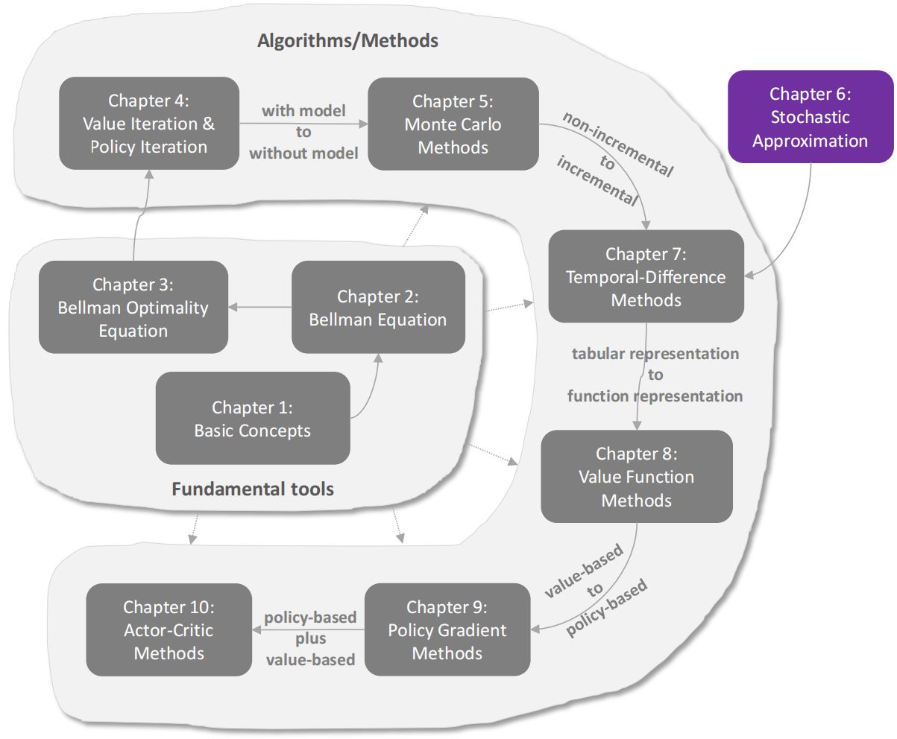
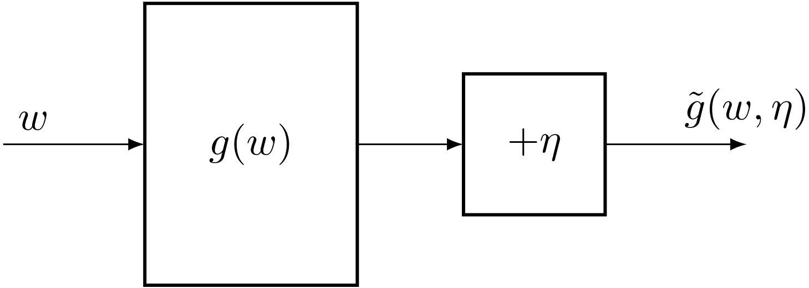
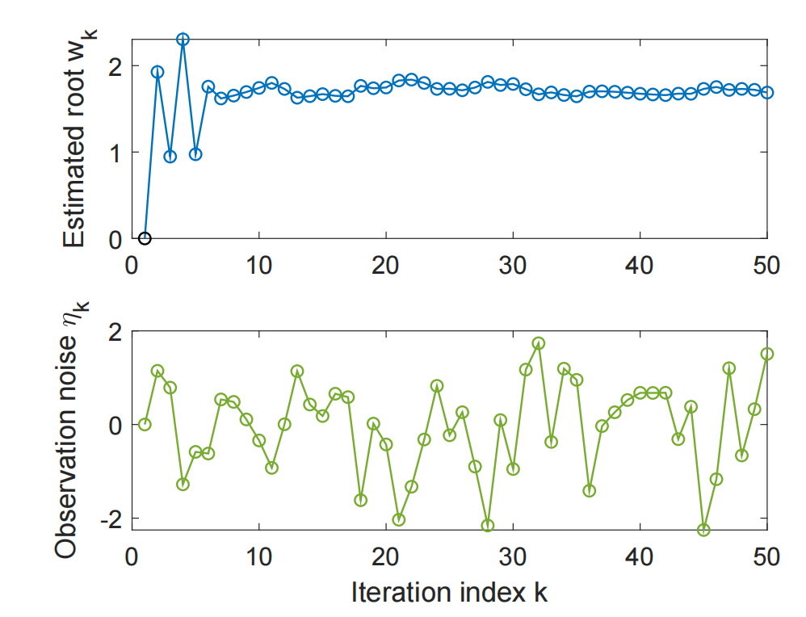
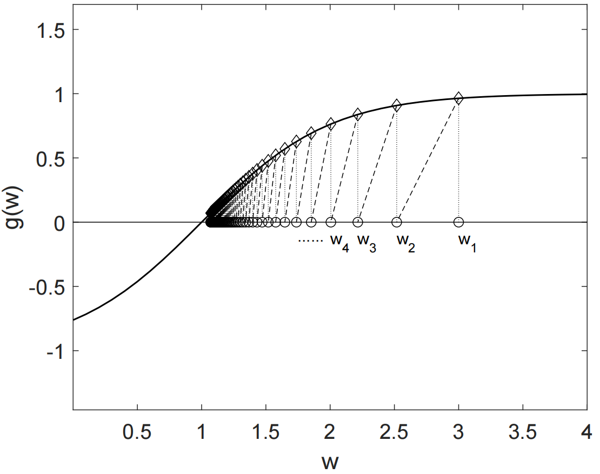
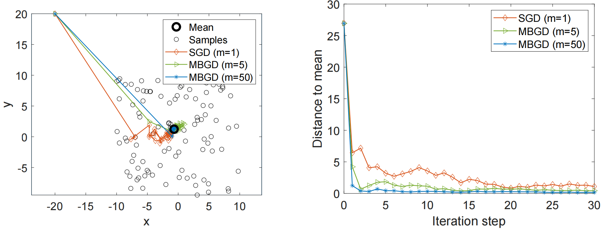

# 随机逼近法

第 5 章介绍了第一类基于蒙特卡洛估计的无模型强化学习算法。

在下一章，也就是第 7 章中，我们将介绍另一类无模型强化学习算法：**时序差分学习**。

然而，在进入下一章之前，我们需要先按下暂停键，做一些更充分的准备。这是因为，时序差分算法与我们目前已经学习过的算法有很大不同。许多第一次接触时序差分算法的读者常常会疑惑：这些算法最初是如何设计出来的？它们为什么能够有效工作？

事实上，前面章节和后续章节之间存在一个知识空缺：我们目前已经学习过的算法是**非增量式**的，而后续章节将要学习的算法是**增量式**的。

本章将通过介绍**随机近似**的基础知识来填补这一知识空缺。虽然本章不会介绍任何具体的强化学习算法，但它为学习后续章节奠定了必要基础。

我们将在第 7 章看到，时序差分算法可以被看作特殊的随机近似算法。机器学习中广泛使用的著名**随机梯度下降算法**，也将在本章中介绍。

## 引例：均值估计

接下来，我们通过考察均值估计问题，说明如何将一个**非增量式算法**转换为**增量式算法**。

- 考虑一个随机变量 $$X$$，它的取值来自一个有限集合 $$\mathcal{X}$$。我们的目标是估计 $$\mathbb{E}[X]$$。假设我们有一组独立同分布样本$${x_i}_{i=1}^{n}$$，那么，$$X$$ 的期望值可以近似为：
  $$
  \begin{equation}
  \mathbb{E}[X] \approx \bar{x} \triangleq \frac{1}{n}\sum_{i=1}^{n}x_i
  \label{sample_mean}
  \end{equation}
  $$
  式 $$\eqref{sample_mean}$$ 中的近似正是第 5 章介绍的蒙特卡洛估计的基本思想。根据大数定律，我们知道：
  $$
  \bar{x} \to \mathbb{E}[X], \quad n \to \infty
  $$

接下来，我们说明可以用两种方法来计算式 $$\eqref{sample_mean}$$ 中的 $$\bar{x}$$。

- 第一种：**非增量式方法**

  - 概念：先收集所有样本，然后再计算平均值。

  - 缺点：如果样本数量很大，我们可能必须等待很长时间，直到所有样本都收集完成。

- 第二种：**增量式方法**（避免第一种方法的缺点）

  - 具体来说，假设：

    $$
    w_{k+1} \triangleq \frac{1}{k}\sum_{i=1}^{k}x_i,
    \quad k=1,2,\ldots
    $$

    因此：

    $$
    w_k=\frac{1}{k-1}\sum_{i=1}^{k-1}x_i,
    \quad k=2,3,\ldots
    $$

    于是，$$w_{k+1}$$ 可以用 $$w_k$$ 表示为：

    $$
    \begin{aligned}
    w_{k+1}
    &= \frac{1}{k}\sum_{i=1}^{k}x_i \\
    &= \frac{1}{k}\left(\sum_{i=1}^{k-1}x_i+x_k\right) \\
    &= \frac{1}{k}\left((k-1)w_k+x_k\right) \\
    &= w_k-\frac{1}{k}(w_k-x_k)
    \end{aligned}
    $$

    因此，我们得到如下增量式算法：

    $$
    \begin{equation}
    w_{k+1}=w_k-\frac{1}{k}(w_k-x_k)
    \label{Sample Mean Recursive Update Formula}
    \end{equation}
    $$

    该算法可以用增量方式计算均值 $$\bar{x}$$。可以验证：
  
    $$
    \begin{equation}
    \begin{aligned}
    w_1 &= x_1, \\[6pt]
    w_2 &= w_1-\frac{1}{1}(w_1-x_1)=x_1, \\[6pt]
    w_3 &= w_2-\frac{1}{2}(w_2-x_2)
         =x_1-\frac{1}{2}(x_1-x_2)
         =\frac{1}{2}(x_1+x_2), \\[6pt]
    w_4 &= w_3-\frac{1}{3}(w_3-x_3)
         =\frac{1}{3}(x_1+x_2+x_3), \\[6pt]
    &\ \vdots \\[6pt]
    w_{k+1} &= \frac{1}{k}\sum_{i=1}^{k}x_i.
    \end{aligned}
    \label{Sample Mean Recursive Update Formulas}
    \end{equation}
    $$
  
    式 $$\eqref{Sample Mean Recursive Update Formula}$$ 的优点是：每当我们接收到一个样本时，就可以立即更新平均值。这个平均值可以用来近似 $$\bar{x}$$，从而近似 $$\mathbb{E}[X]$$。
  
    > [!NOTE]
    >
    > 注意：由于一开始样本不足，因此初始阶段的近似可能并不准确。
    >
    > 不过，有估计总比没有估计好。随着获得的样本越来越多，根据`大数定律`，估计精度会逐渐提高。
  
  - 此外，也可以定义：
  
    $$
    w_{k+1}=\frac{1}{k+1}\sum_{i=1}^{k+1}x_i
    $$
  
    以及：
  
    $$
    w_k=\frac{1}{k}\sum_{i=1}^{k}x_i
    $$
  
    这样做不会带来本质上的区别。在这种情况下，对应的迭代算法为：
  
    $$
    w_{k+1}=w_k-\frac{1}{1+k}(w_k-x_{k+1})
    $$
  
  
  - 进一步地，考虑一个表达形式更一般的算法：
    $$
    \begin{equation}
    w_{k+1}=w_k-\alpha_k(w_k-x_k)
    \label{Sample Mean Recursive Update Formulas co}
    \end{equation}
    $$
  
    该算法非常重要，并且会在本章中频繁使用。它与式 $$\eqref{Sample Mean Recursive Update Formula}$$ 相同，只是将系数 $$1/k$$ 替换为了 $$\alpha_k>0$$。
  
    由于这里没有给出 $$\alpha_k$$ 的具体表达式，因此我们无法像式 $$\eqref{Sample Mean Recursive Update Formulas}$$ 那样得到 $$w_k$$ 的显式表达式。
    
    不过，我们将在下一节中说明：虽然我们没有固定规定每一步的步长 $\alpha_k$ 必须等于 $1/k$，但只要 $\alpha_k$ 这个序列**满足一些不太苛刻的条件**，迭代值 $w_k$ 最终仍然会收敛到真实期望 $\mathbb{E}[X]$，即得到：当 $k \to \infty$ 时，得到 $w_k \to \mathbb{E}[X]$
  
  在第 7 章中，我们将看到，时序差分算法具有类似但更加复杂的表达形式。

## Robbins-Monro 算法

> `随机近似` 是指一大类用于求解**寻根问题**或**优化问题**的随机迭代算法。
>
> 与许多其他**寻根算法**相比，例如**基于梯度的方法**，**随机近似**的强大之处在于：**不要求我们知道目标函数或其导数的具体表达式**。

`Robbins-Monro（RM）算法`是随机近似领域中的开创性工作。著名的随机梯度下降算法就是 RM 算法的一种特殊形式，这一点将在第 6.4 节中说明。接下来，我们介绍 RM 算法的具体细节。

- 假设我们希望求解 方程$g(w)$ 的根（零点），即对应下式：
  $$
  g(w)=0
  $$
  其中

  - $$w\in \mathbb{R}$$ 是未知变量
  - $$g:\mathbb{R}\to \mathbb{R}$$ 是一个函数

  许多问题都可以表述为`寻根问题`。

  > **例如**：
  >
  > - 我有一个目标函数 $J(w)$，想要做的是 找到一个 $w$，让 $J(w)$ **最小（或最大）**，即要求：
  >   $$
  >   g(w)\triangleq \nabla_w J(w)=0
  >   \\
  >   \nabla_w J(w) 表示目标函数 J(w) 对变量 w 的梯度
  >   $$
  >   其中：
  >
  >   - $\nabla_wJ(w)$：梯度，表示 函数在当前位置 函数增长最快的方向（在一维情况下，这就是一个导数$\nabla_wJ(w)=\frac{dJ(w)}{dw}$）
  >
  >     - 梯度 $\nabla J(w)$：指向**上升最快的方向** -> 往梯度方向走 -> 最大化函数
  >     - 负梯度 $-\nabla J(w)$：指向**下降最快的方向** -> 往负梯度方向走 -> 最小化函数
  >
  >   - 当 $\nabla_w J(w)=0$ 时，该点是一个 **驻点（如果在某个点$w$的梯度$\nabla J(w) = 0$，那么这个点就叫做驻点）**，可能是极大值、极小值或鞍点
  >
  >     需要通过二阶导数（一维）或 Hessian 矩阵（多维）来进一步判断其类型
  >
  > - 此外，像
  >   $$
  >   g(w)=c
  >   $$
  >
  >   这样的方程，其中 $$c$$ 是常数，也可以通过将 $$g(w)-c$$ 重写为一个新函数，转换成上述形式的方程。
  
  如果 $$g$$ 或其导数的**表达式是已知的**，那么可以使用许多**数值算法**。
  
  然而，我们现在面对的问题是：**函数 $$g$$ 的表达式是未知的**。
  
  > **例如**：
  >
  > 这个函数可能由一个人工神经网络表示，而该神经网络的结构和参数都是未知的。此外，我们只能获得 $$g(w)$$ 的一个带噪声观测：
  > $$
  > \tilde{g}(w,\eta)=g(w)+\eta
  > $$
  >
  > 其中 $$\eta\in\mathbb{R}$$ 是观测误差，它可能是高斯噪声，也可能不是。
  >
  > 总之，这是一个**`黑箱系统`**：我们只知道输入 $$w$$ 和带噪声的输出 $$\tilde{g}(w,\eta)$$（见图 6.2）。
  >
  > 我们的`目标`是利用 $$w$$ 和 $$\tilde{g}$$ 来求解：
  > $$
  > g(w)=0
  > $$

<figure style="text-align: center;">
    
    <figcaption align="center">图 6.2：利用 \(w\) 和 \(\tilde{g}\) 求解 \(g(w)=0\) 这一问题的示意图</figcaption>
</figure>

- 能够求解 $$g(w)=0$$ 的 RM 算法为：
  $$
  \begin{equation}
  \label{sgd_update}
  w_{k+1}=w_k-a_k\tilde{g}(w_k,\eta_k), \quad k=1,2,3,\ldots
  \end{equation}
  $$
  其中：
  
  - $$w_k$$ 就是我们输入进系统的 $w$，是第 $$k$$ 次对根的估计
  - $$\tilde{g}(w_k,\eta_k)$$ 是第 $$k$$ 次带噪声的观测值
  - $$a_k$$ 是一个正系数。
  
  可以看出，RM 算法不需要关于函数本身的任何信息。它只需要输入和输出。
  
  - 举个例子：
  
    <figure style="text-align: center;">
        
        <figcaption align="center">图6.3：RM 算法的一个示例</figcaption>
    </figure>
  
  - 要求解的函数：
    $$
    g(w)=w^3-5
    $$
    我们知道其真实的根为（但是我们假设我们不知道，我们使用 RM算法来求解）：
    $$
    5^{1/3}\approx 1.71
    $$
  
  - 现在，假设我们只能观测到 输入$$w$$ 和 输出$\tilde{g}(w)$ ：
  
    - 首先我们给 函数$g(w)=w^3-5$ 的输出 加上噪声$$\eta$$ 得到输出$\tilde{g}(w)$
      $$
      \tilde{g}(w)=g(w)+\eta
      $$
      其中：
  
      - $$\eta$$ 是独立同分布的，并且服从`标准正态分布`，其均值为 $$0$$，标准差为 $$1$$
  
    - 初始猜测为：
    
      $$
      w_1=0
      $$
  
      系数为：
    
      $$
      a_k=\frac{1}{k}
      $$
  
      根据 公式$w_{k+1}=w_k-a_k\tilde{g}(w_k,\eta_k),\quad k=1,2,3,\ldots$ 得到 $$w_k$$ 的演化过程如 图6.3 所示。
    
    尽管观测值受到噪声 $$\eta_k$$ 的干扰，估计值 $$w_k$$仍然可以收敛到真实的根。
  
  > [!NOTE]
  >
  > 于特定函数：
  > $$
  > g(w)=w^3-5
  > $$
  >
  > 必须适当地选择初始猜测 $$w_1$$，以确保算法收敛。
  
  在下一小节中，我们将给出 RM 算法对于任意初始猜测都能收敛的条件。

### 收敛性质

为什么式 $\eqref{sgd_update}$ 中的 RM 算法能够找到 $$g(w)=0$$ 的根？接下来，我们先通过一个例子说明其基本思想，然后再给出严格的收敛性分析。

<figure style="text-align: center;">
    
    <figcaption align="center">图6.4：用于说明 RM 算法收敛性的一个示例</figcaption>
</figure>

- 考虑图 6.4 所示的例子：

  - 在这个例子中：

    
    $$
    g(w)=\tanh(w-1)
    $$
    方程 $$g(w)=0$$ 的真实根为：
    $$
    w^*=1
    $$
    
  - 我们采用 RM 算法，我们设置初始条件：
    $$
    w_1=3
    $$
  
    $$
    a_k=\frac{1}{k}
    $$
  
    为了更清楚地说明算法收敛的原因，我们简单地令 $\eta_k\equiv 0$，因此 $\tilde{g}(w_k,\eta_k)=g(w_k)$
  
    在这种情况下，RM 算法为：
  
    $$
    w_{k+1}=w_k-a_kg(w_k)
    $$
  
    由 RM 算法生成的序列 $${w_k}$$ 如图 6.4 所示。可以看出，$$w_k$$ 收敛到了真实根：
    $$
    w^*=1
    $$
  
- 这个简单例子可以说明 RM 算法为什么会收敛。

  **在这个例子中**：

  - 当 $$w_k>w^*$$ 时，有：
    $$
    g(w_k)>0
    $$
    于是：
    $$
    w_{k+1}=w_k-a_kg(w_k)<w_k
    $$
    如果 $$a_kg(w_k)$$ 足够小**（这样可以保证我们一直在该函数的最优点的右边逼近，如果 $$a_kg(w_k)$$ 比较大，那么可能会导致$w_k$从最优点右边跳到最优点左边）**，那么有：
    $$
    w^*<w_{k+1}<w_k
    $$
    因此，$$w_{k+1}$$ 比 $$w_k$$ 更接近 $$w^*$$。

  - 当 $$w_k<w^*$$ 时，有：
    $$
    g(w_k)<0
    $$
    于是：
    $$
    w_{k+1}=w_k-a_kg(w_k)>w_k
    $$
    如果 $$|a_kg(w_k)|$$ 足够小，那么有：
    $$
    w^*>w_{k+1}>w_k
    $$
    因此，$$w_{k+1}$$ 比 $$w_k$$ 更接近 $$w^*$$。

  在这两种情况下，$$w_{k+1}$$ 都比 $$w_k$$ 更接近 $$w^*$$。因此，从直观上看，$$w_k$$ 会收敛到 $$w^*$$。

- 上面的例子比较简单，因为**假设观测误差为零**。

  在存在随机观测误差的情况下，分析算法的收敛性就不是那么简单了。下面这个定理会给出一个严格的收敛结果。

  > `定理6.1`（Robbins-Monro 定理）
  >
  > 在式 $\eqref{sgd_update}$ 的 Robbins-Monro 算法中，如果满足：
  >
  > 1. 对所有 $$w$$，有
  >    $$
  >    0<c_1\le \nabla_w g(w)\le c_2
  >    $$
  >
  > 2. $\sum_{k=1}^{\infty}a_k=\infty$ 并且 $\sum_{k=1}^{\infty}a_k^2<\infty$
  >
  > 3. $\mathbb{E}[\eta_k|H_k]=0$ 并且 $\mathbb{E}[\eta_k^2|H_k]<\infty$
  >
  >    其中：
  >    $$
  >    H_k={w_k,w_{k-1},\ldots}
  >    $$
  >    那么，$$w_k$$ 几乎必然收敛到满足
  >    $$
  >    g(w^*)=0
  >    $$
  >    的根 $$w^*$$。

  我们将该定理的证明推迟到第 6.3.3 节。这个定理依赖于“几乎必然收敛”这一概念，该概念将在附录 B 中介绍。

  定理 6.1 中的三个条件解释如下：

  - **第一个条件**

    1. 对于不等式
       $$
       0<c_1\le \nabla_w g(w)
       $$
       表示 $$g(w)$$ 是一个`单调递增`函数。这个条件保证 方程$g(w)=0$ 的根存在且唯一。

       如果 $$g(w)$$ 是`单调递减`的，我们可以简单地把 $$-g(w)$$ 当作一个新的函数。这个新函数就是单调递增的。

       作为一个应用，我们可以把目标函数为 $$J(w)$$ 的优化问题表述为一个寻根问题：
       $$
       g(w)\triangleq \nabla_w J(w)=0
       $$
       在这种情况下，$$g(w)$$ **单调递增**这一条件表示 $$J(w)$$ 是`凸函数`，而凸性是优化问题中常用的一个假设。

    2. 对于不等式
       $$
       \nabla_w g(w)\le c_2
       $$
       表示 $$g(w)$$ 的`梯度有上界`（表示函数$J(w)$每一步变化不会太猛）。

       例如：
       $$
       g(w)=\tanh(w-1)
       $$
       满足这个条件，但
       $$
       g(w)=w^3-5
       $$
       不满足这个条件。

    第二个关于 $${a_k}$$ 的条件很有意思。我们经常会在强化学习算法中看到类似的条件。

  - **第二个条件**

    1. 条件
       $$
       \sum_{k=1}^{\infty}a_k^2<\infty
       $$
       意思是：$\lim_{n\to\infty}\sum_{k=1}^{n}a_k^2$ 是有上界的。

       它要求：
       $$
       a_k\to 0,\quad k\to\infty
       $$
       
    2. 条件
       $$
       \sum_{k=1}^{\infty}a_k=\infty
       $$
       意思是：
       $$
       \lim_{n\to\infty}\sum_{k=1}^{n}a_k
       $$
       是无穷大的。

       它要求 $$a_k$$ 不能太快地收敛到 $$0$$。这些条件具有一些有趣的性质，我们很快会详细分析。

  - 第三个条件是比较温和的。它不要求观测误差 $$\eta_k$$ 服从`高斯分布`。

    - $\eta_{k}$：表示第 $k$ 次观测时的噪声，也就是误差。
    - $H_k=\{w_k,w_{k-1},\ldots\}$：表示到第 $k$ 次为止，算法已经产生的历史信息。

    > `关键思想`：当前噪声 $\eta_k$ 和过去的历史 $H_k$ 没有关系。

    一个重要的特殊情形是，$${\eta_k}$$ 是一个独立同分布的随机序列，并且满足：
    $$
    \mathbb{E}[\eta_k]=0
    $$
    以及
    $$
    \mathbb{E}[\eta_k^2]<\infty
    $$
    在这种情况下，第三个条件成立。因为 $$\eta_k$$ 与 $$H_k$$ 独立，所以有：
    $$
    \mathbb{E}[\eta_k|H_k]=\mathbb{E}[\eta_k]=0
    $$
    以及
    $$
    \mathbb{E}[\eta_k^2|H_k]=\mathbb{E}[\eta_k^2]
    $$
    接下来，我们更仔细地考察第二个关于系数 $${a_k}$$ 的条件。

  - 为什么第二个条件对 RM 算法的收敛性很重要？

    当我们稍后给出上述定理的严格证明时，这个问题自然会得到回答。这里，我们先给出一些有启发性的直观解释。

    1. 🤔首先，$\sum_{k=1}^{\infty}a_k^2<\infty$ 表示 $a_k\to 0,\quad k\to\infty$。为什么这个条件重要呢？

       假设观测值 $$\tilde{g}(w_k,\eta_k)$$ 始终有界。由于：
       $$
       w_{k+1}-w_k=-a_k\tilde{g}(w_k,\eta_k)
       $$

       - 如果 $a_k\to 0$，那么 $a_k\tilde{g}(w_k,\eta_k)\to 0$，因此 $w_{k+1}-w_k\to 0$ 。这表示当 $$k\to\infty$$ 时，$$w_{k+1}$$ 和 $$w_k$$ 会逐渐接近。

       - 否则，如果 $$a_k$$ 不收敛到 $$0$$，那么即使当 $$k\to\infty$$ 时，$$w_k$$ 仍然可能持续波动（完全发散or在某个区域随机游走or在最优点附近震荡）。

    2. 🤔其次，$\sum_{k=1}^{\infty}a_k=\infty$ 表示: $$a_k$$ 不能太快地收敛到 $$0$$。为什么这个条件重要呢？

       把下面这些等式两边相加：

       $$
       w_2-w_1=-a_1\tilde{g}(w_1,\eta_1)
       $$

       $$
       w_3-w_2=-a_2\tilde{g}(w_2,\eta_2)
       $$

       $$
       w_4-w_3=-a_3\tilde{g}(w_3,\eta_3)
       $$

       $$
       \ldots
       $$

       可以得到：

       $$
       w_1-w_\infty = \sum_{k=1}^{\infty}a_k\tilde{g}(w_k,\eta_k)
       $$
       如果 $\sum_{k=1}^{\infty}a_k<\infty$，那么 $\left|\sum_{k=1}^{\infty}a_k\tilde{g}(w_k,\eta_k)\right|$ 也是有界的。令 $$b$$ 表示一个**有限上界**，使得：
       $$
       |w_1-w_\infty|
       =
       \left|
       \sum_{k=1}^{\infty}a_k\tilde{g}(w_k,\eta_k)
       \right|
       \le b
       \tag{6.6}
       $$

       如果初始猜测 $$w_1$$ 离 $$w^*$$ 很远，以至于：
       $$
       |w_1-w^*|>b
       $$
       那么根据式 $$(6.6)$$，就不可能有：
       $$
       w_\infty=w^*
       $$
       这说明在这种情况下，RM 算法无法找到真实解 $$w^*$$（也就是说 $w_k$ 在 $w^*$ 前面就走不动了）。

       **因此，条件 $\sum_{k=1}^{\infty}a_k=\infty$ 是必要的，因为它保证了在任意初始猜测下算法都有可能收敛**。

  - 什么样的序列满足 $\sum_{k=1}^{\infty}a_k=\infty$ ，并且 $\sum_{k=1}^{\infty}a_k^2<\infty$ 呢？

    一个典型序列是：
    $$
    a_k=\frac{1}{k}
    $$

    1. 一方面，有：
       $$
       \lim_{n\to\infty}
       \left(
       \sum_{k=1}^{n}\frac{1}{k}-\ln n
       \right)
       =\kappa
       $$
       其中，$$\kappa\approx 0.577$$，称为 Euler-Mascheroni 常数，也叫 Euler 常数 。

       由于：

       $$
       \ln n\to\infty,\quad n\to\infty
       $$

       因此：

       $$
       \sum_{k=1}^{\infty}\frac{1}{k}=\infty
       $$

       事实上，

       $$
       H_n=\sum_{k=1}^{n}\frac{1}{k}
       $$

       在数论中称为`调和数`，$H_n$ 表示**第 $n$ 个调和数**。

    2. 另一方面，有 $\sum_{k=1}^{\infty}\frac{1}{k^2}=\frac{\pi^2}{6}<\infty$ 求 $\sum_{k=1}^{\infty}\frac{1}{k^2}$ 的值被称为 `Basel 问题`。

       总之，序列 $\left\{a_k=\frac{1}{k}\right\}$ 满足定理 6.1 中的第二个条件。

       值得注意的是，稍作修改，例如 $a_k=\frac{1}{k+1}$ 或者 $a_k=\frac{c_k}{k}$（其中 $c_k$ 有界），也仍然保持这一条件。

- 在许多应用中，RM 算法中的 $a_k$ 经常被选为一个**足够小的常数**。虽然此时**第二个条件不再满足**，因为：

  - **第二个条件**：$a_{k}$ 要同时满足 $\sum_{k=1}^{\infty}a_k^2=\infty$ 并且 $\sum_{k=1}^{\infty}a_k^2<\infty$

    也就是说，它同时要求两件事：

    - 第一，$a_k$ 的总和要发散到`无穷大`；

    - 第二，$a_k^2$ 的总和要收敛到`有限值`。

  - 举例：

    把 $a_k$ 选成一个固定常数，比如 $a_k=0.01$

    那么 $a_k^2=0.0001$，所以：
    $$
    \sum_{k=1}^{\infty}a_k^2
    =
    \sum_{k=1}^{\infty}0.0001
    =
    0.0001+0.0001+0.0001+\cdots
    $$
    这个和会一直增加，没有上界，因此：
    $$
    \sum_{k=1}^{\infty}a_k^2=\infty
    $$
    所以它不满足：
    $$
    \sum_{k=1}^{\infty}a_k^2<\infty
    $$
    常数步长 $a_k$ 不满足 Robbins-Monro 定理中的第二个收敛条件，因为它的平方和是无穷大；但在实际应用中，常数步长算法仍可能**在某种较弱意义下收敛**，比如收敛到**真实根附近的一个小范围内**👇

  - 如果 $a_k$ **是常数**：它不会随着迭代次数增加而变小。这样每次更新的步长始终保持一定大小，随机噪声的影响也不会被逐渐削弱。因此，$w_k$ 可能会在真实根 $w^*$ 附近来回波动，而不是严格收敛到某一个点。

    如果 $a_k$ **不是常数**，而是随着 $k$ 增大逐渐变小：例如 $a_k=\frac{1}{k}$，那么后期更新步长越来越小，随机噪声的影响会逐渐减弱，算法更容易稳定下来，并可能严格收敛到真实根 $w^*$。

### 均值估计的应用

接下来，我们应用 Robbins-Monro 定理来分析第 6.1 节中讨论过的均值估计问题。

- 回顾一下，式 $$(6.4)$$ 中的均值估计算法为：
  $$
  w_{k+1}=w_k+\alpha_k(x_k-w_k)
  $$
  当 $$\alpha_k=\frac{1}{k}$$ 时，我们可以得到 $$w_{k+1}$$ 的解析表达式 $$w_{k+1}=\frac{1}{k}\sum_{i=1}^{k}x_i$$

  然而，当给定 **一般形式的$$\alpha_k$$（也就是说$$\alpha_k$$具体是什么我们不知道）**时，我们无法得到**解析表达式（如$w_{k+1}=\frac{1}{k}\sum_{i=1}^kx_i$就是解析表达式）**。在这种情况下，**收敛性分析**就不是显然的（不能像 $\alpha_k=\frac{1}{k}$ 那样直接看出算法会收敛，需要用更严格的定理来证明）。

- 我们可以证明，此时该算法是一个特殊的 RM 算法，因此它的收敛性可以自然地由 Robbins-Monro 定理推出。

  - 具体来说，定义函数：
    $$
    g(w)\triangleq w-\mathbb{E}[X]
    $$

  - 原始问题是求出 $$\mathbb{E}[X]$$ 的值。现在，我们把这个问题表述为一个**寻根问题**，即求解 $$g(w)=0$$。给定一个 $$w$$，我们能够获得的带噪声观测为 $$\tilde{g}\triangleq w-x$$（其中，$$x$$ 是随机变量 $$X$$ 的一个样本）。我们需要把均值估计算法写成 Robbins-Monro 算法的标准形式$\tilde{g}(w,\eta)=g(w)+\eta$，所以得：
    $$
    \begin{aligned}
    \tilde{g}(w,\eta)
    &=w-x \\
    &=w-x+\mathbb{E}[X]-\mathbb{E}[X] \\
    &=(w-\mathbb{E}[X])+(\mathbb{E}[X]-x) \\
    &\triangleq g(w)+\eta
    \end{aligned}
    $$
    解释：因为前半部分正好是 $g(w)=w-\mathbb{E}[X]$，所以根据`Robbins-Monro算法`，后半部分自然定义 $\eta\triangleq \mathbb{E}[X]-x$

  - 用于求解该问题的 RM 算法为：
    $$
    w_{k+1}
    =
    w_k-\alpha_k\tilde{g}(w_k,\eta_k)
    =
    w_k-\alpha_k(w_k-x_k)
    $$
    这正好就是式 $$(6.4)$$ 中的算法。

  - 因此，由定理 6.1 可以保证：如果满足
    $$
    \sum_{k=1}^{\infty}\alpha_k=\infty
    $$

    $$
    \sum_{k=1}^{\infty}\alpha_k^2<\infty
    $$

    并且 $${x_k}$$ 是独立同分布的，那么 $$w_k$$ 几乎必然收敛到 $$\mathbb{E}[X]$$

    **注意：这个收敛性质不依赖于关于 $$X$$ 分布的任何假设**。

## 德沃雷茨基收敛定理（选修）

到目前为止，我们还没有证明 RM 算法的收敛性。为此，接下来我们引入 **Dvoretzky 定理**，这是随机近似领域中的一个经典结果。该定理可以用于分析 RM 算法以及许多强化学习算法的收敛性。本节的数学内容稍微较多。建议对随机算法收敛性分析感兴趣的读者学习本节。否则，本节可以跳过。

## 随机梯度下降（SGD）

本节介绍**随机梯度下降**（stochastic gradient descent, SGD）算法。该算法广泛用于机器学习领域。我们将看到，`SGD` 是一种特殊的 RM 算法，而`均值估计算法`是一种特殊的 SGD 算法。

- 考虑如下优化问题：
  $$
  \min_w J(w)=\mathbb{E}[f(w,X)]
  \tag{6.10}
  $$
  其中：

  - $w$：模型参数（我们能控制）（可以是标量，也可以是向量）
  - $X$：随机数据（我们不能控制）（可以是标量，也可以是向量）
  - $f(w,X)$：给定参数 $w$ 和一个样本 $X$ 时的损失函数
  
  含义：

  > 在所有可能参数 $w$ 中，找到那个“**平均损失最小**”的参数。
  
- 于是，梯度下降算法为：
  $$
  w_{k+1}
  =
  w_k-\alpha_k\nabla_w J(w_k)
  =
  w_k-\alpha_k\mathbb{E}[\nabla_w f(w_k,X)]
  \tag{6.11}
  $$
  在一些温和条件下，例如 $f$ 的凸性，该梯度下降算法可以找到最优解 $w^*$。

- 梯度下降算法需要期望值：
  $$
  \mathbb{E}[\nabla_w f(w_k,X)]
  $$
  获得该期望值的方法
  
  1. 基于 $X$ 的概率分布。然而，在实践中，这个分布通常是未知的。
  
  2. 另一种方法是收集大量 $X$ 的独立同分布样本：
     $$
     \{x_i\}_{i=1}^{n}
     $$
     从而用样本平均来近似期望：
     $$
     \mathbb{E}[\nabla_w f(w_k,X)]
     \approx
     \frac{1}{n}\sum_{i=1}^{n}\nabla_w f(w_k,x_i)
     $$
  
     - 于是，式 $(6.11)$ 变为：
       $$
       w_{k+1}
       =
       w_k-\frac{\alpha_k}{n}
       \sum_{i=1}^{n}\nabla_w f(w_k,x_i)
       \tag{6.12}
       $$
       式 $(6.12)$ 中算法的一个问题是：它在每次迭代中都需要使用所有样本。
  
     - 在实践中，如果样本是一个一个收集到的，那么每收集到一个样本就更新一次 $w$ 会更合适。
  
       为此，我们可以使用如下算法：
       $$
       w_{k+1}
       =
       w_k-\alpha_k\nabla_w f(w_k,x_k)
       \tag{6.13}
       $$
       其中，$x_k$ 是在时间步 $k$ 收集到的样本。这就是著名的**随机梯度下降算法**。
  
       > [!NOTE]
       >
       > `随机梯度下降算法` 被称为“随机”，是因为它依赖于 随机样本$\{x_k\}$，导致每一步更新方向都带随机噪声，因此SGD路径震荡，更新不稳定
  
- 🤔与式 $(6.11)$ 中的梯度下降算法相比，SGD 用 随机梯度$\nabla_w f(w_k,x_k)$ 替代了 真实梯度$\mathbb{E}[\nabla_w f(w,X)]$ 。

  既然 $\nabla_w f(w_k,x_k)$ 一般不等于 $\mathbb{E}[\nabla_w f(w,X)]$，这样的替代还能保证当 $k\to\infty$ 时有：
  $$
  w_k\to w^*
  $$
  吗？

  👉**答案是可以的**。
  
  接下来，我们先给出一个直观解释，并将严格的收敛性证明推迟到第 6.4.5 节。
  
  具体来说，由于：
  $$
  \begin{aligned}
  \nabla_w f(w_k,x_k)
  &=
  \mathbb{E}[\nabla_w f(w_k,X)]
  +
  \left(
  \nabla_w f(w_k,x_k)
  -
  \mathbb{E}[\nabla_w f(w_k,X)]
  \right) \\
  &\triangleq
  \mathbb{E}[\nabla_w f(w_k,X)]
  +
  \eta_k
  \end{aligned}
  $$
  其中：
  
  - $\nabla_w f(w_k,x_k)$：用“随机抽取的样本”计算出来的梯度。
  - $\mathbb{E}[\nabla_w f(w_k,X)]$：真正的平均梯度
  - $\eta_k = \nabla_w f(w_k,x_k)-\mathbb{E}[\nabla_w f(w_k,X)]$：单样本梯度相对于真实平均梯度的随机偏差
  
  所以式 $(6.13)$ 中的 SGD 算法可以重写为：
  $$
  w_{k+1}
  =
  w_k
  -
  \alpha_k\mathbb{E}[\nabla_w f(w_k,X)]
  -
  \alpha_k\eta_k
  $$
  因此，SGD 算法与普通梯度下降算法相同，只是多了一个扰动项：
  $$
  \alpha_k\eta_k
  $$
  由于 $\{x_k\}$ 是独立同分布的，我们有：
  $$
  \mathbb{E}_{x_k}[\nabla_w f(w_k,x_k)]
  =
  \mathbb{E}_{X}[\nabla_w f(w_k,X)]
  $$
  因此：
  $$
  \begin{aligned} \mathbb{E}[\eta_k] &= \mathbb{E} \left[ \nabla_w f(w_k,x_k) - \mathbb{E}[\nabla_w f(w_k,X)] \right] \\[2ex] &\text{\small (由于期望的线性性质 $\mathbb{E}[A-B]=\mathbb{E}[A]-\mathbb{E}[B]$)} \\[1ex] &= \mathbb{E}_{x_k}[\nabla_wf(w_k,x_k)] - \mathbb{E}\left[\mathbb{E}[\nabla_wf(w_k,X)]\right] \\[2ex] &\text{\small (因为 $\mathbb{E}[\nabla_wf(w_k,X)]$ 是一个常数，而$\mathbb{E}[c]=c$)} \\[1ex] &= \mathbb{E}_{x_k}[\nabla_w f(w_k,x_k)] - \mathbb{E}_{X}[\nabla_w f(w_k,X)] \\[2ex] &= 0 \end{aligned}
  $$
  所以，扰动项 $\eta_k$ 的均值为 $0$。这从直观上说明，它可能不会破坏算法的收敛性。SGD 收敛性的严格证明将在第 6.4.5 节中给出。

### 均值估计的应用

接下来我们将应用 SGD 来分析均值估计问题，并说明 式$\eqref{Sample Mean Recursive Update Formulas co}$ 中的均值估计算法实际上是一个特殊的 SGD 算法。为此，我们把均值估计问题写成如下优化问题：
$$
\begin{equation}
\min_wJ(w)=\mathbb{E}\left[\frac{1}{2}\|w-X\|^2\right]\doteq\mathbb{E}[f(w,X)]
\label{Stochastic Optimization Problem}
\end{equation}
$$
其中

- 我们定义

  - 目标函数： $J(w)=\mathbb{E}\left[\frac{1}{2}\|w-X\|^2\right]$
  - 单样本损失函数： $f(w,X)=\frac{1}{2}\|w-X\|^2$

- 🤔为什么这个式子与式$\eqref{Sample Mean Recursive Update Formulas co}$是一样的呢？

  我们对其求关于 自变量$w$ 的 梯度： $\nabla_w f(w,X)=w-X$

  因此，当第 $k$ 次采样得到样本 $x_k$ 时，得到 $\nabla_wf(w_k,x_k)=w_k-x_k$

  代入 SGD 更新公式$w_{k+1}=w_k-\alpha_k\nabla_wf(w_k,x_k)$ 得到 $w_{k+1}=w_k-\alpha_k(w_k-x_k).$（这就是式$\eqref{Sample Mean Recursive Update Formulas co}$）

- 求最优解

  - 先对 $w$ 求梯度。

    由于
    $$
    \nabla_w \frac12\|w-X\|^2 = w-X,
    $$
    因此
    $$
    \nabla_w J(w)
    =
    \mathbb{E}[w-X].
    $$
    因为 $w$ 不是随机变量，可以直接提出去，得到：
    $$
    \nabla_w J(w)
    =
    w-\mathbb{E}[X].
    $$

  - 最优解满足：
    $$
    \nabla_w J(w)=0.
    $$
    于是：
    $$
    w-\mathbb{E}[X]=0.
    $$
    所以：
    $$
    w^*=\mathbb{E}[X].
    $$

  因此，这个优化问题与均值估计问题是等价的。

然后我们分别用 GD算法 和 SGD算法 来分析

1. 求解 式$\eqref{Stochastic Optimization Problem}$ 的 `梯度下降（Gradient Descent, GD）` 算法为
   $$
   \begin{aligned}w_{k+1}&=w_{k}-\alpha_{k}\nabla_{w}J(w_{k})\\&=w_k-\alpha_k\mathbb{E}[\nabla_wf(w_k,X)]\\&=w_{k}-\alpha_{k}\mathbb{E}[w_{k}-X].\end{aligned}
   $$
   这个梯度下降算法是不可直接应用的，因为右侧的 $\mathbb{E}[w_k-X]$ 或者说 $\mathbb{E}[X]$ （在上面说过这两者是一样的）

   是未知的（事实上，这正是我们需要求解的量）。

2. 求解式 式$\eqref{Stochastic Optimization Problem}$ 的 `随机梯度下降（SGD）` 算法为
   $$
   \begin{equation}
   \label{SDG}
   w_{k+1}
   =
   w_k-\alpha_k\nabla_w f(w_k,x_k)
   =
   w_k-\alpha_k(w_k-x_k)
   \end{equation}
   $$
   其中 $x_k$ 是在时刻 $k$ 获得的一个样本。
   
   值得注意的是，这个 SGD 算法与 式$\eqref{Sample Mean Recursive Update Formulas co}$ 中的迭代均值估计算法是相同的。
   
   因此：
   
   > [!NOTE]
   >
   > 式$\eqref{Sample Mean Recursive Update Formulas co}$ 本质上是一个专门用于求解 `均值估计问题` 的 `SGD 算法`。

### SGD 的收敛模式

SGD 算法的思想是用随机梯度来替代真实梯度。然而，由于随机梯度本身具有随机性，人们可能会担心 SGD 的收敛速度是否会很慢，或者其收敛过程是否会表现得十分随机。

幸运的是，SGD 在一般情况下仍然能够高效收敛。一个有趣的收敛现象是：

- 当 估计值$w_k$ 距离 最优解$w^*$ 较远时，SGD 的行为与普通梯度下降算法非常相似；

- 只有当 $w_k$ 接近 $w^*$ 时，SGD 的收敛过程才会表现出更明显的随机性。

下面将对这一现象进行分析，并给出一个说明性的例子。

1. 分析

   随机梯度$\nabla_wf(w_k,x_k)$ 与 真实梯度$\mathbb{E}[\nabla_wf(w_k,X)]$ 之间的相对误差定义为
   $$
   \delta_k
   \doteq
   \frac{
   \left|
   \nabla_w f(w_k,x_k)
   -
   \mathbb{E}[\nabla_w f(w_k,X)]
   \right|
   }{
   \left|
   \mathbb{E}[\nabla_w f(w_k,X)]
   \right|
   }.
   $$
   为了简化讨论，我们考虑 $w$ 和 $\nabla_w f(w,x)$ 都是**标量**的情况。

   - 由于$w^*$是最优解，因此目标函数$J(w)$在$w^*$处的梯度为 $\mathbb{E}[\nabla_w f(w^*,X)]=0.$

     于是，相对误差可以改写为
     $$
     \begin{equation}
     \label{relative error}
     \delta_k=\frac{\left|\nabla_w f(w_k,x_k)-\mathbb{E}[\nabla_w f(w_k,X)]\right|}{\left|\mathbb{E}[\nabla_w f(w_k,X)]-\mathbb{E}[\nabla_w f(w^*,X)]\right|}
     \end{equation}
     $$
     其中：

     > `均值定理`
     >
     > 对于一维可导函数 $g(w)$：
     >
     > 如果：
     > $$
     > g(a)-g(b)
     > $$
     > 那么存在某个
     > $$
     > \tilde w \in [a,b]
     > $$
     > 使得：
     > $$
     > g(a)-g(b)
     > =
     > g'(\tilde w)(a-b).
     > \\
     > 两点之间的总变化量=某个中间点的瞬时变化率 × 距离
     > $$
     > 这就是均值定理。

     根据均值定理，我们固定$X$，定义 $g(w)=\nabla_wf(w,X)$，函数$g(w)$关于$w$的导数就是 $g^{\prime}(w)=\nabla_w^2f(w,X).$

     于是应用均值定理：$\nabla_wf(w_k,X)-\nabla_wf(w^*,X) = \nabla_w^2f(\tilde{w}_k,X)(w_k-w^*)$，其中$\tilde{w}_k\in[w_k,w^*].$（$\tilde{w}_k$为位于$w_k$和$w^*$之间的某个点）

   - 那么，式$\eqref{relative error}$ 的分母变为
     $$
     \left|
     \mathbb{E}
     \left[
     \nabla_w^2 f(\tilde w_k,X)(w_k-w^*)
     \right]
     \right|
     $$
     假设$\nabla_w^2f(w,X)\geq c>0$，那么
     $$
     \left|
     \mathbb{E}
     \left[
     \nabla_w^2 f(\tilde w_k,X)(w_k-w^*)
     \right]
     \right|\geq c|w_k-w^*|
     $$

   - 将上述不等式代入 式$\eqref{relative error}$，得到
     $$
     \delta_k
     \le
     \frac{
     \left|
     \nabla_w f(w_k,x_k)
     -
     \mathbb{E}[\nabla_w f(w_k,X)]
     \right|
     }{
     c|w_k-w^*|
     }.
     $$
     其中：

     - `分子` 表示`随机梯度`$\boldsymbol{\nabla}_w\boldsymbol{f}(\boldsymbol{w}_k,\boldsymbol{x}_k)$ 与`真实梯度`$\mathbb{E}\left[\nabla_wf\left(w_k,X\right)\right]$ 之间的差异；
     - `分母` 表示 当前点到最优解的距离$c|w_k-w^*|$。

   上述不等式揭示了 SGD 一个有趣的收敛现象：

   - 相对误差 $\delta_k$ 与$|w_k-w^*|$ 成反比。

     因此，当$|w_k-w^*|$ 较大时，$\delta_k$较小。
   
     所以：
   
     - 当 $w_k$ 远离 $w^*$ 时，SGD 的行为与普通梯度下降算法相似，因此 $w_k$会快速收敛到$w^*$

     - 当 $w_k$ 接近 $w^*$ 时，相对误差$\delta_k$ 可能变大，此时收敛过程会表现出更多随机性。
   
2. 例子：用于说明上述分析的一个很好的例子是均值估计问题。

   - 考虑 式$\eqref{Stochastic Optimization Problem}$ 中的均值估计问题。当 $w$ 和 $X$ 都是标量时，我们得到单样本损失函数为：
     $$
     f(w,X)=\frac{|w-X|^2}{2}
     $$
     因此得到：

     - 单样本的`随机梯度`： $\nabla_w f(w,x_k)=w-x_k$

     - `真实梯度`：$\mathbb{E}[\nabla_w f(w,X)]=w-\mathbb{E}[X]=w-w^*$

     因此，`相对误差`为
     $$
     \begin{aligned}\delta_k=\frac{|\nabla_wf(w_k,x_k)-\mathbb{E}[\nabla_wf(w_k,X)]|}{|\mathbb{E}[\nabla_wf(w_k,X)]|}=\frac{|(w_k-x_k)-(w_k-\mathbb{E}[X])|}{|w_k-w^*|}=\frac{|\mathbb{E}[X]-x_k|}{|w_k-w^*|}.\end{aligned}
     $$
     **相对误差的表达式清楚地表明：$\delta_k$ 与 $|w_k-w^*|$ 成反比**。

     因此，当 $w_k$ 距离 $w^*$ 较远时，相对误差较小，此时 SGD 的行为类似于梯度下降。

   - 此外，由于 $\delta_k$ 与 $|\mathbb{E}[X]-x_k|$ 成正比

     因此 $\delta_k$ 的均值与随机变量 $X$ 的方差成正比。

   - 仿真结果如图 6.5 所示。

     <figure style="text-align: center;">
         
         <figcaption align="center">图 6.5：用于说明随机梯度下降（SGD）与小批量梯度下降（mini-batch gradient descent）算法的一个示例。随机变量X ∈ R 的分布是在一个以原点为中心、边长为 20 的正方形区域内的均匀分布。均值为 E[X] = 0。均值估计基于 100 个独立同分布样本。</figcaption>
     </figure>

     这里，$X\in\mathbb{R}^2$ 表示平面中的一个随机位置。它在以原点为中心的正方形区域内服从均匀分布，并且 $\mathbb{E}[X]=0$。 均值估计基于 100 个独立同分布样本。

     - 尽管均值的初始估计距离真实值较远，但可以看到，SGD 的估计很快就接近原点附近。

     - 当估计值接近原点时，收敛过程会表现出一定的随机性。

### SGD 的确定性形式

式$\eqref{SDG}$ 中的 SGD 形式包含**随机变量$X$**。然而，人们经常会遇到一种不涉及任何随机变量的 SGD 确定性形式。

- 接下来，我们考虑一组确定的实数 $\{x_i\}_{i=1}^n$，其中 $x_i$ 是一组确定的普通实数。我们希望求解的优化问题是最小化其平均值：
  $$
  \min_w J(w)
  =
  \frac1n\sum_{i=1}^n f(w,x_i),
  $$
  其中：

  - $f(w,x_i)$ 是一个参数化函数；
  - $w$ 是需要优化的参数。

- 用于求解该问题的梯度下降算法为
  $$
  w_{k+1}
  =
  w_k-\alpha_k\nabla_w J(w_k)
  $$
  假设集合
  $$
  \{x_i\}_{i=1}^n
  $$
  非常大，以至于我们每次只能取出其中一个数。

- 在这种情况下，更适合采用`增量式（incremental）`的更新方式：
  $$
  \begin{equation}
  \label{SGD_}
  w_{k+1}
  =
  w_k-\alpha_k\nabla_w f(w_k,x_k).
  \end{equation}
  $$

  > [!NOTE]
  >
  > 这里的 $x_k$ 表示在时刻 $k$ 取出的数，而不是集合$\{x_i\}_{i=1}^n$ 中的第 $k$ 个元素。

- 式 $\eqref{SGD_}$ 中的算法与 SGD 非常相似，但其形式存在细微差别，因为它并不涉及随机变量或期望值。

  - 于是会产生许多问题。例如：

    1. 🤔这个算法是否仍然是 SGD？

    2. 🤔应该如何使用 有限集合$\{x_i\}_{i=1}^n$ 中的这些数？

    3. 🤔是应该先排序后依次使用，还是应该从集合中随机抽取一个数？

  - 对于上述问题，一个简短的回答是：尽管上述形式中没有显式涉及随机变量，但我们可以通过引入一个随机变量，将`确定性形式`转化为`随机形式`。

    具体来说：

    - 令 随机变量$X$ 是在 集合$\{x_i\}_{i=1}^n$ 上定义的随机变量。

    - 假设其概率分布为均匀分布，即：
      $$
      p(X=x_i)=\frac1n.
      $$

    - 那么，原来的确定性优化问题就变成了一个随机优化问题：
      $$
      \min_w J(w)
      =
      \frac1n\sum_{i=1}^n f(w,x_i)
      =
      \mathbb{E}[f(w,X)].
      $$
      这里最后一个等号是严格成立的，而不是近似关系。

      因此，式$\eqref{SGD_}$ 中的算法实际上就是 SGD。

    - 并且，如果 $x_k$ 是从 集合$\{x_i\}_{i=1}^n$ 中独立且均匀随机采样得到的，那么该估计会收敛。

      `注意`：由于采用随机采样，$x_k$ 可能会重复取到集合中的同一个数。

### BGD、SGD 与 mini-batch GD

> `SGD`：在每次迭代中只使用一个样本
>
> `MBGD，小批量梯度下降`：在每次迭代中使用多个样本
>
> `BGD，批量梯度下降`：在每次迭代都使用全部样本

背景：假设给定 随机变量$X$ 的一组随机样本 $\{x_i\}_{i=1}^n$，我们希望找到能够最小化 $J(w)=\mathbb{E}[f(w,X)]$ 的最优解。

- 求解该问题的 BGD、SGD 和 MBGD 算法分别为：
  $$
  w_{k+1} = w_k - \alpha_k - \frac{1}{n} \sum_{i=1}^{n} \nabla_w f(w_k, x_i), \quad \text{(BGD)}
  $$

  $$
  w_{k+1} = w_k - \alpha_k \frac{1}{m} \sum_{j \in I_k} \nabla_w f(w_k, x_j), \quad \text{(MBGD)}
  $$
  $$
  w_{k+1} = w_k - \alpha_k \nabla_w f(w_k, x_k). \quad \text{(SGD)}
  $$

- `BGD 算法`：每次迭代都会使用所有样本。

  当 $n$ 很大时，$\frac1n\sum_{i=1}^n\nabla_w f(w_k,x_i)$ 会接近 真实梯度$\mathbb{E}[\nabla_w f(w_k,X)].$

- `MBGD 算法`

  $I_k$ 是在时刻 $k$ 得到的 集合$\{1,\dots,n\}$ 的一个子集，其大小为$|I_k|=m.$

  集合$I_k$ 中的样本也假设为独立同分布。

- `SGD 算法`

  $x_k$ 是在 时刻$k$ 从 集合$\{x_i\}_{i=1}^n$ 中随机采样得到的。

- MBGD 可以看作位于 SGD 与 BGD 之间的一种折中形式。

  - 与 SGD 相比，MBGD 的随机性更小，因为它每次使用多个样本，而不是像 SGD 那样只使用一个样本。

  - 与 BGD 相比，MBGD 不需要在每次迭代中使用全部样本，因此更加灵活。

  - 如果 每次迭代中使用的样本数量$m=1$，那么 MBGD 就退化为 SGD。

  - 如果 每次迭代中使用的样本数量$m=n$，**MBGD 也未必等同于 BGD**。

    因为：

    - BGD 使用的是 全部 $n$ 个样本。

    - MBGD 使用的是 随机抽取的 $n$ 个样本；

      随机抽取的样本可能会重复，因此不一定覆盖 集合$\{x_i\}_{i=1}^n$ 中的所有元素。

- 通常来说，**MBGD 的收敛速度快于 SGD**。

  因为：

  - SGD 用 $\nabla_w f(w_k,x_k)$ 来近似真实梯度

  - MBGD 用 $\frac1m\sum_{j\in I_k}\nabla_w f(w_k,x_j)$ 来近似真实梯度，由于**多个样本的随机性被平均**掉，因此它**更接近真实梯度**。

  MBGD 的收敛性证明与 SGD 的情况类似。

- 用于说明上述分析的一个很好例子是`均值估计问题`。

  - 举个例子：

    给定一些数$\{x_i\}_{i=1}^n$，我们的目标是计算其均值$\bar x=\frac1n\sum_{i=1}^n x_i$

  - 该问题等价于如下优化问题：
    $$
    \min_w
    J(w)
    =
    \frac1n
    \sum_{i=1}^n
    \frac12\|w-x_i\|^2,
    $$
    在上面我们知道其最优解为
    $$
    w^*=\bar x.
    $$

  - 求解该问题的三种算法分别为：
    $$
    w_{k+1}=w_k-\alpha_k\frac{1}{n}\sum_{i=1}^n(w_k-x_i)=w_k-\alpha_k(w_k-\bar{x}),\quad\mathrm{(BGD)}
    $$

    ---

    $$
    w_{k+1}=w_k-\alpha_k\frac{1}{m}\sum_{j\in I_k}(w_k-x_j)=w_k-\alpha_k\left(w_k-\bar{x}_k^{(m)}\right),\quad\mathrm{(MBGD)}
    $$

    其中：

    - 第 $k$ 次 mini-batch 中所有样本的平均值 $\bar x_k^{(m)}=\frac1m\sum_{j\in I_k}x_j.$

    ---

    $$
    w_{k+1}
    =
    w_k-\alpha_k(w_k-x_k).
    \qquad (\mathrm{SGD})
    $$

  - 进一步地，如果 $\alpha_k=\frac1k$，则上述方程可以解为：
    $$
    w_{k+1}
    =
    \frac1k
    \sum_{j=1}^k
    \bar x
    =
    \bar x,
    \qquad (\mathrm{BGD})
    $$

    $$
    w_{k+1}
    =
    \frac1k
    \sum_{j=1}^k
    \bar x_j^{(m)},
    \qquad (\mathrm{MBGD})
    $$

    $$
    w_{k+1}
    =
    \frac1k
    \sum_{j=1}^k
    x_j.
    \qquad (\mathrm{SGD})
    $$

  - 可以看到：

    - BGD 在每一步给出的估计都恰好等于最优解

    $$
    w^*=\bar x
    $$

    - MBGD 比 SGD 更快收敛到均值，因为 $\bar x_k^{(m)}$ 本身已经是一个平均值。

- 图6.5 给出了一个用于说明 MBGD 收敛性的仿真实例。

  令 $\alpha_k=\frac1k.$

  结果表明：

  - 不同 mini-batch 大小的 MBGD 都能够收敛到均值；
  - 当 $m=50$ 时收敛最快；

  - 而 $m=1$ 对应的 SGD 收敛最慢。

  这与上述分析一致。

  尽管如此，SGD 的收敛速度仍然很快，特别是在 第 $k$ 次迭代时的当前估计值$w_k$ 距离 最优值$w^*$ 较远时。

### SGD 的收敛性

下面给出 SGD 收敛性的严格证明。

> **定理 6.4（SGD 的收敛性）**
>
> - 结论：对于 式$\eqref{SGD_}$ 中的 SGD 算法，如果满足以下条件，则 $w_k$ 几乎必然（almost surely）收敛到 方程$\nabla_w\mathbb{E}[f(w,X)]=0$ 的根。
>
> - 条件：
>
>   1. $0<c_1\le \nabla_w^2 f(w,X)\le c_2;$
>
>   2. $\sum_{k=1}^\infty a_k=\infty,\qquad\sum_{k=1}^\infty a_k^2<\infty;$
>
>   3. $\{x_k\}_{k=1}^\infty$ 是 `独立同分布` 的。

> **Box 6.1：定理 6.4 的证明**
>
> 下面我们说明 SGD 算法是 RM（Robbins–Monro）算法的一种特殊情况。这样，SGD 的收敛性便可以直接由 RM 定理得到。
>
> - 背景
>
>   - SGD 要解决的问题是最小化 $J(w)=\mathbb{E}[f(w,X)]$。该问题可以转化为一个求根问题，即求解 $\nabla_wJ(w)=\mathbb{E}[\nabla_w f(w,X)]=0$ 的根。
>
>   - 令 $g(w)=\nabla_w J(w)=\mathbb{E}[\nabla_w f(w,X)]$。那么，SGD 的目标就是求解 $g(w)=0$。而这正是 RM 算法所求解的问题。
>
>   - 我们能够观测到的量为 $\tilde g=\nabla_w f(w,x)$
>
>     其中：
>
>     - $x$ 是随机变量 $X$ 的一个样本。
>
>     - $\tilde g$ 可以改写为 $\tilde g(w,\eta)=\nabla_w f(w,x)=\mathbb{E}[\nabla_w f(w,X)]+\underbrace{\left(\nabla_w f(w,x)-\mathbb{E}[\nabla_w f(w,X)]\right)}_{\eta}$
>
>   - 于是，用于求解 $g(w)=0$ 的 RM 算法为
>     $$
>     w_{k+1}
>     =
>     w_k-a_k\tilde g(w_k,\eta_k)
>     =
>     w_k-a_k\nabla_w f(w_k,x_k),
>     $$
>     这与 式$\eqref{SGD_}$ 中的 SGD 算法完全相同。
>
>     因此，SGD 算法是 RM 算法的一种特殊情况。
>
>   下面说明定理 6.1 中的三个条件均成立。这样，SGD 的收敛性便可由定理 6.1 自然推出。
>
> 1. 对条件1
>
>    由于
>    $$
>    \nabla_w g(w)
>    =
>    \nabla_w
>    \mathbb{E}[\nabla_w f(w,X)]
>    =
>    \mathbb{E}[\nabla_w^2 f(w,X)],
>    $$
>    再由 $f(w,X)$的二阶导是`凸函数`（$\nabla_w^2f(w,X)>0$），且有上下界
>    $$
>    c_1
>    \le
>    \nabla_w^2 f(w,X)
>    \le
>    c_2
>    $$
>    可得
>    $$
>    c_1
>    \le
>    \nabla_w g(w)
>    \le
>    c_2.
>    $$
>    因此，定理 6.1 中的第一个条件成立。
>
> 2. 对条件2
>
>    定理 6.1 中的第二个条件与本定理中的第二个条件完全相同。
>
> 3. 对条件3
>
>    - 定理 6.1 中的第三个条件要求：
>      $$
>      \mathbb{E}[\eta_k|H_k]=0,
>      \qquad
>      \mathbb{E}[\eta_k^2|H_k]<\infty.
>      $$
>
>    - 由于 $\{x_k\}$ 是独立同分布的，因此对于所有 $k$，都有
>      $$
>      \mathbb{E}_{x_k}[\nabla_w f(w,x_k)]
>      =
>      \mathbb{E}[\nabla_w f(w,X)].
>      $$
>      因此，
>      $$
>      \mathbb{E}[\eta_k|H_k]
>      =
>      \mathbb{E}
>      \left[
>      \nabla_w f(w_k,x_k)
>      -
>      \mathbb{E}[\nabla_w f(w_k,X)]
>      \,\middle|\,H_k
>      \right].
>      $$
>
>    - 由于 $H_k=\{w_k,w_{k-1},\dots\}$，并且 $x_k$ 与 $H_k$ 独立，因此
>
>      - 右侧第一项变为$\mathbb{E}[\nabla_w f(w_k,x_k)|H_k]=\mathbb{E}_{x_k}[\nabla_w f(w_k,x_k)]$
>
>      - 第二项变为$\mathbb{E}[\mathbb{E}[\nabla_w f(w_k,X)]|H_k]=\mathbb{E}[\nabla_w f(w_k,X)]$
>
>    - 因为 $\mathbb{E}[\nabla_w f(w_k,X)]$ 是 $w_k$ 的函数，且 $\eta_k=\nabla_wf(w_k,x_k)-\mathbb{E}[\nabla_wf(w_k,X)].$
>      $$
>      \mathbb{E}[\eta_k|H_k]
>      =
>      \mathbb{E}\left[\nabla_wf(w_k,x_k)-\mathbb{E}[\nabla_wf(w_k,X)]\mid H_k\right]
>      =
>      \mathbb{E}[\nabla_wf(w_k,x_k)|H_k]-\mathbb{E}[\mathbb{E}[\nabla_wf(w_k,X)]|H_k].
>      $$
>
>      - 对第二项 $\mathbb{E}[\mathbb{E}[\nabla_wf(w_k,X)]|H_k]=\mathbb{E}[\nabla_wf(w_k,X)].$
>
>        这是因为 $H_k=\{w_k,w_{k-1},\ldots\}$，而 $\mathbb{E}[\nabla_wf(w_k,X)]$是$w_k$的函数，所以$\mathbb{E}[\mathbb{E}[\nabla_wf(w_k,X)]|H_k]$已经由 $H_k$ 完全决定了。
>
>      - 对第一项
>
>        1. 由于 $x_k$ 与 $H_k$ 独立，所以 $\mathbb{E}[\nabla_wf(w_k,x_k)|H_k]=\mathbb{E}_{x_k}[\nabla_wf(w_k,x_k)].$
>
>        2. 又因为 $x_k$ 与 随机变量$X$ 同分布，所以 $\mathbb{E}_{x_k}[\nabla_wf(w_k,x_k)]=\mathbb{E}[\nabla_wf(w_k,X)].$
>
>      - 所以两项相减得到
>        $$
>        \mathbb{E}[\eta_k|H_k]=0
>        $$
>
>    - 类似地，如果对于任意 $w$ 和任意 $x$ 都有
>      $$
>      |\nabla_w f(w,x)|<\infty,
>      $$
>      则可以证明
>      $$
>      \mathbb{E}[\eta_k^2|H_k]<\infty.
>      $$
>
> 由于定理 6.1 中的三个条件均成立，因此 SGD 算法收敛。

## 总结

- 本章并未介绍新的强化学习算法，而是介绍了随机逼近（stochastic approximation）的基础内容，例如 RM 算法和 SGD 算法。

  与许多其他求根算法相比，RM 算法不需要目标函数及其导数的解析表达式。

  我们已经说明，SGD 算法是 RM 算法的一种特殊情况。

- 此外，本章反复讨论的一个重要问题是均值估计（mean estimation）。

  均值估计算法式$\eqref{Sample Mean Recursive Update Formulas co}$ 是本书中首次介绍的随机迭代算法。它实际上是一个特殊的 SGD 算法。

  我们将在第 7 章看到，时序差分学习（temporal-difference learning）算法具有类似的表达形式。

