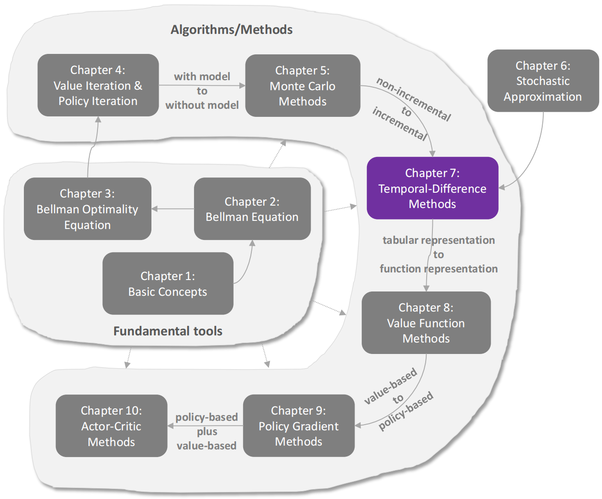

# 时序差分法

本章介绍用于强化学习的时序差分（temporal-difference，TD）方法。

与蒙特卡洛（Monte Carlo，MC）学习类似，TD 学习同样属于无模型（model-free）方法，但由于其具有增量式（incremental）的形式，因此具有一些优势。

有了第 6 章的准备，读者在看到 TD 学习算法时将不会感到陌生。事实上，TD 学习算法可以看作是用于求解 Bellman 方程或 Bellman 最优方程的特殊随机算法。

由于本章会介绍多个 TD 算法，因此我们首先对这些算法进行概述，并说明它们之间的关系。

1. 第 7.1 节介绍最基本的 TD 算法，它能够估计给定策略的状态价值（state value）。

   在学习其他 TD 算法之前，理解这一基础算法非常重要。

2. 第 7.2 节介绍 Sarsa 算法，它能够估计给定策略的动作价值（action value）。

   该算法可以与策略改进步骤结合，从而寻找最优策略。

   Sarsa 算法可以很容易地由第 7.1 节中的 TD 算法得到，只需要将状态价值估计替换为动作价值估计即可。

3. 第 7.3 节介绍 n-step Sarsa 算法，它是 Sarsa 算法的推广。

   后文将会说明：

   - Sarsa
   - MC 学习

   都是 n-step Sarsa 的特殊情况。

4. 第 7.4 节介绍 Q-learning 算法，它是最经典的强化学习算法之一。

   其他 TD 算法旨在求解某个给定策略对应的 Bellman 方程，而 Q-learning 则直接求解 Bellman 最优方程，以获得最优策略。

5. 第 7.5 节对本章介绍的 TD 算法进行比较，并给出统一的观点。

## 状态价值的 TD 学习

TD 学习（temporal-difference learning）通常泛指一大类强化学习算法。

例如，本章中介绍的所有算法都属于 TD 学习的范畴。

然而，本节中的 “TD learning” 特指一种经典的、用于估计状态价值（state value）的算法。

### 算法描述

- 给定一个 策略$\pi$，我们的目标是对 所有状态$s\in S$ 估计其 状态价值$v_\pi(s)$。

  假设我们已经获得了一些按照 策略$\pi$ 生成的经验样本$(s_0,r_1,s_1,\dots,s_t,r_{t+1},s_{t+1},\dots)$。这里，$t$ 表示时间步（time step）。下面的 TD 算法可以利用这些样本来估计状态价值：
  $$
  v_{t+1}(s_t) = v_t(s_t) - \alpha_t(s_t) \left[ v_t(s_t) - \left( r_{t+1} + \gamma v_t(s_{t+1}) \right) \right]
  \tag{7.1}
  \label{td_value_update}

  $$

  $$
  v_{t+1}(s) = v_t(s), \qquad \forall s \neq s_t
  \tag{7.2}
  \label{td_state_invariance}

  $$

  其中：

  - 时间步 $t=0,1,2,\dots$

  - $v_t(s_t)$ 表示在时间 $t$ 时，对 $v_\pi(s_t)$ 的估计；
  - $\alpha_t(s_t)$ 表示时间 $t$ 时状态 $s_t$ 的学习率（learning rate）。

- 需要注意的是：

  在时间 $t$ 时，只有 被访问到的状态$s_t$ 的价值会被更新。

  对于所有 未被访问到的状态$s\neq s_t$ ，其价值保持不变，如 式$\eqref{td_state_invariance}$ 所示。

  为了简洁起见，式$\eqref{td_state_invariance}$ 经常被省略，但需要牢记这一点，因为如果没有这个式子，算法在数学上是不完整的。

